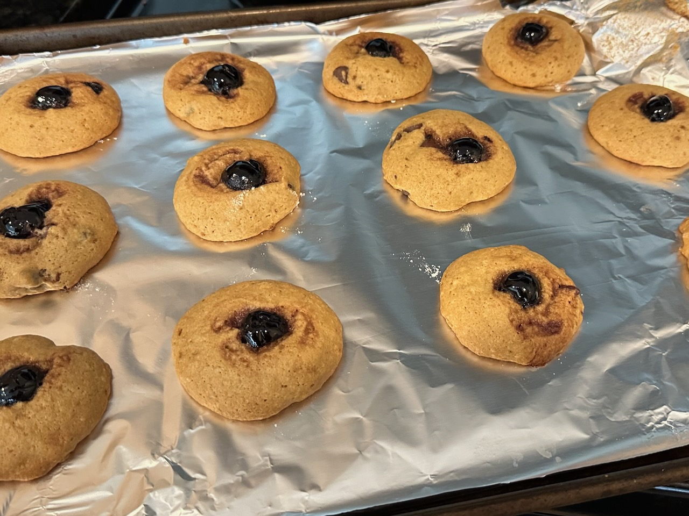

I’ve always been a fan of cookies. Recently I’ve been making a twist on chocolate chip cookies that I call “cocktail cookies”. They don’t actually have alcohol, but they do have a couple cocktail-inspired twists.

The full recipe follows, but the short version is that I swap the vanilla for Angostura bitters, swap the chocolate chips for chopped walnuts, add orange zest to the batter, and place half of a Maraschino cherry on top of each.

## Ingredients

- 1 cup melted butter
- 2/3 cup white sugar
- 2/3 cup brown sugar
- 2 eggs
- 1 tbsp Angostura bitters
- 1 tsp baking soda, dissolved in 2 tsp hot water
- 1 tsp salt
- 3 cups all-purpose flour
- 1 cup chopped walnuts
- Orange
- 24 Maraschino cherries

## Steps

- Preheat the oven to 350°F (175°C).
- Beat butter, white sugar, and brown sugar until smooth.
- Beat eggs in one at a time, until mixture is smooth.
- Stir in Angostura bitters.
- Zest the entire orange; stir in the orange zest and 2 tsp of orange juice.
- Stir in dissolved baking soda and salt.
- Stir in flour and walnuts.
- Take 1 tbsp of dough at a time, rolling into balls, and place on a baking sheet, with a couple inches of distance between each. You should have enough dough for about 48 cookies.
- Press down on each ball with your thumb, flattening slightly and leaving a thumb-sized indent in the center.
- Halve the Maraschino cherries and place one half on the indent in each dough ball.
- Bake for about ten minutes and cool on a wire rack.