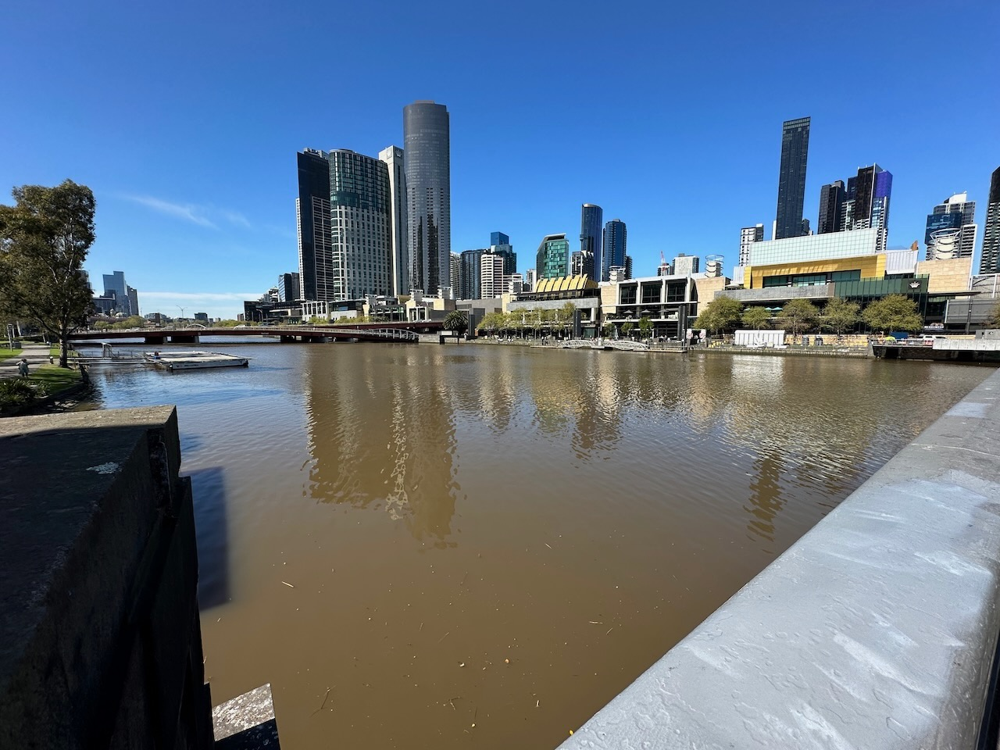
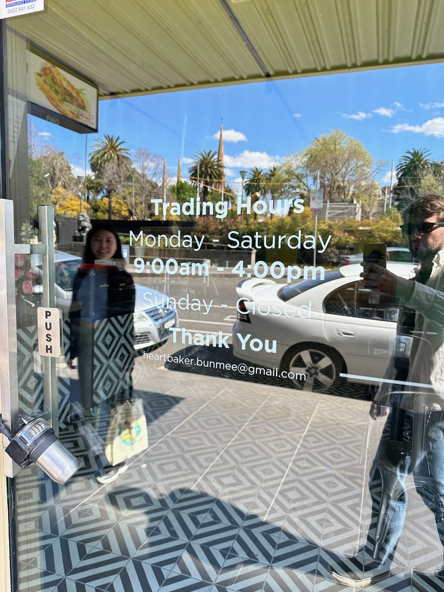
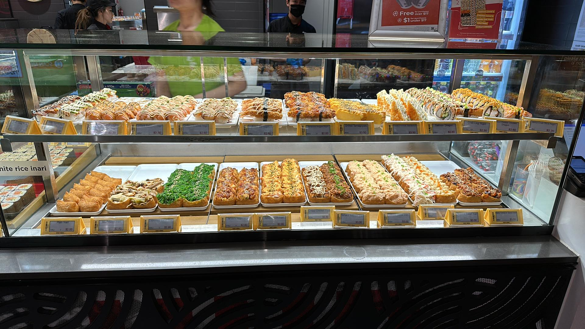
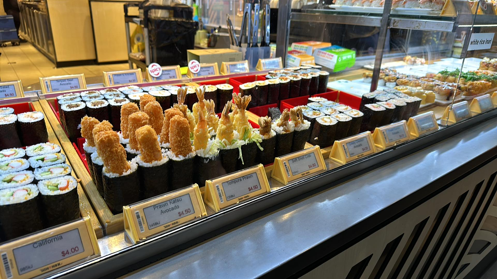
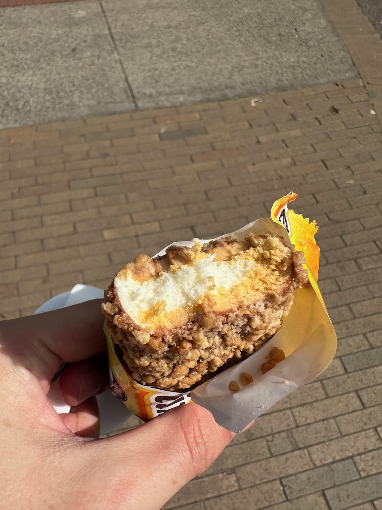
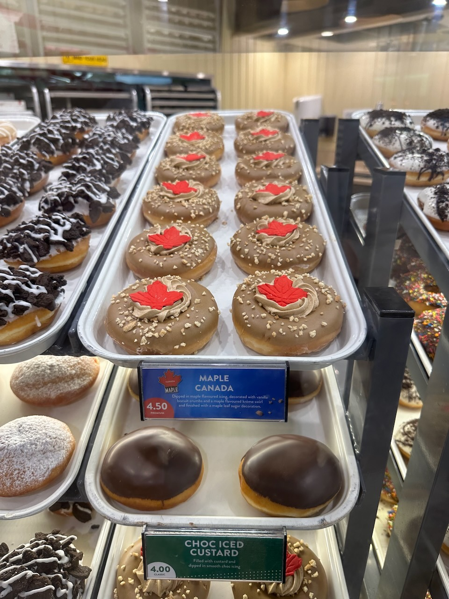

Travel, like the discipline of anthropology, tends to “make the strange familiar and the familiar strange.” So here’s some strange things I noticed about Melbourne during a recent 10-day trip there.

## Victoria Is Basically Just Melbourne

I saw a surprise while reading a [news article](https://www.abc.net.au/news/2023-01-06/population-outside-hobart-means-struggle-for-services/101829418) about Hobart, capital of Tasmania[^1], the small island province off the coast of Victoria. Hobart only has 44% of the population of Tasmania, making it the least centralized province of Australia, which is apparently a major issue for the province.

I had to read that a couple times to make sure that was right — little Tasmania, the _least_ centralized province of Australia? That was surprising from a North American context, where many large American states or Canadian provinces have at least two major settlements[^2] or a significant rural population. But apparently that is not true for most Australian provinces! 77% of Victoria lives in the greater Melbourne area and 66% of New South Wales lives in the greater Sydney area. So in practice, the province of Victoria is basically “Melbourne’s suburbs plus some other small towns.”

## The Yarra is the Worst River

This isn’t an interesting fact, I was just deeply unimpressed with the Yarra, sorry.

## Trading Hours

Most shops and restaurants listed “trading hours”, instead of “opening hours” or just “hours” as is common in North America. Interestingly, this wasn’t completely consistent; I still saw a few restaurants that listed “opening hours.”

## Feed Me Now

Pre fixe menus seem more common in Melbourne than in San Francisco; of the sit down restaurants for which I browsed the menu, I would estimate something like a third had a pre fixe menu option, while in the Bay Area they’re mostly reserved for “high end” (read: Michelin-star-or-aiming-for-a-Michelin-star) restaurants. Also, most restaurants in the Bay Area that offer a pre fixe menu _don't_ offer a la carte, but I don’t recall a single restaurant in Melbourne that only offered pre fixe.

However, the most interesting fact is that pre fixe menus are apparently called “feed me now” in Melbourne. At first I thought this was a restaurant being cheeky, but I saw it quite a few times in downtown Melbourne.

## Licensed & BYO

Most restaurants in Melbourne prominently advertised themselves as “Licensed & BYO”, i.e. they have a liquor license but you can also bring your own, which seemed to be mostly for wine bottles. I can’t say I’ve ever considering bringing my own alcohol to a restaurant in the Bay Area; I’m genuinely not sure if that’s even legal. (Update after more thought: fancy restaurants offer this for wine bottles in San Francisco, usually with a "corkage fee". That said, it's rarely advertised nearly as prominently as it is in Melbourne.)

Restaurants in Toronto and, if I recall correctly, Vancouver often had similar wording, either on their doors or on their menus. Theoretically, restaurants in San Francisco require a liquor license — for instance, Bissap Baobab in the Mission only recently managed to [get a license](https://www.sfchronicle.com/food/restaurants/article/bissap-baobab-bar-drinks-18326699.php) after months of trying — but I can’t recall it ever being mentioned explicitly. I’ll certainly be on the lookout for that.

## Takeaway Sushi

Melbourne has a very particular form of restaurant usually described as “takeaway sushi” — a small shop that pre-prepares a wide variety of rolls and nigiri, then serves them cold in a takeaway box as fast food. (The biggest chain seemed to be Sushi Hub; there were multiple Sushi Hubs _in the same mall_.) The nice thing is that this is very fast — just pick your pieces and go, which is certainly faster than waiting for McDonalds or whatever — and pretty cheap — typically $2-4 AUD per piece. I was slightly sus of the sushi, which had after all been sitting out for the better part of the day, but it was surprisingly good and didn’t make me sick. The Australians we know were _shocked_ that this did not exist outside Australia.

## Golden Gaytime

Australia, and specifically the southern coast, is known for Golden Gaytime, a (very tasty) ice-cream-biscuit-on-a-stick. [Wikipedia](https://en.wikipedia.org/wiki/Golden_Gaytime) dryly notes that “its name has survived intact regardless, or because, of the possible homosexual connotations in modern decades.”

## kJ Instead of Food Calories

Unlike the States, which uses food calories, or Canada, which uses kcal (which happen to be identical to food calories), Australia uses kJ for food energy. That’s not particularly strange, but I did find it inconvenient to determine how much I was actually eating.

## No Street Vendors or Food Trucks

I only saw one food truck and absolutely no street food vendors during my time in Melbourne. (There were a few more food trucks in Queen Victoria Market, but I don’t really count those.) Street vendors selling hot dogs are omnipresent in some parts of San Francisco, e.g. around the ballpark, but they don’t seem to exist in Melbourne. Perhaps health inspectors are scarier, or perhaps Melbourne is dense enough that there just isn’t a market.

## However, Croissants Are In Every Cafe

Melbourne is famous for its cafe and specifically coffee culture, and indeed I had the best coffee of my life at [Patricia](https://www.patriciacoffee.com.au). In addition to coffee, every single cafe I saw, no matter how small, had high-quality croissants and usually other baked goods as well. Obviously, most cafes in the Bay Area also have baked goods, but many cafes are strongly coffee focused and the baked goods, if they have them, feel like an afterthought. Not so in Melbourne.

## Krispy Kreme Had Canada Donuts

No, they don’t have these in Canada. No, I don’t know why either.

## Student Living

University of Melbourne is a fairly large university with a lot of international students, but it’s also a very urban campus right outside the Central Business District with, presumably, very little housing. So I saw multiple apartment buildings that were advertised as “student living” — below-market-rate apartments with extra amenities only offered to current or recent students. I’m sure that exists in other cities like Toronto — where the UT campus feels very similar to UMelbourne — but it seemed much more prominent in downtown Melbourne.

Also, I’m pretty sure our hotel, and some of the nearby hotels, doubled as student housing on at least some floors. I think (?) some hotels in North America used to double as long-term housing — famously so in the case of the [Cecil Hotel](https://en.wikipedia.org/wiki/Cecil_Hotel_(Los_Angeles)) — but I can’t remember the last time I saw that in person.

## Australia First

A lot of the produce and sometimes other food products were listed as “Australia First”, typically with a long explanatory text that the company bought Australian agricultural products first before buying foreign products. Obviously agro-nationalism is present in all major agriculturally-productive countries — I’m sure I’ve passed by similar “California First” signs without even noticing — but it was amusing as a visitor.

## Those Weird Pools of Water

I unfortunately forgot to nab a picture, but Melbourne had these strange little pools of water right at sitting height on some intersections. They were all filled with nasty rainwater and some leaves. I never did figure out what they were for — I assumed hydrants, but they didn’t have a clear place to connect a hose. 🤷‍♀️

[^1]: And home of [Procreate](https://procreate.com/careers)!

[^2]: California has Los Angeles and the Bay Area; British Columbia has Vancouver and Victoria; Alberta has Edmonton and Calgary; Quebec has Montreal and Quebec City; and Ontario, Illinois, and the American northeast have massive metropolitan areas that connect multiple medium-to-large cities.