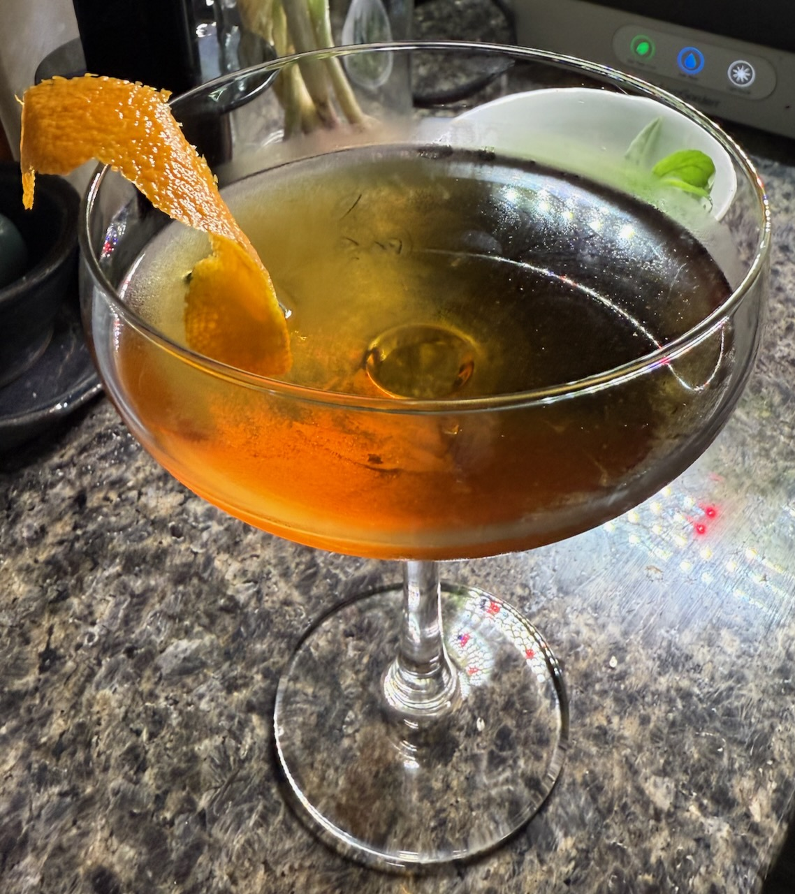

I made up what appears to be a completely new cocktail!

It’s, uh, prettier in person.

The recipe is pretty simple, although I’m still tinkering with it:

- [optional] 2oz London dry gin
- 1oz dry vermouth
- 1oz sweet vermouth
- 1oz St Germain
- Twist of orange

Stir everything over ice, strain, and express the twist of lemon over the glass. I've been using a coupe glass, but it would probably work in anything?

It’s very sweet (almost too sweet?), with lots of floral notes. I originally didn’t include a spirit — it was just vermouth/vermouth/St Germain — but if you do add a spirit (for the bitterness and strength), the juniper flavor of gin feels like the best choice.

With all the botanicals in this drink, I hereby dub this the **Ramona Flowers**.