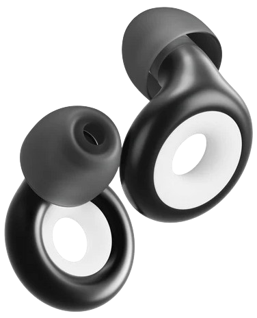
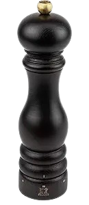
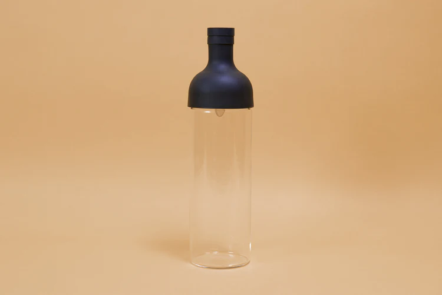
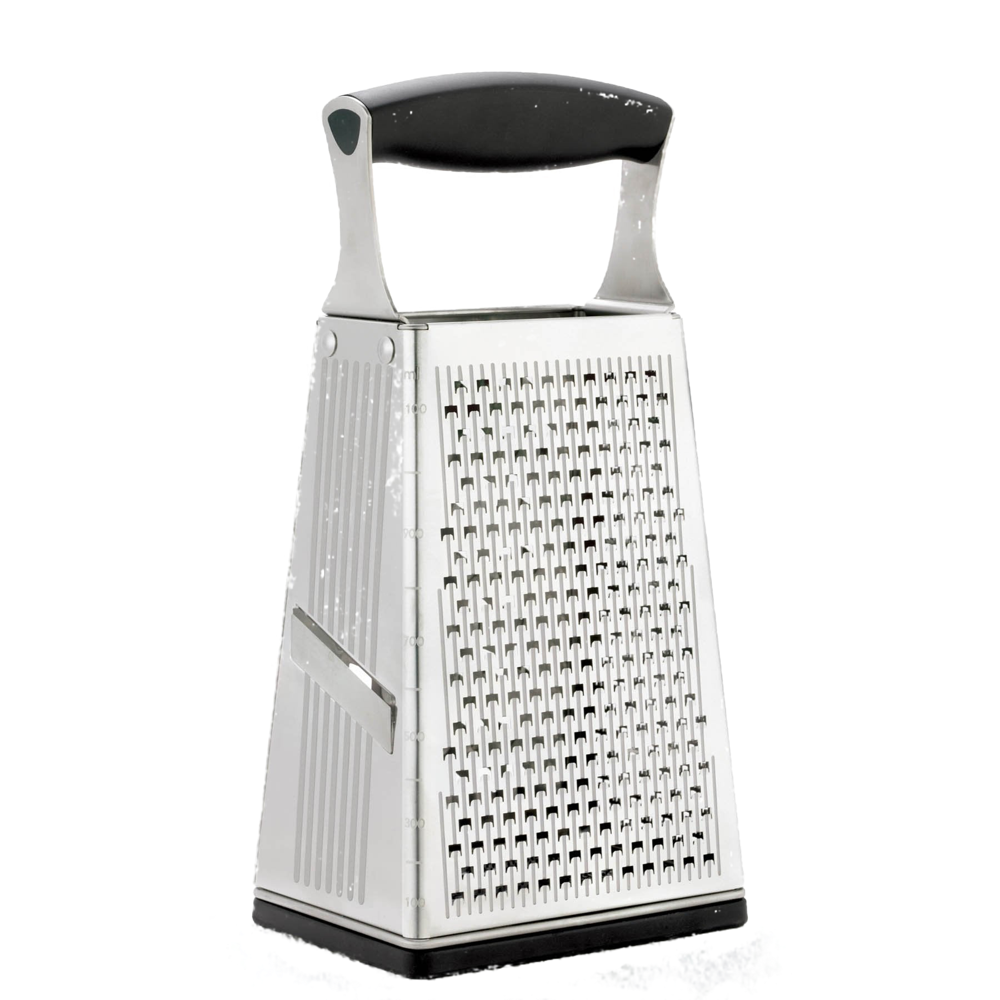
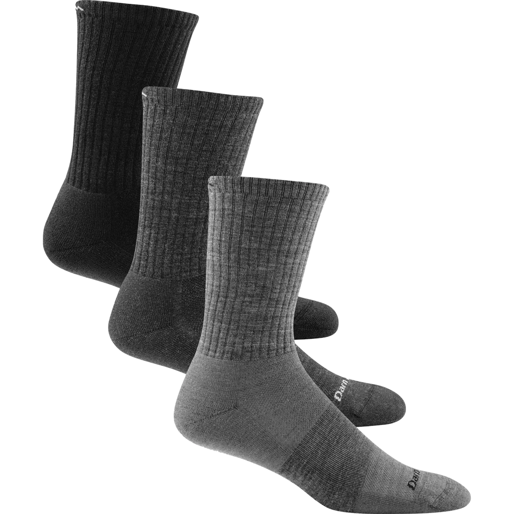

Alternative title: cheap but lovely gifts for a surprise white elephant party.

These are some relatively cheap, relatively small things that make life just a little bit better.
None of these are affiliate links or paid reviews - I just really like all these.

## Table of Contents

## Health & Wellness

### Loop Earplugs

Due to my lifelong tinnitus, I'm religious about hearing safety.
I keep a pair of earplugs on my keychain at all times, especially when going to concerts or loud parties.

Luckily, [Loop Earplugs](https://us.loopearplugs.com) are perfect — I have a pair of the [Experience](https://us.loopearplugs.com/products/experience).
For $35 USD you get stylish-but-effective earplus that come in a keyring-sized carrying case.

Paradoxically, these let me hear _better_ during conversations at loud parties; because of the way they're designed, they block out ambient noise more efficiently than human voices,
so even though my conversation partner is quieter, they're louder relative to the background.

## Culinary

### Peugeot Pepper Mill

Freshly-ground black pepper really does taste just a little bit better than store-bought pre-ground pepper.
A sprinkle of fresh pepper is an easy way to make a good meal great.

Unfortunately, the plastic pepper grinders sometimes found in the grocery store are... not great.
Much better to buy one from [Peugeot](https://us.peugeot-saveurs.com/en_us/pepper-mills), as recommended by Kenji in _The Food Lab_ (of course).
They're $60 USD or so, which is admittedly on the pricey end, but think of how fancy you'll feel when you grind a touch of pepper on your pasta.

### Saltcellar

Another way to feel like a fancier chef is to sprinkle salt with your hands instead of pouring it from a box.
The easiest way to do that is to get a saltcellar and fill it up with nice chunky [kosher salt](https://www.seriouseats.com/ask-the-food-lab-do-i-need-to-use-kosher-salt).

I use [this one from Amazon](https://www.amazon.com/dp/B07STN8DRL?psc=1&ref=ppx_yo2ov_dt_b_product_details), which was only about $10.
It's reasonably high quality, with a magnetic latch for the lid, and it holds plenty of salt.

### Hario Cold Brew Tea Bottle

Cold-brewing tea has suddenly become popular in the Bay Area. Cold-brewing takes a few hours or even days, but it results in delicious, refreshing chilled tea with a distinctive taste; I particularly like cold-brewing [Vahdam's rose black tea](https://www.vahdam.com/products/blooming-rose-black-tea) and I also use cold-brew tea to make tea soda.

[Hario's cold-brew bottle](https://www.hario-usa.com/products/cold-brew-tea-wine-bottle-1) (only $30!) makes this process a delight. Put a few tablespoons of loose-leaf tea at the bottom and fill it up with water. Leave the bottle in the fridge for a few hours. When you take it out, pour through the filtered cap and try a sip from the included tasting glasses.

### Cuisipro Box Grater

If you (like myself) have suffered through the terrible, terrible Oxo plane graters, you owe it to yourself to get this box grater.

It has Patented Surface Glide Technology™️ which sounds silly... but food really does slide across it like butter on a hot pan.
(Mixed metaphor, I guess. You probably could grate butter with this thing, though.)
You can turn a dozen potatoes into a mound of shreds for hashbrowns in a minute or two.
You can grate two cups of cheddar without using your muscles.
And, since it's a box grater, it doesn't spill everywhere.

[The Wirecutter](https://www.nytimes.com/wirecutter/reviews/best-grater/) loves this box grater.
[Serious Eats](https://www.seriouseats.com/best-box-grater) loves this box grater.
Just get this box grater.

### Kamenoko Tawashi

Kamenoko ("baby turtle") _tawashi_ scrub brushes, made famous by [_The Tatami Galaxy_](https://en.wikipedia.org/wiki/The_Tatami_Galaxy), are a replacement for icky sponges.
Dab a bit of dish soap and scrub away without worries. If you wash all your dishes by hand, as I do, these will surely be a delight.
Even better, they're [only $9](https://jinenstore.com/products/kamenoko-tawashi) and last months, if not years.

Here's [an ode to the kamenoko tawashi](https://catapult.co/stories/katie-okamoto-kamenoko-tawashi-turtle-brush-japanese-family), which points out that they're not actually that popular in Japan, but shh. We can love the baby turtle all the same.

## Travel

### Anker Portable Charger

If you take more than one device (phone, laptop, etc) on a trip, you'll have to have a charger brick for each.
Instead, consider Anker's line of portable chargers, like [this one](https://www.anker.com/products/a2667),
which provides enough USB-C ports for each device in a single brick.
The only other thing you'll need for your electronics is a couple USB-C cables — much easier to stuff in a backpack.

## Apparel

### Darn Tough

Everybody's favorite buy-it-for-life Merino wool socks. They may not be 100% Merino wool anymore, but they're still practically indestructible and come with a lifetime warranty.
They're so indestructible that I have a recurring nightmare that my Darn Toughs have big holes in them like normal socks.

## Games

### Coup

I am not sure that [_Coup_](https://boardgamegeek.com/boardgame/131357/coup) is my _favorite_ game, but relative to price ($20 or less, perfect for a white elephant) and time-to-play (15 minutes a round), it may be the highest value.
Each player is trying to collect money to assassinate their opponents, with the help of two secret character cards that give them special abilities.
But the twist is that you can bluff as having _any_ character card, at the risk of losing a character if you are correctly called out.

### Skull

[Skull](https://boardgamegeek.com/boardgame/92415/skull) is another cheap, quick party game perfect for a white elephant.
Players take turns secretly putting down skulls or roses, then take turns bidding on how many roses they can pick up without picking up a skull.
If you win the bid, you then have to pick that many secret tiles from your opponents;
if you are successful, you're a step closer to winning, but if you fail, you have to permanently discard one of your own skulls or roses for future rounds.

Like _Coup_, this is widely available for less than $20, takes less than 15 minutes to play a round, and can be taught in about that time, too.
