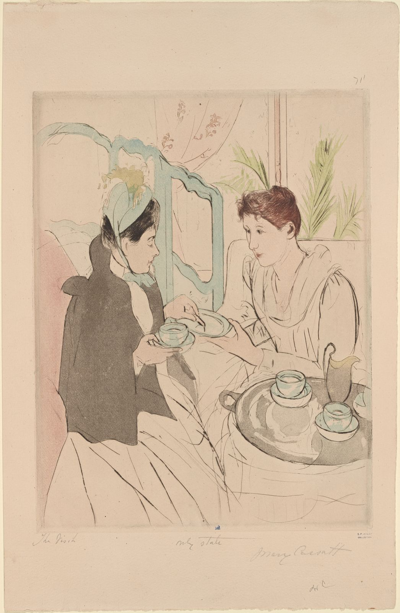

- ["Afternoon tea party" (1891)](https://digitalcollections.nypl.org/items/d71aae00-c60d-012f-13d0-58d385a7bc34?canvasIndex=0), Mary Cassatt

> I was thirty. Before me stretched the portentous, menacing road of a new decade.

- *The Great Gatsby*, F. Scott Fitzgerald

I recently turned 30 and, [as is tradition](https://rwblickhan.org/newsletters/28-pieces-of-advice-for-28/), I gave my friends 30 pieces of advice. This isn’t the exact set I gave, since I thought of better advice after I told them 😉

As usual, this leans more towards practical, since emotional or intellectual advice typically needs to be more personalized.

1. **Dress in layers.** This is the secret to clothing-as-function (though it’s important to clothing-as-aesthetics as well). You might wear a simple undershirt, a wool sweater or flannel, and a rain-resistant technical jacket (if it’s rainy) or a coat (if it’s cold enough). That lets you take layers on and off as you move throughout the day and in-and-out of doors. This is particularly important in microclimate-rich San Francisco, where the west side of the city is often five-to-ten degrees cooler than the east side.
2. **Merino wool is a wonder fabric.** It’s breathable but insulating, meaning it’ll keep you cool if you want to be cool and warm if you want to be warm. It doesn’t get waterlogged and soggy like cotton does. It’s smooth and comfortable on the skin. It’s naturally antibacterial, which means you *don’t* have to wash it every day. It’s on the pricey side compared to cotton, but it’s nowhere near as expensive as, say, high-end cashmere. As a corollary, just buy Darn Tough’s Merino-blend socks, which are additionally covered by a lifetime warranty.
3. **Take electrolytes after drinking.** Much of what you’d consider “a hangover” is actually dehydration, because alcoholic drinks aren’t all that hydrating and a night on the town usually involves a fair bit of running about. Taking quality electrolytes like DripDrop or Liquid IV before going to bed helps; you’ll still have a hangover, but it won’t feel nearly as awful.
4. **Do your stretches.** I learned this the hard way; I developed severe arch pain in my feet due to the poor conditioning of my posterior chain, which required three months of physical therapy to resolve. Do a variety of stretches on a regular basis, and do targeted stretches after exercising. Also, consider buying a foam roller for self-massage, which will help break up any tight muscles.
5. **Use a sleep mask.** It helps to wake up to natural light on a regular cadence. But if you really need to sleep in, you have to get rid of light. Blackout curtains work, but can be a hassle to install. Strapping a small silk face mask to your eyes is much easier.
6. **Learn how to use pillows.** I only recently realized there is a correct method to use a pillow. You should sleep on your back, if possible, with your head and neck, but *not* your shoulders, on the pillow. You can also put a secondary pillow underneath your thighs. If you sleep on your side, consider placing a secondary pillow between your knees, to keep your spline aligned.
7. **Buy packing cubes for travel.** They keep your suitcase neat and organized, so it’s trivial to pack up again, and theoretically save space by compressing some of the air out of your clothes. Some packing cubes even have separate pouches for dirties, so you don’t have to just pile them on the ground in the corner of your hotel.
8. **Belts are only for decoration.** If you “need” a belt to keep your pants up, your pants are too wide.
9. **Buy multiple pairs of shoes, for different purposes.** Walking is fairly hard on our poor shoes. Give them a break by swapping between different pairs, even just for day-to-day walking. They’ll smell better and take longer to wear out. On a related note, most running shoes are only meant to last 9-12 months; if you’re running seriously and your running shoes are a few years old, strongly consider buying a new pair, since you probably don’t even realize how uncomfortable your feet are.
10. **Make use of a bidet whenever possible.** It’s the civilized way to defecate, and it’s more ecologically friendly than using roll after roll of toilet paper. Unfortunately, most North American residential construction doesn’t have a power outlet right next to the toilet, so installing a high-end Toto heated bidet will require contracting an electrician. But if you can settle for lukewarm water, budget bidets will only run you $100 or so and take 10 minutes to install (even in a rented apartment).
11. **Keep a lot of prep bowls around for cooking.** Pretty much every recipe will require that you mix a sauce, or whisk an egg, or toss the peel of an onion, often at the same time. Having half-a-dozen small stainless steel bowls lying around, ready to go, makes cooking so much easier that I’d call it the most important aspect of *mise en place*. I use a set of 6”-diameter stainless-steel bowls from Muji that, sadly, appear to be discontinued, but you can easily find similar bowls from any kitchen supply store or Amazon.
12. **A week of vacation is better than five individual days off.** A few years back, I ended up *very* burnt out at work and had to take a full week off on short notice. I realized I had taken a handful of weekend trips and three-day weekends, but I hadn’t taken a “real” week-long vacation in over a year. A week-long vacation is noticeably more restful than a simple holiday, even if you treat it as a staycation and don’t go anywhere new. If you haven’t taken a real vacation in a while, you may be more burnt out than you realize.
13. **Body heat dries wet clothes efficiently.** If you’re on vacation and only have time to wash, not dry, your clothes, you can very quickly dry your clothes by simply wearing them. Many people find this a bit unpleasant, but a wet T-shirt *will* dry in fifteen or twenty minutes if you’re actively wearing it.
14. **If you want to dress better, listen to a fashionable friend.** Follow them around a clothing store and see how they talk about clothes, how they interact with salespeople or fellow enthusiasts, and how they consider what to look at. Ask them for their favourite websites or YouTube channels, and ask them for recommendations for stores to check out. Ask them for opinions once you’ve found pieces you like. Do your own research — you shouldn’t rely on them for everything! — but confirm your understanding with them. As you get deeper into the hobby, see if you can be introduced to or independently make other friends in that hobby. Most people *like* talking about their hobbies, and talking to people is often the best way to learn. Note this advice applies to most hobbies, not just clothes!
15. **Plan dates with your partner.** Especially once you live together, it may feel unnecessary to plan “dates” — don’t you see each other all the time? But it’s still nice to have “just the two of us” time, where you talk to each other *outside* the context of your normal day-to-day life. If you need ideas, just pick an exhibit or store your or your partner have been meaning to go to, and find a restaurant nearby. I typically go for a slightly-less-than-monthly cadence, but any cadence works as long as your and your partner are happy.
16. **Don’t put the cap on the back of the pen while writing.** They’re weighted for use without the cap, so your handwriting will be neater. I don’t have advice for how to avoid losing the cap, unfortunately.
17. **Always autolyse.** When baking, mix the flour and water thoroughly first, let it rest for some amount of time (depending on what you’re making), and only then add the yeast and other ingredients to start the knead. The yeast will operate more consistently throughout the bread, leading to better texture, and the kneading will be easier. There’s a few edge cases when you shouldn’t autolyse, like if you’re using rye flour, but if you’re that deeply into baking, you probably know this already!
18. **Buy a decent travel water bottle.** So you want to [take my advice](https://rwblickhan.org/newsletters/28-pieces-of-advice-for-28/) and avoid dehydration, particularly while traveling. Get a travel water bottle; you may recall my [Zojirushi recommendation](https://rwblickhan.org/newsletters/things-i-like-that-you-might-like-too/#zojirushi-water-bottle) a few months ago, which I still stand by, but honestly any brand will work, or even a plastic water bottle in a pinch. The point is just to have a big bottle of water that you can sip as you ride a plane or train or just walk around, because you’re *probably* more dehydrated than you realize.
19. **Keep a simple toiletries bag.** I used to stuff toiletries into a small plastic bag or whatever cracks and crevices of my backpack they’d fit into, but a real toiletry bag is so much nicer. You can keep some essentials (travel toothpaste, a comb, etc) packed and ready to go at all times. If the bag stands up, it’ll keep everything tidy on a tiny hotel sink. Any old simple 1L toiletry bag or Dopp kit should work fine; I use a tomtoc bag allegedly intended as a cable organizer.
20. **Make your own simple syrup.** It’s the easiest way to add sweetness to a drink (coffee or otherwise), but there’s no reason to buy it in stores. Just add equal weights water and white sugar to a saucepan and stir gently for five minutes on the lowest possible heat setting, then keep it in a clean squeeze bottle from the cupboard — much easier than going to the store! This applies to plenty of foods; homemade mayonnaise is arguably easier and definitely tastier than the store-bought stuff.
21. **Host more parties.** Parties are great! People appreciate them, even if they’re small and targeted. Pick a theme or simple activity and structure the party around that, but leave lots of social time for people to chat. Just make sure there’s a plan for hydration, bathrooms, and (if it overlaps mealtimes) food.
22. **Be clear on *why* you’re hosting.** My favourite tip from [*The Art of Gathering*](https://app.thestorygraph.com/books/f2a8c0d1-2e6b-4e44-b6a4-83dfa871bbf2) — whenever you’re hosting a party, think hard about *why* you want to host it, since that will determine everything about the structure of the event. Are you hoping to get closer to people you already know? Do you want your friends’ friends to meet? Is the event planned around a structured activity?
23. **Wet board, wet knife.** Cutting vegetables is easier if the cutting board and knife are both slightly wet, because nothing will stick to each other. Also, move your hand as you cut instead of moving the vegetable.
24. **Create geofenced reminders.** If you hear about something interesting in your city, make a geofenced reminder so that you remember to check it out next time you happen to be in the neighborhood. On iOS, at least, you can do this with the stock Reminders app, by setting an alert “upon arriving” at a location (which can be half a mile or so away!).
25. **1.5x is the optimal listening speed for most podcasts and lectures.** 1x (natural speed) is simply too slow — many podcasts and lectures waste a lot of time. But 2x is hard to understand — I often find it difficult to actually recall anything I heard. 1.5x is just right.
26. **Use the rule-of-thirds in photography.** It’s the simplest, but arguably most important, composition trick. Imagine a grid of lines dividing the frame into thirds horizontally and vertically. Then, put the subject of the shot at one of the four corners where the lines intersect. You’ll have much more interesting photos than if you put the subject dead center.
27. **Practice asking interesting questions.** People love answering questions about themselves; it’s one of the easiest ways to deepen a relationship. Next time you don’t know what to talk about, try to come up with an interesting, slightly off-kilter question; it’ll get easier over time.
28. **Carry around earplugs.** You never know when you’ll find yourself in a loud environment; I keep my pair attached to my keyring. They’ll protect your hearing and, counterintuitively, they often help you hear better, especially when attempting to have a conversation with a lot of background noise.
29. **Enter flow state every day.** Typically, this will be doing something you find “productive”, which can be an activity traditionally considered productive, or not (a nice dinner with friends can certainly be a source of flow state!). Otherwise, it’s easy to just scroll on your phone for a whole evening and feel that you “wasted” it.
30. **Ask your friends for advice on their birthday.** It’s a fun tradition!
