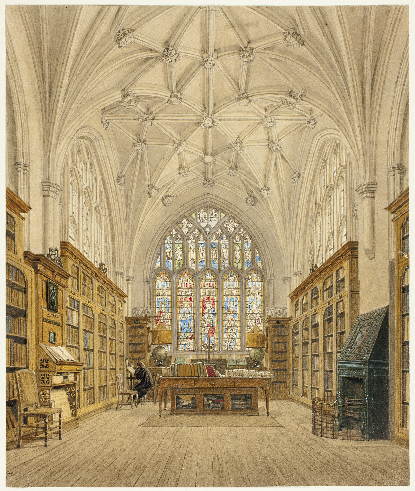

Hello all, and welcome back to a new year and a new season of `rwblog`, née Applied Dilettantery. As a housekeeping note, I’ll no longer be keeping to a regular schedule, but instead send these out whenever I feel like it. I expect most issues to consist of short essays or observations, typically about what I’ve been reading or thinking about — similar to many of the previous formats, but probably quite a bit shorter.

So, without further ado, here are my reflections on my reading for the past year. I managed to read about [56 books this year](https://rwblickhan.org/52books/2021) and intend to read at least 52 next year as well. I expect to follow up with reflections on the films I watched in the past year in the coming weeks as well. Also, as that old canard goes, I apologize for such a long letter — I didn’t have time to write a short one 🙂

["Difference is Time", San Francisco Public Library, Thomas Hawk](https://www.flickr.com/photos/thomashawk/25263635563/in/photolist-EusJFv-2j1kuXa-2hqEoyX-2iGBaXi-2hSVCXw-2mQq9jY-2exZ2sA-2mGtGs9-2kGrGCq-2gPBQuX-8QAwu-2ky4vPt-2jjKVm4-2i9fzqi-8QAxZ-2gkeVhZ-2i8nFbT-2i9r6KX-2kvPNkz-2ifasUW-2kVWf82-RHXGNx-SCyxFU-23F1itB-2jy1pp8-2gb2dA6-9CG6kz-2jo6q9n-2mygVeF-nzvsD-2katncw-2ifBqhq-QdD4iC-2ivKmdh-JzQsp-2mLxJes-2dSG9Pi-2kTbfoz-2g9vFbZ-2hPDPLe-a8B7HB-2hmxCv2-6j4ieS-R6aYRF-N8gxf3-TNtL3E-2gRHqSw-J1yD8B-2kFJjb6-8QArC)

## Fab Five of 2021

> My five favorite books of the year, in rough order of favoriteness

1. *The Last Samurai*: I knew I would love this cult classic novel by Helen DeWitt, because one of my favorite non-fiction stories of all time is her account of being stalked. That said, I didn’t think *The Last Samurai* would slot in as one of my favorite books of all time and immediately inspire multiple novel ideas and a trip to the App Store to download some language-learning apps. Talking about *The Last Samurai* — which only has to do with samurai insofar as the main characters are obsessed with Kurosawa’s masterpiece *Seven Samurai* — feels almost silly; if you pick up the book, you will almost immediately find out it if it’s for you, seeing as how it is written with absolutely no quotation marks of any kind and within 20 pages is rhapsodizing about a perfect world in which authors could use different languages for aesthetic reasons just as painters use different colors while simultaneously teaching the audience ancient Greek. It’s... it’s a lot, is what I’m trying to say. But if you persevere — which is easy, given how wryly humorous it is — and let this book cast its spell, as it first follows frustrated genius Sibylla in teaching her child prodigy son Ludo and then follows Ludo’s adolescent quest for a father figure, you’ll find what one commentator called one of the most “thoroughly democratic” works of all time, a paean to the idea that *anybody* could learn Ancient Greek or compose world-class sonatas or appreciate masterworks of postwar Japanese cinema or find *just* the right shade of blue, if they only had time, if they only had the willingness to learn, to reject the idea that “Sesame Street is about the right level”. It’s very *elite*, in a dark academia way, without ever quite coming across as elitist, but instead inspirational. It’s a book I expect to reread every year and come away refreshed. As a newly-inducted member of the cult of this classic, I urge you — if this sounds remotely interesting, *please* go to your local library[^1] and check out a copy.
2. *The Sympathizer*: All I really have to say about *The Sympathizer* is that it made me laugh more than any other book this year *and also* had one of the most emotionally affecting endings. *The Sympathizer* — about the eponymous communist mole who follows a group of post-fall of Saigon refugees to America, but finds himself caught between his loyalties and his identities, as a northerner who moved to the south, a communist pretending to be capitalist, the son of a Vietnamese mother and French father — is both a deeply thematic production by a postmodern English lit prof — fond of obscure words and Ralph Ellison’s *Invisible Man* — and a propulsive black comedy that never slogs or gets boring. It’s a minor miracle that this book is as good as it is and, if *The Last Samurai* sounds too avant garde, consider this my must-read pick-of-the-year instead.
3. *The Ramayana: A Modern Retelling*: The *Ramayana* is arguably one of the most influential stories ever told, up there with the Bible and *Journey to the West* — its influence felt throughout South and Southeast Asia and finding echoes in East Asia, like Sun Wukong’s striking resemblance to Hanuman — and I felt it was finely time to acquaint myself with it. I’m glad I did so with Ramesh Menon’s novelistic retelling, which captures all the lyricism, detail, and reverence of the Sanskrit original and transmutes it into a novel fit for modern audiences, with just a hint of the modern fantasy genre for good measure. It’s a tale as old as time — boy meets girl, boy and girl are banished by a jealous concubine, girl is kidnapped by a nine-headed demon with magical powers, boy and his army of monkeys unleash hell on earth to get her back — and Menon’s version does not try to paper over the faults of the original — Rama’s banishment is still the result of (a sexist portrayal of) a jealous concubine and her dwarf servant; Sita is still a mostly-wordless damsel-in-distress; Rama’s jealous treatment of the chaste Sita after their return is still almost nonsensical — yet that didn’t stop me from immersing myself in Menon’s telling, which is strikingly beautiful in its descriptions, full of reverence for Rama as an *avatara* of Vishnu, and careful to draw portraits of the archetypal men and woman surrounding Rama. The great achievement here, I think, is making it clear that the *Ramayana* is *both* one of the great fantasy stories *and* an important religious text. I know I’ve made it sound like a sexist slog up there — it may be sexist, but I promise it’s not a slog — but I really do think it’s one of those great works that all people that consider themselves cultured should be acquainted with. I’m excited to dive into his modernization of the *Mahabharata* in the new year, which luckily is much less sexist (Draupadi 4 lyfe).
4. *Candide*: I’ll discuss *Candide* in more detail below, but let me just say I’m *genuinely* surprised I managed not to read this for so long.
5. *The Only Good Indians*: I keep referring to this book as the “spooky deer book”, which is unfair in at least two ways; firstly, it’s actually a spooky *elk*, and secondly, it dramatically sells short one of my favorite novels of the year. *The Only Good Indians* could uncharitably, but accurately, be described as “*It* with an elk”, following a group of four American Indians haunted by a terrible mistake they made as teenagers. The taut-as-a-bow-string plot and devilishly crafted thrills might have been enough to put this in runners-up, but what makes this one of my favorites of the year is that it never lets you forget that mainstream American society still thinks “the only good Indian is a dead Indian” — we are constantly being reminded of the stream of indignities the characters suffer, from both mainstream society and each other, and we see how the protagonists’ perspectives — as victims of a vicious elk spirit — are commuted into “Indian man dies while on the run from the law”. If you can handle the intensity — and make no mistake, this book is intense, including more than a few crushed dogs — I highly recommend it.

## Runners-up

> Five more favorites that I couldn’t resist adding, in no particular order

1. *The Song of Kieu: A New Lament*: The new Penguin translation of this Vietnamese classic — apparently omnipresent in Vietnam and cited repeatedly in *The Sympathzier* — is a bit odd — its translator’s only real qualifications are some poetic credentials and a summer spent with the Peace Corps in Vietnam, and the introduction goes on at great length explaining how a real historical event of the Ming dynasty was warped into an 18th-century Vietnamese classic, while barely discussing its significance in Vietnam — but I don’t hold that against it. *The Song of Kieu* is a breathtakingly beautiful proto-feminist tale of a woman who suffers indignity after indignity, yet somehow manages to find real happiness in the end. If you liked *Circe*, you will definitely like this; and conversely, if you preferred *The Song of Achilles*, perhaps *Kieu* is one you should skip.
2. *The Haunting of Hill House*/*We Have Always Lived In The Castle*: *The Haunting of Hill House* pretends to be a ghost story, but is actually a haunting analysis of a sad, lonely woman stricken by anxiety, pulling much the same trick as my favorite *Neon Genesis Evangelion*. *We Have Always Lived In The Castle*, also by Shirley Jackson, is quite possibly the strangest book I’ve ever read (seriously, stranger even than *The Last Samurai!*) — it’s difficult for me to even talk about without spoiling, but trust me when I say it’s worth trying, even if, like arsenic in sugar, it isn’t quite to your taste.
3. *Monkey King: Journey to the West*: I’ll discuss this one more below, but suffice it to say that Julia Lovell’s breezy — if somewhat hand-wavy — translation was the most fun I had reading a book this year.
4. *The Invention of Morel*: This rather short novella, written by Borges’ protege Adolfo Bioy Casares, is a classic of surrealism, allegedly serving as the inspiration for the famous surrealist film *Last Year at Marienbad*. It follows a man across his stay on a mysterious deserted island, as he comes face-to-face with intruders that can’t possibly exist, giving off vibes akin to Susanna Clarke’s *Piranesi* and, of course, Borges, but with a metaphysical, almost mystical flair that takes the story in unexpectedly philosophical directions. The only reason it is on the runners-up list is the hints of machismo — the protagonist quickly becomes infatuated with one of the intruders and begins to obsess over her — which some might find distastefully old-fashioned.
5. *Mexican Gothic*: This horror novel was overshadowed by *The Only Good Indians*, which I felt was more thematic and had a more finely-tuned plot. However, *Mexican Gothic* is also a masterpiece of modern horror, with a fabulous eye for detail and a touching love story at its heart.

## The Lifetime Achievement Award

> For a book I reread again, and again, and again...

I first read *Scott Pilgrim* in high school, probably younger at the time than Scott’s seventeen-year-old girlfriend Knives. All of the characters seemed impossibly cool, going to house parties and their friends’ bands’ shows, and 24 seemed impossibly distant from my relatively sheltered teenagerhood.

I reread *Scott Pilgrim* sometime in university. I felt much closer, then, to Scott and his friends, having had a taste of the freedom that collegiate life provides. It still felt like the impossibly cool life of Scott and his friends was just around the corner — would I, too, suffer heartbreak and a quarter life crisis?

I reread *Scott Pilgrim* again, at age 25, on a whim. I’m now older than Scott, who starts out 24 and only has his 25th birthday halfway through the series. Scott no longer seems like a distant older cousin who swoops into my life to show me a hint of my future; instead Scott feels like a younger brother, whose lovelorn foibles I can look at with some maturity, remembering the silly things I did in university. It may just be because I had a shockingly young 20-year-old intern this season, or because I just got engaged, but at the end of this year I really do feel meaningfully older than I did, say, even last winter. I feel like I’m closer to 30 — to the start of that long middle age — than to my childhood and university years.

This reread, I confirmed I still loved *Scott Pilgrim*, and I suspect I will for the rest of my life, until it feels more like a time capsule to a distant, almost-forgotten time than a record of the days I’m living through now.

That was, perhaps, too personal. Let me talk about the series a little. It is very much a series of a certain time, which means it has, perhaps, aged poorly in some ways — Ramona is far too quick to refer to other women as “bitches” to be completely comfortable in 2021 — yet has other timelessly-timeful moments, like Kim’s quickfire sarcasm and iconic resting bitch face or Ramona’s utter lack of jealousy towards Scott’s once-upon-a-time relationship with Kim (“what? I just really like her!”). I also always forget just how Canadian it is — Knives has a breakdown over a midnight double-double at Timmies! — or just how funny it is — “bread makes you *fat*?” still gets me every time.

I can’t recommend *Scott Pilgrim* to everyone — I’m not sure I can recommend it to *anyone* — but in its own idiosyncratic way, it has stuck with me — *grown* with me — like no other book.

## The As-You-Like-It Golden Cudgel Award for Most Fun Book

> For the book that was more entertaining than any Marvel movie

I have not read a scholarly translation — let alone the Chinese original — of *Journey to the West*, so it’s hard for me to say just how far *Monkey King*, Julia Lovell’s abridged, rather idiomatic translation, takes the story from the original. That said, being somewhat familiar with the story in some of its other forms — like the classic early-Cultural-Revolution animation *Uproar in Heaven* — I think it captures something of the spirit of the original without too much loss.

To be honest, though, that doesn’t matter so much to me, because this book was *easily* the most fun I had reading this year — perhaps shown no better than the way I plowed through its 200 pages in about two days. Lovell’s loose translations carry through the sense of Sun Wukong’s irrepressible energy as he transforms from a heavenly nuisance into a (more or less) good Buddhist, not to mention more puns than you can shake an (as-you-like-it golden) stick at. *Monkey King* is easily the book I’m most likely to reread for the sheer pleasure of reading it.

## The Garden Cultivation Award for Most Russell Book

> For the book that made me think “how did I never read this before”

Every so often you’ll read a book that seems to have influenced you greatly in retrospect, even though you’ve never touched it before. This has happened to me a few times — most notably with *Dune*, which has always been a massive influence on me through its foundational influence on *Warhammer 40,000*, even though I didn’t read it until mid-university — and I’m happy to report it has happened again this year.

Those who know me well know my love of black comedy, perhaps inherited from reading *The Hitchhiker’s Guide to the Galaxy* earlier than was strictly good for me. Given that, it is *utterly baffling* to me that I have somehow avoided reading what is arguably the greatest black comedy of all time, *Candide*, in which Voltaire demolishes the Leibnitzian idea that this is the “best of all possible worlds” in favor of the idea that perhaps “we must tend our gardens.” There was so much from this novella that seems so influential on me — the use of gardens as a repeated motif, the parody of the picaresque genre, the comedically blasé presentation of horrific events, the implication that maybe the best life is simply tending a garden with some good friends — that I genuinely wonder if I had -read it as a small child and just forgot about it.

## The “Yes, Princess” Award for Most Frustrating Book

> For the book I wanted to like but simply couldn’t

*The Buried Giant*, by Nobel laureate Kazuo Ishiguro, starts with a simple premise — an elderly couple in post-Arthurian Britain decide to leave their village to visit their son. As we catch glimpses of marital strife and village discord, it becomes apparent they are suffering from some kind of memory loss, as are most of the people they meet. That’s because (and here spoilers follow until the end of the paragraph) King Arthur committed a wee bit of genocide in a failed attempt to stop the Anglo-Saxon invasion of England, and afterward left behind a sleeping dragon whose breath makes all the residents of the island, Briton or Saxon, forget what happened. The elderly couple, alongside a few other characters, ultimately must decide whether to kill the dragon and dig up the buried past, or simply let sleeping dogs lie and continue on in a murky haze.

So, as you can tell, this is a thematically-rich work, asking big questions about truth and reconciliation in the wake of traumatic events like genocide, and tying that to smaller-scale relationships like the elderly couple we follow throughout the book, whose relationship is not the dreamy fairy tale we are led to believe in the opening pages. It is a book I thought about a lot this year.

But what that description above doesn’t get across is how *unbelievably* frustrating *The Buried Giant* is to actually read. Simply put, I don’t think Ishiguro is very technically talented as a writer, at least not of fantasy fiction. The dialogue throughout is stilted and wooden — including the protagonist’s infuriating habit of calling his wife “princess” in almost every sentence — and the characters are surprisingly flat and lifeless for an experienced literary novelist. The plot, insofar as the novel even *has* a plot, is meandering at best and simply confusing at worst — like a chapter where our intrepid duo, supported by an aging Sir Gawain, have to solve video-game-y puzzles to open a door and kill an undead dog, for no reason I could discern. But perhaps worst of all, as [Ursula K. Le Guin memorably complained](https://www.ursulakleguin.com/blog/95-are-they-going-to-say-this-is-fantasy)[^2], there is virtually no *worldbuilding* — no detailed exploration of how Britons and Saxons think and feel, no explanation of King Arthur and his court, no evocation of feast or fern to ground the reader in a place — perhaps an excusable offense in a literary novel of the realist tradition, where audiences can reasonably be expected to infer the details of the setting from their own experience, but in the context of a fantastical novel a major problem. That is perhaps intentional, to put the reader in the mindset of the forgetful folk of the novel, but that doesn’t excuse the novel from feeling like a slog.

## The Bruised Apples Award for Most Disappointing Book

> For the book that everybody loves and I didn’t

*Hamnet: A Novel of the Plague* was a New York Times Book Review pick for top 10 books of 2020, appeared on Bill Gates’ favorites from 2021, and was also talked up by the Overdue podcast, whose taste usually aligns fairly well with mine.

To be blunt, I would like to read the book they read, because the *Hamnet* I read was easily the most disappointing — if not actually the worst — book I read this year.

In theory, *Hamnet* is about, well, Hamnet, Shakespeare’s son who died of the plague at a young age and for whom the play *Hamlet* *may* have been named. But you can forget about that, because in practice Hamnet the character plays a very small role in the book named after him. Instead, *Hamnet* the book focuses on Shakespeare’s manic-pixie-dream-girl wife Agnes, who, as the daughter of a maybe-sorta-kinda witch, may or may not be able to see the future — though you should forget about that as well, because it also barely has anything to do with the plot. Oh, and she has a hawk, which the book makes a big deal about, but again, you can forget that detail as unimportant. (Are you noticing a pattern?) We split our time between the past — where we see the relationship develop between Agnes and “the Latin tutor,” as Shakespeare is referred to throughout most of the book — and the present, where Hamnet is dying of the plague, and then follow the post-Hamnet family in their grief, ending with Agnes seeing *Hamlet* for the first time.

I will admit, part of my distaste for this book was simply a difference of opinion — the author writes with some of the purplest prose this side of a Byzantine emperor’s robes, and rarely seems to think one metaphor is sufficient when three could do. To be fair, this did give a rather evocative sense of place (exactly what I complained about above with *The Buried Giant*!), at the cost of being a tremendous slog to actually get through. In fact, at times, the prose is so purple it’s actually confusing what’s going on — towards the end of the novel, Agnes visits London and, disoriented, sees.... criminals being hanged? Or maybe whales being dismembered for oil?... but neither I nor anybody else I talked to about the book could figure out what was actually being described beneath all the prose.

I don’t think all of my issues with the novel are down to personal taste, however, since it’s simply not very well structured either. As you probably noticed above, we’re thrown deep into a sea of details, but most of them simply don’t matter that much. Shakespeare’s father is weirdly sketchy throughout the first few chapters, with other characters implying he’s basically a criminal, but that never comes to the surface and the book seems to forget about it halfway through. Agnes does a variety of odd things — like insisting on giving birth on all fours out in the woods — but they mostly just end up being character quirks described in far too much detail. We spend far longer with Agnes and her relationship with Shakespeare than with Hamnet and his death, yet Agnes’ grief never quite feels real; and when she finally sees *Hamlet* at the end, Agnes’ total contribution to Shakespearean studies is basically “oh, I guess he wrote *Hamlet* because he was sad about Hamnet”.

Ah, yes, and then there’s the bruised apples. If you don’t know what I’m talking about, trust me when I say you should be glad you don’t know what I’m talking about.

That said, there was one bright, shining chapter in this book that almost (but not really, at all) made up for slogging through the rest of the book. We pull away from the Shakespeare family to discover how the plague reached Stratford-upon-Avon in the first place, being introduced to a plucky sailor boy and the ticks infesting his pet monkey. We get a cute little short story, which is detailed enough to immerse us in the time period without quite reaching the fever pitch of description in earlier chapters, as we follow the ticks and their descendants on their journey from Alexandria to Venice to Stratford. It’s strange that the most memorable characters of a book titled *Hamnet* would be ticks, but, I guess that’s life?

## The Sentient Sourdough Award for Most Baffling Book

> For the book that just made me think “wait, what?”

I really like Robin Sloan! I really do! His newsletters stand alongside Craig Mod’s as exemplars of the form! But I struggle to get non-newsletter-readers to acknowledge his talent because his books are just so... *weird*.

A few years ago, I read his debut novel, *Mr Penumbra’s 24-Hour Bookstore*, and found it charming but hard to recommend, thanks in large part to a cast of characters that were weirdly immature for their supposed mid-twenties ages and a breathless paean to Google that hasn’t aged well since 2012 — symptoms, I thought, of debut-novel-itis.

So I was excited for his second novel, *Sourdough*, which opens promisingly: Lois Clary, overworked software engineer that has more in common with the robots she programs than her fellow humans, inherits a possibly-sentient blob of sourdough starter from her favorite delivery place and decides to take on baking as a hobby. Surely, I thought, this would expand into a delightful tale of this young woman learning the simple joys of human connection and good hard work, and maybe gain a new connection to her home of San Francisco, all with the help of talking (well, singing) sourdough.

Instead, the book was... *not* that, instead introducing a mysterious underground farmers market, run by an in-universe stand-in for Alice Waters of Chez Panisse, where Lois gets involved in a ... conspiracy?... involving an analogue of Soylent, falls in love with the delivery store owner that gave her the sourdough (who turns out to be a Roma-like migratory minority made up for the book), and makes a lot of sourdough with the help of a particularly strange chapter where a mushroom-obsessed man in a nuclear bunker rants about the struggle to survive (I wish I could say that makes more sense in context). If I seem to be struggling to describe it, well, yes — *Sourdough* is overstuffed with *ideas*, which is perhaps what makes Sloan’s newsletters so engaging, but doesn’t provide quite enough substance for a consistent narrative.

## Fab Five of 2020

> The five books from 2020 I’m still thinking about

1. *The Secret of Our Success*: The more I think about this book, the more I’m convinced cultural evolution will be the great theoretical model that unites all the social sciences. I’m excited to check out Alex Mesoudi’s *Cultural Evolution* in the new year to learn more about it from a less pop-science standpoint.
2. *The Hungry Brain*: This still stands as one of the best nonfiction books I’ve ever read and a shining model for scientific communication. Satiety has become my go-to cocktail party fun fact.
3. *The Iliad*: Of all the classics I’ve read over the past ~2 years, the *Iliad* is the one that made me go “oof” the most. It’s really impressive that a 3000-year-old war story that’s honestly mostly blood and guts can have such literary subtlety, and the last line (“And thus they tended the funeral of Hector, breaker of horses”) remains one of my favorites (so favorite, in fact, that I plan to steal it 🙂).
4. *The Kiss Quotient*: Lan is literally just Stella Lane-but-fantasy. I will not be explaining further.
5. *The Peach Blossom Fan*: I haven’t thought as much about *The Peach Blossom Fan* as the others on this list, but this bittersweet play about a doomed romance in the ashes of the Ming dynasty’s collapse deserves to be *much* better known.

["Library of Winchester College", c. 1816, Frederick MacKenzie](https://www.artic.edu/artworks/39011/library-of-winchester-college)

[^1]: DeWitt and her characters would, I suspect, appreciate the choice of a library.

[^2]: My apologies that I am not skilled enough to add anything to what Le Guin already wrote five years ago.