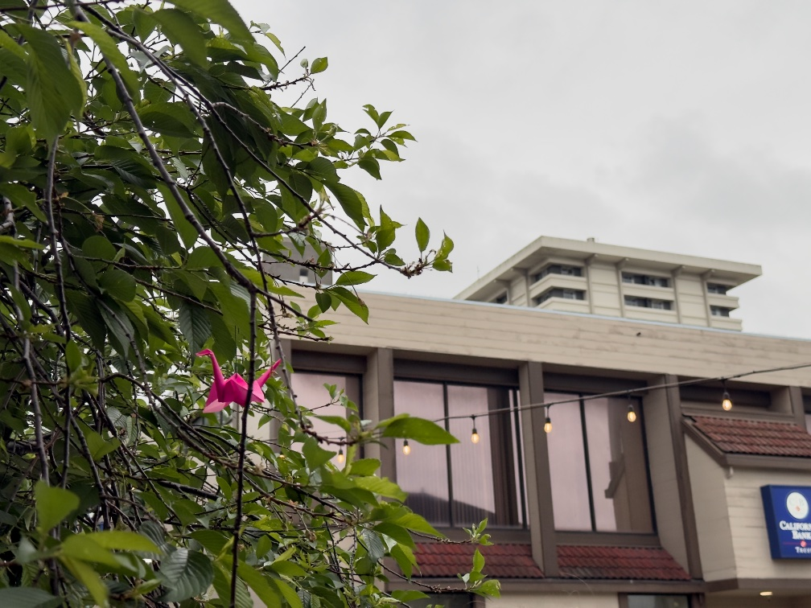

Short one this week, because I’ve a.) finally started work, for real, and need brain space for that b.) have been writing a thousand words a day (give or take) as I race to complete my latest manuscript asap c.) am working on a [how to jujutsu](https://rwblickhan.org/newsletters/really-truly-breathless-with-excitement/) article that I should also reserve some brain space for.

---

I [recently mentioned](https://rwblickhan.org/newsletters/you-can-take-my-em-dashes-from-my-cold-dead-hands/) some of the properties of my oft-repeated core identities of “writer and programmer”. I spent some time this week thinking about what else defines those identities, or perhaps more precisely what traits I identify in myself as coming from those disciplines:

- Programming:
  - A belief that processes _can_ be automated (not to say anything about whether they _should_). So many people are happy to copy-paste-repeat, but programmers tend to ask “why don’t you write a script for that?” I’ve slowly grown to the conviction that, historically, automation is not very natural to the human mindset and has to be learned.
  - An ability to build my own tools (hence a lot of time spent fiddling). Programming is unique as being one of the very few disciplines where you can actively build the tools you’re working in — even if you don’t _choose_ to build a text editor, you hypothetically _could_. How many other disciplines can say that? Perhaps woodworking and metalworking? Some parts of mechanical and electrical engineering? As a result, I spend a lot of time configuring customizing and messing around with settings and building little helper tools.
  - Being organized about data. I’m not sure this is a trait of programmers generally — I know plenty of messy-desk programmers — but it is a mindset I personally adopted from programming. I like to have a filing system for my documents; I like to sort my bookshelf by logical groupings; I like to use version control on everything I can.
  - A particular stance towards resource usage and efficiency that I can’t quite articulate. I find it very natural to think in terms of amortized cost or time tradeoffs, and while I _intellectually_ understand the case for waste and inefficiency[^inefficiency], _emotionally_ it pains me to see someone do something in a woefully inefficient way (like, say, copy-paste-repeat instead of writing a script...).
- Writing:
  - A narrative stance, even when engaging with non-fiction or other media. I like a good story! I think in terms of story! Even if that story is just “here’s an explanation of why we need to...”
  - A desire for nuance. Obviously writers can be very sure of themselves — all writing is partially intended to persuade, after all. But writing, especially long-form writing, especially especially fiction writing, especially especially especially novel writing, seems to militate against being all too sure about oneself.
  - A belief in writing things down. “Don’t bother writing up that documentation,” I am sometimes told, “because nobody reads.” Nevertheless, _I_ have a belief in the power of text to communicate (or else, why would I be writing this right now?).

Both disciplines, of course, share a conviction that these little textual symbols _mean_ something and are just as important as the material world, which is a pretty odd way to think about the world when you think about it.

Anyway, this was an interesting exercise, and probably one I’ll continue to think about. I’d highly recommend it to anybody that has a strong association with a particular hobby or profession.

---

This week’s update to the website: a new table of contents popover in the bottom left (if I put headings in, which I don’t always do). So, for instance, if you open my [brief, opinionated guide to tea](https://rwblickhan.org/newsletters/rbog-tea/), you’ll see the option in the bottom left if your window is wide enough. The design took a few attempts, but I’m reasonably happy with the outcome. I also set up [`scroll-target-group`](https://una.im/scroll-target-group), so if you’re on Chrome you should also see the current heading bolded.

---

[Flow State](https://www.flowstate.fm/) (ever a delightful source for new music) this week recommended [Ax14](https://www.flowstate.fm/p/ax14), a vaporwave producer that freely samples Windows Vista startup chimes and Wii waiting room music into charming midtempo EDM. If you are the exact age I am (i.e. 30ish) then prepare for a nostalgia bomb. (Nostalgia for a better, more optimistic world...)

## Buttermilk French Toast

This gets a header so I can link to it later. Recently I’ve been hankering for buttermilk, but that also means I need to find a _use_ for a quart-size buttermilk. I have discovered a great use: buttermilk French toast! Just replace the milk in a normal French toast recipe with buttermilk and you get super-simple but deliciously tangy meal.

### Ingredients

- 2 slices toast
- 1/2 cup buttermilk
- 1 egg
- Salt
- Pepper
- Butter
- Calabrian chilis

### Recipe

- Either use stale bread or throw it in an air fryer to dry out (I usually do 7 minutes at 180°F, but it doesn’t really matter how long).
- Mix the buttermilk, egg, salt, and pepper.
- Soak each piece of toast in the mixture.
- Pan fry in butter.
- Spread a layer of Calabrian chilis in between each piece in the final stack.
- Optionally, top it with fried egg.

[^inefficiency]: c.f. [Robin Sloan on waste and vitality](https://www.robinsloan.com/newsletters/winter-reading/#waste) or [Bliss Foster on luxury](https://youtube.com/watch?v=gSsCUZZblrc).
