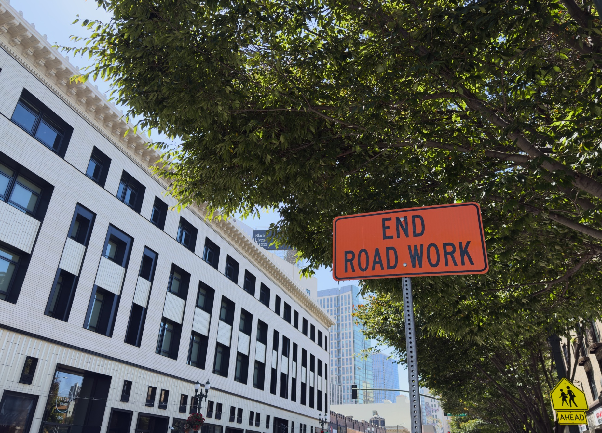
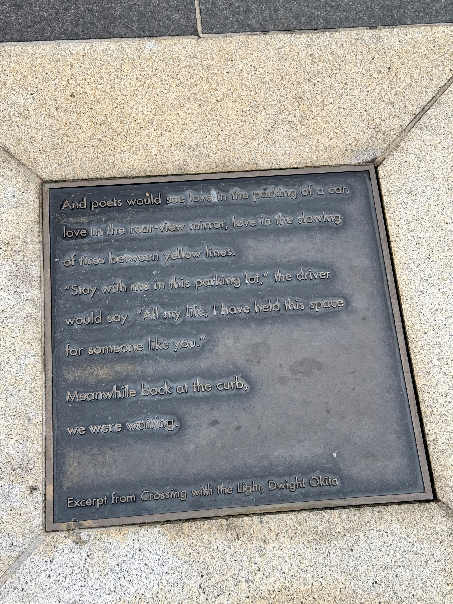
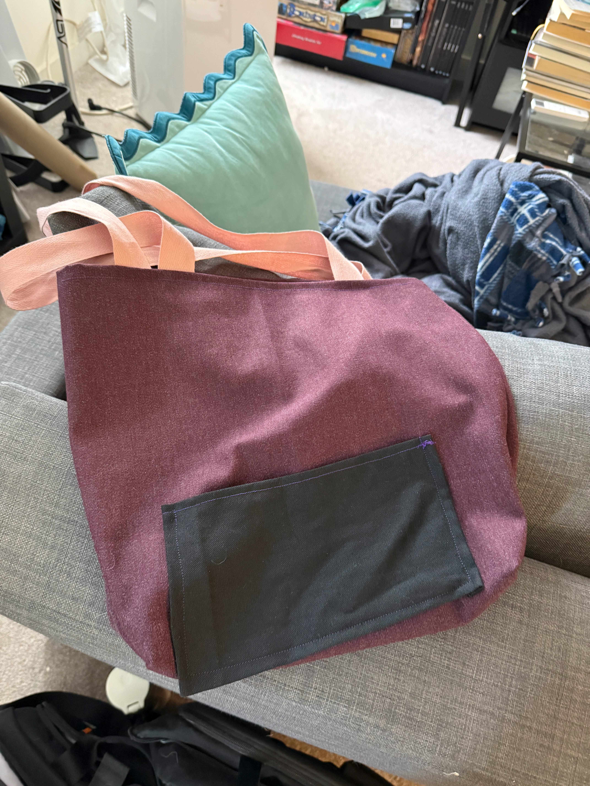

> A sign in Oakland - I can't help but reading this as a brave protestor against the ongoing onslaught of neverending road work...

So this week I read China Miéville’s [_The City & The City_](https://app.thestorygraph.com/books/4410c358-1eb8-40b3-b0c5-d77ffa02d1c3), which was my first Miéville novel and a [direct inspiration](https://steamcommunity.com/games/632470/announcements/detail/3334287173823797601) for _Disco Elysium_.

It has a typically “weird fiction” hook — two cities, Beszel and Ul Qoma, that occupy the same overlapping physical space[^balkans] but are required to “unsee” the inhabitants of the other city or risk being taken by the otherworldly powers of “the Breach” — though, in terms of genre, it’s very solidly a hardboiled detective story, following a Beszel policeman as he follows the conspiratorial twists and turns as he attempts to solve a mysterious cross-border murder.

The detective portions are a little weak at times — it’s overall very engaging, but many of the twists are not as interesting as they really should be, and frankly the novel should have been a good 50 pages shorter — but it’s at its best when it simply dwells on the strangeness of life in a divided city. The two cities have related, but carefully distinct, cultures,[^distinct] lovingly described, and some of my favorite parts of the novel were long trains of exposition describing the inner workings of Besz and Ul Qoman politics. Miéville never trips up, either; the separation between the two cities is always taken into account and never waved away.

The concept of “unseeing” alone ranks it as one of the greatest works of fiction specifically about urbanism, certainly up there with say _Invisible Cities_. It’s never pushed heavily — since, again, most of the plot focuses on mystery — but the setting is underlined by a constant sense of what urban dwellers choose to see and “unsee”. Which, of course, is also true of any urban dweller today, even in an undivided city. I mean, just this morning, I ran to the grocery store and studiously ignored the representatives of the slightly sketchy nature conservancy non-profit that always haunt the entrance. A little rude, yes, but I just wanted to go grocery shopping and did not particularly want to get pulled into my fifth discussion about saving whales (... by giving money to an organization I have literally never heard of). That kind of “unseeing” is a particularly urban phenomenon, and _The City & The City_ captures the feeling well.

---

Another thing that _The City & The City_ left me thinking about, that I may have discussed before and will likely discuss again: cities are _fractal_. If you look closely enough, there’s an almost arbitrary amount of detail in any major urban agglomeration. Despite the [rather large number of trips I’ve taken](https://rwblickhan.org/newsletters/seven-years/), I still occasionally meet someone that’s surprised how rarely I leave the City and County of San Francisco. But there’s just _so much_ San Francisco!

So, for instance: there’s a somewhat major shopping street called [Union Street](<https://en.wikipedia.org/wiki/Union_Street_(San_Francisco)>), which I only visited for the first time about two months ago or so, despite living in San Francisco for seven years now. And I literally, just now, looking at the map, learned that there’s a [fairly famous octagonal house](https://en.wikipedia.org/wiki/McElroy_Octagon_House) on that street that I totally missed the last two times I was there!

---

Another example of urban fractals — many outdoor Muni stations in San Francisco have these charming little poems in the concrete:

I took probably five years to first notice these, but now I make sure to read them every time I’m waiting for the train.

---

Completely unrelated: as part of my quest to explore more [physical arts and crafts](https://rwblickhan.org/newsletters/soulless-hellscape-of-b2b-saas-billboards/), I took the sewing bootcamp at [WorkshopSF](https://workshopsf.org/) — seven hours of learning how to use a sewing machine! A great experience, though a bit hard to book — each session only has maybe 8 students, so I had to set a reminder to book right when it opened.

I enjoyed sewing much more than I expected — something about watching the machine seal up gaps and seeing a complete tote bag appear out of a few bolts of cloth was deeply satisfying, even more so than bookbinding was. I don’t exactly expect to pick up a sewing machine — I don’t really have a project in mind that would use one, at least — but I still achieved the main goal; I notice the stitching on _everything_ now and have a much greater appreciation for how they got there. I’ll be going back to Workshop in a few weeks for their beginner leatherworking class. And, in the meantime, I have a fancy new tote bag I made myself:

[^balkans]: Strongly implied to be somewhere in the Balkans.

[^distinct]: One thinks, of course, of other famously “divided” regions like India/Pakistan, Jerusalem, or Northern Ireland.
