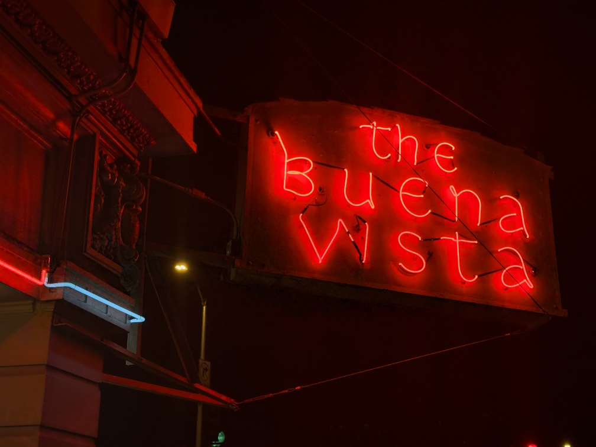

So I recently put the finishing touches on the latest draft of my manuscript (!! finally!!). Now we’ll see what comes of that — it needs uhhh at least one more major draft before I’m comfortable sharing it with anyone — but while reviewing / editing I was reflecting on what I like about my own writing — my comparative advantage, you might say — and I came to the conclusion that I am a Character Writer™️.

“Character writers” write stories where the characters themselves are a major draw (as opposed to the plot or themes), where the characters have some hard-to-describe spark of life independent of the writer.

I don’t think this is a quality of good or bad writing, per se — there’s good (even great) books that don’t have that “spark of life,” and bad books with great characters. It’s more like a _writerly propensity_.

A good example is Lousia May Alcott ([c.f. my recent discussion of _Little Women_](https://rwblickhan.org/newsletters/an-intensively-researched-finely-crafted-educational-program-intended-to-teach-children-values-like-say-curiosity/)) — Jo March is arguably _the_ archetypal girl-next-door, and _Little Women_ is adapted anew every few years. Now, _Little Women_ certainly has a plot and themes and even some very lovely prose — but, frankly, I kept coming back to it just because I really liked the March sisters and wanted to see how they evolved. They feel _alive_ in a way that many literary characters don’t.

Now, on the other hand, there are writers that write good characters but don’t feel like _character writers_ in quite the same way. For instance, I’m halfway through _Infinite Jest_, and while Wallace has a lot of memorable characters, I at least can never quite forget that he’s back there playing puppeteer; they all sound, a _little_ bit, like DFW. I don’t think it would be possible, exactly, to adapt _Infinite Jest_ to any other medium, because the experience of those characters is so wrapped up in the experience of Wallace’s prose specifically. I suspect the same is true of Helen de Witt, even though I love Sibylla and Ludo in _The Last Samurai_.

Curiously, this propensity seems pretty evenly distributed across genres or even mediums. I would have thought Romantasy was a haven for Character Writers, but for instance I found _A Court of Thorns and Roses_ to have pretty stiff characters. SF/fantasy and horror _might_ have less proportionally, but that’s probably just because so many stories in those genres aren’t really character-driven. However, some of the biggest names in sff and horror are big-time Character Writers, like Stephen King; a huge novel like _It_ only really works because the kids, and their adult versions, are so compelling as characters. Interestingly, Stephen King is _also_ uber-mega-adapted by all kinds of very different directors.

The exception might be comics, where for many publishers “characters having an independent life” is kind of the whole deal — DC and Marvel are fundamentally built on characters more than anything else, but so are indie comics like _Scott Pilgrim_. I wonder if that’s because the addition of visual art adds an extra dimension for expressiveness that makes it easier to make memorable characters. That carries over to animation as well, of course.

So what are other character writers that spring to mind?

Jane Austen, of course — “Emma Woodhouse, handsome, clever, and rich” is an iconic opening line for a reason. Douglas Adams was often underrated as a character writer, I think; he’s more known for humorous prose, but then you get a paragraph like this:

> One of the major difficulties Trillian experienced in her relationship with Zaphod was learning to distinguish between him pretending to be stupid just to get people off their guard, pretending to be stupid because he couldn't be bothered to think and wanted someone else to do it for him, pretending to be outrageously stupid to hide the fact that he actually didn't understand what was going on, and really being genuinely stupid. He was renowned for being amazingly clever and quite clearly was so-but not all the time, which obviously worried him, hence the act. He preferred people to be puzzled rather than contemptuous. This above all appeared to Trillian to be genuinely stupid, but she could no longer be bothered to argue about it.

Which I doubt anybody (except myself) would call their favorite passage from _Hitchhiker’s Guide to the Galaxy_ , but always struck me as finely observed, saying a lot about Trillian’s mindset, and Zaphod’s mindset, and the mindset of the many clever-but-not-as-clever-as-they-want-to-be men out there.

But the big one is probably Dostoevsky. _The Brothers Karamazov_ is this weird[^1] blend of family melodrama and philosophical navel-gazing. But it’s born along by the vitality of the characters — Fyodor and Mitya and Ivan and Alyosha and Father Zosima and all the random side characters who feel like real, actual people and not just figments of Dostoevsky’s imagination. Or, at least, they do to me.

Now, obviously that’s very lofty company, and it remains to be seen if anybody likes _my_ characters 😉 But, again, I think of this as more of a writerly propensity than a skill, per se, and I’ve found it a useful mental model to bucket books into — not least because I usually find I prefer reading books by Character Writers...

[^1]: _Brothers K_ is underrated for just how absurdly experimental it is. It’s hard for critics to even explain, exactly, what the point-of-view of the novel is! Not in a philosophical sense, but like a _who is supposed to be telling this story and what conversations do they have access to_ sense.
