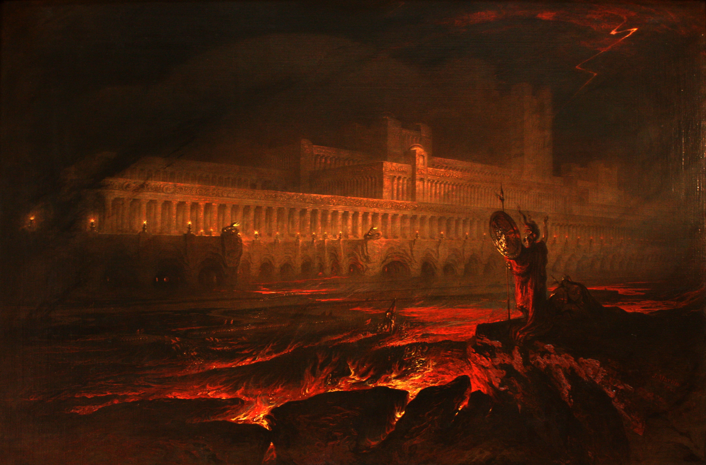
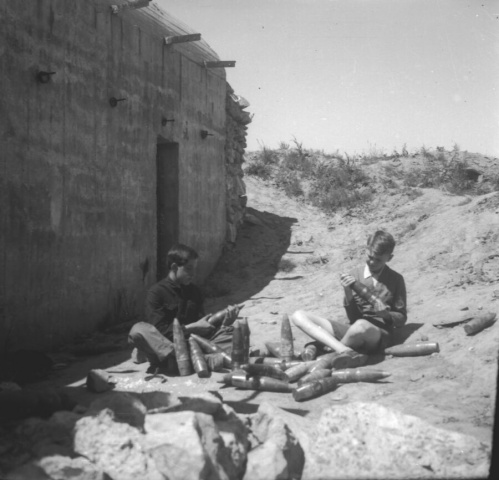
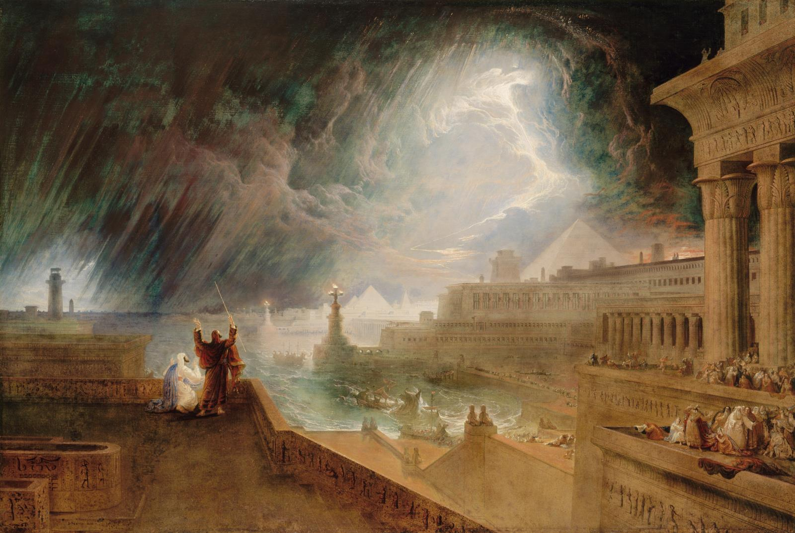
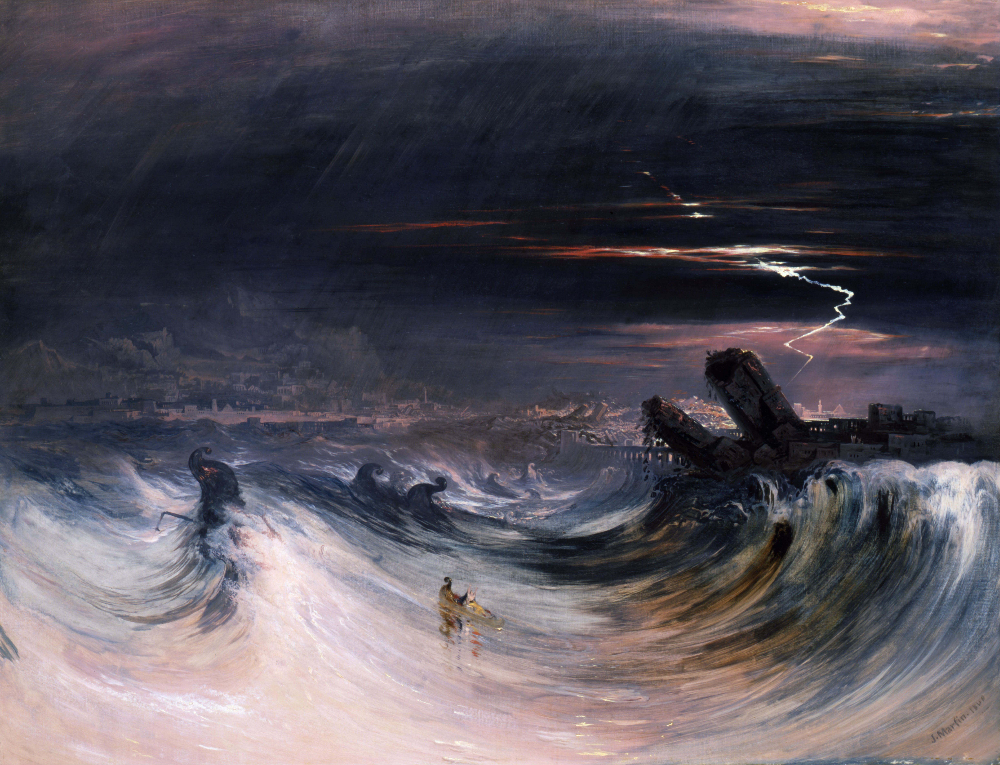

Hello all! It’s that Sunday again—another weekend, another adventure in dilettantery. I do apologize for the length of the newsletter, this week and every week—I always expect it to be short, and then find I write 1,500 words easily.

The art this week is various pieces by Romantic painter [John Martin](<https://en.wikipedia.org/wiki/John_Martin_(painter)>). I first took notice of him from the genuinely breathtaking [_Belshazzar’s Feast_](<https://en.wikipedia.org/wiki/Belshazzar%27s_Feast_(Martin)>), which is used on the Wikipedia page for [“the writing on the wall”](https://en.wikipedia.org/wiki/Belshazzar%27s_feast). Apparently he took much criticism from contemporary critics—Wikipedia almost makes him sound like a Victorian [Thomas Kinkade](https://en.wikipedia.org/wiki/Thomas_Kinkade)—and, in fairness, his paintings are definitely very melodramatic; but then again, sometimes melodrama is nice, and seeing as how he clearly influenced all the epic fantasy concept art I’m so fond of, I of course adore these as well. Plus, the Biblical themes tie into _Paradise Lost_ (see below), so…

[_Belshazzar’s Feast_, John Martin, 1821](<https://en.wikipedia.org/wiki/Belshazzar%27s_Feast_(Martin)>)

## What I’m Reading

I finally got through _Paradise Lost_, a long-term target for reading. It is rightly regarded as a classic, but it’s also a fascinating little book, because on the one hand there’s an awful lot of “and then God, our benevolent creator, created our beautiful world” (followed by two or three pages of purple prose describing the Garden of Eden), but on the other hand, in William Blake’s famous phrase, he was “of the devil’s party without knowing it,” which is to say, Satan gets all the good one liners. I think it’s that subversive tension that really makes it so great—on the one hand it’s a rather conservative text from the 1600s, with a lot of “women belong in the kitchen, our souls belong to God”, but there’s also a lot of tiny hints of unorthodoxy, like how Eve does not at all seem as submissive as the narrator describes her, or how the “Chaos and old Night” seem to be rival deities that God is encroaching on, or how Satan is a perfectly understandable antihero? It’s just marvelous how it feels like some parts of _Paradise Lost_ (I’m thinking of the opening chapter especially) could have been written in the last 30 years. Anyway, it’s a bit long and sometimes a bit boring, but I think it’s definitely a rewarding read.

Traditionally, my “reading list” was a series of slightly disorganized Amazon wishlists, which was rather annoying, since Amazon has a pretty trash mobile experience, which makes it hard to note things I want to read while I’m at the library/a bookstore/reading something on Pocket. So, I’ve moved to use Goodreads instead (even though it’s… also Amazon), and while my complaints about it are (probably?) well-known to this audience, I’ve found that it actually does work… fine? Not great, not even _well_, but fine. Anyway, that was just a prologue to say that I’ve been moving my to-read list to Goodreads, only to find I had way too many books to reasonably finish, so I instead created a [“must read” list](https://www.goodreads.com/review/list/26891156-russell-blickhan?shelf=must-read)… which now has 251 books and counting 😭 I’m also trying to “now reading” more intentionally (previously, it was merely whatever my Kindle thought I had open), which is to say, I’m now reading.

On a semi-related note, for my book-buying needs (not that I… have book buying needs, of course 🙂), I’m thinking of trying out [Bookshop](https://bookshop.org), an online bookstore that gives a cut to local indie bookstores. I’ve heard pretty good things about it! You can even [become an affiliate](https://bookshop.org/affiliates/profile/introduction) and make a pretty penny off your book recommendations; that being said, I wouldn’t ever expect anybody to buy off an affiliate link, but I am tempted by having a public list of “recommendations”/reading lists, a la [Robin Sloan](https://bookshop.org/shop/robinsloan).

[_Le Pandemonium_, John Martin, 1841](https://en.wikipedia.org/wiki/File:John_Martin_Le_Pandemonium_Louvre.JPG)

## What I’m Watching

Since this year is apparently turning into a “year of classics”, I checked off a prominent member of the cinematic canon, Kurosawa’s _Rashomon_, in which four eyewitnesses tell differing, contradictory accounts of a sexual assault and murder. It is, indeed, a very good movie—it somehow manages to be a Thinky Movie that you could watch in a media studies class, while also being an enjoyable murder-mystery-ish yarn that’s done and through in just 90 minutes. On the other hand, as the comments on Kanopy pointed out[^1], it can be a bit hard to stomach a story of sexual assault[^2] that’s essentially ‘50s attitudes projected back on the Sengoku-era past, with not a little victim-blaming and obnoxious obsession with honor—this is definitely a film that would deserve a content warning in a film studies class. On the _other_ other hand, you could also read the film as a critique of those attitudes—definitely, none of the characters come out looking particularly noble, especially as the film repeatedly tells us they are _all_ lying, with one of the fight scenes in which the dueling characters are visibly shaking being especially shocking. I also found the ending, which concludes the frame story, rather disturbing; I’m not sure this was entirely the intention (Wikipedia seems to frame it as a “happy ending”), but then again, I’m not sure it’s _not_ intended either. In any case, I would tentatively recommend it.

In video essay land, here’s one titled [“The Nightmare Artist”](https://youtu.be/dxRB4sdbIcw), exploring the life and work of deeply influential horror painter Zdzisław Beksiński. The only thing I have to add here is that you should definitely see the above picture of him and his friend playing with discarded ordnance in 1941, [found on Wikipedia](https://commons.wikimedia.org/wiki/File:Zdzisek_1941.jpg).

[_The Seventh Plague of Egypt_, John Martin, 1823](https://en.wikipedia.org/wiki/File:Martin,_John_-_The_Seventh_Plague_-_1823.jpg)

## What I’m Listening To

Thank goodness, there’s [someone else](https://longreads.com/2020/05/04/i-dont-like-fiona-apple/) who doesn’t think Fiona Apple’s _Fetch the Bolt Cutters_ is the Earth Mother’s gift to humanity 🙄 Seriously, though, it has felt strangely isolating to completely fail to connect with an album that is, currently, the highest rated album ever on Metacritic (and, in fact, being completely unable to articulate _why_), and that article is a tidy exploration of that feeling.

On the other hand, I have been enjoying Grimes’ _Visions_ quite a bit—turns out she makes really nice weird-but-danceable synthpop in the vein of, say, Chrvches or Gazelle Twin?

[_The Evening of The Deluge_, John Martin, 1828](https://en.wikipedia.org/wiki/File:The_Deluge_engraving_by_WIlliam_Miller_after_J_Martin.jpg)

## What I’m Working On

I’ve been forcing myself to write 500 words a day, no more, no less—not counting the newsletters, that is—in an attempt to “increase my velocity”, as a software project manager might say. That has worked out reasonably well so far, with a ~6,000 words or so written in the past two weeks. I think the trick here is that 500 words is just long enough to feel like “progress”—it can encapsulate a small episode in a story or the core of an argument in an essay—but not long enough to feel like a hassle, and thus readily achievable each day. I subscribe very strongly to the “power of habit” school of thought (i.e. do something every day for 14 days and you’ll do it for the rest of your life—that’s how I ended up jogging almost every night for the past 5 years or so), so I think it’s important to have something that feels doable each day, unlike NaNoWriMo’s[^3] 1,667-words-per-day requirement.

So, I’ve split the work about 80/20 between the Charlemagne-inspired story I teased last time (though, to be quite honest, I’m not really _feeling_ the story—but I’ll try to reach 10,000 words before abandoning it) and a retelling of _The Tempest_ with a few twists. Do let me know if you want access to the in-progress rough drafts of either of those (although, again: rough drafts).

I’ve not bothered doing any non-trivial work on buttonup for the past two weeks (hence why there was no newsletter sent out), though to my surprise Sherry has really taken off with [her Android version](https://github.com/frostyshadows/buttonup). The past few weeks at work have been somewhat intense and, with an intern and interview training starting, I expect the next month or so to be intense as well[^4], so I don’t imagine I’ll get much more done anytime soon (and, in any case, I’d rather write more instead).

[_The Destruction of Tyre_, John Martin, 1840](https://en.wikipedia.org/wiki/File:John_Martin_-_Destruction_of_Tyre_-_Google_Art_Project.jpg)

[^1]: N.B. Kanopy has a surprisingly good comments section? I suppose that’s because most people watching things on it are there through the library. Libraries are great, folks!

[^2]: Or maybe I should say “sexual assault”—the story definitely _calls_ it rape, but then it also heavily implies it was perhaps not so unconsensual after all.

[^3]: Let me say I am _shocked_ by how few people seem to know what NaNoWriMo is—I think the only person I’ve mentioned it to that was aware of it at all was themself a published author (yes, a few coworkers are apparently published authors). Now, on the one hand, that makes perfect sense—who would know about a writing challenge that wasn’t a writer?—but, on the other hand, I had a very charismatic middle school English teacher who had done NaNoWriMo multiple times (!) and encouraged us to do likewise (!!!)—perhaps I was just lucky to have extremely passionate English teachers growing up.

[^4]: Although we did get May 1st off, which was a nice touch, and I’ll be taking off a four-day weekend for Memorial Day.
