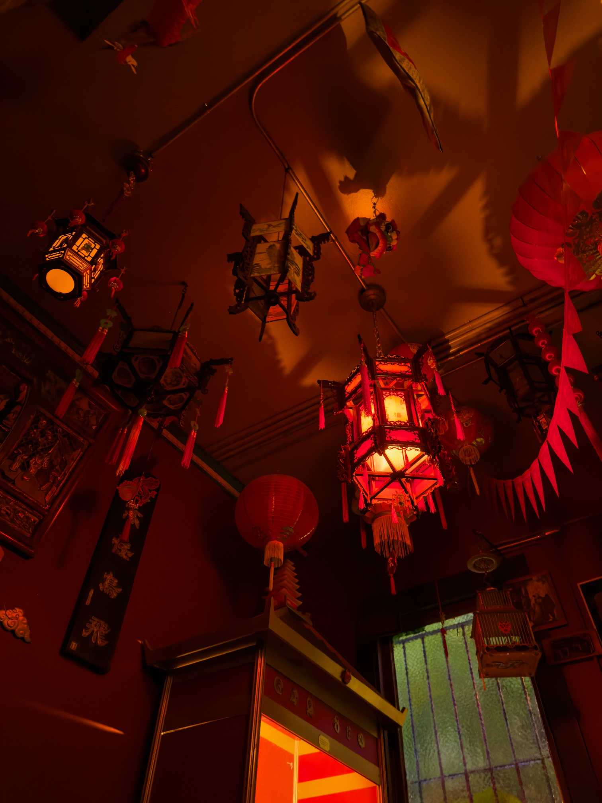

- The very strange Chinese-themed room at the 134-year-old [Shotwell's](https://www.shotwellsbar.com/) in the Mission District (otherwise a very lovely bar!)

I realized in the past two weeks I hadn’t marked [the passing of Marjane Satrapi](https://deadline.com/2026/06/marjane-satrapi-dead-iranian-french-persepolis-56-1236940629/), author of classic Bildungsroman comic _Persepolis_.

_Persepolis_ is a particular favorite of mine, even though I would probably forget to include it on such a list if asked since it’s not a book I reread very often. It bears little resemblance to most of the the topics I typically think or talk about,[^4] but it has a good chance of being in the top three most important books in my life, or possibly _the_ most important. Once upon a time, I was a naive young Midwestern kid, who didn’t know that Iraq and Iran were different places, let alone that they had fought a bitter and brutal war throughout most of the ‘80s. So, having been assigned _Persepolis_ in school, my eyes were opened to the breadth and depth of the world, that there are whole regions of the world with their own complex histories and identities and people who are very similar to myself in some ways and very, very different in others. Which seems trite, sure, but it was important to a fairly sheltered tween. And a fair number of my life decisions have been driven by that realization — if I ever seem like a know-it-all (probably quite often, I know), then that’s ultimately driven by a desire to fill up my knowledge of the world, as much as I possibly can, while I still can, a desire first uncovered by _Persepolis_.

Also, it’s still such a beautiful work of art. There’s one scene — one panel, really — which still makes me tear up every time I read it.

Satrapi had a difficult life; obviously, everything included in her memoir, but it’s also difficult to read her hopeful introduction to the 25th anniversary edition in light of, well, everything that’s happened to Iran during the 26th anniversary. And she suffered severe depression after the death of her partner, with her family saying she “died of sadness.”

But, still, I’m grateful that _Persepolis_ exists, and I’m grateful that it made my life better. So rest in peace, Marjane, and may you be reunited with your lost love.

---

Next time you have 45 minutes free to watch a crotchety old Midwesterner ramble about his art, video-game-documentarians-extraordinaire People Make Games [traveled to Michigan](https://www.youtube.com/watch?v=Is8N7B9b0GQ) to see [Jerry’s Map](https://www.jerrysmap.com/). Jerry Gretzinger has spent decades generating a massive, basketball-court-sized map of a not-quite-fantasy world, as instructed by a slightly spooky set of cards and a complicated generative ruleset. Absolutely delightful to watch Quinns struggle with just how seriously to take the work, especially when Jerry starts dryly talking about the map’s population of reanimated humans.

But what I appreciated more than the doc itself — which is, to be clear, lovely — is [Quinns’ reflections](https://www.patreon.com/qquest/posts/fan-club-blog-27-161136920?post_id=161136920) on his Patreon[^1], where he points out that Jerry’s map isn’t a _game_, exactly, but it’s certainly a form of _play_. And there’s all kinds of play, historically,[^2] that have influenced each other in all kinds of ways, and could _continue_ to influence each other, due to this deep human need for play.

And, on the other hand, what a great example of (not-quite-)outsider art — a man making a little art piece, every day, according to rules he set up decades ago, day in and day out, resulting in this massive artwork that is beautiful but also kind of hard to understand. Which then makes me think of other great outsider artists like Hilma af Klint[^3] and the relation between play and sacredness — because af Kilnt and her circle understood their work as sacred (“Paintings for the Temple”, after all) but it was also pretty clearly a form of _play_.

One year I set a goal of making a “year of play,” because I felt my life was lacking a sense of playfulness. Nothing really came of that, and now I’m wondering if I’m still lacking that sense of _play_. Then again: maybe this newsletter is also, in its own way, a form of play, just like Jerry’s map.

---

New on the website this week: I’ve always been fascinated by the artwork on coffee cups, which is often treated with such care despite being on one of the most disposable items in modern culture.

So I made a [single-serving page](https://rwblickhan.org/coffeecups/) to collect photos of coffee cups that I’ve encountered — just a few, to start, though I have a backlog of collected coffee cups to photograph. _Unfortunately_, I haven’t found time to investigate the artists and designers, though if you somehow happen to know who did any of them please let me know!

[^1]: Paywalled, but, Quinns is doing the Lord’s work!

[^2]: One thinks of how [_Playing at the World_](https://playingattheworld.blogspot.com/) opens with Prussian _kriegsspiel_.

[^3]: “But af Klint isn’t an outsider artist!” you might shout. Perhaps another essay but I think understanding her circle of women artists as outsider artists is _far_ more interesting than their posthumous reputation as the first abstract art, a claim that’s much flimsier than usually let on.

[^4]: Other than being a Bildungsroman, of course, which is one of my favorite genres, and a comic, which is one of my favorite media. But, then again, maybe those are my favorites _because_ of _Persepolis_.
