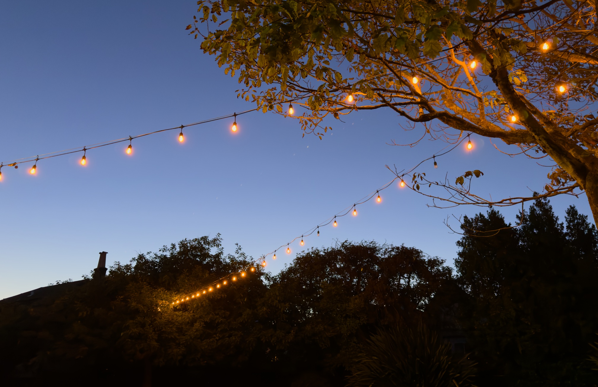

So, I’m supposed to be finishing up the [San Francisco Marathon](https://www.thesfmarathon.com/) as I write this. I’ve been training — a half marathon a week — for the past month. I organized my whole weekend around spending 5+ hours running this morning. I had friends preparing to cheer me on. I went to bed at 9pm last night. I had even prepared the title for this newsletter: [_A Supposedly Fun Thing That I Will, On Further Reflection, Probably Do Again_](https://rwblickhan.org/newsletters/a-supposedly-fun-thing-ill-never-do-again/).

But then, somehow, _all three_ alarms I had set failed[^failed] to go off. So instead of getting up at 4:15am for the 5:15am start line, I got up at 7:15am when the first rays of sunlight hit my face.

So, needless to say, I’ve now deferred for the _third year in a row_ and am, at this moment, wondering what witch cursed me and why.

So, yeah, a pretty huge disappointment, with lots of messy feelings I’m going to have to work through in the next few days. But at least I’m no longer anxious about having to get up at 4am 🙃

On the bright side: I _was_ allowed to defer again (despite being past the deadline) and next year (2027) is the 50th anniversary of the SF Marathon. Also, perhaps knowing in my heart that I was cursed, I intentionally set my [yearly goal](https://rwblickhan.org/newsletters/yearly-goals/) to “12 long runs”, not “run a marathon”, so that I could claim credit for training for the marathon, even if the marathon itself didn’t happen (as indeed it did not).

Oh well. Maybe next year.

---

In other news, I watched Christopher Nolan’s adaptation of _The Odyssey_, and I [did not like it](https://letterboxd.com/rwblickhan/film/the-odyssey-2026/). Obviously I am very happy to see someone provide a fresh take on our common cultural inheritance, but I have to agree with [Adam Roberts](https://profadamroberts.substack.com/p/nolans-odyssey): why Odysseus? I think Nolan would have been much better served adapting the _Aeneid_, a poem which is _already about_ the themes Nolan clearly wanted to explore (war crimes, guilt, PTSD, cycles of violence, the collapse of civilization, etc etc). But I also think the film just wasn’t very good on its own merits, a collection of all of Nolan’s worst tics as a filmmaker[^dead] in one neat bundle. I also wasn’t extremely enthusiastic about _Oppenheimer_, but at least it had a particular kind of manic energy that this film totally lacks.

[^failed]: The alarm was on my lock screen when I got up, but wasn’t ringing. My only reasonable explanation is that I’m on the iOS 27 beta and something changed with the relationship between alarms, silent mode, and DND. Maybe. Frankly, it’s a mystery.

[^dead]: Except a dead wife! Somehow, miraculously, Nolan resisted the temptation to kill off Penelope.
