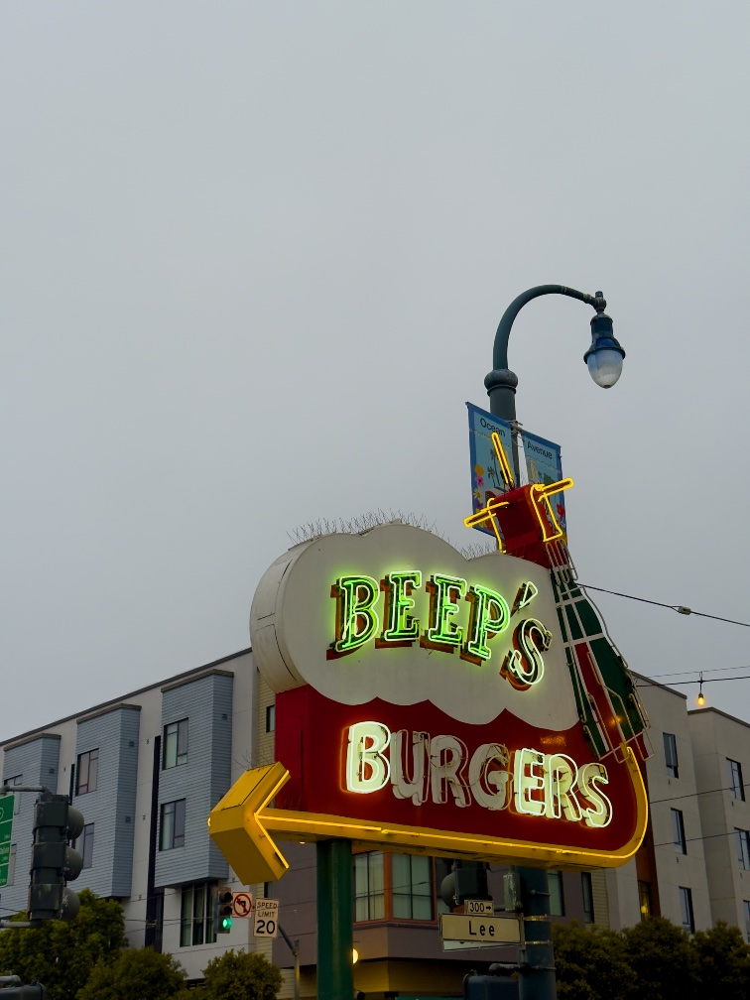

After mentioning [last week](https://rwblickhan.org/newsletters/seven-years/) that I had never been to Beep’s, I guess I manifested it, because I was almost immediately invited to say goodbye to a friend moving away by eating at his favorite late-night haunt, which was, of course, Beeps. I’m happy to report that it is in fact a solid 8 out of 10 and not at all overhyped.

---

This week I finished another book off my yearly goals, which was [_Jane Eyre_](https://en.wikipedia.org/wiki/Jane_Eyre).

On the one hand... it’s all there! All of modern literary fiction — this idea that novels should be all about _interiority_ — comes right from _Jane Eyre_. So much of the novel is just Jane thinking to herself about what she thinks other people are thinking, a full half century before the advent of modernism. It’s one of the few classics where I finished it and immediately thought, yes, this is a capital-I Important work in the history of literary fiction and worth reading for that reason alone. Plus, Jane is just a great character; her personality comes through _so strongly_ that by the end you feel like she’s a real person you know.

But, on the other hand, parts of it were frankly a slog. It’s just so aggressively wordy, in that uniquely early-nineteenth-century way, and many scenes drag on much longer than strictly necessary. A modern-day editor would probably go to town cutting. Plus, despite being one of the great romances[^romance], I just _didn’t really like_ Mr Rochester — most of the time Jane and Rochester were together, I found myself wondering why she was so devoted to the man, who _was_ the archetypal brooding, dashingly handsome, kind of problematic Bryonic hero, but also just... a bit of a dick, sometimes? I imagine most adaptations play up the (admittedly quite charming) banter between the pair, and probably squash the age gap.

Which, on that topic: it was _very strange_ to go into _Jane Eyre_ knowing that Rochester is maybe-probably inspired by Charlotte Brontë’s unrequited crush on her tutor, [Constantin Heger](https://en.wikipedia.org/wiki/Constantin_Heger). That lends the novel a slightly strange (but also kind of amusing) wish-fulfillment fan-fic-y quality, especially when the twist turns out to be (uh, spoilers) that Rochester is actually married, _but his wife is **craaaaaazy**_.

Anyway, I can’t quite unreservedly recommend reading _Jane Eyre_ “for fun”, though a few chapters were particularly strong.[^sojourn] But it well deserves its place in literary history.

And now, on to _Wide Sargasso Sea_, a reinterpretation of _Jane Eyre_ that, based on the first ten pages, has a strong chance of being the best book I read this year!

[^romance]: It _also_ feels like a milestone in the romance genre.

[^sojourn]: Jane’s three-day impoverished sojourn after leaving Rochester’s mansion springs to mind; it captures the slowly gathering sense of desperation quite well.
