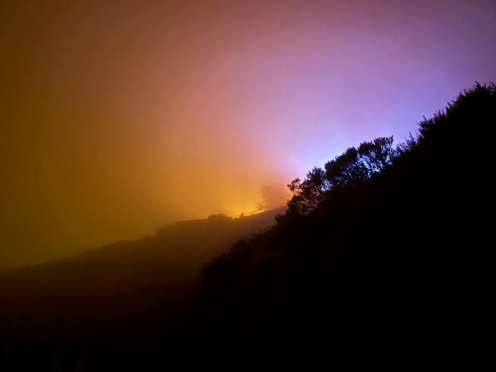

So, I’ve done it. I’ve climbed Mount _Infinite Jest_ and survived to come down the other side. It was, to paraphrase a great essayist, a supposedly fun thing I’ll never do again. And I have Thoughts™️, but also, at some level, not as much to say about it as I expected? Oh well, we’ll see how many words this ends up being...

---

The rest of this newsletter probably won’t make much sense if you don’t have at least a passing familiarity with _Infinite Jest_. Luckily, travel blogger extraordinaire Matt Lakeman has a [plot-summary-slash-thematic-overview](https://mattlakeman.org/2026/03/26/infinite-jest-extraction/) that ably serves as an introduction.[^plot] I largely agree with his take, that _Infinite Jest_ is a novel about people devoting their lives to _something_ (whether that be tennis, or avant garde filmmaking, or drugs, or just simple entertainment), while not always being totally aware that they’re doing so. But we _all_ do that — to paraphrase [_The Master_](https://letterboxd.com/film/the-master-2012/), the person that can find a way to live without serving a master, any master, would be the first to do so in the world — so it’s valuable to be aware of it and take control of it. Also, earnestness is great and 90s-style detached irony sucked.

So I’m not necessarily that interested in talking about the novel thematically, but instead _Infinite Jest_ as a cultural object. And for that, the greatest source text has to be Patricia Lockwood’s [“Where be your jibes now?”](https://www.lrb.co.uk/the-paper/v45/n14/patricia-lockwood/where-be-your-jibes-now), a long critique of Wallace’s work and possibly my favorite Lockwood piece.[^lockwood] She’s a lot harsher on Wallace than I would be, but, well, a lot of the details[^details] _are_ pretty damning.

But, then again: Michelle Zauner (of Japanese Breakfast and _Crying in H-Mart_) [loves the novel](https://www.theguardian.com/books/2026/feb/07/never-mind-the-lit-bros-infinite-jest-is-a-true-classic-at-30), so much so she wrote the introduction to the 30th-anniversary edition. Which then led me to [this rather interesting piece](https://clereviewofbooks.com/finding-a-way-in-on-michelle-zauner-and-the-cultural-history-of-infinite-jests-forewords/) in the _Cleveland Review of Books_ that analyzes the forewords for the tenth-, twentieth-, and thirtieth-anniversary editions.

And then, of course, there’s [Helen DeWitt’s comments](https://paperpools.blogspot.com/2008/09/oblivion.html?m=1) on DFW, and then [Phil Christman’s comments](https://philipchristman.substack.com/p/helen-dewitt-and-ilya-gridneffs-your) on Helen DeWitt’s comments, on whether Wallace’s work is “difficult”, to which I tend to agree — namely, that it’s not _really_ that difficult, other than the length, and merely trusts the reader to follow along.

So! With all[^homework] the homework out of the way, let’s move on.

---

The experience of reading _Infinite Jest_ is dozens of pages of mild-at-best interest, followed by 2-3 pages of transcendence. Repeat ad nauseam for 60 hours.

Part of my frustration is that [I loved](https://rwblickhan.org/newsletters/yes-yes-i-know-its-passe/#5-something-to-do-with-paying-attention-david-foster-wallace) _Something To Do With Paying Attention_, a novella plucked out of (the unfinished) _The Pale King_ by an enterprising editor and published posthumously. You can probably get 80%[^20] of the value of _Infinite Jest_ in 20% (or less) of the time, _and_ you don’t have to read a scene where an improbably-disabled girl wearing a Raquel Welch mask is molested by her father (something that, yes, occurs in _Infinite Jest_).

Which does just go to show the value of a good editor, right? There’s something to be said for a massive, life-consuming aesthetic experience... but there’s also something to be said for conciseness.

---

One thing I found surprising was that, despite the many forward-thinking mini-essays on the state of media, DFW never really justifies the structure of _Infinite Jest_ itself within _Infinite Jest_. Specifically, _why is it so long?_ Why are there so many characters? Why does it spend so much time on mundane details of characters that don’t relate to anything else in the story?

There is _some_ discussion of the topic, including a long conversation about silent figurants (that is, extras) in film, as well as various jokes about a director who includes so much noise from unnamed background characters that you can’t hear the main dialogue. But none of these discussions really argues _for_ the digressive quality of the text itself — _Infinite Jest_ seems to take its value as a given.

---

Part of what makes _Infinite Jest_ frustrating to get through is a pervasive sense of _immaturity_. Not even at a textual level — although the worldbuilding was shockingly silly[^canadians] and there’s slightly more slurs than I’m fully comfortable with[^slurs] and the slapstick humor is frequently just not funny and, as Lockwood ably points out, there’s a pervasive sense of male gaze in which pretty much every major female character is the victim of childhood molestation — but on a deeper, cultural level. It’s just so obviously a product of a time before the last twenty-ish years of cultural change.

And really, you get the sense, from a 2026 vantage point, that 1990s America just didn’t have enough to worry about. Like, really? You’re worried about a video so appealing people get addicted to it? We have that here in 2026; it’s called TikTok. And that’s not even on the top ten list of apocalyptic threats.

---

An excursus[^excursus] that may make sense momentarily: A few years ago, I finally sat down to read Neil Gaiman’s _Sandman_, in which the eponymous character famously looks suspiciously similar to Gaiman. I loved it, and I read it as the story of a man who had done some not-great things — broken a few hearts, gotten in a few fights, nothing unforgivable — and was slowly learning to forgive himself, since, after all, we humans can learn and change. I related — I am, after all, not always the most emotionally stable myself.

Then [_the allegations_](https://www.vulture.com/article/neil-gaiman-allegations-controversy-amanda-palmer-sandman-madoc.html) came out.

So, curious, I tried to reread one of the _Sandman_ arcs last year. At which point I realized it wasn’t the story of a man forgiving himself for doing not-bad things — it’s the story of a man doing _very very_ bad things, and continuing to do so, and trying to convince the reader (and, just as much, himself) that they weren’t _that_ bad, were they? He’s still a good person, _right_?

Which does, in some ways, make _Sandman_ thematically richer! But it’s almost impossible to recommend reading it straight, without major asterisks. I gave up on that reread after half an issue.

On that old debate of separating the art from the artist, I’m generally comfortable with separation, _unless_ the artists’ views are thematically relevant. It’s difficult to read Lovecraft, because his racist worldview pervades the horror of his fiction. It’s difficult to read _Sandman_ because of _the allegations_ and how similar they are to some of the plot points — how, to paraphrase _Sandman_, some stories are meant to warn you about dangers in the world, but Gaiman was _himself_ the danger.

Which leaves me in a pickle with _Infinite Jest_, because on the one hand, I want to say we can safely separate the art from the artist and enjoy it as a world of its own — that any bad things DFW did are irrelevant to the novel. But, obviously, we can’t? It’s set in a tennis academy and AA-influenced halfway house, and sure enough, Wallace was a junior tennis player and a 12 Step adherent. Plus, as Lockwood points out, the character of Joelle van Dyne, the “Prettiest Girl of All Time”, is pretty transparently based on Mary Karr, who Wallace was violently obsessed with. Maybe I should not be paying attention to this book at all!

But on the other hand, _Infinite Jest_ is so long, so filled with different voices, so recursively detailed, that it does feel a little reductive to say that it’s just “pulled from life.” It does feel like the novel has a life apart from whatever Wallace may have intended or how he may have behaved.

But also, he did behave pretty badly, it seems. So I don’t think _Infinite Jest_ is so special or unique that you _have_ to read it, despite any distaste you might feel.

---

On the topic of specialness or uniqueness: there was, at some time, a consensus that _Infinite Jest_ was completely _sui generis_, an attempt to push novels to some completely uncharted territory. That it is, ahem, a heartbreaking work of staggering genius.

It’s definitely an _impressive_ work, in the sense that it’s very long and very well-written throughout, and yes the footnotes are fun, but I’m not sure that’s really _unique_. Having now [read some Pynchon](https://rwblickhan.org/newsletters/index-full-of-in-jokes-which-most-readers-probably-skip-over/), I couldn’t help but spend the entire novel going: oh, he’s doing Pynchon! Or, more broadly, he’s writing Wallace-style nonfiction essays, a lot of them, but set in a slightly funky world of his own creation (that, again, has fairly clearly real-life inspirations).

I wouldn’t call _Infinite Jest_ a work of genius not made by human hands. When I think of a book that feels inhuman, in the sense of “how did a human even write this?”, I instead think of _Watchmen_, a long, convoluted, episodic narrative in which all the random elements turn out to be part of a single overarching grand plan, which is then _thematically about grand plans and their tendency to go awry_. I’m not sure I understand how _Watchmen_ exists, though then again I’m not sure Alan Moore would say he understands either.

---

It’s mildly ironic that Dave Eggers — who effusively praises _Infinite Jest_ in his tenth-anniversary foreword as, basically, the best book of all time, the work of a singular unmatched genius, that will outlive us all — has had a deeper, longer-lasting, (...arguably more positive...?), influence on the arts, through his work on [_McSweeney’s_](https://en.wikipedia.org/wiki/Timothy_McSweeney's_Quarterly_Concern) and [826 Valencia](https://en.wikipedia.org/wiki/826_Valencia) and the new [Art + Water](https://artpluswater.org/about/) artistic residency program.[^eggers]

---

This all sounds very harsh. And, to be fair, by the last 200 pages, I was just trying to get it over with. One almost begins to wonder if we’ve wasted the last thirty years on this novel.

But... but...

There _are_ those two-to-three-page stretches of transcendence. There _are_ those chapters that will forever stick in my head, like heart-of-gold Don Gately’s doomed defense of Ennet House and his charges. There _is_ the portrayal of the deliciously dysfunctional dynamic of the Incandenza family, particularly as seen from Joelle’s perspective, which is to my mind is up there with _Arrested Development_ as one of the greatest depictions of the weird combination of love and repulsion in truly dysfunctional families. There _is_ earnest, loving, disabled Mario Incandenza, the only person in the story that actually seems remotely in touch with their emotions.

But most of all there is, as Helen DeWitt[^dewitt] puts it, his “ravishingly lovely gift for voice; he took the sort of pleasure in variety that we see in (say) Mussorgsky's Pictures at an Exhibition or Debussy's Preludes.” The answer to “why is _Infinite Jest_ _like that_” is probably as simple as “because Wallace wanted to write a lot, in a lot of different voices and styles.” At the end of the day, no matter how digressive, _Infinite Jest_ is just kind of interesting to read on a sentence-by-sentence level.

The question, then, is perhaps what we do with that. That’s why Lockwood’s article ends with the exhortation: “You open a text and it wakes. What is alive in it passes to the living. His attention becomes our attention. It can still be ours, sure. Do with it what you will.”

---

I was first exposed to David Foster Wallace in, I think, high school, when we were assigned _Consider the Lobster_ — specifically “Consider the Lobster,” “Big Red Son”, and “Authority and American Usage,” if memory serves, which it usually doesn’t. He’s never quite come unlodged since, despite how little I interacted with his work since; the copy of _Infinite Jest_ I bought in the first year of college remained, perhaps luckily, unread until now. My next exposure — besides a reread of _Consider the Lobster_ in college, when I considered donating my badly dogeared copy — was _Something To Do With Paying Attention_, which, as I’ve said, I loved on its own merits.

Obviously, That Voice™️ has had a huge influence on me, perhaps second only to Douglas Adams — you may note the presence of ten footnotes in this very essay, or my cheeky habit of Capitalizing Important Words And Trademarking Them™️, or just the slightly rambling, digressive style. You don’t, necessarily, get to pick what voices influence you.

And I’m still not sure how I feel about that.

---

A fun fact I don’t know where else to put: part of my childhood fascination with DFW was his strong resemblance to [Elliot Spencer](https://www.google.com/search?q=elliot+spencer+leverage), the fixer portrayed by Christian Kane on the TNT heist comedy-drama [_Leverage_](<https://en.wikipedia.org/wiki/Leverage_(American_TV_series)>), which my mother was fairly obsessed with at the time. As I recall, the character often wore a tellingly Wallace-ian bandanna and rolled-up flannels or denim.

I’ve always thought I was the only person in the world to notice this (which was _surely_ intentional), but I just now learned the novelist Max Gladstone [pointed it out](https://maxgladstone.com/2012/01/david-foster-wallace-provides-leverage/) way back in 2012.

[^plot]: Though he does get a few plot details notably wrong.

[^lockwood]: The focus on a single writer’s works lends a coherence I, er, sometimes find lacking in her other work (as enjoyable as they can be to read).

[^details]: Whenever “David Foster Wallace pushed Mary Karr out of a moving car” comes up, I will admit I feel, uncomfortably, just a little, like the protagonist of The Onion’s greatest work, [“Man Always Gets Little Rush Out Of Telling People John Lennon Beat Wife”](https://theonion.com/man-always-gets-little-rush-out-of-telling-people-john-1819578998/)...

[^20]: The other 20% is [the sense of a lived-in world](https://www.theguardian.com/books/2026/feb/07/never-mind-the-lit-bros-infinite-jest-is-a-true-classic-at-30) that Michelle Zauner talks about. _Something To Do With Paying Attention_ just isn’t long enough.

[^excursus]: I know “excursus” is a little pretentious, but it’s just such a lovely word!

[^eggers]: And [chewing out OpenAI employees](https://www.theverge.com/ai-artificial-intelligence/967630/dave-eggers-openai-chatgpt-silencing-an-entire-generation) after he was invited to speak there lol

[^canadians]: I found the portrayal of Canadians amusing at first, but the longer it went on, the more I’m convinced DFW never actually met a Canadian.

[^slurs]: Justified as being in the voice of particular characters, although as [I said before](https://rwblickhan.org/newsletters/a-hard-to-describe-spark-of-life-independent-of-the-writer/), all of the characters kind of sound like DFW...

[^dewitt]: It’s probably telling that the only main critics I’ve referred to here, DeWitt and Lockwood, are _themselves_ gifted with a talent for voice, above all else; I call them DeWitticisms for a reason.

[^homework]: Actually, one more article: [Consider the Sister](https://www.thesmallbow.com/p/consider-the-sister-2b94?ref=thebrowser.com) discusses his relationship with his (still living) sister, who a.) talks exactly like him and b.) may be the inspiration for his story [“Good Old Neon”](https://en.wikipedia.org/wiki/Good_Old_Neon) and c.) now has to defend his reality as a person against the pop-culture construct that has taken over.
