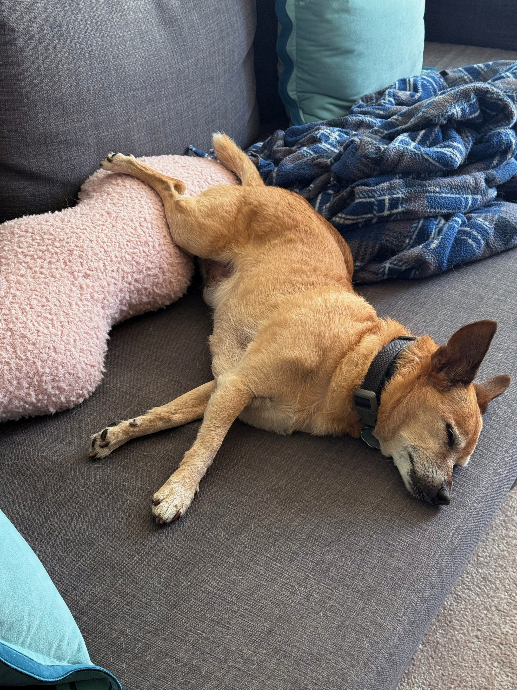

Fantastic week in music.

First up: if you missed Slayyyter’s breakout hit _WOR$T GIRL IN AMERICA_ earlier this year, you’re missing the album of the year! Slayyyter was previously known for songs like “Throatzilla” (sample lyric: “I went straight down from the very first kiss/Like, ‘Baby, let me swallow them kids’”[^throatzilla]) and “Purr” (sample lyric: “Drugs make this kitty go, ‘Purr’”), but supposedly felt that she had missed her chance to break out. So she decided to go crazy with her last album, creating a dark, confessional EDM album with a trashy-Midwestern-trailer-park aesthetic. And. It is. A masterpieeeeeeeece. It’s got production halfway between Justice and Crystal Castles and Health, the snippiest lyrics this side of a rap beef, and Slayyyter’s astounding how-does-she-hold-her-breath-that-long vocal performances. It’s really, really, really good. And now, having become an act that sells out, she’s following it up with a sequel album where every song is paired to or a reimagined version of a song on the original album.

And this week I lucked out and miraculously got cheap last-minute tickets to see her at the Fox Theater in Oakland! And it was just as good as I imagined!! Highly recommended!!!

Slayyyter fun fact I only learned today: despite associations with gay EDM, she’s not named for the verb “slay” — she is in fact a huge film nerd, particularly for Richard Linklater[^linklater], and picked the named Slayyyter [after a character in _Dazed & Confused_](https://www.youtube.com/shorts/4xL7tA3MGHo) (with a few extra ys to secure a Twitter handle).

Anyway, next week I see Ninajirachi, who I _assumed_ up until now would be the album of the year. Or maybe they’re both the best shows I’ve ever seen and this month is just a very good month for music 🙃

Also this week: Andrew W.K. came out of ... retirement? ... to release an ambient jazz noir album, _Temptation to Exist_. If that combination of words doesn’t already make you want to check it out, then perhaps one of my all-time favourite pieces of journalism will: [“The Crying Of Lot 55: The Unsolved Mysteries And Alternate Realities Of Andrew W.K.”](https://stereogum.com/2015589/andrew-wk-steev-mike/columns/sounding-board).

You see, Andrew W.K. may _appear_ to be a former party boy, now married to Kat “2 Broke Girls” Dennings[^kat], that makes music with lyrics like “PARTY HARD. PARTY HARD. PARTY HARD,” but. Uh. Well, where to begin.

Firstly, if you actually listen to his albums, there’s a bunch of Lynchian content about curses and deals with the devil and people’s appearance inexplicably changing. Then there’s some sort of complicated legal controversy with a producer or producers credited as Steev Mike, who might actually be a character made up by Andrew. And there was a period where he fucked off to Japan and made a jazz piano album that is still, to this day, only legally available in Japan. And then for a while he ran a self-help workshop. And then on top of all that there’s persistent fan conspiracies that Andrew W.K. is not a real person but actually a character portrayed by different actors, which sounds crazy[^crazy], until you watch videos of his performances and notice that some of them _really do_ seem to be a totally different person who happens to look vaguely like the person on the cover of the albums. It’s all very very strange! It’s reminiscent of the extreme depths of “wait, is this real?” weirdness you get with, say, Nathan Fielder.[^fielder] So needless to say, I love him and everything he puts out, ambient jazz noir albums included[^jazz].

---

Speaking of Nathan Fielder: who’s excited for [his insane-looking Elizabeth Holmes (!!) documentary](https://youtube.com/watch?v=pTL9BtN6IKs)!

---

So this past week I finally caught up on Jane Schoenbrun’s [_I Saw The TV Glow_](https://letterboxd.com/film/i-saw-the-tv-glow/), a movie that in short is about the dangers of not transitioning, as expressed through 1990s fan-favorite media. I had... [_conflicted_ feelings](https://letterboxd.com/rwblickhan/film/i-saw-the-tv-glow/)[^feelings].

The film suffers from what I’ve taken to calling “A24 indie darling syndrome”, which are A24 indie films that are widely beloved, but have a set of stylistic tics that are deeply frustrating to a lover of cinema, like:

- _Extremely_ long takes, where most shots feel like they’re literally minutes too long.
- Exposition-heavy dialogue where lots of characters State How They Are Feeling And What The Themes Of The Movie Are with little subtlety — all tell no show.
- Wonky, disorganized structures where the plot feels a little out of order and establishing details are shown in great detail when a short flashback probably would have sufficed; where it feels like the first draft was shot without developmental editing.
- Lots of pretty digital cinematography that looks wonderful in isolation but doesn’t do much to serve the story.
- Talented actors giving listless, affectless performances.

Obviously I’m subnewslettering my [least favourite](https://letterboxd.com/rwblickhan/film/past-lives/) film of all time, _Past Lives_, but these flaws also afflict, say, [_Minari_](https://letterboxd.com/film/minari/) or [_Backrooms_](https://letterboxd.com/film/backrooms-2026/) or, to a lesser extent, [_The Last Black Man in San Francisco_](https://letterboxd.com/film/the-last-black-man-in-san-francisco/) or [_Moonlight_](https://letterboxd.com/film/moonlight-2016/)[^moonlight].

Anyway, now that I have a term for this I’m seeing these movies _everywhere_ and I’m slightly alarmed that maybe this is just considered good writing now. I’m a grumpy old man! Bring me back my golden-era [Billy Wilder dialogue](https://en.wikipedia.org/wiki/Billy_Wilder)!

[^throatzilla]: To be clear I think this song is genius and I am not at all surprised that the minute Slayyyter moved in a halfway-serious direction she blew up.

[^kat]: Who, charmingly, apparently posted a bunch of “uwu my husband is a genius :3” messages when the new album came out.

[^crazy]: I mean, his legal name is public and he’s married to a famous actress!

[^fielder]: Which is a nice segue to once again recommend one of my favourite videos on the Internet, in which Super Eyepatch Wolf [spends an hour](https://youtube.com/watch?v=iavoSO6lOLQ) slowly losing his mind trying to figure out how much of Fielder’s content is an act.

[^jazz]: That the album is, you know, quite good is just a bonus.

[^linklater]: Whose name she even puns on in her [big breakout single](https://genius.com/Slayyyter-crank-lyrics).

[^feelings]: Although at least I was not as savage as [Khoi Vinh](https://en.wikipedia.org/wiki/Khoi_Vinh) (former design director for the _NYT_ and current director at Adobe, and sometime podcaster, which is probably why I'm aware of him). He gave the film [one star](https://letterboxd.com/khoi/film/i-saw-the-tv-glow/) and said he “wept for the state of independent cinema when \[he\] watched this”. I kind of love reading his sassy Letterboxd reviews, even when I don’t agree — he’s probably the single snobbiest film person I have ever encountered, including a [two star review](https://letterboxd.com/khoi/film/everything-everywhere-all-at-once/) for _Everything Everywhere All At Once_! (A review that I think more than anything reveals a stark generational divide between him and myself heh.) Then again, he also gave _Past Lives_ [four stars](https://letterboxd.com/khoi/film/past-lives/) (!!!) so perhaps he is just, as the kids say, cooked.

[^moonlight]: Though _Moonlight_, despite having most of these features, is a masterpiece that should have won Best Picture, fight me. Art is a subjective medium!!
