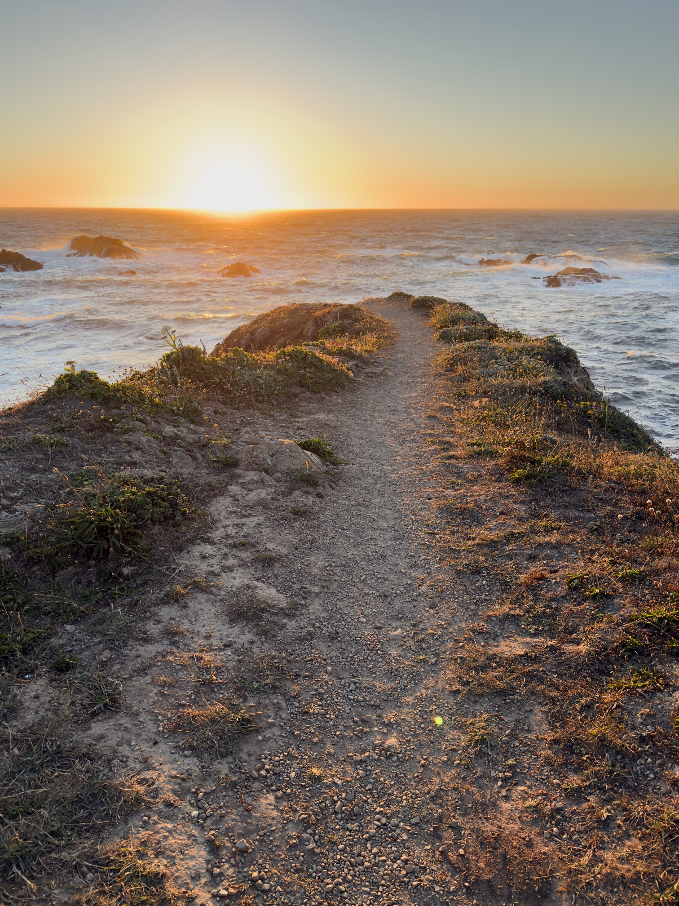

I just got back from a short weekend trip to Mendocino[^1] so this will be a short one.

---

It’s funny how the books that are _actually_ “life-changing” often aren’t the books we’d name as influential. In my case, probably the single most important book in my entire life is, of all things, Dr Sanjay Gupta’s [_Keep Sharp_](https://app.thestorygraph.com/books/8f590d89-c263-42d9-97f5-0db48b40d5fc). It’s a pretty standard pop-science introduction to Alzheimer’s, albeit with an emphasis on actionable steps you can take the avoid the onset of Alzheimer’s.[^2] But it’s so important to me because of an offhand comment that hydration is extremely important, and that you’re probably more dehydrated than you think, because humans are not actually all that great at telling how hydrated they are, particularly as they get older.

This was _literally life-changing_ — after reading that line, I started paying much more attention to my drinking habits. Am I suddenly very sleep? Dehydrated. Unusually grumpy? Dehydrated. Headache? Dehydrated.[^3] I broadly feel much better day-to-day just because of that one throwaway line in a series of “basic life tips” that also included, like, “get exercise sometimes” and “eat healthy.”

---

I recently visited the [Transamerica Pyramid](https://en.wikipedia.org/wiki/Transamerica_Pyramid) for the first time. The [Institute of Contemporary Art](https://www.icasf.org/) has a couple exhibitions up, one of which is a presentation of the time capsule buried at the building’s opening in 1972 and then completely forgotten about until renovations a few years back dug it up by accident.

I realized I can’t even recall the last time I saw a time capsule buried, if _ever_. I vaguely remember having one in middle school, at which time I understood it as a very normal event that frequently occurred at the opening of new buildings or at major life events like graduations. But I don’t think I’ve seen or heard of a time capsule since then.

Has American society just given up on thinking about the future at all? It’s such an optimistic move, in such a 70s way, to bury a time capsule in the hope that it’ll be opened in 50 years. I’m not sure American culture at large is even capable of thinking of the world in 10 years, let alone 50. We live in a very present-tense culture.

But then, I also wonder, what _was_ the heyday of time capsules? When did they stop being popular? Will they even make sense to the youth of tomorrow? If I asked a middle schooler today, would they even know what it was?

[^1]: Where I saw exactly zero [Mendocino Farms](https://en.wikipedia.org/wiki/Mendocino_Farms), which I am just now learning is _not even from Mendocino_.

[^2]: This review may sound dismissive, but it _is_ a very solid pop-science introduction!

[^3]: Unless it’s one of my twice-yearly migraines. Hydration is not, alas, a miracle cure.
