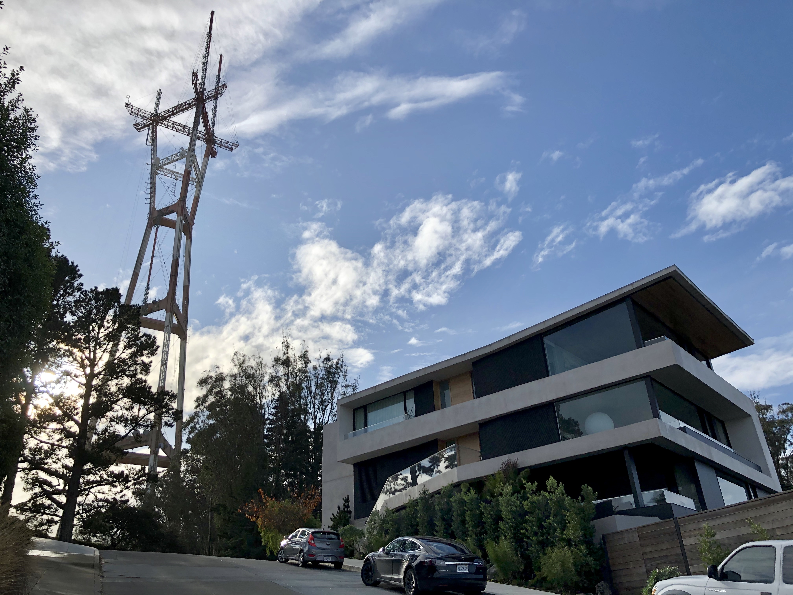

This is quite long! I apologize! Just think of it as an early Christmas/Hanukkah/Kwanzaa/Chunjie/insert-other-winter-holidays-here present.

### What I’m Watching

I went to see *Rise of Skywalker*. Spoiler-free review: it was alright. It does, in fact, paper over a lot of what *The Last Jedi* (quite correctly) destroyed, and it does, in fact, feel an awful lot like bad fan fiction that somehow made it to the screen. But it concludes the sequel trilogy, and the trilogy of *Star Wars* trilogies, in a more-or-less satisfying way, and it is, at the very least, not as mind-numbingly uninteresting as *The Force Awakens* (there’s *some* things I like about episode 7, but… not too much). In any case, I probably won’t think of it ever again; here’s to hoping for more unambiguously good *Star Wars* in the future.

(Okay, I actually enjoyed it quite a bit more than that paragraph is letting on—in a lot of ways it’s a disaster as a film… but it’s also, by *far*, the most Warhammer-y of the *Star Wars* films, and I do love Warhammer.)

I’ve been watching *Wild, Wild Country*, about the ill-fated ‘80s commune of Rajneeshpuram, which I already knew about from a video in [Fredrik Knudsen’s *Down the Rabbit Hole* YouTube series](https://youtu.be/Gwx9nqknu-c). I do think that video is, perhaps, required previewing—it does a much better job of actually telling the *story* of Rajneesh and his city in the wilderness, at least of what I’ve seen of *Wild, Wild Country* so far—but *Wild, Wild Country*, in its slow buildup, does do a much better job of capturing *tone*. You do get a really good sense for why people would want to join, and they do actually go interview former (and current!) members, including Ma Anand Sheela, who is, essentially, the villain of the story. But it is definitely *slow*, and (at least two episodes in) seems to have a bit of a pro-Rajneesh bias. So, I’ll have to see how it is later.

The YouTube Algorithm™️ forced video essayist Jacob Geller on me, and for once I’m glad it did. He makes truly beautiful meditations on video games that takes them seriously as works of art. To wit: his essay on the [“quiet sadness of *Super Mario Galaxy*”](https://youtu.be/IZ1y75vxO0o), or his moving essay on [the inevitability of death in *Outer Wilds*](https://youtu.be/H-yTZFi-_eY) (and, of course, in life).

Also on YouTube: I will admit I really don’t… know that much about India. So here’s a Voxsplainer™️ that explains [why Delhi has some of the worst air quality in the world](https://youtu.be/bVzvZxW5n2Q), especially for two particular months out of the year. What’s especially interesting is that it’s ultimately second-order effects from a (well-intentioned) piece of farming legislation.

“Are you ever going to talk about *End of Evangelion*, Russell?” Someday, yes… but not today.

### What I’m Listening To

Burial dropped a collection of tunes from 2011-2019 called, appropriately enough, *Tunes 2011-2019*. I love *Untrue* and I love this too.

I’ve also gotten hooked on Maki Namekawa’s rendition of Philip Glass’s soundtrack to *Mishima*, as recommended by the Flow State newsletter; sometimes there’s nothing better than a highly talented pianist playing a beautiful piece. (I was going to say I have no idea what the album is about, but then I looked it up, and it’s about [Yukio Mishima](https://en.wikipedia.org/wiki/Yukio_Mishima), a Japanese novelist/nationalist that famously took over an Self-Defense Forces base before committing seppuku in 1970. I’m *fairly* certain this sounds familiar because it’s one of the last topics in *The Making of Modern Japan*, a book I *really* need to reread one of these days.

I bounced off [*Patient Zero*](https://www.patientzeropodcast.com), a podcast about the story of Lyme disease, the first time I listened. I’ll admit that the production is maybe not *quite* at the level of a *99% Invisible* or *Decoder Ring*—but on a second try it is really an interesting, worthwhile story. On the other hand, I’ve blown through almost all of [*Nice Try!*](https://www.curbed.com/2019/5/7/18514684/nice-try-podcast-utopian-avery-trufelman) in one sitting—but it’s a show about utopias by Avery Trufelman of *99% Invisible* fame, so… I also really liked Lost Notes’ [episode on the sad story of The Shaggs](https://www.kcrw.com/culture/shows/lost-notes/shaggs-own-thing-the-story-of-the-wiggin-sisters); *Philosophy of the World* remains one of my (unironic) favorites.

And finally, since everybody else in the world linked to it (even my parents sent it to me): [Pachelbel’s Canon played by train horns](https://youtu.be/cD3QlR98--A). (Trrrraaaaaaiiiiinnnnnnssssss.)

### What I’m Reading

I finished Madeline Miller’s *Circe*, which was just… wow. I honestly can’t remember the last time a book made me cry. Seriously, it was *really* good—I think I read the whole thing in basically two sittings. And a reputable source (hi, Reputable Source) tells me Miller’s debut *Song of Achilles* is *even better*, which I can barely even comprehend. I will admit, though, that the effect may depend on your knowledge of and/or passion for Greek mythology. As for me, I *love* mythology of all sorts (thank you, childhood playing little other than *Age of Mythology*), and I do love the almost-melodramatic flourishes of the story, but your mileage may vary. Still, it’s a very well-constructed story, and Circe’s internal monologue is so beautifully drawn; even if it doesn’t totally gel with you, I think it’s still worth giving a try.

On a related “wow” note, my big Christmas gift this year was the complete, unabridged, hardcover version of Robert Alter’s translation of the complete *Hebrew Bible*. Like I said… wow. I’ve been going through the Torah (aka Pentateuch, aka Five Books of Moses, aka Genesis/Exodus/Leviticus/Numbers/Deuteronomy), and what I really appreciate is his insistence on treating it as an intentional work of literature, despite the probable truth of (some form of) the [Documentary Hypothesis](https://en.wikipedia.org/wiki/Documentary_hypothesis)—after all, the editor(s) of the Hebrew Bible were intelligent humans like you or me, and though they clearly weren’t entirely successful at patching together this patchwork, Alter’s commentary brilliantly enlightens all the structure hiding just beneath the surface. (My understanding is that something along these lines is, in fact, the majority view of scholars today—although there are clearly different sources, it is nevertheless a single, coherent work.) It’s also interesting, much like with Emily Wilson’s translation of *The Odyssey*, to see a style of storytelling so removed from our own, and (also like Emily Wilson’s translation of *The Odyssey*) the translation is just really, *really* good. Just check out the opening lines:

> When God began to create heaven and earth, and the earth was then welter and waste and darkness over the deep and God’s breath having over the waters, God said, “Let there be light.”

Welter and waste! Darkness over the deep! So good! Anyway, if you’re going to read a translation of the Hebrew Bible (and you should—for better or worse, it, together with the New Testament of the Christian Bible, make up one of the most popular works of pop culture in human history, and inform large parts of Western media to this day), you should make it Alter’s.

My hold (finally) came in on *This Is How You Lose The Time War*, and it is *also* a “wow” (so far). More when I finish, though.

I sped through Tamsyn Muir’s *Gideon the Ninth*, in the hopes of finishing it before the library hold on it was up (in this, I was successful). It’s the type of slightly pulpy book I enjoy while reading but then put down and never think about again. Most of the characters are really plot contrivances more so than fleshed-out people, it rarely rouses itself to care overmuch about theme, and it isn’t sustained by sheer bonkers originality like *Black Leopard, Red Wolf*. Yes, it’s marketed as a fairly unique story of “lesbian necromancers in space,” but in truth the plot and story structure are fairly reminiscent of *Dune* in some ways and the skull-clad-medieval-nobles-in-space aesthetic owes a heavy debt to Warhammer 40k. But, of course, that meant I could enjoy it as a slightly less problematic version of that universe; and it does have a fairly addictive murder-mystery/haunted house/“race to solve the puzzles” structure, as well as a not-altogether-serious tone, which make it rather enjoyable to read anyway. Basically: 6.5/10, read to relax.

On the non-fiction front, I’ve been trundling through Michael Gomez’ *African Dominion: A New History of Empire in Early and Medieval West Africa*, which is so far a good overview of exactly what it says on the tin, if a bit too academic at times, as well as continuing on *The Warmth of Other Suns* (also a wow).

Also, since I read a bit more on Pocket this week than I have in a while, I’d like to make note of [A Constructive Look At TempleOS](http://www.codersnotes.com/notes/a-constructive-look-at-templeos/), in which Richard Mitton takes a look at the *good* parts of [TempleOS](https://en.wikipedia.org/wiki/TempleOS), an infamously Bible-themed operating system built from the ground up by Terry Davis, a sufferer of schizophrenia prone to racist outbursts and, apparently, divine revelation, who died last year. It’s probably the closest programming gets to “outsider art” or “outsider music” (like The Shaggs, above)—it’s especially fascinating to try to *appreciate* it for what it does, genuinely, get right.

