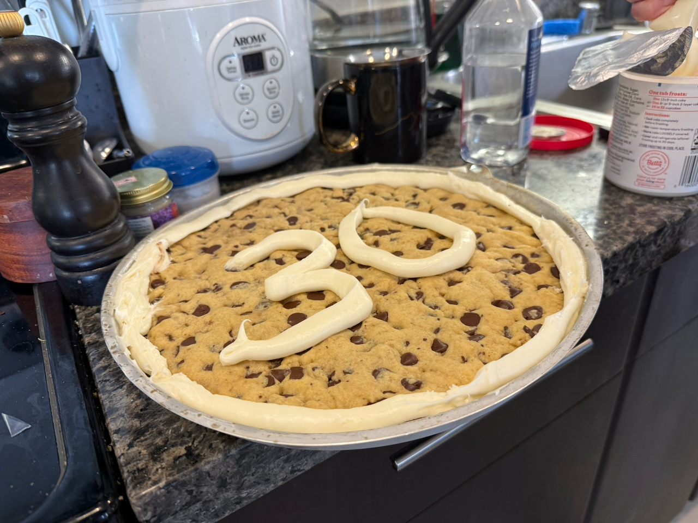

- Hooray, my age has continued to creep up on me... (but shoutout to Sherry for a beautiful and delicious cookie cake!).

This has been a particularly busy week, for reasons that may or may not become clear shortly. San Francisco, meanwhile, has continued its heat wave; we’ve moved on from the pleasant-for-a-picnic warmth of a June to the oh-god-turn-the-sun-off heat of an August. I am currently cowering in the corner next to the portable A/C we bought last summer, since our 10th floor apartment is always a good five-to-ten degrees Fahrenheit warmer than street level, and dehydration stalks every attempt to leave the house. And all that’s without mentioning the ~ current events situation ~ — a situation impossibly idiotic and yet difficult to get a handle on what levers I, personally, could even pull to change things. Oh well. On to the dilletantery, of which I promise there is zero (0) discussion of LLMs in this issue.

---

While discussing restaurants recently, my friends and I discovered something shocking: _restaurants are just a timeshare for chefs_.

Obviously nobody actually thinks of restaurants that way, but it’s true — restaurants are primarily a place where you pay money to have a slice of a chef’s time, shared with all the other patrons, as opposed to cooking for yourself or hiring a private chef (which some people do!).

I’m not sure whether this revelation will change my relationship to restaurants (probably not; it’s mostly a bit of silly fun), but it does lead to the follow-up question: why _don’t_ we think of restaurants in this fashion? They’re often considered in some sense a “different type” of establishment than other retail establishments or forms of domicile, and in some ways restaurants are very odd, but in other ways they’re very similar to other aspects of culture.

---

This week’s music recommendation is Angine de Poitrine, a Quebecois microtonal math rock band that exclusively performs in costume under the pseudonyms of Khn de Poitrine and Klek de Poitrine. Based on that description alone, you probably already know whether you want to click through to their [surprisingly popular KEXP performance](https://youtube.com/watch?v=0Ssi-9wS1so) from a month ago.

---

A music not-quite-recommendation: my friends and I have been going through the [_Rolling Stone_ 500 Greatest Albums of All Time list](https://en.wikipedia.org/wiki/Rolling_Stone%27s_500_Greatest_Albums_of_All_Time), at a rate of 3-4 albums per week. It’s a surprising amount of work keeping up, and obviously the _Rolling Stone_ list is mildly controversial, but I’ve appreciated the chance to listen to many of the “canonical” albums of rock and rap that I’ve never gone through before.

:::aside{.note}
Speaking of rap: despite its reputation as an “old boys club” of dad rock, the latest revision has a (surprising?) number of rap and hip-hop albums; 50 albums in and we’ve already gotten Dr Dre, A Tribe Called Quest, Public Enemy, Outkast, Kendrick, Biggie, Wu-Tang Clan, and Jay Z, or as he [apparently spells his name now](https://www.hot97.com/news/jay-z-has-changed-his-name-taking-it-back-to-the-90s/), Jaÿ-Z. (As well as, of course, every Beatles and Bob Dylan album — the list _does_ earn its reputation, somewhat.)
:::

This week we got to Chuck Berry, via his compilation album _The Great Twenty-Eight_. Obviously I was _aware_ of Chuck Berry, as arguably _the_ father of rock-and-roll as a modern genre, but I think I had only ever heard _Johnny B. Goode_ in passing.

To my (slight) surprise, Berry’s recordings still have a manic energy that (even in 2026!) comes across as, frankly, _dangerous_, in an “oh this might start a riot” kind of way. I walked away with a better understanding of why sheltered ‘50s suburbanites would have _freaked out_ about their kids listening to him, just as those kids would become sheltered ‘80s suburbanites freaking out about their own kids listening to “Satanic” heavy metal (a situation specifically referenced in _It_, which you [may recall](https://rwblickhan.org/newsletters/nevertheless-i-read-obsessively/#it) I read last year).

Anyway: if you haven’t, highly recommend giving Berry’s recordings your attention, at least for a few songs, and you’ll probably see what I mean. (They do get samey after a while.) And I highly highly recommend going through a list of famous albums with your friends, even if the list is imperfect!
