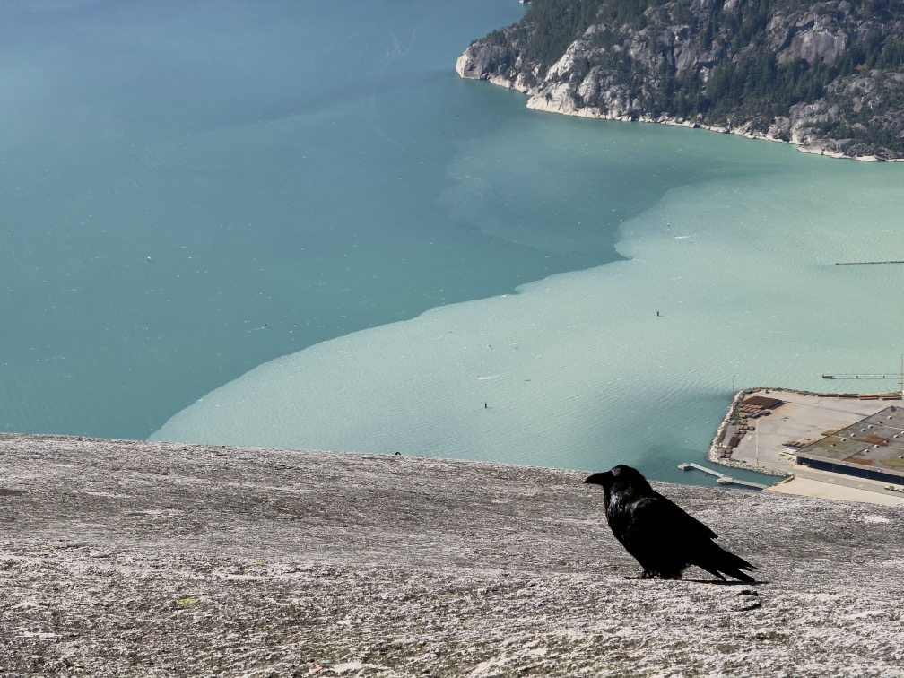

So on my flight back [from Canada](https://rwblickhan.org/newsletters/a-two-week-tour-of-canada/) I decided to start catching up on Wes Anderson.

Now, as you (probably didn’t, but) may know, [_The Grand Budapest Hotel_](https://letterboxd.com/film/the-grand-budapest-hotel/) is one of my all-time favourites, narrowly nabbing the last spot in my Letterboxd top four, rewatched about once a year. But my knowledge of Wes Anderon’s filmography is pretty spotty otherwise, so I decided to watch [_The French Dispatch_](https://letterboxd.com/film/the-french-dispatch-of-the-liberty-kansas/), a film that I liked quite a bit even though it’s kind of a mess.[^mess]

But it reminded me that I did in fact see [_Asteroid City_](https://letterboxd.com/film/asteroid-city/) in theaters when it released, which is perhaps the single strangest film I’ve ever seen — yes, even compared to [_Possession_](https://letterboxd.com/film/possession/) or [_Rocky Horror Picture Show_](https://letterboxd.com/film/the-rocky-horror-picture-show/). It has perhaps the most strongly mixed reviews I’ve ever seen — it’s sitting at 3.5 on Letterboxd, but from folks I know personally, it’s either the worst film of all time or a masterpiece. Curiously, “masterpiece” seems more common among the more creative (or at least strongly media-literate) folks I know. And I think I know why!

_Asteroid City_ attempts to be [abstract expressionist](https://en.wikipedia.org/wiki/Abstract_expressionism), _but for plot_. So it’s actually quite a bit more radical than it seems on the surface.

To step back: one of the blog posts I think about the most is [“How to Understand Abstract Art”](https://andreivajnaii.blogspot.com/2023/05/how-to-understand-abstract-art.html) by Andrei Vajna, a blogger I haven’t read before or since. It’s a fantastic piece, well worth reading beginning to end, but its main point is that abstract art is all about trying to express abstract concepts — ideas, feelings, _vibes_ — through non-representative markings. Or, as they eventually explain:

> The point of art is that it triggers something in the audience, whether it is emotions or thoughts. With abstract art, you don't need to think of the meaning, you don't need to fill it with details in order to achieve that. It could help, but it's optional. The arrangement of visual elements is enough to trigger a response, you don't need to find hidden meaning behind them. You could feel a sense of wonder and curiosity: what's with that small black block in the upper left? You could feel overwhelmed by the size of the red rectangle in the first image, even though it doesn't represent anything.

I know this article was influential on me because, after a lifetime of dismissing abstract art, the last time I saw a Rothko at SFMOMA I _literally gasped_. Because thinking through Rothko intellectually, looking at a small picture of a Rothko on Wikipedia, is all well and good, but turning a corner and seeing a massive, wall-covering block of color when you didn’t expect is, in fact, a breathtaking experience — and that’s rather the point.

Anyway, _Asteroid City_ attempts to apply this idea to _plot_. How so? The plot of _Asteroid City_ kind of doesn’t make any sense — at a frame level, it’s a taped performance of a play, though then the bulk of the film is actually the play itself. But the audience doesn’t even see the entire play! Whole chunks of the plot are just missing, referenced in passing later in the play or explained in frame-story exposition, because the film starts arbitrarily jumping between the play itself and the frame story, as we follow the messy production of the play. So there’s almost no characters we follow throughout, and many of the actors are doing double-duty as actors and the characters they portray, and the film often intentionally compresses the difference between the two. The most emotional moment in the film is two actors (one of whom is introduced just for this scene) discussing a character that was _cut from the play entirely_! Which is probably why mass audiences were, you know, turned off.

But I’d argue it’s attempting to apply abstract expression to the concept of a plot. Most plots work, emotionally, by following a small set of characters over time and watching how their emotions evolve. Most films are, in theory, attempting to engross the viewer in their verisimilitude — the audience is supposed to feel a “part of” the film world, generally speaking. Even extremely formalist exercises like, say, [_Speed Racer_](https://letterboxd.com/film/speed-racer/) are still fairly literal on a plot level. But _Asteroid City_ doesn’t bother with that. It’s attempting to ask whether we can _feel something_ even in a situation where we don’t have characters to hook onto for more than a scene or two, where the skeletal artifice of the plot, of the entire _concept_ of a plot, is repeatedly pointed out to us, where we are intentionally distanced from anything and everything inside the film’s world(s).

I’m not sure it’s successful — though it worked for me — but that’s probably the most radical artistic statement I’ve seen a mainstream film. I’m sure I can think of other examples, especially in art films — Lynch’s weirder films, like [_Inland Empire_](https://letterboxd.com/film/inland-empire/), approach similar levels of abstraction, as does a lot of animation like Masaaki Yuasa’s [_Mind Game_](https://letterboxd.com/film/mind-game/) or Don Hertzfeldt’s [_ME_](https://letterboxd.com/film/me-2024/) — but in a mainstream, all-celebrity-cast, not-quite-a-blockbuster-but-definitely-financially-successful film? Wes Anderson is often flanderized to a twee aesthetic — like the frankly baffling [_Accidental Wes Anderson_](https://accidentallywesanderson.com/), which maybe I’ll return to another time — but he doesn’t get enough credit for how strange his artistic work often is.

---

While digging up references for this article, I rediscovered [Alan Jacobs’ commentary](https://blog.ayjay.org/what-the-bird-said/) on the film, which comes at the film from a very different angle but, I think, comes up with a similar conclusion. Highly recommended.

[^mess]: See, for instance, [Khoi Vinh’s successively-worse reviews](https://letterboxd.com/khoi/film/the-french-dispatch-of-the-liberty-kansas/2/) for the film on Letterboxd.
