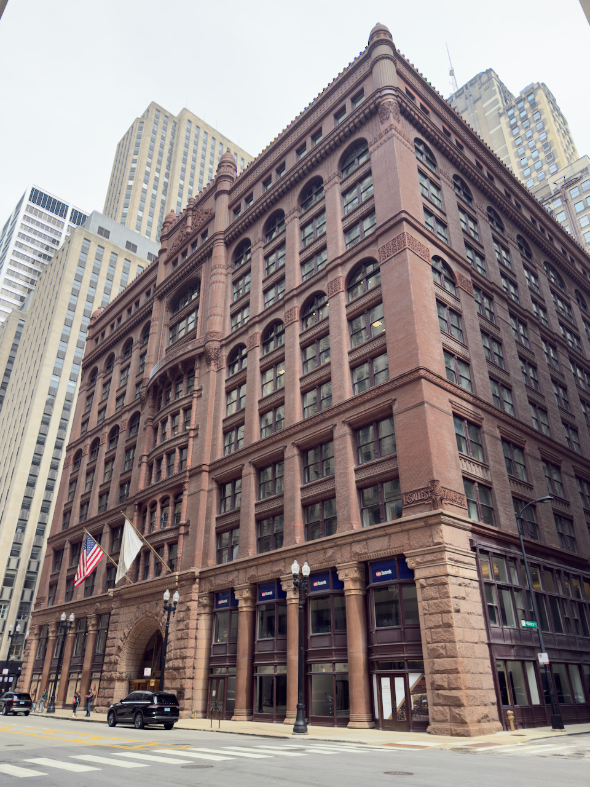

I’ve spent the past week in Illinois, so this is going to be a ~lightweight~ (aka skippable) issue.

The photo up top is the [Rookery Building](https://en.wikipedia.org/wiki/Rookery_Building), the first modern office building and (supposedly) the first building over eleven stories tall, which also has Daniel Burnham’s office, who designed the [World’s Columbian Exposition](https://en.wikipedia.org/wiki/World%27s_Columbian_Exposition) (aka the White City of [_Devil in the White City_](https://en.wikipedia.org/wiki/The_Devil_in_the_White_City) fame). I also got to tour the Frank Lloyd Wright-designed [Unity Temple](https://en.wikipedia.org/wiki/Unity_Temple), basically the first building made primarily of reinforced concrete and a pretty solid advertisement for [Unitarian Universalism](https://en.wikipedia.org/wiki/Unitarian_Universalism) (which, as far as I can tell, is essentially “what if American liberalism were literally a religion?”).

---

You’ve heard of extraverts. You’ve heard of introverts. You may have heard of ambiverts, who are right in the middle of the distribution — they need some social time and some alone time. But have you heard of _omniverts_?[^note1]

That’s right — I’m going to start identifying as a whole new, unexplored quadrant of the introvert/extravert axis! Because, as folks have sometimes pointed out, it’s _quite odd_ that I seem completely comfortable with _any_ level of social interaction. I can spend a week going to house parties every night after work none the worse for the wear (assuming I like the people at the parties). On the other hand, I suffered essentially no negative mental impacts from pandemic lockdowns; as long as I walked the dog every day, I was completely fine being alone all day every day.

That feels a little different from ambiversion — most self-identified ambiverts I know prefer _some_ social time and _some_ alone time and get rather upsetty if either is missing. To be indifferent to either seems much rarer.

---

Since I’m becoming a Menswear Guy™️ (oh no), I’ve been watching a lot of [Percia Verlin](https://www.youtube.com/@percish). She had a pretty interesting video recently where she talked to a bunch of the [independent designers at Paris Fashion Week](https://youtube.com/watch?v=zkgDegd-14M) about their new menswear lines. There’s a lot of interesting information tossed off, like that there’s been a move to more interesting / higher quality fabrics, so I recommend the whole video.

But the most interesting part (for which I can’t find a timestamp) is that a lot of these designers might find trouble being in the “mushy middle”. The modern clothing industry, I’ve gathered, has basically three tiers:

- “Fast fashion” a la Zara / Uniqlo / etc, at the sub-$100-a-piece price point
- Slightly elevated brands like Buck Mason at the $100-$200 price point
- Luxury / designer which start at $600 or so (but in practice are much more expensive)

You’ll notice there’s a pretty big gap between those latter two, and that’s the mushy middle. (Percia points out that a similar dynamic holds in the camera industry; either you’re buying a straightforward sub-$500 camera or you’re dropping $2k-plus on a high-end mirrorless, and there’s not really a profitable niche in between.) Anyway, my first thought was: maybe tech yuppies should be spending slightly more on clothes? But, then again, they mostly don’t care (see: Allbirds), even though clothing is a pretty interesting technical field itself. Anyway, I don’t really have a point here, but perhaps expect more clothing-related content here? Dunno.

---

I love a good single-purpose plain text site, so here’s a site that gathers [everything known about the Roman cult of Mithras](https://mithras.tertullian.org/display.php?page=main). It’s delightfully snippy about the state of the relevant Wikipedia article.

---

I rewatched Fellini’s [_8½_](https://letterboxd.com/film/8-half/) (thanks to [_Your Name Here_](https://letterboxd.com/film/8-half/) last week). I _love_ this film even though it’s a little too long and a little too male gazey and the 1960s ADR is terrible. But pretty much every scene in this film launched the career of some major director — both David Lynch and Terry Gilliam cited it as a major influence. And this time I noticed another similarity that I can’t find cited anywhere but seems pretty likely: one of the most famous scenes in _8½_ has the main character [cracking a whip to take control of his dream harem](https://www.youtube.com/watch?v=5mSOwZNIzxY) (did I mention this movie was very Italian-male-gazey?) in a way that feels very Indiana Jones-coded.

---

I somehow missed that Men I Trust released [not one but _two_](https://en.wikipedia.org/wiki/Men_I_Trust#2025%E2%80%93present:_Forever_Live_Sessions,_Vol._2_and_Equus_albums) albums in 2025. I don’t think they quite reach the heights of their earlier EPs but I still love my funky Quebecois indie dream pop!!

[^note1]: I’m _still_ not sure whether “extravert” or “extrovert” is considered the more correct spelling. I’ve been corrected on _both_ spellings 🤷‍♀️
