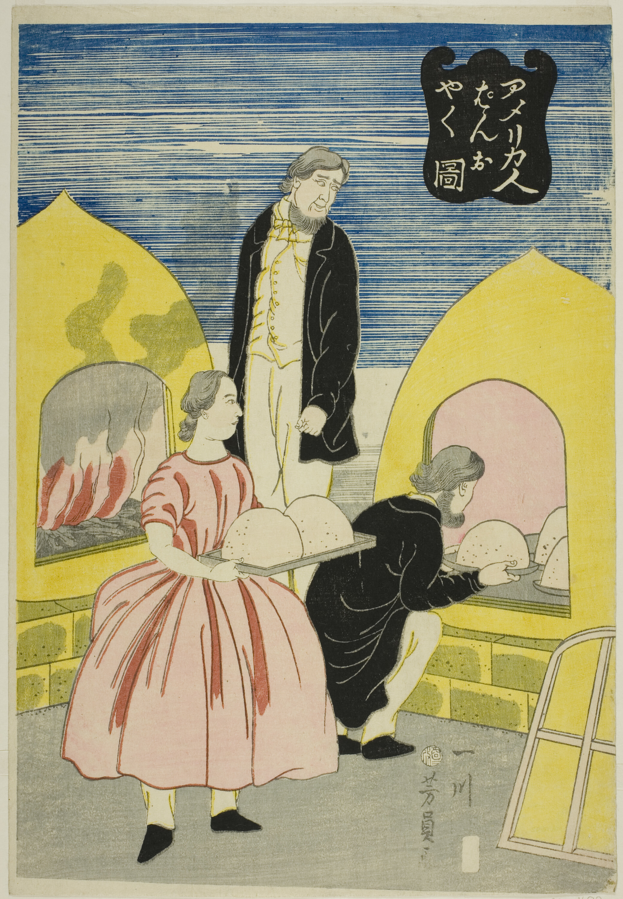
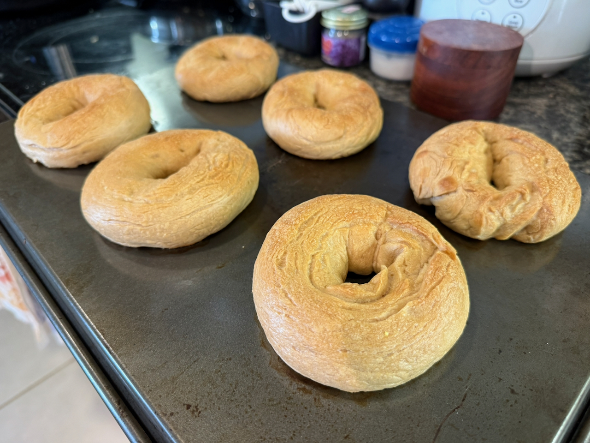
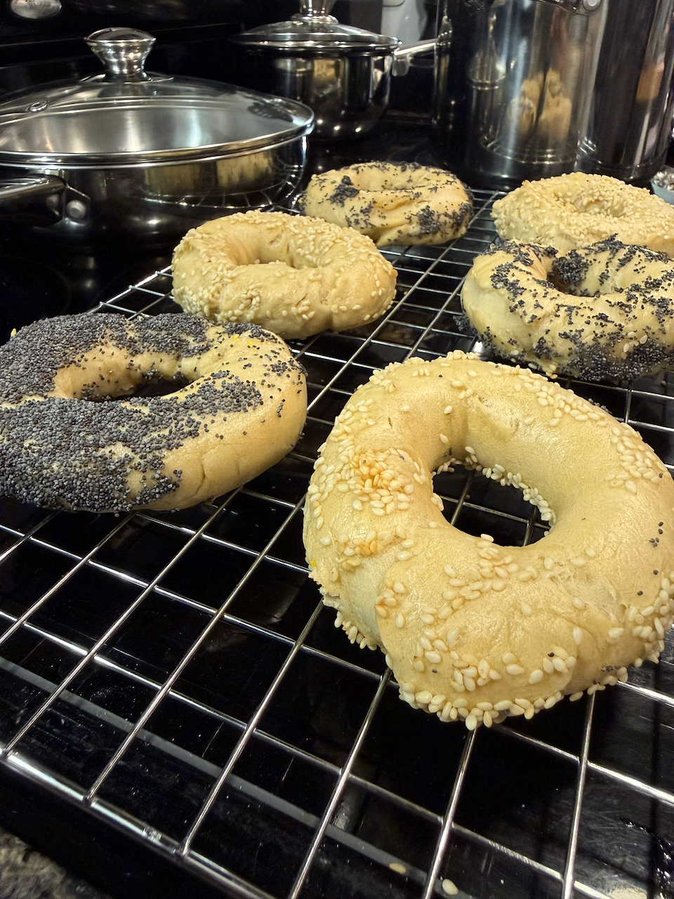

[“Americans Baking Bread (*Amerikajin pan wo yaku zu*)”](https://www.artic.edu/artworks/32192/americans-baking-bread-amerikajin-pan-wo-yaku-zu)

Some weeks go by and you look back and think... what even *happened* this week? What did I *do* with all my time? This week was one of those weeks.

---

One thing I *did* do was (attempt to) make bagels. I followed the recipes in Cathy Barrow’s [*Bagels, Schmears, and a Nice Piece of Fish*](https://app.thestorygraph.com/books/829b38b4-7b2a-4854-9fc0-2103229973f7), which as far as I can tell is the only bagel cookbook in existence — certainly the only one with both New York and Montreal bagels. (I was also recommended Peter Reinhart’s classic [*The Bread Baker’s Apprentice*](https://app.thestorygraph.com/books/c656805f-d8ad-4fb9-a19c-8a6a3328f6c4), which had a nice bagel recipe, but just one.)

Bagels are surprisingly easy. New York-style bagels only have five ingredients, only one of which (non-diastatic malt powder) is remotely exotic — the other ingredients are high-protein flour (usually sold as bread flour), yeast, kosher salt, and water. (And, no, it doesn’t have to be New York tap water.) Mix together, knead, divide into equal portion balls, poke a hole and stretch into a loop, leave to proof for a few hours, boil, bake, and you’re golden. Mine didn’t *quite* turn out perfectly — I think I baked them too long, so the crust was a bit too tough — but still perfectly edible.

The difference with Montreal-style bagels (at least according to this cookbook) is the use of all-purpose instead of high-protein flour, a *dramatically* shorter proofing period, honey instead of malt barley, and honey-sweetened water for boiling. (Apparently some New York bagel bakeries also boil in sweetened water, but typically not with honey.) That results in a denser, sweeter bread without a crust. Also, they’re almost exclusively topped with sesame seeds or poppy seeds. I found it much easier to get good results out of the Montreal-style recipe.

The cookbook recommended a stand mixer — while also noting that the high-protein flour in New York-style bagels tends to strain typical home mixers — but I didn’t find any issue kneading for the 15 or so minutes required by hand.

One particularly pro tip recommended by *Bagels, Schmears, and a Nice Piece of Fish* (which was also provided independently by my most-serious-baker friend) was a [10-minute autolyse](https://www.kingarthurbaking.com/blog/2017/09/29/autolyse-sourdough) — mix the flour and water, wait 10 minutes for gluten formation to start, and only then begin to knead. That has a number of benefits, but perhaps the most relevant one is a shorter, less intense kneading time.

---

I guess this is a cooking issue now. Have I ever spread the gospel of sugar milk here? (The name needs work.)

A few months back, I got annoyed that there was a death of warm, caffeine-free, alcohol-free drinks suitable for sipping at a cafe in the evening. There’s various herbal teas (which I mostly don’t love), there’s hot chocolate, there’s warm apple cider (though that feels very fall-specific), there’s decaf coffee (though most speciality coffee shops that can make a decent latte are closed in the evening), and... that’s about it.

Later, my friend and I were discussing lattes, coffee and matcha, and how many drinkers treat them as a lightly-coffee-or-matcha-flavored conveyance for milk and sugar.

That made us realize there’s an entire palette of “latte-like drinks” that, minus the coffee-or-matcha, are decaffeinated and possible to serve warm. So why aren’t these served more often?

There’s a few examples — golden milk springs to mind, and apparently there’s various Indian drinks that fit this rough category — but there’s so many more options! What about putting MSG in milk? Chili oil? Brown butter? I even tried putting mustard in my milk, which... well, not all of them can be winners. (To be clear: I liked it. Nobody else did.)

Anyway, expect to hear more about this in the future, and if you can think of a trendy name that’s better than “sugar milk,” uh maybe I can cut you in on the profits of this non-existence venture.
