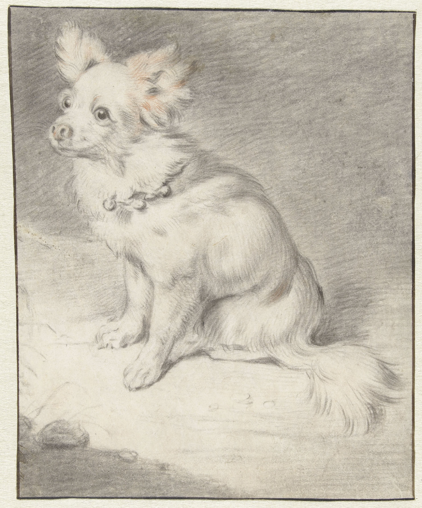

[Seated Dog, c. 1650 - 1700 (this papillon looks a lot like Rooibos, right?)](https://www.rijksmuseum.nl/en/collection/object/Seated-Dog--6d080fc276f22d016506294f7a37f6c1?tab=data)

A dog thought:

This fantastic [episode of Howtown](https://youtu.be/EJXG-5mZfJM?si=5MG91iHya8gf7Zwb) explaining dog vision and smell explains that dogs’ olfactory peduncles are strongly connected to the occipital lobe, so dogs might literally “see” in smell.

Do humans have an equally important sense? Obviously vision is very important to humans, but I wonder if sound is really the equivalent. Language is such an important cultural tool that humans are obsessed with sound the way dogs are obsessed with smell — we have music for a reason!

To bring this back to dogs, though: if dogs had complex societies, would they have “smell music”? Would they have “osmophiles” collecting rare perfumes? Would they have “nasal DJs” pumping refined sets of smells at raves?

---

Another dog thought: [*The Invaders*](https://app.thestorygraph.com/books/9e8dd5b7-c191-4c49-90f8-f1e0ff79bae0) points out that humans and dogs are pretty much unique (even compared to other primates and canines) in having very visible white sclara, which is important for gaze detection and may have coevolved for hunting purposes. But then: do dogs experience pareidolia like humans do? When they see a vaguely dog-head-shaped patch of mud, do they “see” it as another dog?

---

Sherry is reading [*Katabasis*](https://app.thestorygraph.com/books/f6d86997-4009-47ac-a1f4-99e6890541e8) and pointed out that it’s weird that the name Alice, specifically, is so common in fiction.

My theory is that it’s the one English name that *both* has a lot of literary and thematic weight *and* scans as a normal English name. When you see the name “Alice”, you think of *Alice in Wonderland* (and all the other literary Alices referencing each other), but you’re not distracted by a name that sounds overly literary — you might meet Alices in real life.

I can’t think of many other English names that work like that. Beatrice has a long history, famously used in Dante but also prominently in *A Series of Unfortunate Events* and *Over the Garden Wall*. But Beatrice sounds old-fashioned as a day-to-day name. Peter and Paul are common names with literary resonance, although I suspect you only get the full effect if you’re coming from a religious background with a deep familiarity with the New Testament. (Although: Paul Atreides.) Are there any other names that meet this criteria? Hit me with a reply if you can think of any!

---

I recently read, for the first time, Mary Shelley’s *Frankenstein*, in preparation for the del Toro adaptation.

Reading *Frankenstein* in 2025 is a strange experience — the type of capital-R Romantic melodrama that it typifies is sorely out of fashion. So much of the novel reads like: I created a monster! I am in so much emotional torment it feels like the wind and rain are attacking me personally!! Then I went mad and literally passed out with fever for two months!!! But then I saw a pretty mountain and I felt quite cheered up.

The overall effect is almost impressionistic, [similar to *Possession*](https://youtu.be/X1dtelvi_E8?si=6Zb5mPR3YzKdIv2l), where EVERY! LINE! IS! SHOUTED! and the dialogue isn’t meant to be taken all too literally. Still: as beautiful as the language often is, it’s a slog to get through the third or fourth description of the sublime beauty of Mont Blanc or Victor’s emotional turmoil as he travels across the world.

Anyway: maybe at some point I’ll have more thoughts on the novel as a whole. (Certainly, the tale of an inventor creating an intelligence for ambition’s sake without thinking it through at all has resonances with the current moment in LLMs...) But the Gothic nature of the novel was what really stuck out.

Other things of interest:

- It’s fascinating how casually the novel introduces the idea of Victor and his “more-than-sister” Elizabeth marrying. “Oh yeah you guys were totally meant to be a couple,” his dad says casually at one point, after raising them as siblings. It’s a moment that feels particularly strange and of-its-time.
- Tangentially related, but perhaps of interest nonetheless: my newly-discovered fave channel Esoterica (scholarly analysis of the occult!) has an episode on the [historical occult underpinnings of *Frankenstein*](https://youtu.be/zI73-CpVKjM?si=TUYkrNy5cqv6Id49).
- Did you know Mary Shelley was so obsessed with her badass mom Mary Wollstonecraft that she (probably) [lost her virginity on her mother’s tomb](https://lithub.com/did-mary-shelley-actually-lose-her-virginity-to-percy-on-top-of-her-mothers-grave/)?

---

November whiles away — is the month already half gone? Is the *year* already almost over? It felt like just a day ago that I was confidently saying “the year is only two-thirds gone”!
