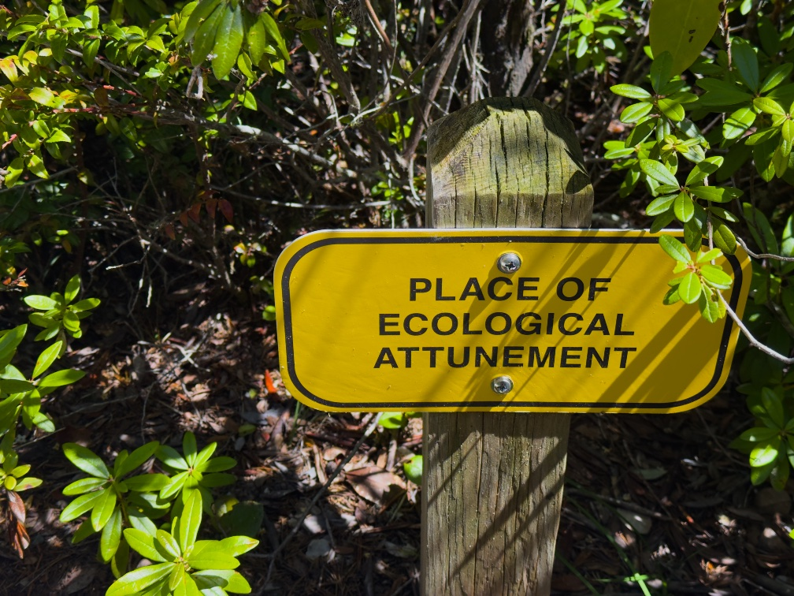

A very short newsletter this week, because I spent my time writing up a starter guide to [jujutsu](https://docs.jj-vcs.dev/latest/), an [exciting](https://rwblickhan.org/newsletters/really-truly-breathless-with-excitement/) new version control system, which you can read... here:

- [Russell’s Starter Guide to Jujutsu](https://rwblickhan.org/newsletters/russells-starter-guide-to-jujutsu/)

It will probably only make sense if you’re a programmer, but [if you consider yourself a member of that tribe](https://rwblickhan.org/newsletters/a-belief-in-writing-things-down/), then I really do highly recommend sitting down to learn jujutsu — even if you, er, click through to one of the other tutorials I list up there.

Till next week!
