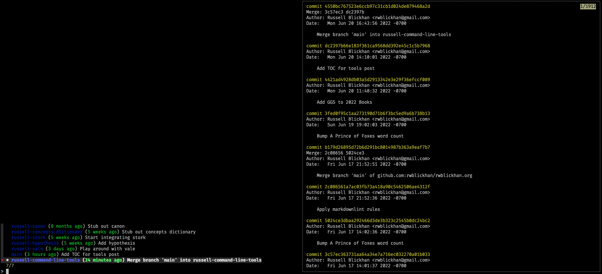
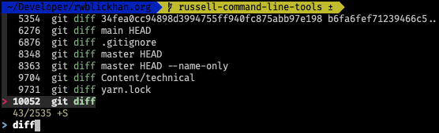
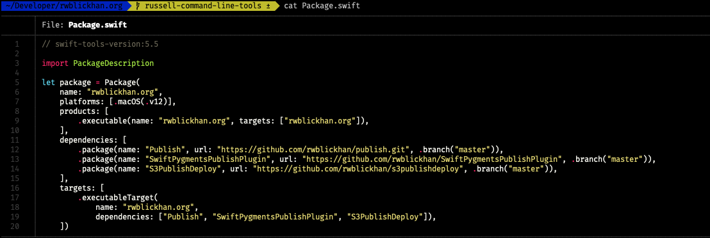
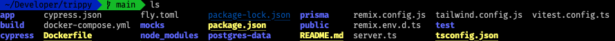
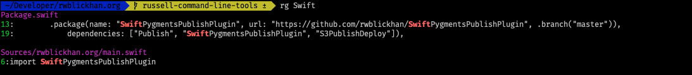
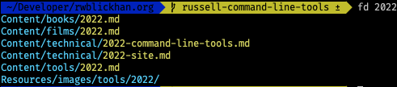
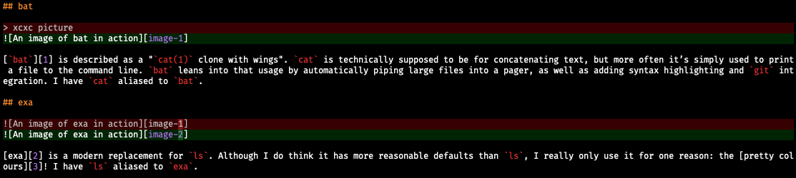
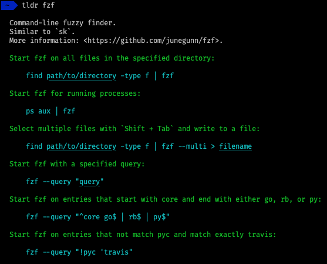

> This is another fairly technical post, and in particular presupposes some enthusiasm for the command line. If that isn't you, feel free to skip this one!

Despite being primarily an iOS developer, I use the command line quite a bit - I guess old habits from my time as an embedded software intern die hard.
That said, I like a number of modern command line tools, many written in Rust, which are typically blazing fast and have better command-line interfaces than traditional Unix tools.

If you like this list, you might also like Julia Evan's [more comprehensive list](https://jvns.ca/blog/2022/04/12/a-list-of-new-ish--command-line-tools/)!

## neovim

I have a noted love for vim, but when I'm not using an IDE with a vim mode, I'm actually typically using [neovim](https://neovim.io), alias `nvim`, which is a modern reimplementation of vim with much less technical debt, a scripting engine based on Lua instead of notoriously-idiosyncratic vimscript, and reasonable defaults like syntax highlighting enabled by default. It also has a full implementation of the [Language Server Protocol](https://microsoft.github.io/language-server-protocol/), which enables it to have very rich, Visual Studio Code-esque plugins.

## fzf

[`fzf`](https://github.com/junegunn/fzf) is a command-line fuzzy finder; given some input, `fzf` lets you search through the input with a fuzzy matching search term. One use I find for this is my custom `git` alias for a fancy branch switcher, `git b`, which lets me fuzzy-search for branch names when I want to switch branches.

It's also useful on its own! It can helpfully install a replacement for your terminal's Ctrl+R to fuzzy-search previous commands, as well as a Ctrl+T command to fuzzy-search files in the current directory (although, to be honest, I usually find this option less than effective).

## bat

[`bat`][1] is described as a "`cat(1)` clone with wings". `cat` is technically supposed to be for concatenating text, but more often it’s simply used to print a file to the command line. `bat` leans into that usage by automatically piping large files into a pager, as well as adding syntax highlighting and `git` integration. I have `cat` aliased to `bat`.

## exa

[exa][2] is a modern replacement for `ls`. Although I do think it has more reasonable defaults than `ls`, I really only use it for one reason: the [pretty colours][3]! I have `ls` aliased to `exa`.

## rg

[ripgrep](https://github.com/BurntSushi/ripgrep), aka `rg`, is a grep tool; it allows you to efficiently search the full text of all files in a directory using regular expressions. Admittedly, it's often more convenient to use a real IDE's search function, but `rg` works everywhere and is _blazingly_ fast.

## fd

[`fd`](https://github.com/sharkdp/fd) is a modern replacement for `find`. Unlike `rg`, which searches the full text of files, `fd` just searches filenames. This is useful in large codebases where you know roughly what a file is named but don't know what directory it lives in. `fd` has a more intuitive command-line interface than `find` and even ignores files in your `.gitignore` by default! I have `find` aliased to `fd`.

Notably, some of this behavior is also provided by `fzf`, but I usually find `fd` much more effective in actually finding what I want.

## delta

Don't you wish your command-line `git diff` was as pretty as Github? Well, now it can be! [`delta`](https://github.com/dandavison/delta) makes `git diff` output much prettier, with word-level highlighting, line numbers, and an optional side-by-side mode.

## tldr

`tldr` is a utility that provides community-maintained help pages for command-line tools, meant to complement traditional [man pages](https://en.wikipedia.org/wiki/Man_page), which are typically verbose. Instead, `tldr` provides a quick cheat-sheet for common use cases. I use the [tealdeer](https://github.com/dbrgn/tealdeer) implementation of `tldr`.

## zoxide

zoxide is a replacement for `cd`, inspired by `z`, that lets you jump around quickly. At a basic level, it can completely emulate the behavior of typical `cd`. However, you can also give it a fuzzy search term, and it will use a "frecency" algorithm to determine which directory, anywhere on your system, to jump to. I have `cd` aliased to `z`, the binary for zoxide.

zoxide also has an interactive mode that uses `fzf` to fuzzy-find recent directory paths. I have that functionality aliased to `cdi`, though I haven't gotten in the habit of using it yet.

## httpie

[HTTPie](https://httpie.io/cli) is a recent discovery. I don't need to use `curl` very often to make HTTP requests, but when I do, it's always a bit painful to remember the syntax. HTTPie has a much more obvious command-line interface and also built-in support for making HTTPS requests.

[1]: https://github.com/sharkdp/bat
[2]: https://the.exa.website
[3]: https://the.exa.website/features/colours