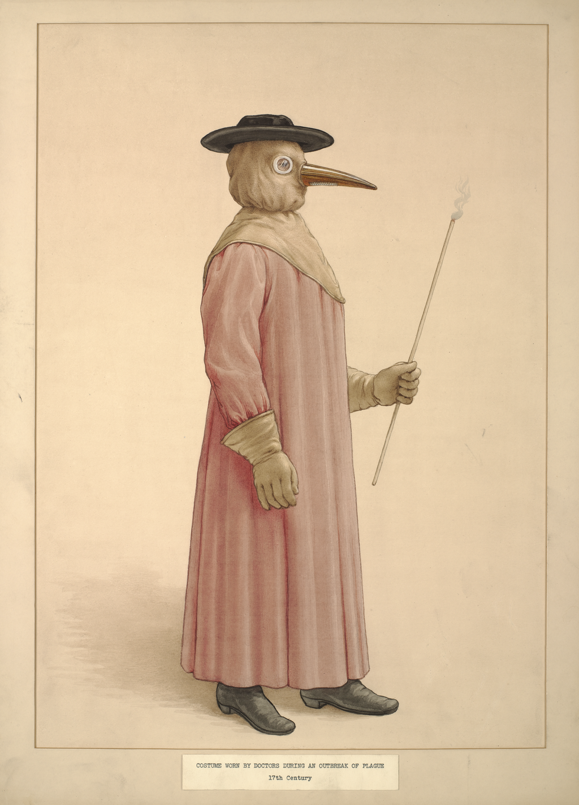
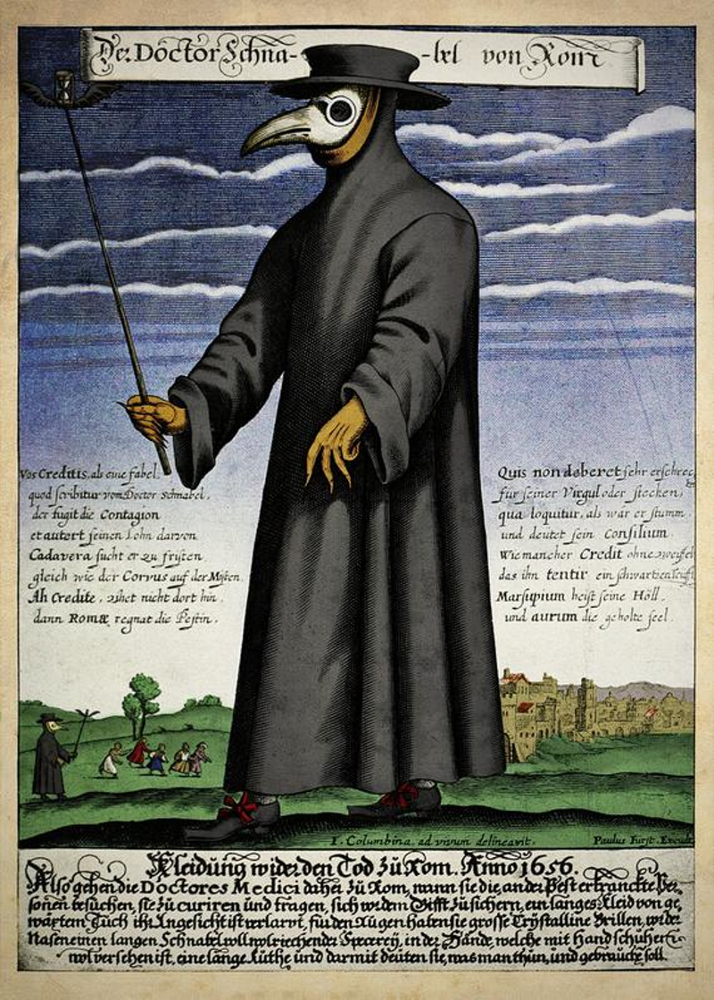
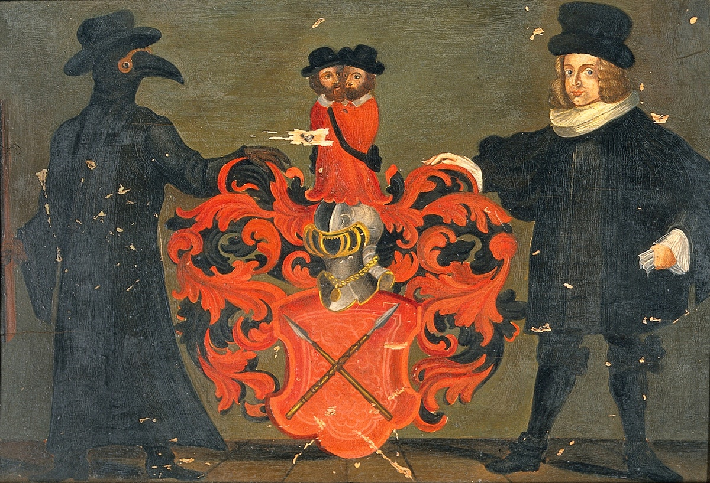
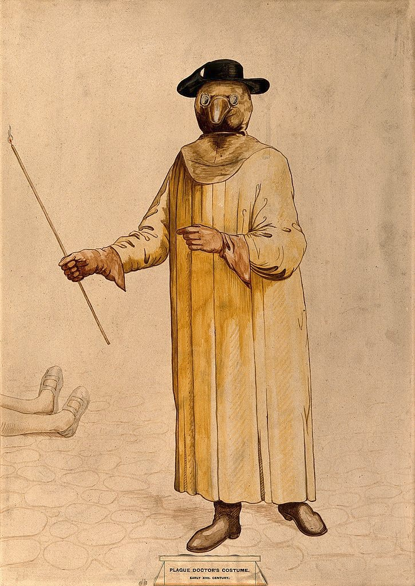

Happy Easter one and all! It’s not actually a holiday here in California, but oh well. Short edition this week, since I already wrote a [2,000-word newsletter](https://buttondown.email/buttonup/archive/e6a0531b-6708-49cc-8d5f-44a1ecb5d4cb) today, which also means I don’t have much in the way of Big Thoughts™️ and this is more a log of my media diet. Nevertheless, enjoy!

Images today are [plague doctors from Public Domain Review](https://publicdomainreview.org/collection/plague-doctor-costumes/). Fun fact: plague doctors were not present for the Black Death (14th century), rather coming about some three centuries later (17th century), which just goes to show how not-static the pre-modern world was.

## What I Read

I finally got around to reading the copy of Ellen Raskin’s _The Westing Game_ that I picked up at the Strand. I vaguely remember it as being a.) a mix of _Clue_ and Agatha Christie and b.) being one of my favourite childhood books. That description is... exactly correct! It's extremely charming and it really speaks to my inner child. But... it also hasn't aged _that_ well. I mean, sure, there’s Black Panthers references that probably resounded much more in the late ‘70s, but we also have the bizarre situation of the Chinese restaurant owner’s wife, who doesn't speak English, stealing things to go back to China? And this is never really explained??? Which is a shame, because then her stepson (an Asian-American kid who ends up being an Olympic winner) is a surprisingly well-rounded portrayal for the late ‘70s. Basically, I want a modern film remake. 🤔

[_Crafting Interpreters_](https://www.craftinginterpreters.com/), which is one of my favourite books of all time (technical or not), is finally done! The author, Bob Nystrom, has [a great post up](http://journal.stuffwithstuff.com/2020/04/05/crafting-crafting-interpreters/) talking about the history of and process of working on the book. Interestingly, all of the images are actually drawn by hand! Warning, though, some tears may be shed.

[This article](https://www.spur.org/publications/urbanist-article/2008-06-01/eye-street), from the San Francisco Bay Area Planning and Urban Research Association, talks about why San Francisco streets feel so... depressing? Spoiler alert: they're badly designed!

## What I Watched

Following up from _Helvetica_, Gary Hustwit streamed _Objectified_ for free. Disappointingly, I didn't think it reached the heights of _Helvetica_—it mostly consisted of various designers mumbling about what makes good design, with nary a narrative strand in sight.

Bong Joon-ho’s _Snowpiercer_ never quite reaches the mastercraft status of its follow-up _Parasite_—it's far more heavy-handed and occasionally clumsy—but still well worth a watch.

We, like most of America, watched the Netflix original _Tiger King: Murder, Mayhem, & Madness_, chronicling the rise and fall of tiger zoo owner Joe Exotic. We chewed through the whole series in a week, which I suppose is some kind of stamp of approval, but I walked away feeling rather uneasy, especially after watching part of the Joel McHale-hosted “after show” released today. [This piece](https://www.nytimes.com/2020/04/09/science/tiger-king-joe-exotic-conservation.html) in the New York Times captures that feeling well—it feels more like a reality show than a considered documentary, with the intent of making stars of its subjects (some of whom, it is rumoured, were paid for participation); the welfare of the animals only occasionally peeks through the human drama of duelling zoo leaders; and Carole Baskin, who’s no angel but probably not the devil either[^1], is villainized in almost the same light Joe Exotic painted her in, at least going by the number of people I've seen that joking-not-joking say “Carole did it.”[^2] I wouldn't go so far as to call the show “irresponsible,” though if there ends up being a “Free Joe” campaign it may well be (as he was, remember, convicted unanimously by a jury of his peers after admitting to animal abuse!). It makes an interesting contrast with the first episode of _Don’t Fuck with Cats_, which is much more careful to present a balanced picture (and explicitly says “maybe mob justice is bad”!).

## What I'm Listening To

[This episode](https://lingthusiasm.com/post/613058137097912320/lingthusiasm-episode-42-what-makes-a-language) of Lingthusiasm from last month, “What makes a language ‘easy’? It's a hard question”, is a delight. I think I've sung the praises Gretchen McCullough and Lauren Gawne before, but if not: Lingthusiasm is regularly a delight. This episode references a bunch of my favourite facts: language learning difficulty depends on where you're starting from; complexity in one area of a language allows for simplicity in others; languages with small speaker communities tend to be more complex, and in particular tend to be more [synthetic](https://en.wikipedia.org/wiki/Synthetic_language), hence why both Mandarin (the most widely spoken language in the world) and English (which was spoken by huge communities of non-native Scandinavian vikings, Irish slaves, French Normans...) “don't have grammar”.

I don't know how I found it, but I've been hung up on this folk album, _Folkesange_, by Danish “dark folk/black metal” (?) musician [Myrkur](https://en.wikipedia.org/wiki/Myrkur).

## The Rooibos Corner

He's not usually _this_ photogenic.

## What I'm Working On

Buttonup, my Buttondown client for iOS, is coming along. For more details, follow my [buttonup Dev Diary newsletter](https://buttondown.email/buttonup) 🙂

I’m working on a project with [Rob](https://buttondown.email/bobheadxi) and some others but _shh_.

Then there’s the revamp of [rwblickhan.org](https://rwblickhan.org) which I’m still dragging my feet on… but it is getting closer.

[^1]: She’s domineering to a fault and swindled some people out of their rightful inheritance, and I have no doubt she threatened her then-husband—but the case that she actually murdered him and fed him to tigers seems much murkier than the show lets on.

[^2]: As that article points out, the show seems deliberately unflattering to Baskin—there is a meaningful difference between Big Cat Rescue and Joe Exotic’s zoo, not least the fact that Big Cat Rescue actually does have humanely-sized cages (contrary to the footage in the show). Plus, while her treatment of volunteers and interns doesn't seem _great_, the show does elide the difference between legitimate volunteers and the cult-like atmosphere Joe Exotic and Doc Antle cultivated.
