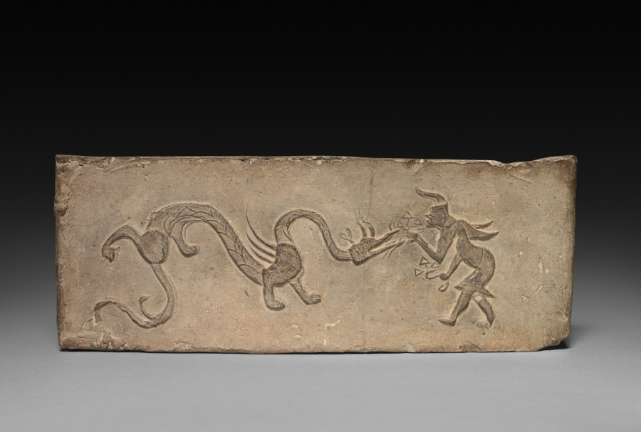

[“Panel from Model Cooking Stove: Fairy Feeding Lingzhi Fungus to a Dragon”, 101-100 BC](https://www.clevelandart.org/art/1925.134)

## Dragon Farming

Dragon farming is a tough job, yes it is, but it’s my way of life and it’s rewarding like nothing else — when you do it right. If you don’t do it right, well… *chuckles*

I can’t say we get many of you big city folk down here to take a look at the dragons, but I’m more than happy to show you around. Pretty interesting to see where the meat in your supermarket comes from, eh?

Intelligent? Gods, no, dragons aren’t intelligent, what are you talking about? They’re giant flying lizards, for crying out loud! They’re not pigs or horses, they’re basically salamanders with wings — well, and they spit fire. Gods, could you imagine if we farmed pigs? Think of how troublesome they would be!

Well, if you’ll step right this way, I’ll take you out in my pickup truck to see the dragons. Just, uh, keep your hands inside — wouldn’t want you to get a finger nipped off!

So as you can see, we have a few hundred acres, most of it given over to caves and grottoes and the like. If you give them a nice fat pile of gold they’ll mostly just sleep, especially as they get bigger.

Gold? Of course they hoard gold, don’t you know anything about dragons? That’s the main expense in raising dragons, that and all the chicken meat they eat. Well, they eat the gold too — I guess that’s why they hoard it, actually, so that they always have a supply. Supposedly it’s because it powers some reaction that lets them breathe fire. Don’t ask me for details, though, I didn’t exactly pass chemistry with flying colors, heh.

Alright, now if you’ll follow me into this cave — it’s alright, this one is pretty tame — you’ll see a girl we call Lil’ Shorty. It’s a joke, y’see, because she’s pretty long — ‘bout twelve feet, roundabouts. That’s on the larger side for commercial dragon farming — usually you don’t want to let them get that big, but she’s a breeder. Some of the whelps are probably wandering around here, but I guess some are getting they, heh, “tonsillectomy.” Can’t let them fly free, burning everything down.

Flying? Oh, yeah, we let them fly, we’re a free-range establishment — we’re not exactly making veal here. They’ve all got tracking collars and tonsillectomies, and dragons rarely fly far from their hoards. It’s not exactly easy to find a bunch of gold laying around, right? *chuckles*

Anyway, seems like she’s hibernating. Let’s keep going.

Ah, I’ll pull off over here. Looks like the salmon are trying to swim upstream, but they’re not going to get far. Let’s just wait and see…

Wow, did you see that?! That was an Asian dragon, scooping up as much as he could eat. We mostly grow ‘em for foreign markets — of course China and Japan are the big producers, but a lot of folks swear by the waters out here in the wild west — supposedly they have a fishier taste. They’re way too lean for my taste, but hey, money is money, right?

Alright, here’s one that’s awake. Careful, he’ll nip. Here, I’ll put him up on your arm. Yeah, I know, he gives you those big puppy eyes. When he’s a bit bigger he’ll be sent to the slaughterhouse, so don’t get too attached. What? Oh, yeah, they purr like cats all the time, especially when they have a nice big pile of gold.

What’s that? Can you keep him? Well, I suppose if you pay fair market value…