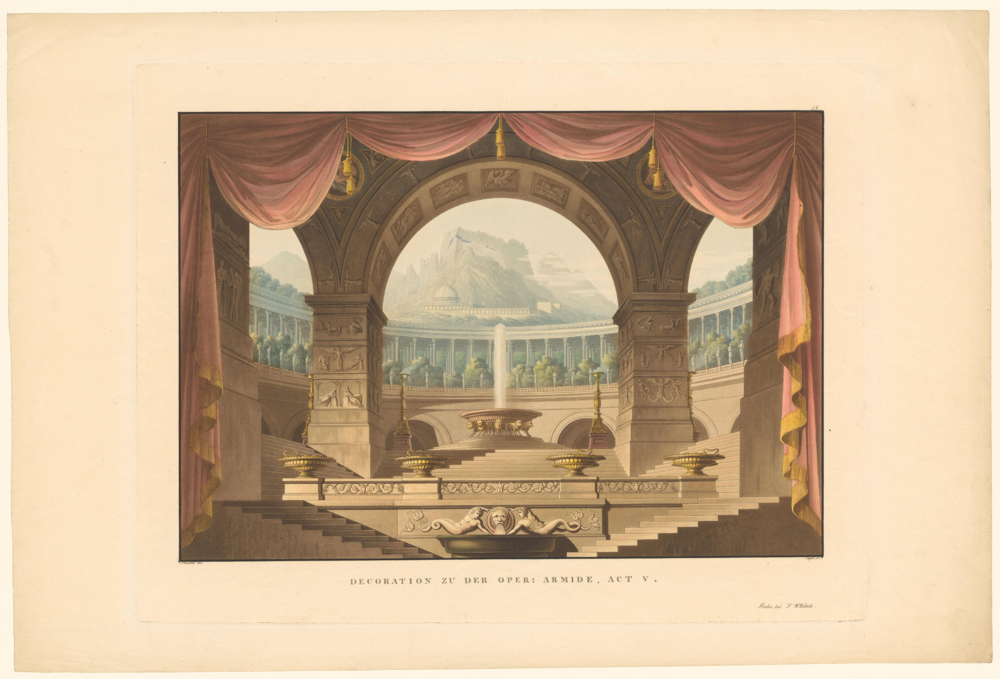

[“Decor voor opera 'Armida’”](https://www.rijksmuseum.nl/en/collection/object/Decor-voor-opera-Armida--533a224fb46c8f44b3cfebac34536aae)

[I have watched Guillermo del Toro’s *Frankenstein*!](https://rwblickhan.org/newsletters/capital-r-romantic-melodrama/)

Now *puts on everything-is-neurodiversity hat* this film is absolutely definitely about Victor abusing his nonverbal autistic child, right?

Anyway: it’s not particularly faithful to the text, but it *is* faithful to its spirit, which is probably the correct choice for 2025. The bigger issue is that (as with many of GdT’s films) it’s essentially a Catholic tragic opera, running in a melodramatic mode, and your experience with the film is basically determined by how much you like Catholic tragic opera. I for one enjoy it very much (although *Pan’s Labyrinth* did it better and subtler), but it’s no surprise Khoi Vin [hated the film](https://letterboxd.com/khoi/film/frankenstein-2025/) if you’ve been following his Letterboxd reviews.

Also: this film wears its Catholicism on its sleeve — one important scene is set in a confessional booth, Victor prays to the Archangel Michael, Elizabeth-as-mother-Mary wears a crucifix in every scene... It’s a fascinating choice, given the original novel was written by a possibly-crypto-atheist English novelist in an England that had been Very Not Catholic for a century.

---

Speaking of Christianity: we now have season 2 of *Hazbin Hotel*, everybody’s favorite (citation needed) animated musical comedy about the intensely bisexual daughter of Satan, Charlie Morningstar, trying (and mostly failing) to redeem the sinners of Hell.

I enjoy *Hazbin Hotel* very much, but I acknowledge it is very much Not For Everyone. There’s a particular subgenre of intentionally-campy, found-family-focused, LGBT-authored, often-animated, often-musical media — which I am completely failing to think of other examples for, but if you know you know — which often ends up aggressively beloved more for vibes than actual quality. Which is to say, I’m sometimes underimpressed by the writing in *Hazbin* — it’s a show that often seems to think “maturity” means “using naughty words unnecessarily” and not, say, dealing with mature topics — *but* I am very much a fan of the vibes. Also, *Hazbin* has a very particular 1920s jazz-and-bootleggers aesthetic shared by, say, [*Lackadaisy*](https://lackadaisy.com/), which is like catnip to me. Or, perhaps, like a top-shelf pre-Prohibition bottle served at a speakeasy circa 1927. (I tried to make this metaphor work, I really tried.)

Perhaps more importantly: *Hazbin* is another step in the long, long evolution of Abrahamic mythology. *Hazbin* quietly assumes a fairly extensive familiarity with esoteric Christian concepts — not just the overall theme of redemption, but for instance the existence of Metatron as God’s spokesangel, or Lilith as the first human woman-turned-demon (now cast as Charlie’s absentee mom).

:::aside{.note}
> Esoterica alert: he had a [great video](https://youtu.be/3592DMH-eyM?si=4oLCg0zWCWIi1Tpe) this week discussing how Lilith went from a generic demonic entity to the Lilith we all know and love, thanks to a *deeply* satirical tract called *The Alphabet of Ben Sirah*.
:::

It’s particularly fascinating to watch while rereading *Paradise Lost*, which did so much to cement English-language conceptions of Satan. Indeed, *Hazbin* is almost as much an inversion of *Paradise Lost* as Pullman’s *His Dark Materials*, and worth watching on those grounds alone.

---

On a not-so-whim a month or so ago I decided to follow Sam Harris’ Waking Up meditation course. It’s... surprisingly effective?

The core insight he’s trying to get you to notice, through focused attention, is a feeling of egolessness. To paraphrase the phrasing I found most effective, your “sense of self” *just is* the constant stream of thoughts through consciousness. Consciousness is just a field of experience that thoughts wander through, but if you learn to let thoughts go — to stop getting “lost in thought” — then your sense of self vanishes, at least momentarily.

Which, for therapeutic purposes, ends up roughly reinventing CBT (*I am in charge of my thoughts; my thoughts are not in charge of me*), but is also profound in its own right.

That may sound strange, but as Harris repeatedly points out, you can just *try it* and (eventually) see that it’s true. I’ve experienced it myself a few moments at a time — a slightly uncanny feeling of “paying attention to what’s paying attention” and realizing there’s nothing there, just a pure stream of experience, living in the moment. I know I sound like a hippy but I swear it’s true!!

I read the original book the course is based on (also titled *Waking Up*) and while it is interesting in its own right — it has one of the clearest explanations of the “hard problem of consciousness” I’ve seen — it’s simply not as effective as sitting listening to guided meditations for a month. Also, it showcases some of the uglier parts of Harris’ Four Horsemen of New Atheism persona — he wastes an awful lot of ink complaining about Christianity’s lack of philosophy of mind or the abuses of various gurus.

The course is (sadly) Very Not Free, although I’ve found plenty of value in it, and there is an aggressive referral program, so if you want a free trial month, reply to this email, I guess?

---

Finally, a recommendation: if you’re in the Bay Area, consider seeing Masako Miki’s [*Midnight March*](https://www.icasf.org/exhibitions/20-midnight-march) at the ICA, *for free*, while it’s still open! (You have a week!!) It’s small, but incredibly charming.
