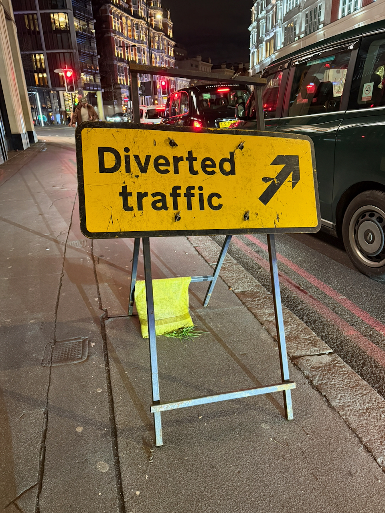

At least it's not a sign reading ["You Have Been Diverted"](https://en.wikipedia.org/wiki/Life,_the_Universe_and_Everything)...

Hello! I write, bleary-eyed, at 7am, having been in some sort of wakefulness for the past four hours. Yes, that’s right — I’m jetlagged.

It’s a commonplace observation, but jetlag really is the closest we can get to time travel, isn’t it? You board a plane one day and by the time you disembark it’s a completely different time and place.

Sherry mentioned in passing, in the airport, that it’s easy to take air travel for granted, and that’s true too. People are sometimes pessimistic about the human capability for large-scale cooperation, for transcending tribalism and building things for the whole human race — but in the modern air travel experience, we’ve somehow assembled some of the most complex machines ever built, then built a world-wrapping system of radar arrays and tarmacs and airports, and then instituted a loosely-organized federation of global professionals that somehow makes these fearsome flying machines go from one airport to the next without, for the most part, dropping out of the sky.

:::aside{.note}
Perhaps that’s why I, and so many others, find the mystery of MH370 so compelling. Air travel is so counterintuitively well-organized that it _doesn’t feel possible_ that a plane could just disappear without an explanation. But planes should be disappearing all the time!
:::

Anyway: this week I’m in London to celebrate my 30th, and then off to Paris, and then back home. So expect these missives to be short until then!
