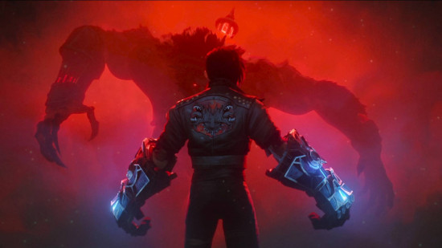
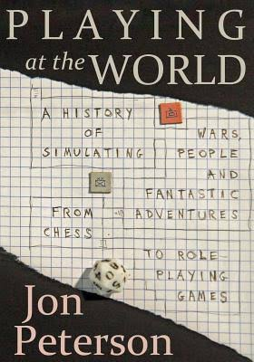
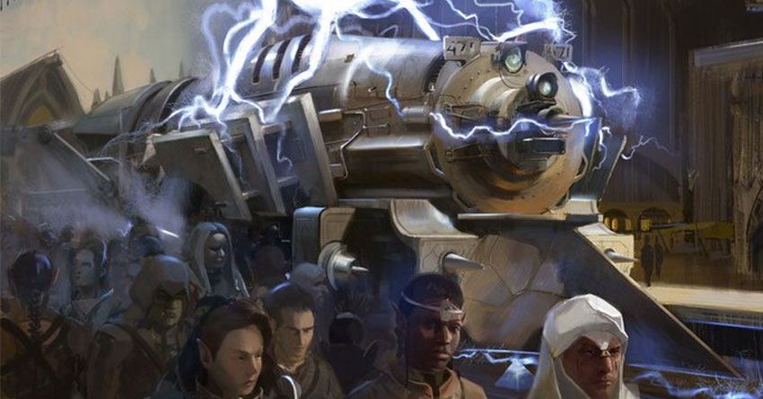
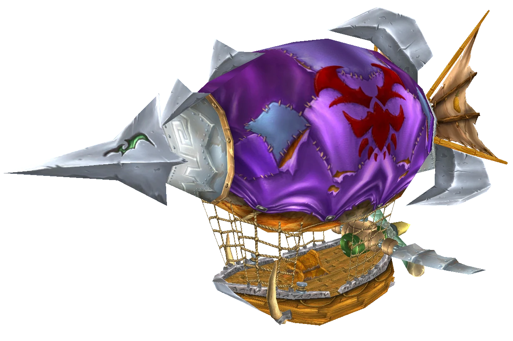

I was watching the second season of *Arcane* recently and realized it’s canonizing new “defaults” for the (high) fantasy genre.

If you think of the most generic high fantasy setting you can, what does it include? You’re probably thinking of a pseudo-medieval setting of knights with magic swords advised by wizards; elves and dwarves fighting orcs and dragons; a motley crew of companions on a quest to save the world.

That’s the result of the last round of canonization, resulting in what I’ll here call “traditional fantasy.” (There’s a *lot* of fantasy subgenres, like urban fantasy, but I’m focused on mainstream high fantasy here.) But it feels like we’re on the cusp of a new set of “defaults”, driven by the dual popularity of *Arcane* and Brandon Sanderson, which I’ll call “modern fantasy.”

So, as I understand it, the potted history of the fantasy genre in the English language, and high fantasy in particular, starts with a few separate strains in the early 20th century:

- Children’s fantasy, like *The Wizard of Oz* or Narnia
- Pulp-oriented sword-and-sorcery, like Conan or Fafhrd and the Grey Mouser
- Folkloric fantasy based on the Norse sagas or *Beowulf*, most notably Tolkien but also writers like Poul Anderson; these were also pulling from an earlier generation of proto-fantasy like George MacDonald, William Morris, and Lord Dunsany
- And a bunch of other idiosyncratic stuff like *Lud-in-the-Mist* and the Gormenghast trilogy

All these strains were bubbling around by the 1950s, then *Lord of the Rings* found newfound popularity with the hippies in the ‘60s, leading to the canonization efforts of the Ballantine Adult Fantasy series and a string of high fantasy knock-offs of *LotR* through the ‘70s, finally culminating in *Dungeons & Dragons* in the ‘80s. Dungeons & Dragons pulled heavily from LotR[^gygax] and pulp sword-and-sorcery. And *Dungeons & Dragons* and its many settings and novelizations and video game adaptations became the “default” for fantasy settings.

(Most of these details pulled from the first edition of Jon Peterson’s [*Playing at the World*](https://www.goodreads.com/book/show/15784870-playing-at-the-world?ac=1&from_search=true&qid=Sez8d6d2Gb&rank=1), which is excellent. I eagerly await [Adam Roberts’ *Fantasy: A Short History*](https://www.amazon.com/Fantasy-History-Adam-C-Roberts/dp/1350407828), though.)

Reactions to this dominant genre started even before canonization, especially with [New Wave](https://en.wikipedia.org/wiki/New_Wave_(science_fiction)) writers like Ursula K. Le Guin (*Earthsea*) and Michael Moorcock (whose Elric books were a major influence on Warhammer). The 1980s and ‘90s also saw the rise of Terry Pratchett, at least in the UK. While *Discworld* doesn’t strike me as a major influence on the *Arcane* and Brandon Sanderson, it does have a degree of thematic and tonal similarities.[^reactions]

But the more important thread to follow to modern fantasy is not reactions per se but extensions and reinventions.

D&D has a long history of increasingly out-there settings. In particular, Eberron has always delighted me. It calls itself “dungeonpunk,” which means it extrapolates from D&D’s weird, anachronistic ruleset into completely serious worldbuilding. If wizards can use three gold pieces to magic up a portal, then *of course* they will immediately build intercontinental rail! *Magic: The Gathering* (itself a child of D&D, as it was invented to pass the time between D&D games) has Ravnica, among other settings, which introduces a planet-wide city controlled by a council of guilds. There’s also Iron Kingdoms (later adapted into Warmachine and Hordes), which stapled full-on steampunk (itself a whole subgenre with its own history) into “normal” D&D, resulting in a weird mix of “engineers building steam engines” and “wizards chanting magic spells to control the steam engines.”

The direct route to *Arcane*, though, goes through Warhammer, then Warcraft, then League of Legends, its actual source.

Warhammer started in the ‘80s as a scheme to sell more D&D miniatures and ended up becoming a massive franchise of its own (in the UK, at least), combining a peculiarity British comedic sensibility with an everything-and-the-kitchen sink approach to fantasy tropes — Arthurian knights fighting Moorcockian elves fighting mad-scientist rat-people[^skaven] fighting evil dwarves with diesel trains. Then, in the ‘90s and into the 2000s, the Warcraft franchise and in particular *World of Warcraft* took over the video game industry. Apocryphally, Warcraft was originally a Warhammer licensed game, which I’ve never really believed[^newsletter], but regardless, it adopted Warhammer’s devil-may-care attitude towards anachronism — orcs in mud huts fighting dwarves in blimps. It also introduced the idea of oppressed-orcs-fighting-self-righteous-humans, which would become ever more central to the emerging genre. Then, finally, these ideas were picked up by *League of Legends* (originally based on a Warcraft mod, *Defense of the Ancients*). LoL is arguably the most important video game of the 2010s (excepting perhaps Minecraft and Fortnite), and *Arcane* has been a (perhaps surprising?) smash hit — maybe not *completely* mainstream, but widely advertised by Netflix as a prestige TV show.

And that brings us up to right now, as I watch the second season of *Arcane*. I had an uneasy feeling of deja vu — I’ve seen all these tropes before! — and that’s when I realized we’ve well and truly past the traditional fantasy of which D&D was a capstone. A lot of these tropes are also shared by best(-best-best)-selling author Brandon Sanderson, and they pop up various other places as well (Rowan Rook & Deckard’s recent RPGs like *Spire*, the comic / film *Nimona*, the newer Warhammer games like *Age of Sigmar*).

So what tropes are being canonized?

- **Oppression, resistance, and terrorism**: Modern fantasy feels very post-post-9/11. Right after 9/11, in the midst of the Iraq War, there was a wave of genre fiction that was pretty explicitly about the War on Terror — *Battlestar Galactica* and *Wicked* (the book, not the musical) spring to mind. That’s still around, but modern fantasy is very specifically often about an oppressed underclass fighting a colonial or totalitarian government.[^hungergames] You have Zaun’s conflict with Piltover in *Arcane*, the rebellion against the emperor in Brandon Sanderon’s *Mistborn*, the oppressed dark elves in Rowan Rook & Deckard’s RPG *Spire*, Nimona’s conflict with the self-righteous city government, and so on. This marks huge contrast with traditional fantasy, which was uncomfortably situated between the Inkling’s Edwardian comfort with class systems and American frontier ideology.
- **Magic-as-engineering**: Modern fantasy has fallen in love with [Brandon Sanderson’s concept of “hard magic” systems](https://www.brandonsanderson.com/blogs/blog/sandersons-first-law) — magic is no longer a mysterious, numinous force wielded by the rare few; it’s instead a technical discipline with specific rules that are carefully explored like we’re reading *I, Robot*. In-universe, magic is often *literally* a discipline, with colleges dedicated to churning out students of magic who basically fulfill the role of engineers in their societies.
- **Steam technology (or equivalent)**: Modern fantasy has adopted steampunk, or steampunk-like, technology wholesale. No more pseudo-medievalism — modern fantasy is much more comfortable in urban settings, with magic-powered bullet trains and semi-industrial manufacturing. That’s common to pretty much all the newer D&D settings and was somewhat present in Warhammer and Warcraft as well, but in those settings its somewhat distinguished (only one group has the technology, say) or actively commented on (Eberron’s self-description as “dungeonpunk”), but in *Arcane* or Brandon Sanderson’s works it’s taken for granted. Blimps are omnipresent now.
- **Superheroes**: Traditional fantasy pulled heavily from King Arthur and *Beowulf*[^beowulf] — the lone hero with a magic sword, advised by a wizard, fighting monsters and only occasionally other knights. But modern fantasy pulls more from superhero culture, probably because of the overwhelming force of the MCU.[^mcu] There’s much more emphasis on the “team up”, with different heroes using different weapons or tactics — the ending of the first episode of the second season of *Arcane* literally ends up with an Avengers-esque montage, and Nimona literally starts as a superhero (well, supervillain) comic. There’s also a very Marvel-ish emphasis on “normal people with supernormal powers.” The characters are not destined heroes or multi-generational monarchs; they’re basically normal people who, for whatever reason, end up with what are basically superpowers. But they aren’t just any old people — there’s no more “only a hobbit is humble enough to carry the Ring” from LotR or the rather marginal position of most pulp heroes — they *do* have powers and as a result end up changing society.

There’s probably other tropes I’m struggling to name right now, but those are some of the big ones and anyway this has turned into a much more massive newsletter than I intended, so I think I’m going to dip now.

[^gygax]: Ironically so, given E. Gary Gygax was not a fan of LotR and only added elves, dwarves, and so on for commercial reasons.
[^reactions]: There’s a major thread of “grimdark”[^grimdark] reactions that specifically take aim at Tolkien’s concept of [“eucatastrophe”](https://en.wikipedia.org/wiki/Eucatastrophe), of which the most famous by far is George R.R. Martin’s *A Song of Ice & Fire* (that is, *Game of Thrones*). There’s another very recent thread that might be called “ethnic fantasies,” a la R.F. Kuang’s *The Poppy War*, which use the tropes of Western high fantasy but graft on mythological creatures and themes from non-Western cultures. But neither of these relates strongly to the thread I’m pulling on here.
[^skaven]: Warhammer is largely one big blender of tropes, but the Skaven are the one truly original idea in Warhammer, and I find them weirdly underappreciated and uninfluential. Die-die, man-thing!
[^newsletter]: More importantly, I’m not willing to do the work of researching for an off-the-cuff newsletter.
[^beowulf]: This is perhaps not surprising — Tolkien was at one point the world’s preeminent *Beowulf* scholar, and also translated the Arthurian *Green Knight*.
[^mcu]: While “mainstream” fantasy pulls away from Arthuriana, there has been a (surprising, to me) revival of Arthuriana in the more literary end of fantasy, from Kazuo Ishhiguro’s *The Buried Giant* to Robin Sloan’s *Moonbound* to Lev Grossman’s *The Bright Sword*, not to mention the big-budget *Green Knight* film starring Dev Patel. I have no explanation.
[^grimdark]: Though, calling this fantasy subgenre “grimdark” has always bothered me. “Grimdark” is a reference to Warhammer 40,000’s tagline, “In the grim darkness of the far future, there is only war.” But, unlike *Game of Thrones* or most of the other stories that get labeled “grimdark”, 40k *is primarily a black comedy* — the line about grim darkness is intentionally over-the-top and satirical.
[^hungergames]: Now that I’m writing this out, I wonder if this due to the influence of dystopian YA lit like *The Hunger Games*.