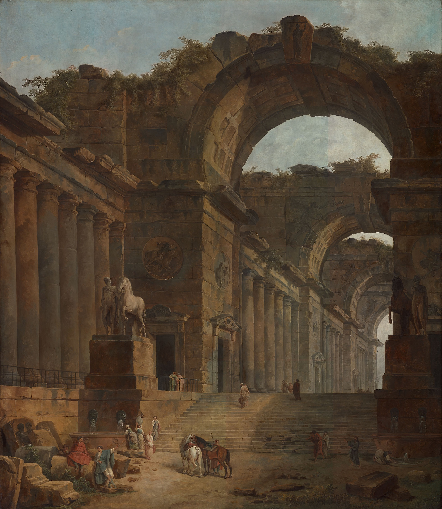
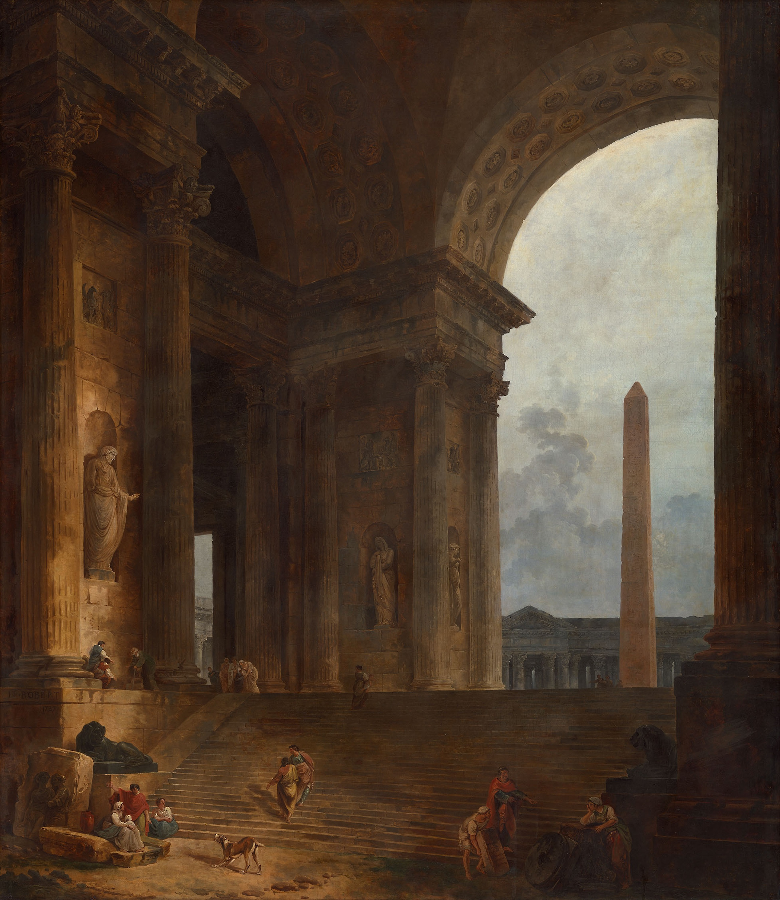
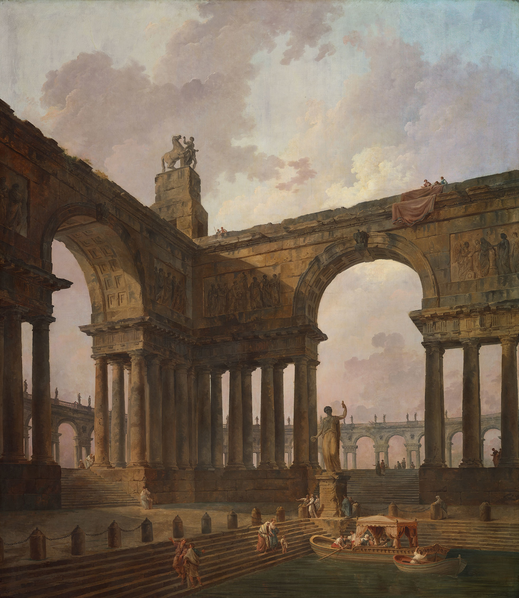
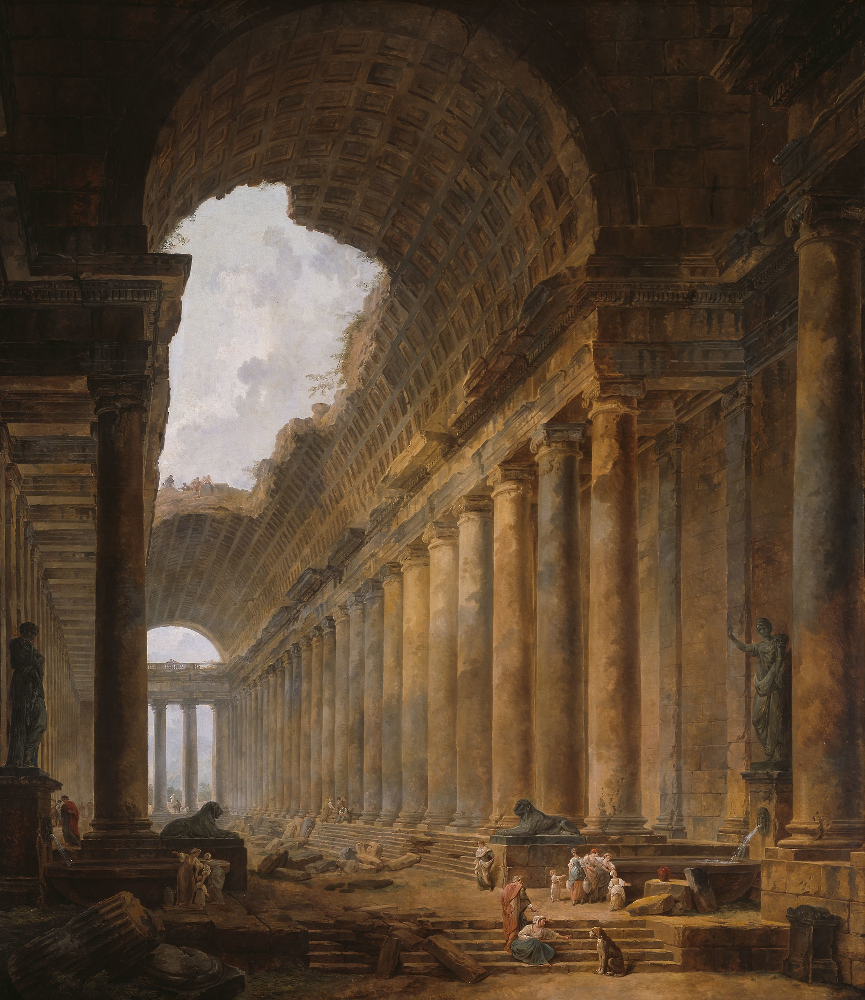
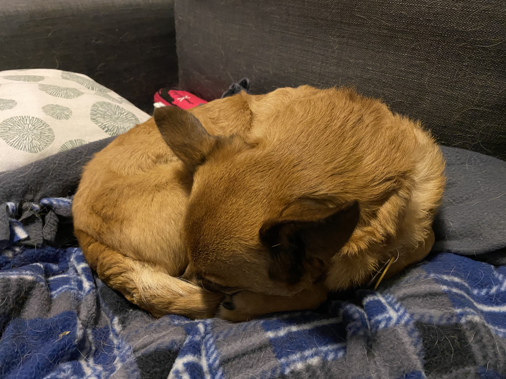

Hello all and hopefully you’re all staying safe and sane. Personally, I (and, it seems, most of my coworkers) am finally feeling the strain of work-from-home; admittedly, having a partner but no children does relieve most of the burden, so in practice my day-to-day routine is practically unchanged, but there is still a strain. Luckily, May 1 has been declared a company-wide holiday, so that’s hopefully a nice chance for rest and relaxation.

[The Fountains, Hubert Robert, 1787-88](https://www.artic.edu/artworks/57051/the-fountains)

Art this week is a series of Neoclassical Roman ruins, found by browsing the [open access portion of the Art Institute of Chicago’s collection](https://www.artic.edu/collection?is_public_domain=1)[^1] I could have highfalutin’ thoughts about these, but to be honest, I think they simply caught my eye because they remind me of video game concept art. It also helps that they have a distinctly early-medieval-ruins-of-past-glories vibe that gels well with, well…

## What I’m Working On

I didn’t get much done on buttonup, my Buttondown iOS client, this week, though interestingly Sherry started a rival Android client and got significantly farther than me. As always, you can follow the development in the [dev diary](https://buttondown.email/buttonup). In fact, I didn’t get much at all “productive” done—perhaps I’ve been working too hard at my day job 😛 Then again, I did just receive a promotion, so that’s nice.

I’ve also _once again_ starting a writing project that will probably never go anywhere. This time I was struck by inspiration while reading about [Charlemagne’s grandchildren](https://en.wikipedia.org/wiki/Charles_the_Bald) and the [Treaty of Verdun](https://en.wikipedia.org/wiki/Treaty_of_Verdun) and thinking “this cries out for a _A Song of Ice & Fire_-ification” [^2]. So a few hours later I found myself reading about [_Orlando Furioso_](https://en.wikipedia.org/wiki/Orlando_Furioso) and [_The Song of Roland_](https://en.wikipedia.org/wiki/The_Song_of_Roland) and [Durandal](https://en.wikipedia.org/wiki/Durendal) and [Bradamante](https://en.wikipedia.org/wiki/Bradamante) and of course most importantly the creation of [Carolingian Minuscule](https://en.wikipedia.org/wiki/Carolingian_minuscule) by [Alcuin](https://en.wikipedia.org/wiki/Alcuin), and somehow mushing this together with my preexisting idea for stories based around a [dog-headed](https://en.wikipedia.org/wiki/Cynocephaly) [St Christopher](https://en.wikipedia.org/wiki/Saint_Christopher)-type character and a Zoroastrian-inspired dualistic religion… and in between all that I managed to squeeze out a full _four hundred_ words (impressive, I know). In the spirit of “working with the garage door open” (on which more below), here they are (I would not highly recommend reading it, but):

> The clangor of the bells rang out loud and clear over the teeming masses of the imperial capital. The throngs of worshippers pushed their way out of the cathedral onto the street, to enjoy the day of rest and relaxation ordained by Charity Herself as a perpetual statute for mankind.
>
> At the head of the cathedral, Louis sat in prayer, waiting for the crowds to dissipate. Despite his position as crown prince, none would bother a man in prayer. When he looked up, the silence of the now-empty cathedral echoing around him, the priest was there, looking down upon him. “Heavy is the burden you must bear.”
>
> Louis opened his mouth to speak, but he had no response. He closed his mouth again. The priest smiled at him and moved closer, putting a kind hand on his shoulder. “Say nothing. I understand.”
>
> “I’m too young to rule.”
>
> “You are in your thirties. Do you know how old your father was when he became emperor?”
>
> “Don’t remind me.”
>
> “You’re right, of course. The comparison is inapt. And yet nevertheless the Virtues have decreed that it is your time to reign.”
>
> Their conversation was interrupted by footsteps echoing throughout the cathedral behind them. Louis turned to espy his father’s secretary, short head bobbing up and down, rapidly approaching them. “Guiscard, my good man. And how may we be of service?” Louis rose and gave a short bow.
>
> His new interlocutor matched him. “I dare say I shall be serving you in a matter of hours, now.” Despite his jocular tone, his face was grim.
>
> “My father, then…”
>
> “If Charity is kind, he may have another day in this mortal realm.”
>
> “And there is nothing that can be done?”
>
> “His _medicus_ looked him over and swears by Truth there is no treatment in this sublunary world. And as for prayer, well, the archbishop here can speak to its efficacy more than I. But I would warrant a miracle not long seen in this world is necessary.”
>
> “Then you’re here to summon me for the announcement of the inheritance.”
>
> “Yes.”
>
> “Then let us go.”

[The Obelisk, Hubert Robert, 1787-88](https://www.artic.edu/artworks/57049/the-obelisk)

## What I’m Reading

I keep saying I’ve been too lazy to read books, but actually I’ve gotten through both [Leviticus](https://en.wikipedia.org/wiki/Book_of_Leviticus) and [Numbers](https://en.wikipedia.org/wiki/Book_of_Numbers) in [Robert Alter’s Hebrew Bible translation](https://www.goodreads.com/book/show/38212108-the-hebrew-bible?ac=1&from_search=true&qid=K1tdOGbxBQ&rank=1), both of which are… not that easy to get through! ([Apocrypals](http://apocrypals.libsyn.com) helped.) I’m sad to say _Ancillary Justice_ failed to grab my attention (I’ll try it again soon) and while I’m still getting through _Rise and Kill First_, I wanted a break for some fiction. So, before jumping into Deuteronomy, I’m finally tackling that Oxford World’s Classics copy of _Paradise Lost_ I bought a while back, which is, of course, astounding from pretty much the first line.

I’ve also been reading a lot of [r/AskHistorians](https://www.reddit.com/r/AskHistorians/), the last good place on the internet, because my idea of “mindless browsing” is, uh… rather more _academic_ than most people. Anyway! Among the interesting posts I saw this week ([their Twitter](https://twitter.com/askhistorians) is the best place to find posts with high-quality answers), something I had never really considered: why did [early Christians meet in basilicas](https://www.reddit.com/r/AskHistorians/comments/g2j4ac/why_didnt_ancient_greek_and_roman_temples_become/fnsez7h/) (the ancient Roman equivalent of the proverbial middle school gym) instead of pagan-style temples, setting the stage for 2,000 years of church design? Well, for much the same reason some churches today meet in middle school gyms (and community centers, etc. of course)—Christian worship is essentially a bunch of people meeting up, hence you need a place for a bunch of people to meet, unlike ancient polytheism, which was much much more centered on showy public rituals! Anyway, there’s a lot more detail at the link—that was my fun little discovery of the week.

If you may recall all the way back from issue 1, this newsletter was directly inspired by author Robin Sloan’s [Year of the Meteor](https://desert.glass) newsletter (check it out before it’s gone!). Well, now he’s working on a map-based text adventure (???) titled [_Perils of the Overworld_](https://www.robinsloan.com/overworld/), and, in the spirit of [“working with the garage door up”](https://notes.andymatuschak.org/About_these_notes?stackedNotes=Work_with_the_garage_door_up)[^3], he’s developing it week-by-week, in public (kinda like a [certain other newsletter](https://buttondown.email/buttonup), come to think of it… 🤔). Seeing as how he is a Professional Wordsmith™️, it is… a very good newsletter! In particular, I want to point to [issue 2](https://www.robinsloan.com/overworld/week/2/), in which he both takes aim at a personal pet peeve of mine (video game text that scrolls verrrrryyyyy slowlllllyyyyy) and also explores video game typography, and [issue 4](https://www.robinsloan.com/overworld/week/4/) (from… today!), in which he has some Thoughts™️ about Writing™️. Now, I am very excited for this game itself, which he describes[^4] as

> an adventure game in which you set out on a grand, dangerous quest but then, as you aid others and are aided in return, find yourself enmeshed with them: and so, your quest ends not in the jaws of a dragon but in the grip of a community. In the vise of actually caring!

But just as much so I’m excited to see where this newsletter goes; even if the game goes nowhere, or ends up disappointing, I think this newsletter will stand on its own as a valuable work of art.

Finally, here’s a random Wikipedia page on the [Yarsani religion](https://en.wikipedia.org/wiki/Yarsanism). The only reason I link to this is as a reminder (for myself more so than for you, dear reader) that religious diversity, even today, is much higher than perhaps expected.

[The Landing Place, Hubert Robert, 1787-88](https://www.artic.edu/artworks/57050/the-landing-place)

## What I’m Watching

I thought _Parasite_ was the clear winner of 2019, but I hadn’t caught _Knives Out_, a classic murder mystery (with a twist!) written and directed by Rian Johnson (of _The Last Jedi_ infamy, although I actually _like_ _The Last Jedi_, so…). I don’t have much to add other than this syllogism: a.) I love murder mysteries b.) this is a really, really good murder mystery c.) therefore, I love this really, really good murder mystery. Much like _Parasite_, the _craft_ of filmmaking is on display every scene—it will no doubt reward rewatches—and like any good genre fiction, the clever and rewarding. For more on the first, watch [Rian Johnson break down a scene](https://youtu.be/69GjaVWeGQM), and for the second, here’s [video essayist Just Write on how it switches genres](https://youtu.be/AfF7-vJJBNY) (although be forewarned that the second in particular spoils essentially the whole film, and this is one of those very very rare films that I think is worth seeing unspoiled).

Maybe video games are not art; but if not, then they definitely constitute literature, and in literature, there are literary critics who can [greatly enrich](https://www.goodreads.com/book/show/38212108-the-hebrew-bible?ac=1&from_search=true&qid=ak4wfU7SeI&rank=1) the experience of a work. In video games, one example is [_Killing Is Harmless: A Critical Reading of Spec Ops: The Line_](https://www.goodreads.com/book/show/16162864-killing-is-harmless?from_search=true&from_srp=true&qid=YnOSnMXetO&rank=1) (a member of my personal [antilibrary](https://www.antilibrari.es/about/)—unread but influenced), and another is the work of video essayist Jacob Geller (who, if memory serves, I have linked before). Geller has [done it again](https://youtu.be/7MOKTU9tCbw), combining history and video games criticism into an alluring yet terrifying exploration of the uncanny appeal of the deep places of the world.

As a palette cleanser, here’s [“Marcy Learns Something New”](https://kottke.org/20/04/marcy-learns-something-new). It’s a very cute and clever micro-comedy about an aging widower becoming a dominatrix. It’s funny and sweet and surprisingly respectful of BDSM!

Finally, something educational: [Hillel Wayne](https://www.hillelwayne.com/about/), a software consultant specializing in formal methods (and who has a very nice [blog](https://www.hillelwayne.com/post/)) gave a talk at the Deconstruct conference last year titled [“What We Can Learn From Software History”](https://www.deconstructconf.com/2019/hillel-wayne-what-we-can-learn-from-software-history?utm_source=hillelwayne&utm_medium=email) (sorry, that spoils the joke at the beginning… but then again, that’s in the title of the page, too). It’s a lovely explanation of the historical method (which only professional historians and regular visitors to [r/AskHistorians](https://www.reddit.com/r/askhistorians) pay much attention to otherwise) and its relevance to software engineering, focusing on the case study of “why is reversing a linked-list a common interview problem?” The answer (well, a strongly-supported hypothesis, which is about as far as “answers” go in history) probably won’t surprise you overmuch, but the real interest lay in how he goes about supporting that strongly-supported hypothesis.

[The Old Temple, Hubert Robert, 1787-88](https://www.artic.edu/artworks/57048/the-old-temple)

### What I’m Listening To

I’ve been hitting up the _Crusader Kings 2_ soundtrack, for reasons probably became obvious in the first section. On a possibly-related note, please do check out _Lost Voices of Hagia Sophia_, part of a project to [recreate the music of the Byzantine Empire](https://kottke.org/20/03/hear-how-choral-music-sounded-in-the-hagia-sophia-more-than-500-years-ago) as it would have sounded in the Hagia Sophia pre-1453 (that is, before the Ottoman Turkish conquest of Istanbul-nee-Constantinople). Also, hey, look, [the cow](https://youtu.be/mXnJqYwebF8) made it to the Billboard Hot 100 with a [total bop](https://youtu.be/pok8H_KF1FA) (pairs well with Lizzos [“Juice”](https://youtu.be/XaCrQL_8eMY))!

On the podcast side, I fell in love with [Radiolab’s “The Other Latif”](https://www.wnycstudios.org/podcasts/radiolab/projects/other-latif-series), in which Radiolab’s Latif Nasser discovers he shares a name with a Guantanamo internee. Interesting for all the reasons you would expect (i.e. gross miscarriage of justice), but it also serves as a great vehicle to explore the history of the US and radical Islam in the late ‘90s and early 2000s, which is to say, did you know Osama Bin Laden owned a [Yemeni farm “larger than the United Arab Emirates”](https://en.wikipedia.org/wiki/Al-Damazin_Farms)?

I’ve also just started (and consumed half of) the [_History of Persia_ podcast](https://historyofpersiapodcast.com), which does fall squarely in that genre of “American history undergrad inspired by [_History of Rome_](<https://en.wikipedia.org/wiki/The_History_of_Rome_(podcast)>) explains two thousand years of history” (see also: [_History of Byzantium_](https://thehistoryofbyzantium.com), [_History of China_](https://thehistoryofchina.wordpress.com)), but also… it’s pretty good? I mean, the host is a flaired commenter on r/AskHistorians, and not just anybody can be a flaired commenter on r/AskHistorians 🙂

## The Rooibos Corner

Well, poor reader, you’re probably just about as tired as Rooibos—this has now clocked in at over 2000 words of ramble (if you include the story snippet) which was hopefully of some use or value to your or someone. In any case, stay safe, stay sane, stay inside—and here’s to [meeting again](https://youtu.be/HsM_VmN6ytk).[^5]

[^1]: One of the best collections in the world, mind.

[^2]: Of course, I am also inspired by reacting _against_ _Game of Thrones_ and its [not-very-medieval-ness](https://acoup.blog/2019/05/28/new-acquisitions-not-how-it-was-game-of-thrones-and-the-middle-ages-part-i/).

[^3]: A concept coined by Robin Sloan, but that I ironically only remembered due to _another_ newsletter, linking to this set of “working notes”, linking to Robin Sloan 🙃

[^4]: A description which very much reminds me of [_80 Days_](https://www.inklestudios.com/80days/), one of my very favoritest games of all time, and whose open-source [Ink](https://www.inklestudios.com/ink/) scripting language, perhaps not coincidentally, will power _Perils of the Overworld_.

[^5]: Which, come to think of it, has strong overtones of [_An empty bliss beyond this world_](https://youtu.be/LL998ajnjN4), which I know you haven’t listened to yet, which makes me sad.
