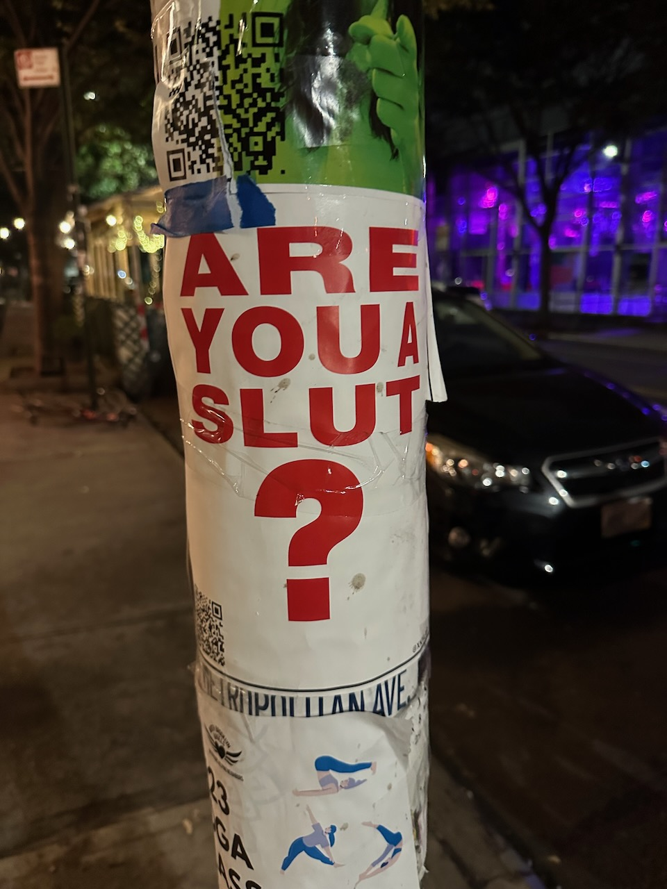

Hello frens,

It sure has been a while, hasn’t it? This issue will be more of a grab bag than usual.

It turns out the Guggenheim looks a lot like the SFPL rotunda in the right light.

I recently visited New York for the first time in five years. It was rewarding, but exhausting — I probably shouldn’t have tried to speed run all four major art museums in two days, not to mention a handful of smaller galleries and exhibits 🙈

Sherry commented that both feel like the center of the world when you’re in them, at least for a certain subset of yuppies. However, San Franciscans constantly worry the city will lose that status, hence work to maintain it, while New Yorkers assume NYC will always be great.

That feels different than mere [second city syndrome](https://www.urbandictionary.com/define.php?term=second%20city%20syndrome) — of which my hometown of Chicago is definitely guilty with respect to New York — but it may explain the ambivalent feelings non-native San Franciscans have towards their city.

Speaking of travel: a thought occurred while waiting in the TSA Precheck line[^precheck]. *Security lines are institutional scar tissue.* They are a physical embodiment of national trauma, an inconvenience maintained long after the state of the world changed.

After yet another fruitless argument about the precise boundary of Gen Z and Millennials, I realized generations are another example of a [folk mental model](https://rwblickhan.org/newsletters/accessible-understandable-answers-in-a-broad-domain-of-interest/#folk-mental-models). “Generations” are [not really a useful concept in the social sciences](https://www.newyorker.com/magazine/2021/10/18/its-time-to-stop-talking-about-generations) and don’t even have a clear definition — Wikipedia says Gen Z is “most frequently defined as people born between 1997 to 2012”, for no clear reason! — yet we love to argue about them. Indeed, much like astrology, we often assign personality traits based on generation — Baby Boomers are lackadaisical and carefree, Millennials don’t like to work, and so on — even though these often overlap or are outright contradictory.

That may explain my frustration when I talk to people that take the existence of generations for granted — it’s like talking to an astrologer when you think the planets are just rocks in the sky. Still, I find it fascinating just how many folk mental models are quietly lurking beneath the surface.

Recently I assigned a [hyperkey](https://rachsmith.com/hyperkey/) via the eponymous [Hyperkey app](https://hyperkey.app). The idea is to map a lesser-used key — I chose the right ⌘ (Command) key — to all four modifier keys at once — Shift, ^ (Control), ⌘ (Command), and ⌥ (Option) — and use that as a new modifier key for keyboard shortcuts that can’t conflict with any existing keyboard shortcuts.

The nice part is that this has native support in [Raycast](https://www.raycast.com) — you can even configure it to show a special icon! — so I can use the new hyperkey as a shortcut to open apps directly. In particular, I’ve set up a rough system of mnemonics for my most-used apps — hyper-T opens Things, hyper-C opens the console (well, iTerm2), hyper-O opens Obsidian, and so on. Conveniently, you can use the same Raycast shortcut to *hide* the app as well, which keeps my desktop windows nice and tidy.‌

This may be a micro-optimization, but then again, [speed matters](https://rwblickhan.org/misc/pattern-language/#speed-matters).

Well... are you?

A few months back, I made [my own online version](https://askhole.rwblickhan.org) of Aella’s (dearly departed) Askhole card game. I rescued the original (extremely unhinged) questions from Askhole and added a set of my own. I’ve continually added questions as I think of them — the latest is “Should we domesticate raccoons? Why or why not?”, which sums up the level of hinged-ness — so please check it out 🙇‍♀️

[^precheck]: Highly recommended, not because it’s particularly faster — at most airports it’ll save 5-10 minutes tops — but because it’s incomparably less stressful to avoid taking anything out of your bag.