Following on from [last week](https://rwblickhan.org/newsletters/nevertheless-i-read-obsessively/), here’s some of my favorite films, shows, and games from the last year.

## Film

### Speed Racer

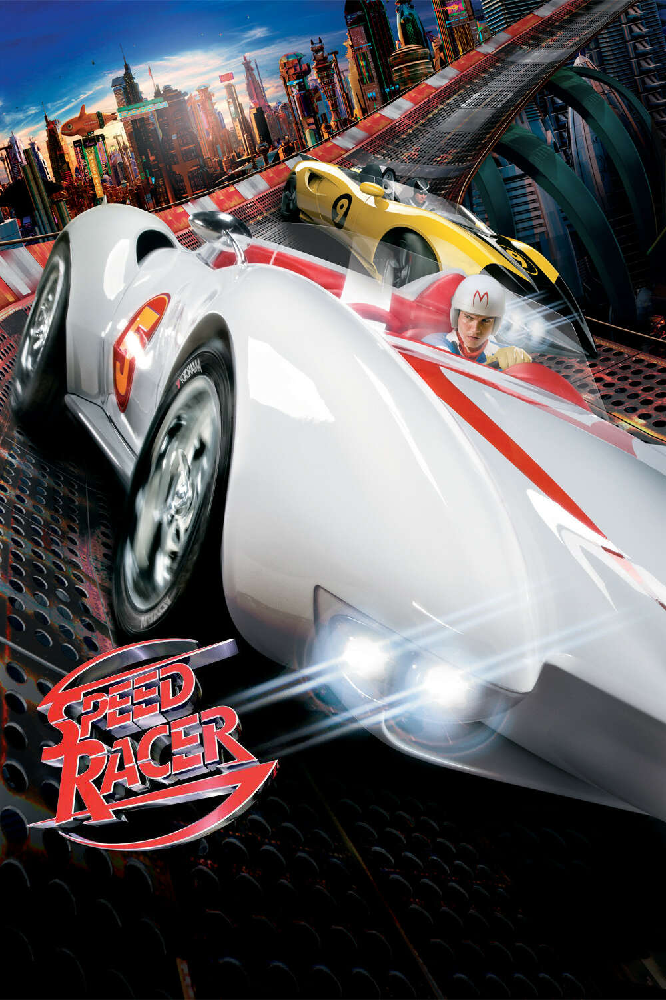

[*Speed Racer*](https://letterboxd.com/film/speed-racer/) was, *by far*, my favorite film of the year. I loved it so much that I wrote a thousand-word essay about it on Letterboxd. So, to save myself some effort, I’m just going to reprint it with some light edits:

I’m a proud member of the Roxie because it’s a theater that looks around at *everything going on* and says: fuck it, we need to watch *Speed Racer*.

If you’re on letterboxd dot com you probably already know that *Speed Racer* is a forgotten cult classic that uses formalism to full effect. However, I’m here to say:

*Speed Racer* is an almost-flawless masterpiece and I suspect I’ll think about it at least once a week for the rest of my life.

Yes, *Speed Racer*, the film with a [40-something on Rotten Tomatoes](https://www.rottentomatoes.com/m/speed_racer). Contemporary critics were too harsh, and I think that’s because of context. In 2008 *Speed Racer* was “the new film from the creators of *The Matrix*”; in 2025 it’s more like “the forgotten film from the makers of earnest, genuine, sometimes goofy stuff like *Jupiter Rising* and *Sense8* who oh yeah directed *The Matrix* twenty-five years ago”.

And in that context *Speed Racer* not only makes a lot of sense, but is probably their greatest masterpiece, because it is the most earnest, most genuine, and yes probably goofiest film of all time.

You absolutely have to meet this film where it’s coming from. If you go into it with even a shred of cynicism, you will have a bad time. I mean, this is literally a film where ninjas attack, and then one character steps forward and says “oh my god, were those *ninjas*?” with complete sincerity. If you expect it to be silly and dumb it will be silly and dumb. But accepting it in all its goofy sincerity is exactly the point.

Probably a whole essay could be written about how the red pill from *The Matrix* was uh *misappropriated*, let’s say. Because in the context of the whole trilogy, the point of the red pill is not “wake up to the actual power structures governing society”, or not just that (and certainly not “wake up to how men are *actually* the oppressed ones”). The point of the red pill is to go have a big sweaty rave in a cave — to be open to genuine human connection with real, actual humans in the real world. The rave-cave scene in the final film doesn’t quite work, because it’s incredibly goofy and sincere in a trilogy otherwise about wearing cool black trench coats and doing kung fu to fight robots. But that scene is, to me, what the Wachowskis have been on about all along. *It’s all about genuine human connection, man.*

And *Speed Racer* takes that and just absolutely runs with it. This is a film that basically argues that the world could be a much better if we just had more dads willing to apologize to their sons, and moms willing to say how proud they are of their special boy, and boyfriends who can literally do something that *nobody has ever done before* but still find time to swoop in for the big picture perfect kiss to prove they love their girlfriend.

Which sounds pretty silly when you write it out, but the magic of this film is that it actually just works. When Speed Racer finally learns to commune with the spirit of his car and jump his car out of a stall, people in the audience literally *cheered*. Something about the formalism, and the postmodern flashback-within-a-flashback exposition, and the absolutely wild energy of the race scenes make the emotions hit that much harder.

Now, Speed Racer *appears* to be a very straightforward, surface level film. Genuine human connection, good. Not being an evil billionaire, good. But that’s just not realistic, right? This is all just one big cartoon with simple morals. Speed Racer go fast, defeat evil billionaire. No relevance to real life.

However, recall: this film was preceded by the Wachowski’s adaptation of *V for Vendetta*, which diverges from the book to tell the story of a fascist government throwing LGBT people into death camps. (What a wild and crazy idea from the year 2005…) The Wachowskis are possibly the most culturally influential trans people to exist currently. They are inherently political actors.

And that’s where I think *Speed Racer* is actually much more subtle. *Speed Racer* is really about making art in a hostile environment. What’s even the point, after all? When Speed Racer turns down the deal with the devil (which is to say, a lucrative sponsorship contract from a man who is basically a combo of every tech billionaire currently in existence), he has the book thrown at him. He has to fight his way back up from the bottom, and face betrayal and hardship the whole way. What’s even the point? He seriously considers giving up.

But then he gets this whole lecture about how he doesn’t always have to drive to try to change racing; sometimes he can just race because he’s driven. (There’s, uh, a lot of very self-serious talk about driving and racing in this movie. You’re supposed to mentally substitute “filmmaking” or “writing” or your favorite art form.) Speed Racer gonna race, because that’s what he was *born* to do.

But, come on. Good for Speed Racer, but, as we eventually learn, *every Grand Prix since ’43 was fixed*. (If you care about the spoiler there, you uh might be missing the point of this movie.) Speed can race, but he isn’t gonna win.

So what’s the point of making art when the system is rigged?

Because, goddamnit, *Speed Racer* was your favorite cartoon growing up, and everything you have ever done, all the voice and influence you have in this life, is indirectly inspired by it, and you want to make something that someday is gonna inspire the next *Speed Racer*.

Speed Racer races because you *can* face the world genuinely. You *can* have real human connection. You *can* make great art about being genuine and having real human connection. And for the world we’re heading into, we *need* all of that. We need people to actually care about each other and treat each other well and believe that a better world is possible.

We need to believe that, no matter how stacked the deck is, no matter how rigged the system is, no matter how fixed the race is… sometimes, if you let yourself believe that the underdog can win… then maybe, just maybe, they actually will.

God damn. I hope someday to make something a tenth as marvelous as this film. I literally teared up and in the spirit of this film I am not afraid to admit it.

P.S. I love that I’ve recently seen two separate films about the relationship between art and finance where a key plot point is John Goodman wrestling somebody. Absolutely splendid. (The other is [*Barton Fink*](https://letterboxd.com/film/barton-fink/), which you [may remember from last year’s list](https://rwblickhan.org/newsletters/that-was-the-year-that-was-in-movies/).)

P.P.S. I said almost flawless. I think some of the comic relief is aimed at a younger audience than will really appreciate this film (although, hey, good on the Wachowski sisters for trying to make something for the whole family) and also there’s one reveal towards the end of the film that is, actually, pretty silly. But those are minor complaints!!

### Wake Up Dead Man: A Knives Out Mystery

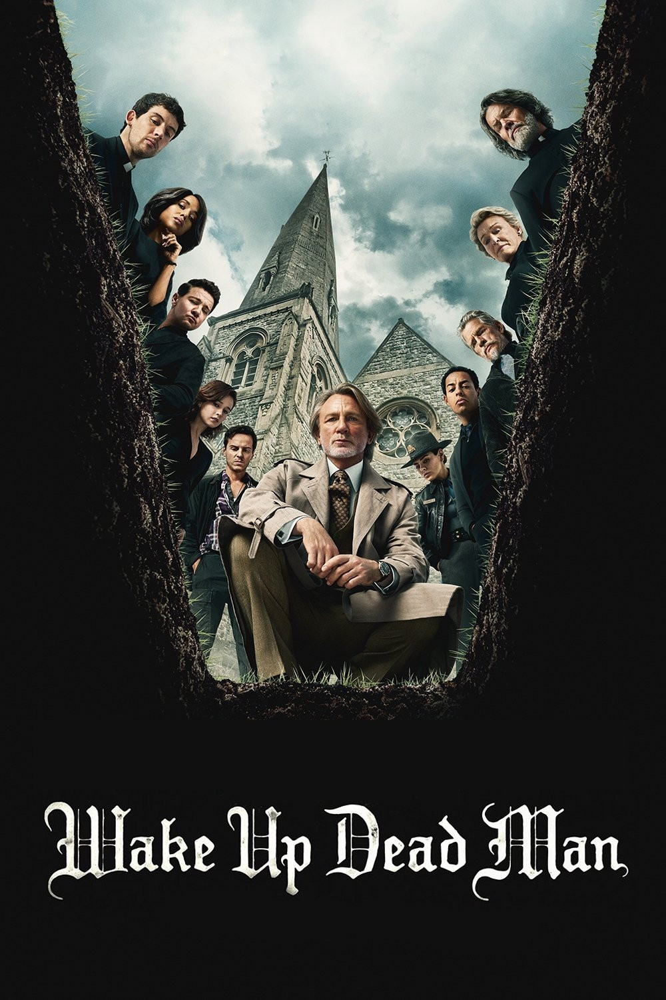

I was not too impressed with the second *Knives Out* ([this critical essay](https://filmcolossus.com/glass-onion-bad-writing) was fairly persuasive), so I’m happy to say [the third outing](https://letterboxd.com/film/wake-up-dead-man/) is probably my second favorite film of the year. Some folks say the mystery portion is not as strong this time, but I don’t agree — rather, I find it an elegant inversion of the typical locked-room mystery format (which it playfully references in detail).

But the *real* movie, and the movie that’s my second favorite of the year, is a tense character drama about a priest dealing with his own anger and his responsibilities as a cleric. I teared up a couple times, most notably during “um, can you pray for me?”, which is one of the cleverest inversions of tone I’ve ever seen.  I have more thoughts, but I’ll likely save them for a critical essay comparing it to *Tokyo Godfathers* (to which it has more than a little relation). In the meantime, have a [long essay](https://reactormag.com/entirely-too-many-thoughts-about-wake-up-dead-man/) exploring the religious symbolism in the film and the deeper themes it explores!

### Twin Peaks: Fire Walk With Me

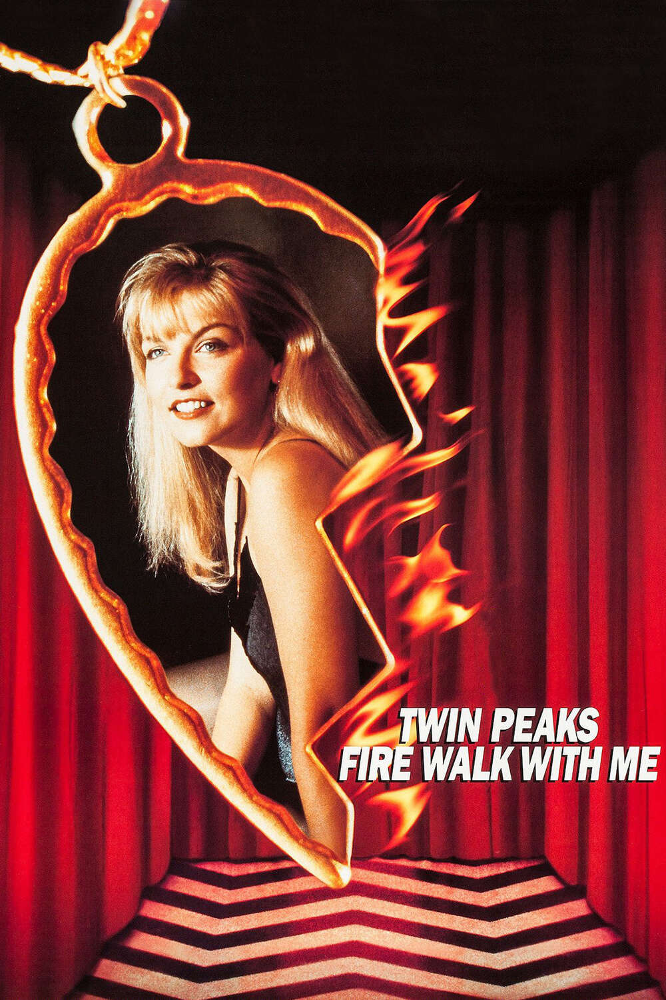

As with many of David Lynch’s films, [*Twin Peaks: Fire Walk With Me*](https://letterboxd.com/film/twin-peaks-fire-walk-with-me/) is kind of a mess. The first third is more-or-less a red herring. A cameo from David Bowie (though surprisingly important to the overall series) just feels strange and out of place. Most of the details of Laura Palmer’s life feel just a little silly, including *Twin Peaks*’ continued insistence that Canadians are sketchy.

But, gosh, that last half, and particularly Sheryl Lee’s performance. I genuinely don’t understand why she’s not considered one of the greats — her soul-searing performance of the line “keep *away* from me” is, maybe, one of the best I’ve ever seen?

More importantly, perhaps, you *have* to watch *Fire Walk With Me* if you’re going to watch *The Return*... on which more below 🙂

### Love & Pop

A charming little film about a group of Japanese teen girls who go on (sometimes traumatic) casual dates with older men for spending money they don’t need while navel-gazing about existentialism. And I loved it!

Can you guess the director? Did you guess Hideaki Anno? Yes, you guessed right!

There appears to be a general consensus that [*Love & Pop*](https://letterboxd.com/film/love-pop/) is just a *touch* exploitative (just a touch, though) and might have benefited from a female director. Still, I don’t think that should ward anyone off from what is a genuinely striking existentialist work that feels oddly under-watched (given the popularity of *Evangelion* and *Shin Godzilla*). It also features some of the wildest assortment of shots ever collected in a film; there’s probably an entire film studies class about cinematography hiding in this film.

### In the Mouth of Madness

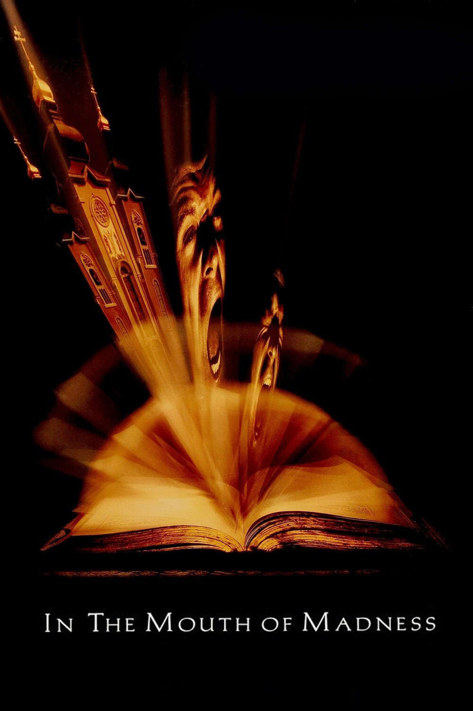

To my shame, I don’t think I’ve seen a John Carpenter film before. Really!

But [*In the Mouth of Madness*](https://letterboxd.com/film/in-the-mouth-of-madness/) was probably the best place to start, telling the tale of an insurance broker assigned to investigate the disappearance of a best-selling author, only to realize he’s a *character* in one of that author’s stories, with an underlying theme of madness — since, after all, how can you tell where *your* madness ends and *society’s* madness begins? It’s a film that feels like it *should* be much more iconic than it is, but (coming in 1994) is presumably a victim of the late-90s/early-2000s shift towards sadistic horror a la *Saw* and *Hostel*, since despite being ostensibly horror, it’s an overwhelmingly joyous and simply *fun* film, up to and including the title theme, Carpenter’s take on Metallica’s classic “Enter Sandman” after he was unable to secure the rights.

### Possession

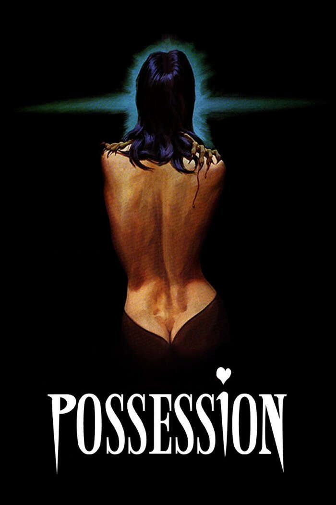

I’m still not sure whether I think cult-classic [*Possession*](https://letterboxd.com/film/possession/) is a misunderstood masterpiece or a complete aesthetic failure. Even watching a [20-minute-long analysis](https://youtube.com/watch?v=X1dtelvi_E8) didn’t fully convince me, though it moved me closer to “misunderstood masterpiece” . Regardless: *Possession* has some of the wildest scenes I’ve ever seen, and I’ll forever associate divorce with the “EXCUSE ME” scene, so perhaps it can only be judged on those grounds.

### KPop Demon Hunters

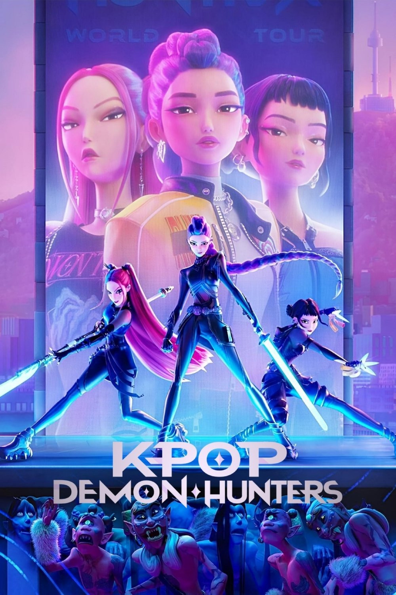

It feels like we’re in the midst of a Sony Pictures Animation renaissance, combining slick animation and sick soundtracks with actually-pretty-good plots, not too dissimilar to the [mid-90s Disney Renaissance](https://en.wikipedia.org/wiki/Disney_Renaissance). And, as part of that, we’re probably going to be living with [*KPop Demon Hunters*](https://letterboxd.com/film/kpop-demon-hunters/) for the next forty years. So, good thing it’s a pretty fun watch, eh?

### Hundreds of Beavers

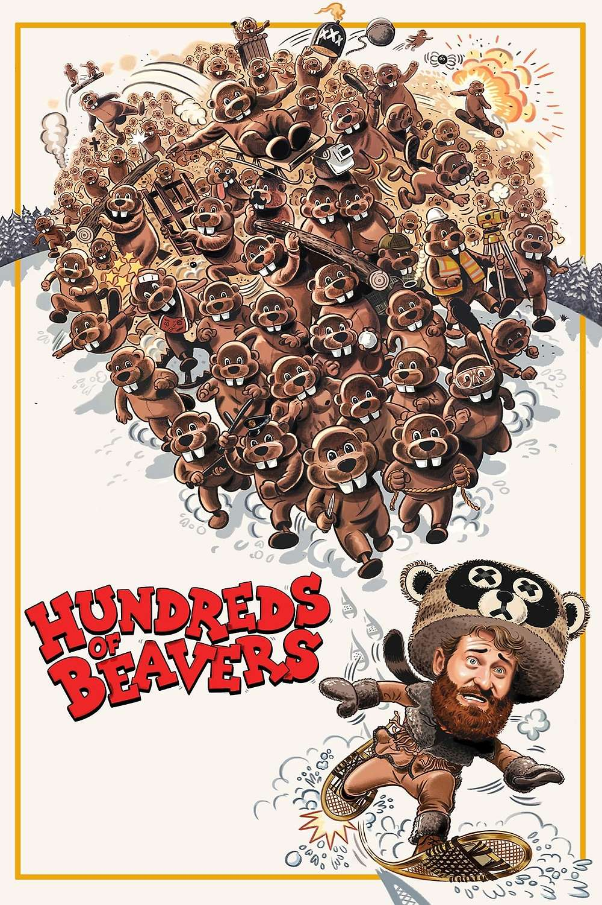

[*Hundreds of Beavers*](https://letterboxd.com/film/hundreds-of-beavers/) is one of the *most* independent of independent films, with a reported budget of just $150,000. (Which still seems like a lot, but hey, a novelist’s only costs are food and housing...) It takes this paucity of budget and runs away with it, ending up with a nearly two-hour long celebration of classic silent-film slapstick and video game culture, *which you can [watch for free on YouTube](https://youtube.com/watch?v=guE0Qd8BRw0) right now*!

Your mileage may vary — I personally found the first twenty or so minutes somewhat boring, not least because I’ve never been a particular fan of Buster Keaton and Charlie Chaplin. But once the main character starts to piece together the rules of the world he finds himself in — somewhat literally modeled off a video-game tutorial — the film picks up steam until barreling to an absurd, but fitting, conclusion. Get together with a dozen friends in a dark theater and you’ll have a good time.

## Television

### Twin Peaks: The Return

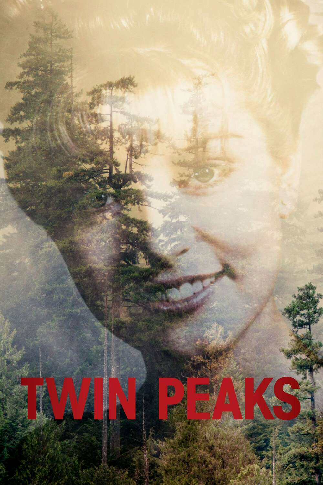

*You can never bring her back.*

In college, I set out to finally watch *Twin Peaks*, only to find my interest flagging in the second season. Only later did I learn that this was common — that the second season is widely considered a let-down compared to the first, a case of two writers going down a path with no clear direction, of a show intended as pastiche-parody-homage of soap operas turning into little more than another soap opera.

This year, with Lynch’s untimely death, I decided to power through. I appreciated the second season more this time, and I loved *Fire Walk With Me* (see above), but the real jewel was [*Twin Peaks: The Return*](https://letterboxd.com/film/twin-peaks-the-return/), the third season put out two decades later.

*Twin Peaks: The Return* is the greatest work of art the live-action televisual medium has produced.

That’s quite hard to justify, and at points in the season I was bored, or annoyed, or felt the show was letting itself down. And, to be clear, there are flaws, major flaws — a general sense of “boomerness” and leering-old-man-ness, subplots that go absolutely nowhere, scenes so full of outrageous sentimentality or strange behavior that they wouldn’t look out of place in *The Room*. But, are those really flaws? It’s hard to say. Maybe art is just a collection of flaws that are combined to reveal the truth.

Lynch and Frost were well aware of the tropes of prestige television, as codified by golden-age HBO — indeed, they created many of those tropes in the first two seasons of *Twin Peaks*, which is arguably the first of the modern golden-age prestige TV shows. But they *simply don’t care*. *Twin Peaks: The Return* does whatever it wants to do — it doesn’t just zig when other shows zag, it invents a whole new vocabulary.

But what prevents it from simply turning into an exercise in artistic abstraction is the beating heart of the show, which is Laura Palmer’s death (which was, incidentally, [based on the real murder of one of Frost’s family friends](https://mubi.com/en/notebook/posts/mubi-podcast-mark-frost-founds-twin-peaks).) What is the show ultimately saying? I think it’s something along the lines of *you can never bring her back* — that, despite literally being a revival of a long-dead TV show, you can’t undo the trauma done by Laura Palmer’s death. Time only goes forward.

But maybe that’s reading too much into it. The critic Matt Zoller Seitz, referencing Lynch’s background as a painter, [described the series](https://www.vulture.com/2017/09/twin-peaks-the-return-showtime-review.html) as a painting in 18 panels, in which the artist only allows you to see one panel at a time. And then, “you might even come away thinking the experience was not worth the time you invested. But for the rest of your life, there would be moments when you’d flash back to the time that that painter invited you into the studio and unveiled a work one square at a time, then stood back while you looked at it.”

And there are many, many moments from this show that will, and have, flashed back to me, moments that barely make sense in context and definitely don’t make sense out of context. The Experiment. A red door in the suburbs. A giant tea kettle that speaks in steam puffs. Penderecki’s *Threnody*. “I’m not here... I’m not here... I’m in the sheriff’s office!” A long explanation of the term “jobsworth”. “Fine, then I’m taking off my jacket!” Every single moment of Naomi Watts as Janey-E. Every single moment of Laura Dern as Diane. The funniest and most bizarre cameo ever. “We are the dreamer that dreams...” The list goes on and on. And isn’t that what surrealist art is all about?

### The Chair Company

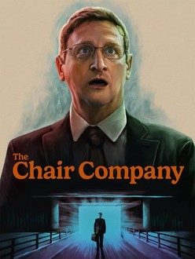

I’ve always bounced off Tim Robinson’s brand of cringe comedy — one friend lists *I Think You Should Leave* as perhaps his favorite show of all time, and he’s tried to make me watch it, but I can barely sit through a single skit, let alone an entire episode.

So, color me surprised (shocked, even) that I adored his latest show, [*The Chair Company*](https://en.wikipedia.org/wiki/The_Chair_Company), which pairs his everybody-behaving-bizarrely-and-uncomfortably-but-acting-like-its-normal comedic style and shaggy-dog-heavy plotting with a tense, conspiratorial thriller. And, somehow, it works? It’s both incredibly propulsive — what’s *really* going on with all these layers of conspiracy surrounding simple office chairs? — and extremely funny — an extended dialogue about “Wendy’s Carvers,” a ham-based premium spin-off of the fast food chain, is probably the most I’ve laughed all year.

More than anything, though, it’s one of the great depictions of mid-life crisis. Although the main character (portrayed, as usual, by Robinson himself) is a very strange duck, there’s very real pathos in watching him cry as he clicks through a slideshow for his daughter’s upcoming wedding, or following as he forms a halting middle-aged-male friendship with the (also very strange) man that assists him in his investigation, or paying attention to the bigger theme of the series, which is his struggle to grasp for meaning and purpose in a life that has provided little for him other than building malls in suburban Indiana. Comparisons to Lynch seem apt — the not-quite-realistic behavior of the characters, the play-it-straight nature of the framing, the genuine pathos mined from the strange scenarios.

Also, Lou Diamond Phillips as the main character’s dickish boss was *choice* casting.

### Gurren Lagann

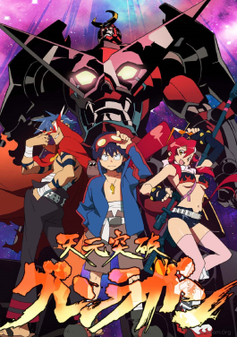

[*Gurren Lagann*](https://en.wikipedia.org/wiki/Gurren_Lagann) (or, as I knew it from the memes of my youth, *Tengen Toppa Gurren Lagann*) is both everything wrong with and everything *right* with anime.

It was made for twelve-year-old boys and it feels like it. There’s fan service left and right. The main character is a moping mess for the first ten episodes. Most of the battles follow the action-figure logic of “combine things and yell a catchphrase”. The plot starts convoluted and only becomes more so. Some of the episodes are pure bottle episodes that are barely worth watching; one is literally just a recap episode. The main theme goes about as deep as “if we stand together, we can do anything,” expressed via catchphrases like, well, “if we stand together, we can do anything.”

But. But but but.

The animation is some of the wildest and most beautiful ever made. Sometimes a battle scene that involves smashing action figures together and yelling a catchphrase *can* get the blood pumping, especially when you actually care about the characters. And you *do* care about the characters, because you see them slowly develop over the course of twenty-odd episodes and twenty-odd years (!). And those catchphrases really *feel* meaningful, as you see the challenges the characters face and repeatedly overcome. By the end of the series, you’re cheering as the main characters are facing down (as the first episode foreshadows) *the entire universe*.

It’s the kind of bonkers experience you can only really have with a medium like anime, and while I wouldn’t go so far as to say it’s essential, it *is* essential if you like anime or, for the matter, if you’re planning to watch *Evangelion* (to which *Gurren Lagann* is a fairly explicit response).

### Andor Season 2

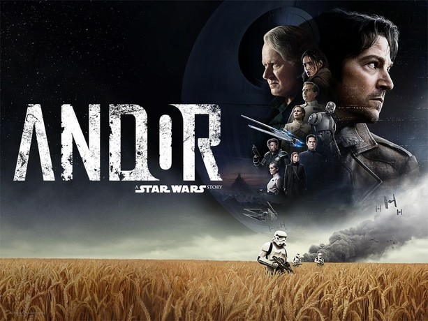

[*Andor* Season 2](https://en.wikipedia.org/wiki/Andor) is [not as good as](https://rwblickhan.org/newsletters/that-was-the-year-that-was-in-movies/#special-awards) *Andor* Season 1. Alas: that was probably too high a bar. Season 2 was unfortunately required to squash four seasons of material into one, resulting in a constant feeling of rush, with half the plot happening off-screen during plot jumps. And the pacing of *Andor* Season 1 is part of what makes it work so well!

But, despite its flaws, *Andor* Season 2 is still a masterpiece and we should be happy Disney allowed it to be made at all. It may not have any moments quite as iconic as “one way out” or “I burn my life to make a sunrise that I know I’ll never see”, but it *does* have Ben Mendelsohn’s hilarious ad-libbed head poke, so there’s that!

### The Rehearsal Season 2

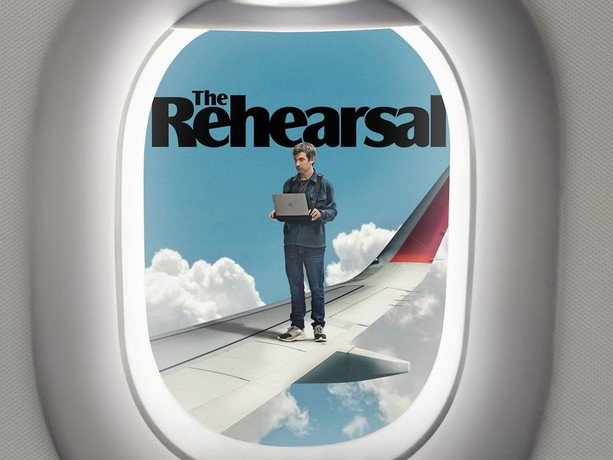

If anybody tells you that performance art is dead, that there is no contemporary replacement for a Marina Abramović or a Yoko Ono, then you should politely tell them to watch both season 1 and season 2 of [*The Rehearsal*](https://en.wikipedia.org/wiki/The_Rehearsal_(TV_series)), Nathan Fielder’s increasingly bizarre mock(?)umentary series, which now includes persuasive evidence of the strangest, lowest-stakes conspiracy theory ever (hint: it involves Evanescence’ “Bring Me To Life”).

## Video Games

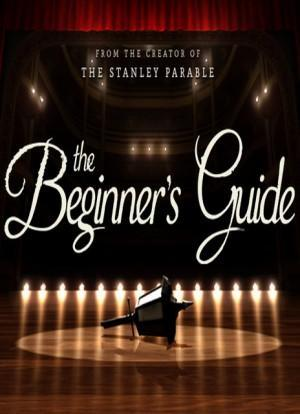

I didn’t play [too many games](https://rwblickhan.org/logs/games-2025/) this year, unfortunately, but one really stuck in my head as a unique artistic experience that could only really be a video game: [Davey Wreden’s *The Beginner’s Guide*](https://store.steampowered.com/app/303210/The_Beginners_Guide/). That said, I talked about it in a [previous newsletter](https://rwblickhan.org/newsletters/strange-shibboleths-for-children/) and don’t have much to add, other than to recommend it once again, particularly if you are interested in games *as an aesthetic experience*.
