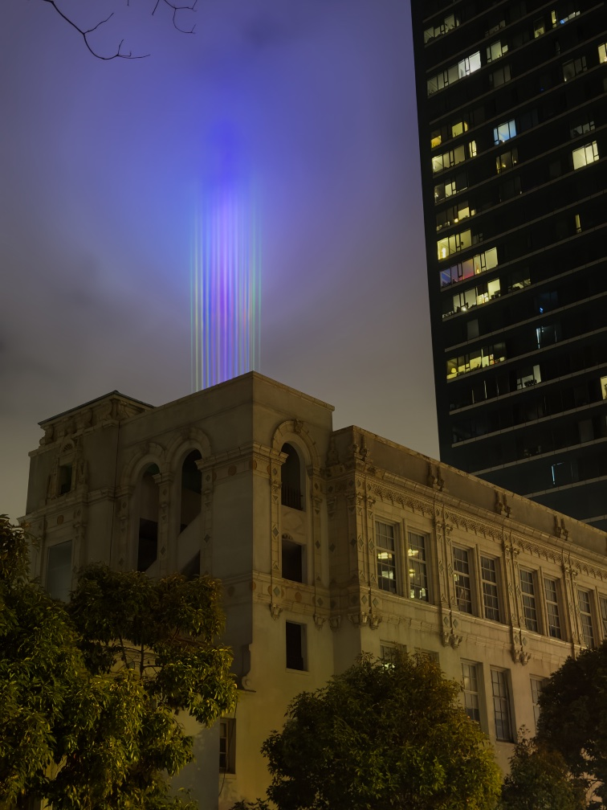

Hello from a _Twin Peaks_ themed writing meetup. Yes, there are donuts and strong black coffee; yes, the host is wearing a 1950s-style diner waitress smock; yes, the _Twin Peaks_ soundtrack is playing on repeat in the background.

---

So an article I keep thinking about is Sara Hendren’s [“catechesis by camera”](https://sarahendren.substack.com/p/catechesis-by-camera), which, like everything Hendren[^hendren] writes, is a must-read.[^mustread] It spring-boards off the controversy surrounding an influencer couple’s public decision to abort a fetus with Down syndrome[^down] to discuss the rather lacking state of public bioethical conversation in 2026 and, in particular, the common “project rubric” applied to children, as if they were a product launch attempting to meet OKRs. Because in an era of optimization and (supposed) self-actualization, as we’re supposed to move up Maslow’s hierarchy of needs, what other criteria are available for the decision to have children?

Which is provocative, right? Because I don’t know if I’d make a different decision, but could I honestly say I was doing it for any reason other than my own convenience? As someone not-unaffected by a genetic condition, could I honestly say I would want someone to make that decision for me?

---

A point that Hendren touches on is the idea of children as a transformative experience.[^exp] You can’t honestly judge the experience of parenthood before you become a parent because you literally become a different person, with different preferences; so in many ways the project rubric _doesn’t even make sense_, because you can’t really judge the pros and cons of having a child from the perspective of a parent until you’ve already done it.

Now, as a current non-parent, I can’t really speak to this, but I think pet ownership offers the same experience in miniature. We’ve had a lot of “negative” experiences with Rooibos — he had pretty severe separation anxiety when first adopted; he had a bad spot of insomnia due to noise in our last apartment; just this week he had half his remaining teeth extracted, at no small cost to our pocketbook. But a while back I was chatting with a friend who was considering getting a pet, and they mentioned the “pros and cons” of pet ownership — of getting woken up in the middle of the night, of vet bills, of finding sitters for trips — and my first thought was: wait, that doesn’t even make sense. Because Rooibos has become so central to my life, in some ways, that I’m not even sure what I would be like without him, let alone mere “pros” and “cons”.

---

One thing [Sherry](https://sherryyuan.me/) and I chatted about recently is that strange empty feeling that often occurs when wrapping up a project, be that a novel manuscript or a painted canvas or just a successful party. I proposed the rather cheeky name “post-artum depression.” That’s not intended to make light of the seriousness of postpartum depression, but there is a parallel between the two, I think. Of course, luckily, with post-artum depression, you can just move on to the next project 😉

[^hendren]: [_What Can a Body Do?_](https://app.thestorygraph.com/books/af53ce67-3aed-41d4-9c12-44527669b308) is, as [I’ve noted before](https://rwblickhan.org/newsletters/logs-thrown-overboard-to-track-speed/), one of the very few nonfiction books I found valuable to read twice.

[^mustread]: And if you aren’t convinced, just check out this line: “Becoming a parent is like swallowing a solar system: a reordered gravitational pull, a new series of orbits, with magnetism and polarities that sway all of life’s conditions. It is many things, but it is not a project.” Wow!

[^down]: Notably, Hendren herself has a child with Down syndrome.

[^exp]: I was, according to my notes, introduced to this concept by [this article on the cross-pollination of philosophy and science fiction](https://newrepublic.com/article/161457/literature-philosophy-awkward-match), of all things, although I’m _fairly_ certain I’ve also read about it in the context of parenthood specifically.
