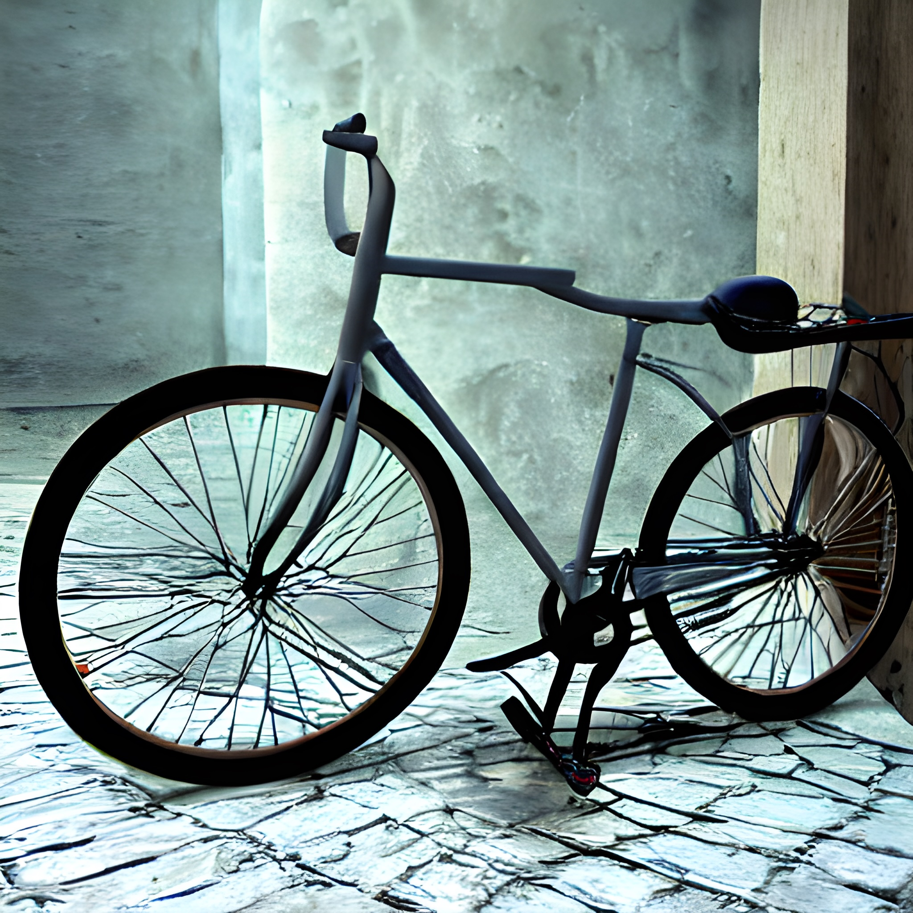

Let’s get right in to the meaty content!

“photo of a shrine to guanyin at dawn”, Stable Diffusion[^1]

## Table of Contents

## In Which I Wax Nostalgic for My Lost Youth

Hello from the other side of a quarter-life crisis!

So I recently turned 27 and it feels rather differently than I thought it might. For the past year I’ve been aggressively joking that I’m “old” now, since I’m in my late twenties and have not published even a single best-selling novel, let alone four of them (*cough* I’m not jealous of my age-mate[^2] R.F. Kuang *at all*). I joked so aggressively that my friend started increasing my age every time I did it; as a result I’m roughly 39 now.

On a more serious note, I was rather skeptical of the whole idea of a “quarter life crisis”, but now I do think I spent the last ~2 years in the depths of one. I’ve been rather obsessed with the idea that I *had* to finish my great American novel, and *had* to take on more responsibility at work, and *had* to become a local community pillar, and if I didn’t I wasn’t “sucking the marrow out of life”, and I would end up settling down and having kids with nothing to show for my youth.

But with this twenty-seventh birthday — which is, after all, still young, still so very young — two things shifted.

Firstly, I read [this essay](https://thedreammachine.substack.com/p/a-new-new-year) by Jackie Luo, and in particular these lines:

> i'm not twenty or twenty-one or twenty-three anymore. [...] i find that i no longer believe that nothing is irrevocable and everything is within reach, that none of the mistakes count. when you’re (almost) twenty-eight, you’ve begun to accumulate enough choices, successes and missteps, that you can start to see the chain reaction, dots forming a trajectory of your life.
>
> sometimes, looking back at an accounting of it all, i’m disappointed that it doesn’t add up to quite as much as i thought it would by now. it’s not a clean narrative.’

Which is rather pessimistic. Ever the optimist, I’ve taken those thoughts in a different direction. The lack of a clean narrative is, in fact, a *life*. The accumulation of choices is, in fact, *focus*.

I’m now well into my career and well into my life, and at this point I have to accept that some career paths are out of reach, and some hobbies will never been taken up, and some interests will wither on the vine, never inquired into. But, on the other hand, I’ve now lived enough that I can roughly define what I’m interested in and *focus*.

To wit: I recently realized that every story idea I’ve ever had was “really” about neurodiversity — about people either accepting or struggling against the way they think. And, while I don’t want to prematurely limit myself, I also find that exciting. That’s not exactly a clean narrative, but it is a focus. It is, partially, what my life is “about”. It is, perhaps, providing a sense of purpose that was lacking; I can define a small set of topics that dominate my intellectual life (about which more below) and pursue those, perhaps for the rest of my life.

Secondly, I realized that [humans need play](https://allenpike.com/2023/humans-need-play). I spent most of the last two years stagnating at work without noticing it. I spent most of my “productive” time outside work on a forced march to Novelistland. I spent most of my non-productive time being an extravert and planning five social events a week. I told myself that I had more than enough “downtime” walking the dog.

Having finally switched teams and, in fact, platforms — that’s right, I’m no longer a mobile engineer! — I realized that I was, well, *bored* at work (not to mention burnt out). I’ve realized I can have fun with writing, and not feel guilty that I’m writing a newsletter instead of my best-selling novel. I realized I can take a day or two off and nobody will miss me (... I’m still an extravert though 😉).

Curiously, contra hustle culture, these insights have made me *more* productive. I can take a night off to myself and write a short story and feel invigorated, not exhausted. I can spend a few hours messing around with Rust, for a “useless” project, and not feel guilty that I’ve “wasted” productive time that could be going towards my novel. So I’ve ended up writing just as much or more than I did when I was forcing myself to push for a novel, just by writing and working naturally, albeit in a more diffuse manner.

Because, really, I don’t *have* to publish a novel. I was being pushed by the feeling that I was “behind” and that if I didn’t chunk my year into novel-writing-seasons, then I would never finish. But at the end of the day, a brief guide to tea can be just as satisfying — and, anyway, I love writing, and it’s not like I *won’t* eventually finish some of the things I’ve been working on 😉

That said, I wouldn’t call the last two years a waste. For one thing, I learned what it feels like when writing is going “well” — I wrote the entire 20,000 word draft for *Dreams of an Alien God* in something like two weeks, with barely a qualm about whether it was “worth” expanding (it definitely is, and I’ll get back on that... shortly). More importantly, though, I proved to myself that I could *do it* — I wrote a complete 80,000 word novel and then wrote another 25,000 words of revision on the complete part one, plus a complete 20,000 word novella. [Like Robin Sloan said](https://www.robinsloan.com/newsletters/sunshine-skyway/):

> When you start and finish, by contrast — and it can be a project of any scope: a 24-hour comic, a one-page short story, truly anything — it is powerful fuel that goes straight back into the tank. When a project is finished, it exits the realm of “this is gonna be great” and becomes something you (and perhaps others) can actually evaluate. Even if that evaluation is disastrous, it is also, I will insist, thrilling and productive. It’s the pump of a piston, preparing the engine for the next one.

“writing compiler, photorealistic, abstract, words going into a machine in outer space”, Stable DIffusion[^3]

## Writing Compiler

Boy, that ChatGPT sure got a lot of attention lately, didn’t it? I’m sure you’d love to hear *even more* about it, right? Right??

More seriously, I find a lot of discussion about ChatGPT and its LLM (large language model) friends pretty boring. A lot of it boils down to:

- “Boy OpenAI sure could make a lot of money off this! Google better be scared!”

- “Oh no we’re about to be flooded with bullshit that would get a solid C- in the typical American high school.”

- “I sure hope our AI overlords are nice to us.”

Like I said: boring!

I’m a lot more interested in thinking of LLMs as one more in a long line of cultural tools that let us work with arguably the most important human invention of all time — text!

I’ve previously linked the talk that really solidified this way of thinking for me but I’m going to link it again: [“Large Language Models as a Cultural Technology”](https://www.youtube.com/watch?v=k7rPtFLH6yw), where Dr Alison Gopnik compares LLMs to ... libraries! (My favorite underrated cultural technology.) LLMs will probably reshape society just like printing or libraries or Wikipedia, but who knows how?

So if we get past CNET using GPT-3 to spam low-quality SEO-optimized articles, what genuinely novel use cases could we find for GPT-3?

One idea that really struck me from [this otherwise fairly pessimistic article](https://countercraft.substack.com/p/the-only-sure-thing-with-ai-is-writing?isFreemail=true) was GPT-as-“writing compiler”. Programmers expect to be able to change all usages of a variable in scope with one click, but human language is just a bit too syntactically complicated to be tractable. Or, rather, it *was*. To wit:

> For example, swapping a passage from first person POV to third person POV is—at least on the initial pass—a bunch of robotic work that a future AI program could do in an instant. As an author, I’d kill for that.

Maggie Appleton had [a similar idea](https://maggieappleton.com/reverse-outline). She likes to write a long, rambling draft first, then “reverse outline” and extract the structure — a task that feels perfectly suited to the summarization-happy ChatGPT.

Really, what I’m saying here is that my best guess is that, in 5-10 years, LLMs will be just another tool — albeit an extremely powerful one — that we can apply to our writing problems, like we apply build toolchains to our programming problems. Or, as the late, great Douglas Adams put it:

> I've come up with a set of rules that describe our reactions to technologies: 1. Anything that is in the world when you’re born is normal and ordinary and is just a natural part of the way the world works. 2. Anything that's invented between when you’re fifteen and thirty-five is new and exciting and revolutionary and you can probably get a career in it. 3. Anything invented after you're thirty-five is against the natural order of things.

On a related note: note that I have an M2 Mac, I used Sindre Sorhus’ [Amazing AI](https://sindresorhus.com/amazing-ai), which is backed by Stable Diffusion, to generate the images for this post. (Is that ethical? Is that *legal*? Erm…) On the one hand, it’s amazing to me that Stable Diffusion has a concept of “Guanyin” hanging out in its head; on the other hand, uh, [so does Wikipedia](https://en.wikipedia.org/wiki/Guanyin)?

“bicycle for the mind, photorealistic, unreal 3d, tools for thought”, Stable Diffusion[^4]

## Bicycle ... for the Mind

So [here’s an interesting site](https://szymonkaliski.com/notes/bicycle-for-the-mind/) I stumbled on while searching for a historical reference for “bicycle for the mind”. (Search can be... good, sometimes? Would ChatGPT have surfaced this? Really makes you think 🤔). I link this here for exactly one sentence:

> computers are currently made to be "easy to start using", bicycles are not - they require effortful learning (and mastering), but it pays off in the long term

That’s such an interesting concept! It’s easy to forget as adults but learning to ride a bike is... kind of... hard? What would that look like in the software world? My immediate thought is spreadsheets, which “anyone can use” but quickly become W I L D, or “tools for thought” like Notion or Obsidian, which can be overwhelming to start with but quickly mold themselves to the user’s preferences.

## In Other Boring News

- I rewrote [my landing page](https://rwblickhan.org/)! In particular, I decided to summarize the topics I’m most interested in right now, that I think I want to devote the next ~10 years (and possibly whole life?) to — the things I want to *focus* on. The fun part was thinking up three “questions” for each to give the vibe of the category instead of strictly defining them. Already I’ve found this a clarifying exercise — “oh yes, I really *do* write about that a lot” — and a generative one — “oh, these are all interlinked in ways I hadn’t noticed before”. I would highly recommend it! (In particular, I settled on the categories of “cultural evolution”, “neurodiversity”, “tools for thought”, “community building”, and “storytelling”.)

- Related to the above cleanup, I also wrote up a [tools for thought reading list](https://rwblickhan.org/misc/tools-for-thought-reading-recs/). Right now it’s basically just a bunch of blogs I happen to like, but I’d like to add more resources as I encounter them. Perhaps I’ll write a reading list for each category? 🤔

- I recently built an Obsidian plugin called [tag-search](https://github.com/rwblickhan/obsidian-tag-search). In the spirit of [“working with the garage door up”](https://notes.andymatuschak.org/z21cgR9K3UcQ5a7yPsj2RUim3oM2TzdBByZu), I also wrote [a post about building it](https://rwblickhan.org/technical/obsidian-plugin/)!

- Some friends and I recently attended the SF Chronicle’s Data Trivia Night at Manny’s and... [we won](https://www.sfchronicle.com/about/newsroomnews/article/data-trivia-night-17747401.php)? Although note the sassiness: “Despite coming out on top, the winning team only scored 64% of possible points.” 😊

## Hey I Thought You Wrote Fiction Sometimes

Wow, Mr Subheadline, sure are sassy today, aren’t you?

Yes, I’m still trying to write fiction. I’d like to revisit *Dreams of an Alien God* later this year and expand it to real novella length, and I’m working on two short stories right now, and I’m plotting out a comic (which, hey, if you’re reading this and your lifelong dream is to draw a comic someone else wrote... hit me up 👀).

## Fine But You Haven’t Published Any Of It Yet Have You

lalala I can’t hear you go back up and reread the section titled “In Which I Wax Nostalgic for My Lost Youth”

[^1]: Okay, we get one Guanyin for the road.

[^2]: Is age-mate even a term? It feels like it must be. 🤔

[^3]: Look, I don’t know what’s going on in this one either.

[^4]: Look, I’m not a great prompt engineer yet, okay?