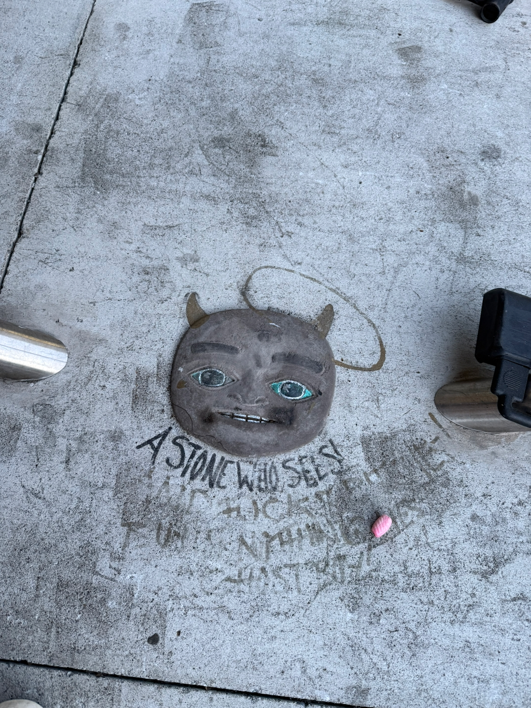

- A spooky stone on the Embarcadero is _very_ San Francisco

Hello all, I hope you had a lovely week. I’ve been busy getting [lots of productive work done](https://rwblickhan.org/newsletters/i-will-no-doubt-get-lots-of-productive-work-done/), like for instance taxes and buying real hanging file folders. I know I’m an adult now because I practically started salivating at the Container Store 🙃

_Actually_, I have been writing 1k words a day, and I’m now past 31k words on the latest draft, so maybe something like 2/5ths of the way there? But then, of course, yet another draft begins...

---

I’ve also been reading a lot, because of _course_ I have. Partly that’s because I set a [yearly goal](https://rwblickhan.org/newsletters/yearly-goals/) to read 12 specific books, which include:

1. [_From Hell_](https://en.wikipedia.org/wiki/From_Hell)
2. [_Middlemarch_](https://en.wikipedia.org/wiki/Middlemarch)
3. [_Infinite Jest_](https://en.wikipedia.org/wiki/Infinite_Jest) (for its 30th anniversary, natch)
4. [_Jonathan Strange and Mr Norrell_](https://en.wikipedia.org/wiki/Jonathan_Strange_%26_Mr_Norrell)
5. [_Little Women_](https://en.wikipedia.org/wiki/Little_Women)
6. [_Jane Eyre_](https://en.wikipedia.org/wiki/Jane_Eyre) and [_Wide Sargasso Sea_](https://en.wikipedia.org/wiki/Wide_Sargasso_Sea)
7. The [_Gormenghast_](<https://en.wikipedia.org/wiki/Gormenghast_(series)>) trilogy
8. P.G. Wodehouse’s [Jeeves stories](https://standardebooks.org/ebooks/p-g-wodehouse/jeeves-stories)
9. A novel by [Nabokov](https://en.wikipedia.org/wiki/Vladimir_Nabokov) (I picked [_Pale Fire_](https://en.wikipedia.org/wiki/Pale_Fire))
10. A novel by [Pynchon](https://en.wikipedia.org/wiki/Thomas_Pynchon) (I picked [_The Crying of Lot 49_](https://en.wikipedia.org/wiki/The_Crying_of_Lot_49))
11. A novel by [Murakami](https://en.wikipedia.org/wiki/Haruki_Murakami) (no idea what I’ll pick, hit me up if you have opinions)
12. A novel by [Toni Morrison](https://en.wikipedia.org/wiki/Toni_Morrison) (no idea what I’ll pick, hit me up if you have opinions)[^note1][^note2]

This list may be... ambitious... given that _Middlemarch_, _Infinite Jest_, and _Jonathan Strange and Mr Norrell_ are a thousand pages a piece. (There’s a reason I picked Pynchon’s shortest book by a country mile...) Also, I keep getting distracted with mere 500-page novels like _Your Name Here_ (see below). But so far I’ve kept up, so we’ll see where I am in a couple months!

Anyway, I figured I’d talk about a few things I’ve read recently, since I haven’t done that in a bit. Don’t expect any kind of serious literary analysis here — this is just a brief newsletter; but maybe in the future?

---

First up: _Pale Fire_.

I have never read _Lolita_! Quelle surprise! It was never assigned in school and I just never, quite, got around to it. (I have, however, listened to Jamie Loftus’ fantastic [_Lolita Podcast_](https://open.spotify.com/show/4dvc06zTAaAylzdTrsgKzp) about how the book has been (mis)interpreted over the years.) But despite _Lolita_’s greater stature in ~ the culture ~, _Pale Fire_ is widely considered Nabokov’s masterpiece.

“Pale Fire” (in the context of the novel) is a short-ish, not-particularly-good poem in which the poet John Shade muses about his life and his daughter’s premature death. The bulk of the novel is the extensive footnotes, in which the poet’s friend and coworker Professor Kinbote explains the allusions but mostly just rambles about the king of his home country of Zembla. Eventually, of course, you start to think... _hmm_, maybe their relationship was not exactly what I thought.

This book! Is very good! But I also think it requires a certain level of familiarity with academic commentarial conventions which perhaps explains why I was over the moon for this novel and my book club was not so much. It’s a book that assumes you’ve read at least one extensively footnoted OUP World’s Classics edition or a literary companion (like, say, [_A Companion to the Crying of Lot 49_](https://app.thestorygraph.com/books/2bf0a27b-bae3-4dc9-9d5e-a5e484000cc3)...).

Some (spoilerific) things I loved about _Pale Fire_:

- The title! It’s never exactly spelled out, but it’s taken from Shakespeare’s _Timon of Athens_, and in context is about the moon’s “pale fire” being a theft of the sun’s light. Ironically, Kinbote complains about poets being too lazy to come up with a good title for their work, while _himself_ attempting to co-opt the poem for his own purposes!
- “Pale Fire” the poem is, uh, not that good. But in the narrative of the novel that’s probably because Shade dies literally the day after he “finishes” it. Throughout the commentary, we’re introduced to snippets of alternative readings and we’re left wondering — would the poet have edited “Pale Fire” further? How far along _was_ he in his work, really? But, as Kinbote mentions in the introduction, the commentators always get the last word 😉
- The relationship between Shade and Kinbote (and the “interference” of Shade’s wife) is uncomfortably toxic in just the right way. We all know that one person who has that one strange friend that they’re not, _quite_, able to cut off, and _Pale Fire_ is probably the best portrayal of that relationship I’ve read. (The funniest scene in the novel is when Kinbote doesn’t receive an invite to Shade’s birthday, and decides to get back at him by... gifting him, via his wife, a copy of the volume of Proust where one character is snubbed from a party. This involves a _full page_ of exposition to explain, and Shade’s wife is, understandably, just confused.)
- The novel has all these tiny blink-and-you-miss-it clues and puzzles that fit together neatly, in a really masterful way. _Obviously_ Kinbote is the former king of Zembla; that’s basically text. But what’s more subtle is the _real_ identity of Kinbote. There’s an index full of in-jokes, which most readers probably skip over. If you take the time to read it, you’ll find an otherwise-unexplained entry for a Professor Botkin, likely the mad Russian professor occasionally referenced in the text, as the butt of jokes at Shade’s college. But, of course, Botkin is a near-anagram of Kinbote — an [interpretation all-but-confirmed by Nabokov](https://en.wikipedia.org/wiki/Pale_Fire#Interpretations).

---

Next up: _Rusty Brown_.

This was intended as a “popcorn read” by my book club, after _Pale Fire_. Obviously nobody realized that the LARB review of the book was titled [“Does Chris Ware Still Hate Fun?”](https://lareviewofbooks.org/article/does-chris-ware-still-hate-fun/).

Yep! Chris Ware still hates fun! A lesson I should have learned when [I read _Quimby Mouse_](https://rwblickhan.org/newsletters/on-self-deprecation/).

_Rusty Brown_ is (almost) unrelentingly bleak. (Almost) all of the stories are grim, depressing, misanthropic. Every time you feel a character might be redeemed, they are almost immediately unredeemed. All of the male characters are outright creeps, and the female characters generally aren’t much better.

The exception is the last story, where... well, let’s just say it might not have a happy ending, and it’s followed by an “intermission” title card, for a second volume that might take another 18 years to write — but it is _cathartic_.

Is _Rusty Brown_ worth reading? I’m not sure (and, for the record, [neither is Alan Jacobs](https://blog.ayjay.org/a-few-thoughts-on-chris-ware/)). It’s _so_ misanthropic that it feels unrealistic, in almost the same way _A Little Life_ does — but the over-the-top, almost-comedic bleakness of _A Little Life_ is rather the point of that novel. I get the sense Chris Ware _actually believes_ that people are the worst.

But... it also has some of the _best_ graphic design of any graphic novel I’ve ever read. The cradle-to-grave story of Jordan Lint III — starting with a disorganized jumble of geometric shapes as he resolves into consciousness — is just astonishing, even if it’s almost physically repulsive to read. I’m not sure I can _recommend_ it, exactly, but if you’re a fan of the medium I do think you have to grapple with it.

---

You are reading a review of _Your Name Here_, the new novel by Helen DeWitt and Ilya Gridneff. Wait, weren’t you just reading a newsletter? What’s even going on? Has this newsletter lost the plot?

No, I just read the new novel by Helen DeWitt and Ilya Gridneff, so if you detect some DeWitticisms in this newsletter, you are definitely correct.

This is one of those novels that _has a lot going on_, as they say (whoever “they” are). There are _at least_ five concurrent plotlines going on which are all completely unexplained and have to be pieced together from context:

1. A long chain of emails between Helen DeWitt and Ilya Gridneff as they attempt to write _Your Name Here_ together (with many references to Fellini’s _8 1/2_ and Kaufman’s _Adaptation_)
2. A long chain of emails between reclusive author Rachel Zozanian and a globetrotting tabloid journalist called by various names but mostly Alyosha Pechorin, as they attempt to write a novel together
3. Various first-person sections from Zozanian and Pechorin as they attempt to deal with their money troubles / publishing industry troubles / disappointment in the other author / etc
4. Excerpts from _Lotteryland_, Zozanian’s award-winning first novel (in reality, an unpublished DeWitt novel), set in a Gilliam-esque alternate Britain in which everything is assigned by lottery
5. Excerpts from _Hustlers_, Zozanian’s semi-autobiographical second novel, about her time working as a prostitute to pay her way through Oxford
6. A series of second-person interludes (freely referencing Calvino’s _If on a winter’s night a traveler_), primarily about a director and various actors attempting to make a film version of _Lotteryland_, while reading an in-universe version of _Your Name Here_ which is an airport bookstore bestseller written by an in-universe Helen DeWitt to popularize learning the Arabic language in the wake of the War on Terror

The novel itself was mostly written around 2006 (hence the references to the War on Terror) and floated around as a pay-what-you-want PDF on DeWitt’s website for two decades before a publisher finally picked it up. It more-or-less assumes you’re familiar with who DeWitt is and the axe she has to grind with the publishing industry; I can’t imagine anyone getting much out of this novel without _at least_ first reading _The Last Samurai_ and a profile or two of DeWitt, given a major theme of the novel is to analyze the distinction between writer and character, between person and persona (Zozanian isn’t DeWitt, but she’s not _not_ DeWitt either).

Now, I am a huge fan of _The Last Samurai_. I am a huge fan of _The English Understand Wool_. I am less a fan of _Lightning Rods_ (though I did enjoy it), and I think _Some Trick_ is bad and shouldn’t have been published in its current form. So I strongly suspected I’d love this novel, but I was worried.

I _loved_ this novel, but my worries were also correct. This is a very, very difficult novel to recommend — certainly nothing like _The Last Samurai_, where I will happily shove it in the hands of anyone that will listen — but it’s also _brilliant_. There’s so many DeWitticisms that have infected my brain (“the brain is not clever”, “you’re lucky just being you”, “drinks Bitburger”, and a single line that’s probably the hardest I’ve laughed in a year, all thanks to a particular typographical trick. You’ll know it when you see it.) However, it’s also a bit of a slog — I don’t love Gridneff’s wacky misspelled emails as much as DeWitt or her in-universe stand-ins do — and that’s difficult when the book is 500 pages. But _if_ you can stomach it — _if_ you’re a huge fan of _The Last Samurai_ — then this is a worthy follow-up.

But I do somewhat wish the entirety of _Lotteryland_ is published at some point. I need more Gilliam-esque alternate Britain in my life.

---

And then, I read Pynchon. (Conveniently, given, as [James Selkins points out](https://jameselkins.substack.com/p/thoughts-on-why-the-media-are-entranced#_), his influence on _Your Name Here_.)

Pynchon has a reputation for being an obtuse, hard-to-follow, hard-to-read novelist, and while that may be true for his longer novels, I definitely didn’t find that to be true for _The Crying of Lot 49_. He uses elevated, careful diction, yes, but it’s nevertheless eminently readable — _Lot 49_ is a masterpiece of careful, mellifluous word choice defusing any potential confusion from paragraph-long sentences. It’s really beautiful prose!

Now, I do understand why some people are turned off by the _plot_. Bored housewife Oedipa Maas learns that she’s the co-executor of the estate of Pierce Inverarity, a multimillionaire former lover. She drives down California to the fictional LA suburb of San Narciso and immediately starts an affair with her other co-executor. Then, she almost immediately starts losing her mind, as Inverarity’s estate seems to be linked in mysterious ways to “the Tristero”, which may (or may not) be a secret society dedicated to the overthrow of postal monopolies. (Or, it may just be a giant put-on.) Oedipa bounces around from one picaresque adventure to another — palling around one of Inverarity’s high-end suburban developments and contacting the inventor of a possible perpetual motion machine and spending an _entire chapter_ describing the plot of a pseudo-Shakespearean drama — as her paranoia slowly starts to envelop her.

It’s a very, very Russellcore book.

It has multi-page-long exposition of Maxwell’s Demon and the connection between information and entropy. It has a page-long discussion of Remedios Varo’s [“Bordando el manto terrestre”](https://historia-arte.com/obras/bordando-el-manto-terrestre), one of my favorite art pieces ever. It has a made-up Puritan sect from the English Civil War and prominently features the Thurn-und-Taxis postal monopoly of the Holy Roman Empire. It starts as a light-hearted, indeed frivolous, comedy, and slowly devolves into paranoia that there might be _something_, vaster than any of us understand, hidden just out of sight, as the ominous muted-posthorn symbol and acronym W.A.S.T.E. start appearing everywhere. It has long stretches of beautiful prose to say, basically, “Oedipa was feeling nostalgic.” I loved it. I loved loved loved loved it. But I also suspect most people I recommend it to will be put off by it. Oh well — at 150 short pages, it’s worth a try.[^note3][^note4]

---

Recently a friend asked me if I was an “oakloh kid”. I had to ask what they meant three times, because I had _no idea_ what they meant, but I eventually worked out that they were talking about French underground musician [Oklou](https://en.wikipedia.org/wiki/Oklou).[^note5]

I was not, at the time, an Oklou kid. So I dutifully looked up her first full-length LP, [_choke enough_](https://en.wikipedia.org/wiki/Choke_Enough), and uh that was a week ago and I’ve listened to the entire album at least 3 times a day since then so I guess I’m an Oklou kid now. She combines some of the best downtempo production I’ve ever heard with Broadcast-style word-salad tone poetry and the result is intoxicating.

Meanwhile, the new [Underscores](<https://en.wikipedia.org/wiki/Underscores_(musician)>) album [_U_](<https://en.wikipedia.org/wiki/U_(Underscores_album)>) is out. It took me probably three full listens to really get into it, so I recommend giving it time. But the main reason I’m including it here is a San Francisco fun fact: the album cover is a [cartoon take on Stonestown Galleria](https://www.thefader.com/2026/03/25/underscores-u-album-cover-illustrator-process-interview)!!

---

Alright, I’m off to Chicago for a week. Next missive in T-minus one week.

[^note1]: It’s interesting that it feels very natural to refer to “Nabokov”, “Pynchon”, and “Murakami” mononymously but not so much P.G. Wodehouse and Toni Morrison. I’m not convinced this is just a case of Toni Morrison being less valued, or Morrison being a more common last name (I could be talking about [Grant Morrison](https://en.wikipedia.org/wiki/Grant_Morrison) I suppose, which would be fitting, in a [“Last War in Albion”](https://www.eruditorumpress.com/last-war-in-albion) way, with the inclusion of Alan Moore’s _From Hell_ on the list). Something about referring to Toni Morrison as just “Morrison” just... feels wrong. Incomplete. She’s _Toni Morrison_! She’s a titan of 20th century literature! She deserves her whole name!
[^note2]: macOS is insisting that “mononymously” is not a valid word, but I swear I’ve seen it before — I even know how to spell it! But, sure enough, the OED says that the [earliest reference](https://www.oed.com/dictionary/mononymously_adv?tl=true) to “mononymously” is only 2001!
[^note3]: Radiohead loves this novel too! Their online store is called W.A.S.T.E. I strongly suspect Wes Anderson does too — _Grand Budapest Hotel_ also has a plot that can basically be summed up as “someone unexpectedly inherits an estate and gets wrapped up in a conspiracy involved the Thurn-und-Taxis family.”
[^note4]: I was vaguely aware that _One Battle After Another_ was a loose adaptation of Pynchon’s novel _Vineland_, but I didn’t realize just how much Pynchon it had. The weird names? The alternate America that is almost, but not exactly, just like the America of the late 20th century? The picaresque structure? The sense of paranoia? The sense of rootlessness, of a world gone slightly mad by modernity? All Pynchon.
[^note5]: Apparently Oklou is pronounced “okay Lou”, since her name is Marylou.
