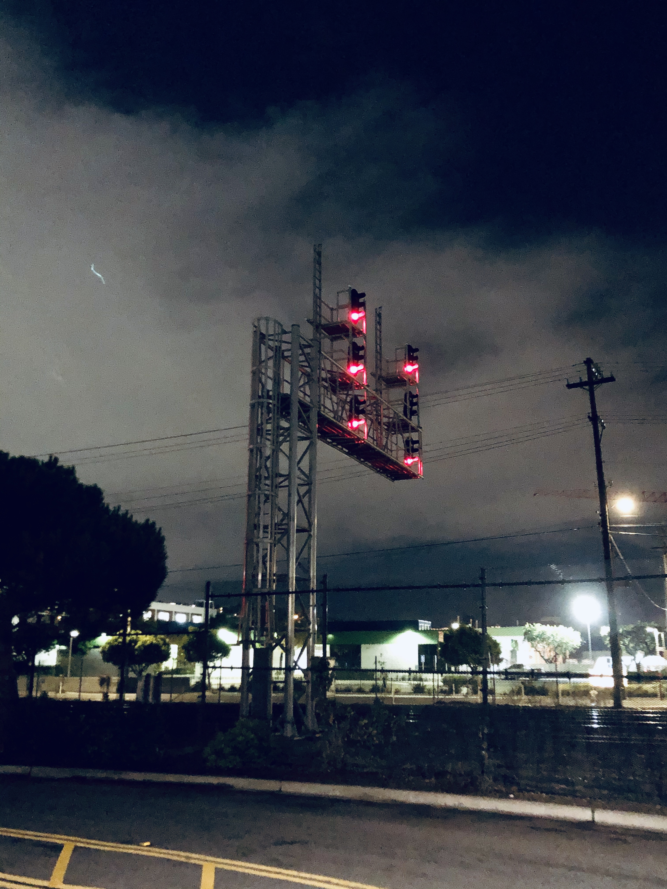

 Short one this week because I’m lazy, sorry.

### What I'm Watching

We finished up _American Horror Story: Cult_, which was reasonably entertaining if not particularly good.

We’ve also watched a bit more of David Chang’s other show, _Breakfast, Lunch, & Dinner_, and it just hasn’t grabbed me the way _Ugly Delicious_ did. I think part of it is that it spends much more time lingering on his guests/cohosts, rather than the food or culture of the places visited. This works fine when the cohost is a fountain of naturally-sourced charisma like Chrissy Teigen; it works less so in the episode with Kate McKinnon in Cambodia, who comes across as gratingly annoying and, together with Chang, as an exotifying, ugly American.

(My spellchecker is telling me that “exotifying” is not a word. Leaving aside the fact that _any_ word from an English speaker’s lips is technically a valid English word, what I mean is that they engage in exotification. Which my spellchecker is now also saying is not a word. They do, as always, include local voices; but in that episode in particular it feels like too little, too late.)

… I will keep kicking the metaphorical _End of Evangelion_ can down the road, probably until Christmas, or I forget about it.

### What I’m Eating

Trader Joe’s has ghost pepper potato chips that combine umami, spicy, and crunchy in such equal measure that they’re basically my idea of a perfect snack. They almost, but not _quite_, make up for the inability to find Sichuan peppercorn Lay’s in North America.

### What I'm Listening To

There’s new [Broken Bells](https://youtu.be/Lkv2zF2Bgq0)!!!

Thanks to a surprisingly effective [mashup](https://youtu.be/I4xYoknOzIY) of “The Less I Know The Better” and “There Is A Light That Never Goes Out”, I finally listened to the Smiths. I think I hate their teenagery moping (said the Radiohead fan). But I can’t stop listening to “There Is A Light That Never Goes Out” on repeat, so I guess it’s at least catchy moping!!!

I heard [Anemone](https://youtu.be/ByQPLnw604w) at an Everlane (I wasn’t doing the shopping, mind, so my ears were attuned to the songs instead) and they’re just the kind of jangly psychedelic indie pop I love!!!

Hopefully this has been a very exciting section to read!!!

### What I'm Reading

I finished (and loved) Harry Miller’s _State Vs Gentry in Late Ming Dynasty China, 1572-1644_, a scholarly monograph about (what else?) political battles between the state and the gentry in late Ming dynasty China. You can probably tell if it’s a book for you based on the fact the title ends with a date range, but! If it is a book for you, it is _definitely_ a book for you—Miller writes very clearly and concisely, but covers pretty much everything you might want to know about, well, the topic in the title.

So. I finish _Black Leopard, Red Wolf_. If ever there was a book to be described as a “flawed masterpiece,” this would be it. I really liked it, in the end; I’m definitely glad I read it. But, at 600 pages, with more than a little rape, slavery, and child mutilation, it’s not an easy book to get through. Plus, to be quite honest, it felt like it could have used another draft; the plot comes together in the end, but most of the book does feel like a bit of a mess, with characters coming and going seemingly randomly, an overcomplicated stories-within-an-interrogation structure, and a few places that felt like legitimate copyediting mistakes (most notably, there were a few places where I’m _fairly_ certain the wrong character was described as talking). But despite all that, it is weirdly enjoyable—I like how it was structured around the different cities the main character visits, each of which has its own culture that you slowly get to learn about, and I like how the plot comes together so satisfyingly in the end, and (for those that have or are about to read it) I love how the Aesi just keeps appearing out of thin air, and every time it’s described as it feeling like he had always been there—and I’m definitely going to read the sequels when they come out

Anyway, I liked [Amal El-Mohtar’s review](https://www.npr.org/2019/02/08/692415906/black-leopard-red-wolf-is-a-beast-of-a-book) (on a related note, I’m still waiting for my hold on _This Is How You Lose The Time War_ to come in 🙂).

### What I'm Working On

As I mentioned last time, I was revamping and rebuilding my NaNoWriMo story; that’s now at about 10,000 words (although I could probably double that by picking wisely from the NaNoWriMo draft). I was hoping to have a first draft done by Christmas, but… eh, that’s not going to happen. But I might get most of the way there.

Also, [this](https://github.com/bibliopals/betterreads-api) is happening now, apparently, since Goodreads is bad.