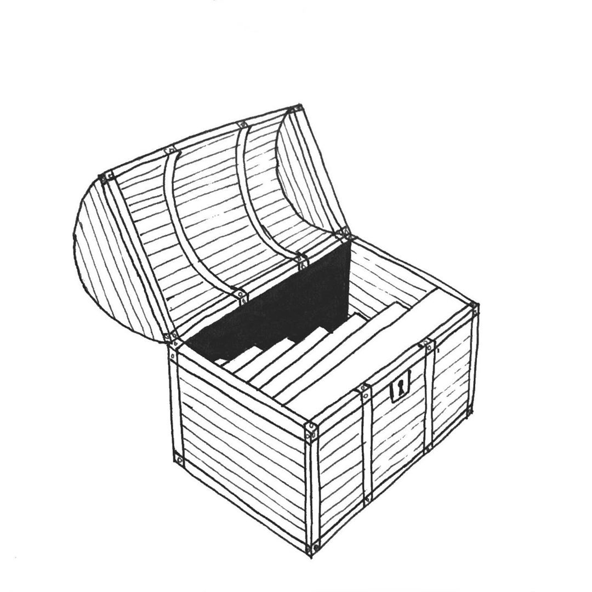
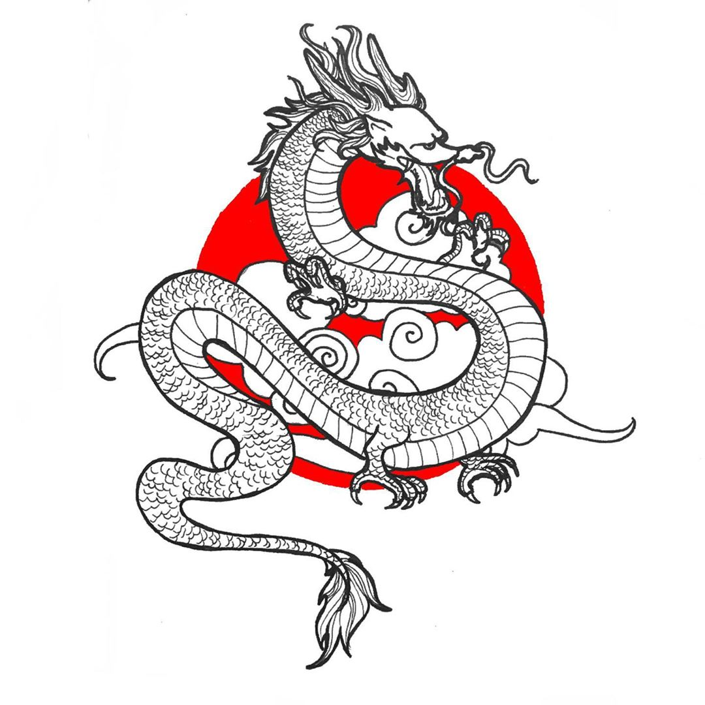

Busy week—guests over and work ramping up—so not much to say by way of introduction. But, again, I’m featuring Sherry’s Inktober artwork [from Instagram](https://www.instagram.com/frostyshadows/).

## What I’m Watching

Sherry and I have been trying to catch up on the latest season of _Terrace House_—we’ve tried to watch previous seasons but always felt a bit late to the game. Of course, it’s basically one big ad for Japan (I wonder if it’s sponsored by some Japanese tourism bureau 🤔), but I think what really makes the show so engrossing is its emphasis on body language—the show is really a masterclass in editing to catch all the tiny glances and signals exchanged between people. It’s a lot like _Evangelion_ in that way—probably a byproduct of Japanese culture, in both cases. Anyway, I’m 100% on board with Yamachan’s conspiracy theory that Kenny is leading everybody on and just there to promote his band 🙃

## What I’m Reading

I’m just starting on a big thick textbook (?) called _Buddhisms: An Introduction_. It is, in fact, an introduction to Buddhism(s).

Instead of _Number One Chinese Restaurant_ I picked up Weike Wang’s _Chemistry_ which was a good decision. It’s a tiny little book (I think it took me two hours?), but it’s so very, very lovely. The first-person narration has a rather strange, unidiomatic cadence, but somehow it nevertheless _works_, granting you full access to the thoughts of the narrator, a struggling graduate student who may or may not be based on Wang herself. It’s funny (the narrator maintains a strikingly familiar deadpan attitude throughout) and also sad, in a hopeful, cathartic way. Look, it’s just really good, okay? I recommend 👍

As a big fan of Robin Sloan’s one-year-only newletter [_Year of the Meteor_](https://desert.glass), I finally read his debut _Mr Penumbra’s 24-Hour Bookstore_, which is, sure enough, about a mysterious bookstore open 24 hours. I liked it (enough to consider reading his followup _Sourdough_, at least), but it’s rather laser-targeted at a teenaged Russell’s interests (_Hitchhiker’s Guide_ and Wes Anderson films both play small roles in the plot), so I’m not sure I could really recommend it to anybody else. The plot isn’t exactly original, and the writing style feels rather YA—the characters act weirdly immature and horny for their mid-20s, bringing to mind teenagers from a John Green novel rather than the yuppy tech workers I know, with an uncomfortable running joke that the narrator’s best friend is a multi-millionaire for developing… a boob physics engine for video games? Plus the fetishization of Google (Sloan clearly has some friends there) might have made sense in 2012, but it hasn’t really aged well, and his depiction of San Francisco is _ahem_ slightly romanticized.

But… I liked it! It’s just so charming, and Sloan is just insightful enough (though it comes through more in his newsletter, which I will dearly miss come the end of the year), that I couldn’t help but grin all the way through to the saccharine-sweet-but-still-lovely ending. Plus, again—laser targeted at a teenaged Russell. If I read this around age 14 it would probably be one of my favorites of all time. But, alas, I’m only reading it now.

Perhaps unsurprisingly (given it’s [Sloan’s favorite novel of all time](https://electricliterature.com/robin-sloan-recommends-five-books-that-arent-by-men/)—it “made him,” the way _Hitchhiker’s Guide_ made me), it reminds me a lot of _The Westing Game_—stylistically, well, maybe (because, despite loving it with all my heart, I barely remember _The Westing Game_ at all), but more how it sits precariously somewhere between YA and “adult” literature, happily just… being its own thing.

I should reread _The Westing Game_.

## What I’m Listening To

I thought I’d be spending the past two weeks listening to early-90s Chinese alt rock, which did partly happen, but then my attention was dragged away by The Caretaker’s [_An empty bliss beyond this world_](https://thecaretaker.bandcamp.com/album/an-empty-bliss-beyond-this-world), an album which I’m convinced is a.) cursed and b.) is haunting me, specifically. It’s basically a combination of the haunted ballroom from _The Shining_ and playing music for Alzheimer’s patients to help them remember. Despite basically being snippets of old-timey big band music put through a couple filters Instagram-style, it’s probably one of the spookiest/best albums I’ve ever heard.

I also _finally_ got around to William Basinski’s [_The Disintegration Loops_](https://en.wikipedia.org/wiki/The_Disintegration_Loops), which is of course one of the best ambient albums of all time, no support for that statement needed.

I tried to listen to the New York Times’ _1619_ companion podcast, of which I’ve heard much high praise, but, maybe because I went to a particularly progressive high school, I don’t find it particularly new or interesting. Like, yes, of course the history of America is in large part a history of slavery and its aftermath! I don’t mean to dismiss it entirely out of hand—obviously _some_ people need to hear it —but I just don’t find it adds all that much to the conversation for those who already know a bit about American history. On the other hand, _You Must Remember This_ (which, you might remember, had a season on Charles Manson that I raved about all summer) is now doing a season on Disney’s “long lost” 1946 film _Song of the South_, and I found the first episode to already be a much more precise analysis of the influence of slavery on American media, even a century removed! Basically, _You Must Remember This_ is great and you should listen.

## What I’m Learning

We bought a digital piano—a [Yamaha P71](https://www.amazon.com/gp/product/B07W3PN1Z1/ref=ppx_yo_dt_b_asin_title_o02_s00?ie=UTF8&psc=1), to be precise—and I’ve found that I enjoy practicing much more than I did as a child. So: _Trois gymnopedies_? ✔️ _Clair de lune_? Only half a checkmark for that one, but it is coming along. (On a related note, I recently found out Sherry didn’t know about the [IMSLP Petrucci Music Library](https://imslp.org/wiki/Main_Page), which is an absolute _treasure trove_ of out-of-copyright sheet music and highly recommended.) I’ve also been trying to pick up guitar (again), though I’ve switched to Sherry’s acoustic rather than my electric because I think it will promote good technique. I’m trying to get the E-shape barre chord down (no teacher necessary, thanks to [Justin Guitar](https://www.justinguitar.com)) and it’s _slowly_ coming along. I want to start learning to draw now too 😔

I’m still working on _Beautiful Racket_ and _100 Days of SwiftUI_ (though I haven’t exactly been keeping up with the latter), though I took a break to check out _Beautiful Racket_ author Matthew Butterick’s other book, [_Butterick’s Practical Typography_](https://practicaltypography.com), which was nice, though it’s a little too “practical” for my tastes.

