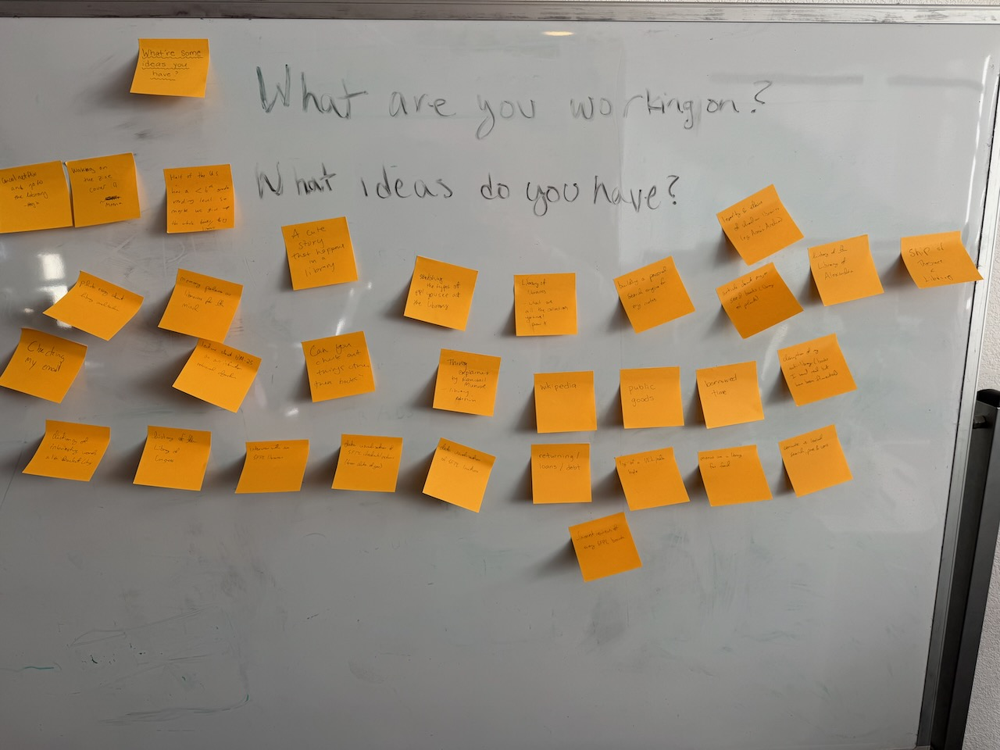

Sorry, another LLM newsletter. I *promise* next week I have a different topic.

IMG_6812 2.jpeg

(But first, some ideation for [zine 4](sf-frens.org)!)

Recently there’s been some Discourse™️ about the use of LLMs, with some noting a backlash against LLMs (primarily on Bluesky) and others noting a backlash against the backlash. There’s been plenty of newslettering, too, like:

- Robin Sloan’s essay [“Is it okay?”](https://www.robinsloan.com/lab/is-it-okay/)
- Baldur Bjarnason’s [response](https://www.baldurbjarnason.com/notes/2025/subtly-wrong-is-more-dangerous/) and then, disappointed by [Sloan’s response](https://www.robinsloan.com/lab/science-fiction/) to the response, a *second* response titled [“Now I'm disappointed”](https://www.baldurbjarnason.com/notes/2025/now-im-disappointed/), of which Jeremy Keith [was a fan](https://adactio.com/journal/21712)
- Miriam Suzanne’s [“Tech continues to be political”](https://www.miriamsuzanne.com/2025/02/12/tech-ai-wtf/)
- A confusing dustup on Bluesky involving the journalists / pundits Matthew Yglesias, Kevin Roose, Ezra Klein, Mike Masnick, and Casey Newton (among others), which [Max Read helpfully summarized](https://maxread.substack.com/p/the-ai-backlash-backlash)

Frankly, a lot of it is exhausting, and some of it seems like folks talking past each other —  a great example of the [farmer-forager dichotomy](https://rwblickhan.org/essays/farmers-foragers/) I defined a while back. (At one point Bjarnason accuses Sloan of being a bullshitter-a-la-Harry-Frankfurt, which is a very farmer-on-forager move!)

That said, I never want to be accused of having underthought things, and while I mostly stand by [my last post](https://rwblickhan.org/newsletters/but-what-is-it-good-for/), it does feel a little *too*... forager-y?

So here is:

## Russell’s List of Every Objection to LLMs (That I Could Think Of)

(No, I didn’t ask Claude to generate a list of examples. I used my squishy wet human brain.)

- LLMs waste energy during a climate crisis. Even if you think LLMs are useful, the energy cost may outweigh the benefits. Additionally, because of the distortionary finance of the hype cycle and competitive dynamics, major vendors are likely to continue training larger, more energy-intensive models, even if performance does not increase by the standards of their own metrics.
- LLMs hallucinate — that is, they make up likely, but incorrect, text — and this is a fundamental limitation of statistical approaches to language modeling. However, because of the human bias towards confident, coherent text, users will trust LLM output even when it is widely known to contain falsehoods.
- Generative AI is explicitly intended to replace human labor and will lead directly to job losses, particularly in vulnerable professions like illustration. In the long run, this may create new jobs or make existing jobs more efficient — but, to paraphrase Keynes, in the long run we’re all dead.
- LLMs are trained on opaque datasets that are known to contain harmful biases; users may be unknowingly influenced by these biases. RLHF seems to reduce bias, but the field of mechanistic interpretability has few confident results; it’s possible RLHF gives only an *appearance* of reducing bias.
- LLMs are based on large-scale intellectual property theft. Even if training with copyright materials is legal — which is unclear and untested — there is also the question of how companies *obtained* copywritten materials, which almost certainly involved large-scale piracy.
- LLMs are based on unethical, non-consensual use of written material, even if training is judged to be legal. They’re is different from search engines, because while most writing *wants* to be found (otherwise, why are you writing?), LLMs drive orders of magnitude less traffic to the original sources, assuming sources are even provided.
- If LLMs become a major economic force and if LLMs require large-scale ongoing investment, then most of the benefit will accrue to a small number of companies, accelerating winner-take-all dynamics in the tech industry and giving those companies even more power over our lives.
- Individuals that rely on LLMs will be less creative, because LLMs are fundamentally [imitators, not innovators](https://journals.sagepub.com/doi/10.1177/17456916231201401) — they return the statistically most-likely continuation of a piece of text. If deployed at societal scale, then society as a whole will be less creative.
- On a specifically technical level, LLMs cement currently-popular ideas and tools at the expense of rarer or newly-developed alternatives. For instance, most LLMs are noticeably better at writing Python than a relatively obscure language like Ada. If most of society comes to rely on LLMs to generate code, then most of that code will be in languages that happened to be popular circa 2022.
- LLMs are primarily useful for generating [slop](https://simonwillison.net/2024/May/8/slop/). If LLM usage is widespread, we will drown in meaningless text.
- LLMs are primarily useful for cheating on exams. Because of their propensity towards hallucination, learning from an LLM will be difficult or less valuable than attempting to learn by oneself. Using an LLM to write [distracts from the actual purpose of writing](https://thewalrus.ca/i-used-to-teach-students-now-i-catch-chatgpt-cheats), which is to think; LLMs are not just a [“calculator for words”](https://simonwillison.net/2023/Apr/2/calculator-for-words/) because a calculator is only used to automate rote arithmetic that requires no useful thought.
- LLMs are primarily useful for parasocial relationships a la *Her*. Lonely people will flock to LLMs that only provide the appearance of emotional support.
- Artificial general intelligence (AGI) is badly-defined and requires acceptance of an almost-eugenic understanding of intelligence and rejection of neurodiversity. Even if you accept a -eneral “scale” of intelligence, users of LLMs risk conflating eloquence, or the *appearance* of intelligence, with actual intelligence.
- If we continue building larger LLMs, we risk creating a thinking machine that is dangerously misaligned with human values broadly.
- On the converse, perhaps LLMs are [not a productive path to true natural-language understanding](https://aclanthology.org/2020.acl-main.463/). If training on statistical patterns of large-scale data is *not* enough to produce a general language-understanding intelligence, because it is not possible to learn grounded meaning that way[^bender], then we are likely close to the ceiling of performance.[^performance] *From the perspective of NLU as a field*, we will have wasted decades of researcher time and billions of dollars. (Notably, this is a separate question from whether the resulting systems are economically useful.)

This was at a random stairwell at my workplace. 🤷‍♀️

## So How Do I Feel?

Uneasy, definitely uneasy.

I don’t think LLMs are at all fake or useless — I listed genuine use cases in the [last post](https://rwblickhan.org/newsletters/but-what-is-it-good-for/)!

But I am skeptical of the AI labs’ claims that we’re “just a few months” from a general intelligence, let alone a *super*intelligence (and that’s without getting into the murky waters of comparing intelligences...). Just today, I found myself nodding along to [this bear case for AI progress](https://www.lesswrong.com/posts/oKAFFvaouKKEhbBPm/a-bear-case-my-predictions-regarding-ai-progress) on LessWrong — it argues we’re likely close to the ceiling on reasoning performance (c.f. the disappointing release of GPT 4.5 just last week) and most of the benchmarks are not really measuring genuine intelligence. As the article puts it: “It seems to me that "vibe checks" for how smart a model feels are easily gameable by making it have a better personality. \[...\] Deep Research was this for me, at first. Some of its summaries were just *pleasant* to read, they felt so information-dense and intelligent! Not like typical AI slop at all! But then it turned out most of it was just AI slop underneath anyway, and now my slop-recognition function has adjusted and the effect is gone.” The fact that I could even *use* the term “mechanical sympathy” meaningfully in the last post is a clue that this really is “just a machine”.

And, really, most of the non-programming uses I listed in the last newsletter are useful, but not *that* useful — not multi-percentage-point-GDP-growth useful, certainly, but [maybe as useful as a spreadsheet](https://rwblickhan.org/newsletters/perhaps-the-llm-juice-isnt-worth-the-electrical-squeeze/#llm-llm-llm).[^newsletter] At the end of the day, I have a few niche tasks that I use LLMs for — converting equations into clean LaTeX is *pretty* darn useful when I need it — but I really don’t use LLMs *that often*.

So, where do I stand, given the critiques above?

- As mentioned last time, I’m uncomfortable with image and video generators. The loss-of-jobs and slop arguments feel pretty damning, and anyway, I notice an increasing norm that generated images are, at the *very* best, a little sketchy.
- Many of the criticisms aren’t impacted by whether I personally use LLMs. If I abstain from LLM usage, that won’t stop teenagers from cheating on exams; if I abstain from LLM usage, that won’t stop unscrupulous scammers from creating slop. (Last time, I used the analogy of a chef’s knife.)
- Similarly, whether this is a productive approach to AGI, or whether that’s even the right goal at all, doesn’t impact whether I find use today!
- Some of the arguments make more sense if you assume they’re promoting wholesale abolition and nonproliferation, but given distilled models can run on a laptop and only require a file of weights, that would require upending the entire tech industry and probably destroying all knowledge of neural nets. As a species, we can’t even stop nuclear proliferation, and we *know* those could destroy the world.
- The non-consensual use of writing is tough. (I’m less concerned about the legal implications; the courts will judge.) On the one hand, that’s a genuine ethical concern — am I stealing every time I use an LLM? But on the other hand, those complaints sometimes seem driven more by frustration at the tech industry as a whole rather than a specific ethical concern — and I can’t quite agree with that as a person with one foot in both worlds! For my purposes — which are closer to a “calculator for words” and farther from “generating slop” or “a worse search engine”; I typically want the original source and not the LLM summary! — I’m not *too* concerned ethically, but I am uneasy.
- That said, giving money to these companies directly supports organizations that disagree with some or all of the critiques above and supports a financial hype cycle. So while I don’t think it’s unethical to pay for LLMs, I’m going to avoid it as much as possible.
- But also... I’m not going to quit my job just because we use LLMs (or even image or video generators), *especially* not with a possible depression right around the corner.

Okay, whew. Hopefully you know that wasn’t written by an LLM because (it’s barely edited and) it sounds a lot like me. I am tired and need to go take a nap. I promise I have a non-LLM topic for next time.

[^bender]: Before I’ve complained about folks who brush off the possibility of LLM consciousness using the term “stochastic parrots”. But the original Bender-and-Koller paper [“Climbing Towards NLU”](https://aclanthology.org/2020.acl-main.463/) is great! Still, I stand by what I said — the “stochastic parrot” criticism works for grounded understanding, but *not* for phenomenal consciousness. LLMs may lack understanding of what they’re manipulating while still being phenomenally conscious. But as I always point out, I’m an [illusionist](https://keithfrankish.github.io/articles/Frankish_Illusionism%20as%20a%20theory%20of%20consciousness_eprint.pdf) about consciousness and [believe the United States is meaningfully conscious](https://faculty.ucr.edu/~eschwitz/SchwitzAbs/USAconscious.htm) — so LLMs being phenomenally conscious doesn’t say much.
[^performance]: If Bender and Koller are right that genuine understanding is impossible to learn from syntax, then how come LLMs are useful *at all*? How do the new reasoning models reason? I think that means a lot of reasoning *just is* purely syntactic. If I ask a question like “how much sugar is in 2 tbsp of simple syrup,” you don’t need to know what sugar or simple syrup or tablespoons are “really”; you just need to know how they all relate to each other semantically and then do some probabilistic substitutions.
[^newsletter]: One of the joys of having a newsletter is to see that I was already asking these questions almost a year ago.