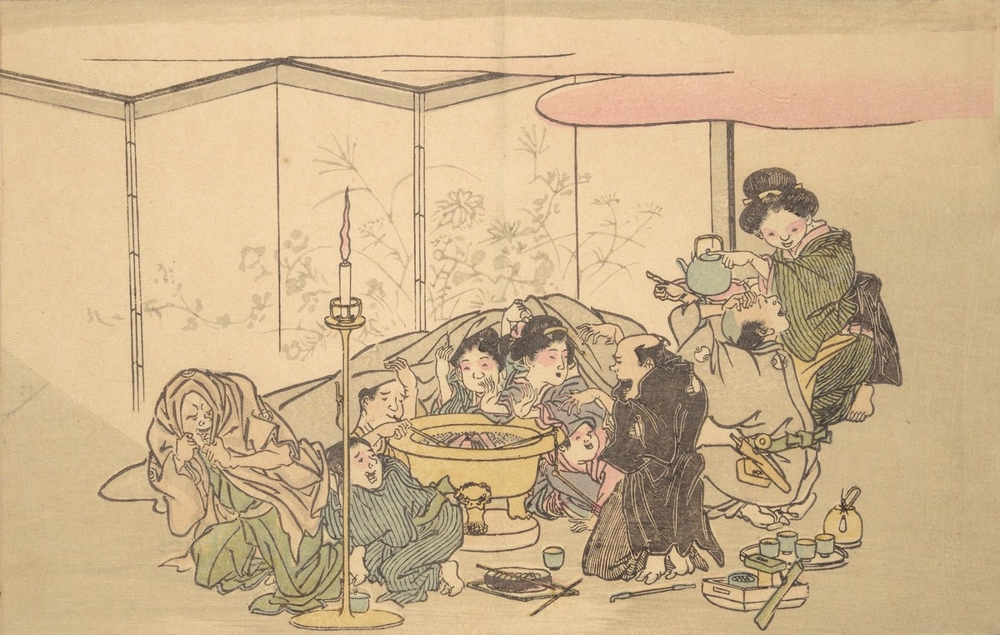
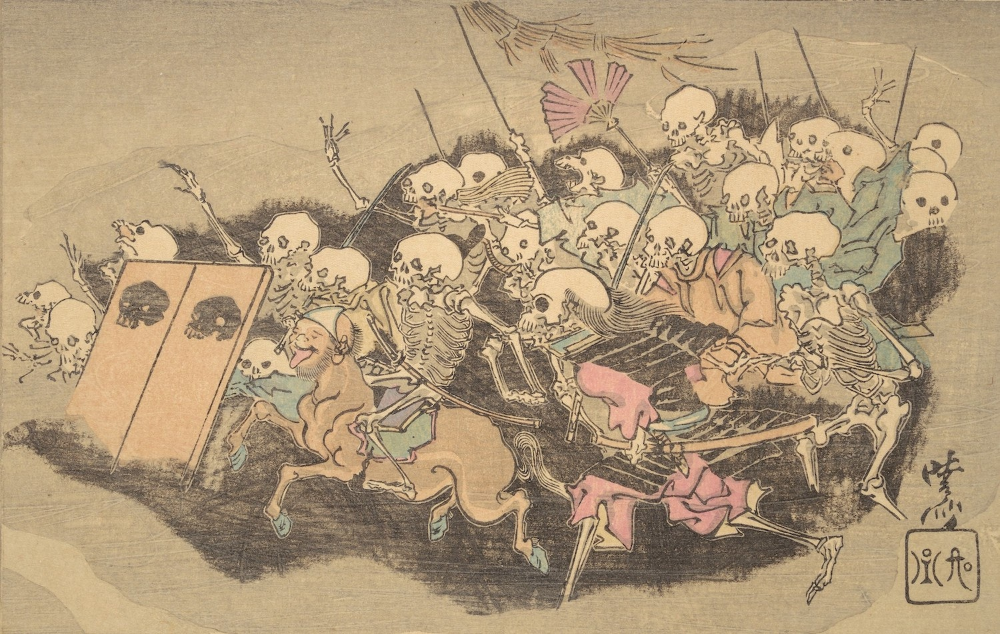
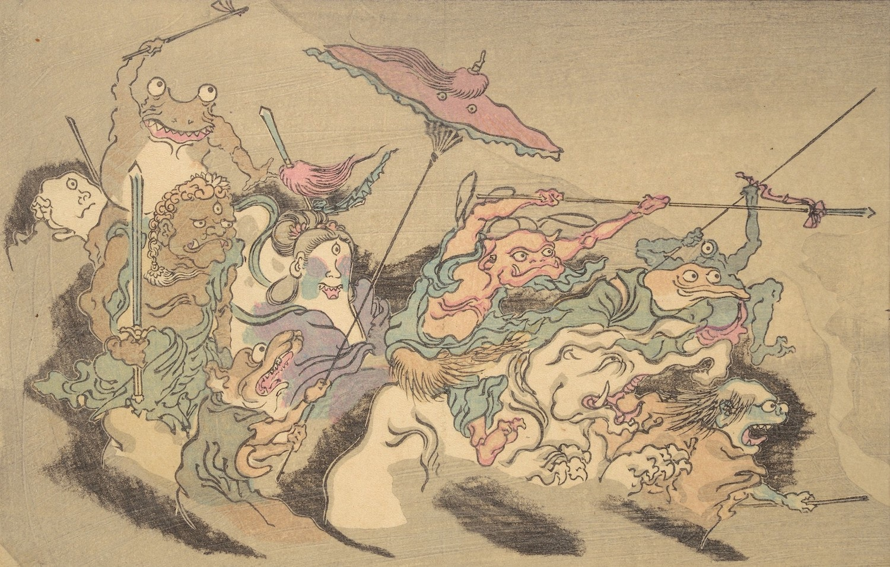
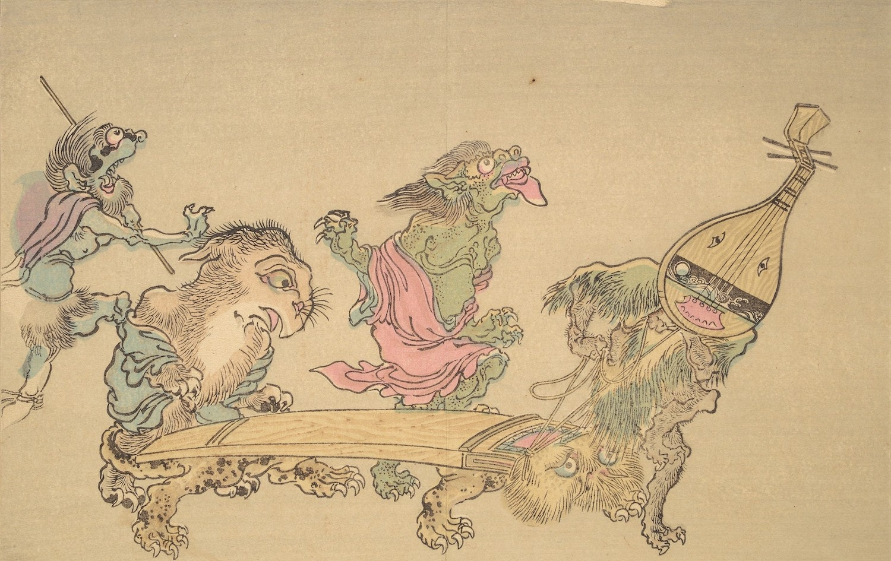
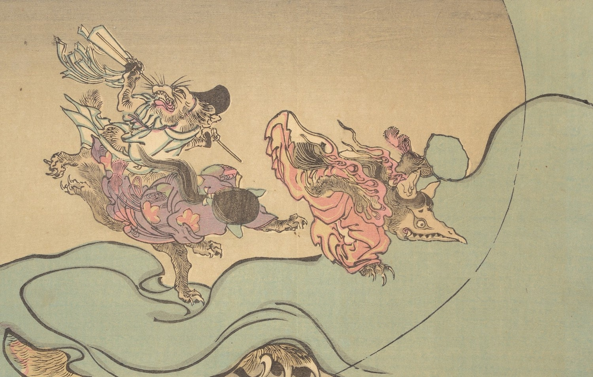
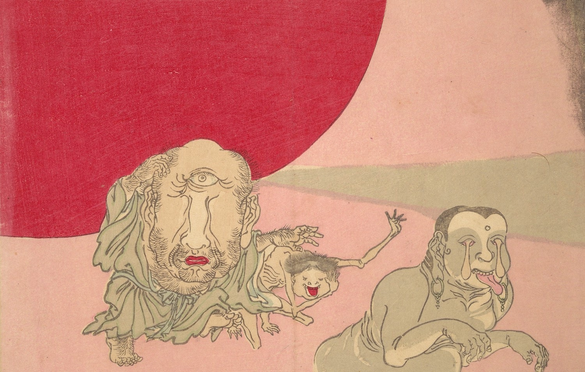

Hello one and all to this new season of *Applied Dilettantery* (neé *Adventures in Dilettantery*)[^1], two weeks early.

As mentioned in the last few issues, I’ve been unhappy with the direction the newsletter was going in; it had drifted into a simple log of things I’d read/watched/listened to and, in a certain sense, didn’t have a strong value-add. I do of course respect your time, dear reader, so I want this newsletter to at least be consistently “mildly interesting” and perhaps even thoughtful. Perhaps more to the point, I was getting bored of the old format and didn’t feel like *I* got much out of writing it.

So, what will this newsletter look like, for the next season (read: year)? Instead of divisions into “what I read/watched/listened to/worked on” and so on, I’ll be dividing it into mini-essays (less than 500 words each) on media I recently consumed or some other topic I’ve been thinking about, arranged into a series of questions[^2]. I’ll still include some links I recommend that I don’t have much to say about at the bottom.

I’m still experimenting with the format, so expect this to change. I’ve recently started a Zettelkasten[^3], so I might have a “random note” section at some point, or add a Q&A section if there’s any questions, or include things I’ve recently worked on. In the meantime, if you have any questions or comments, please do hit reply on this email 🙂 So, without further ado…

Of course, I’ll also continue to include themed public domain art in between sections. This week we have selections from the 1890 *Night Parade of One Hundred Demons* by Kawanabe Kyōsai, as highlighted by [the wonderful Public Domain Review](https://publicdomainreview.org/collection/night-parade-of-one-hundred-demons).

## Is Agamemnon just a bad leader?

*The Iliad*, as its very first line notes, tells the tale of the “wrath of Achilles”. After nine years of war against Troy, the leader of the Achaeans (that is, the Greeks), Agamemnon, is being punished for refusing to ransom a slave he took (warning: the rest of this section is predicated on slavery, which is gross, but unfortunately par for the course when dealing with ancient works.). He finally does so, but in recompense, he takes the slave Briseus from the great hero Achilles; Achilles, offended to the point of wrath, sits out the rest of the book, until his best friend (slash lover?[^4]) Patroclus is killed.

What I want to explore here is the incentive structure of the Greek army as a toy example of problematic institutions. The Achaeans fight, pirate-like, for plunder, as distributed by their leader, Agamemnon, but they also fight for their [*kleos*](https://en.wikipedia.org/wiki/Kleos) or honor (not least of all Achilles, who has been forewarned that he can either die on the beaches of Troy with great glory, or go home and live a long, but unremarked upon, life). The problem with this dual reward structure is that it assumes a constant flow of plunder—when that flow is reversed, as when Agamemnon ransoms the captive, he risks losing that glory, and thus has to take back plunder from someone else (namely Achilles), who in turn risks losing glory, and the whole system collapses. This is compounded by the fact Achilles doesn’t *have* to fight—unlike many of the other named characters present, who had sworn an oath to help Menelaos retrieve his wife Helen, Achilles is there simply for his own glory—and rightfully points out that he has no real part in the Trojan War.[^5] Thus, he sits out most of the book, nursing his grudge, until he can gain even greater glory (albeit only with the death of Patroclus).

This strikes as a case of misplaced institutional incentives—Agamemnon[^6] has set up this system to encourage plunder and courage in battle, but instead the best fighter almost leaves and Agamemnon almost loses the entire war.

## ”Why do you relax your fierce courage?”

The quote continues: “‘Hard it is for me, strong though I am,/to break this alone and make a way to the ships. Come, join with me; for the work of many men is better.’/So he spoke, and in dread of their lord’s rebuke/they pressed all the more around the lord who bore their counsels.”[^7] I picked this quote by opening to a random page; almost every page of the *Iliad* that involves combat has a similar line. It’s an interesting pattern because it points to a concept Bret Devereaux mentions many times on [his magnificent military history blog](https://acoup.blog), namely cohesion—it generally matters much more how “strong” the bonds are between individuals in an army, rather than how deadly that army is. Recently, he’s talked about it on [his series on the Battle of Helm’s Deep](https://acoup.blog/category/collections/the-battle-of-helms-deep/) in *The Lord of the Rings: The Two Towers*[^8], where he discusses both the [Uruk-hai](https://acoup.blog/2020/05/15/collections-the-battle-of-helms-deep-part-iii-the-host-of-saruman/) and [Rohirrim](https://acoup.blog/2020/05/22/collections-the-battle-of-helms-deep-part-iv-men-of-rohan/) armies, and how the men of Rohan do much better because, even though they don’t have a “professional” military structure like the invading Uruk-hai, their army relies on the natural social bonds built in peacetime; you’re much less likely to run away when you’re defending your friends and neighbors! This is all over the *Iliad*, where the men fighting are constantly chiding each other for being cowardly and either (for the Greeks) referencing family bonds and shared culture heroes or (for the Trojans and their allies) referencing the non-combatants in the city they’re trying to save.

(Note: I am not a military historian, only an applied dilettante, so take the above description with a few grains of salt.)

## “Thus they tended the funeral of Hector, breaker of horses.”

This is the enigmatic ending line of the *Iliad*, which leads to a natural question—who is this book *really* about, anyway? The opening line references the wrath of Achilles, but the ending line references Hector, breaker of horses, his hated rival. Asking which of these two is “really” the protagonist is of course reductive, but it is fascinating how heavy an emphasis is placed on the aftermath of Hector’s death. For a story that is essentially pro-war (despite the cost, enumerated in the many crushed bones and wailing wives throughout), it’s striking that the story ends with the laments for and funeral of Hector, savior of Troy, which will, the story implies, soon fall without him. Similarly, it’s striking that the last chapter involves a recognition between Achilles and Priam, both having suffered such loss. And *yet* the war will go on—Achilles may pause the fighting, but only for two weeks. In that sense, the story, though clearly a product of the Iron Age, does nevertheless feel somewhat timeless—for we all lose those we love in time.

## What’s the use of useless questions?

Whenever the topic of the *Iliad* and the *Odyssey* come up, you will likely hear about the so-called [Homeric Question](https://en.wikipedia.org/wiki/Homeric_Question)—namely, was there really a blind poet named Homer that wrote the two works, or was it a group of poets, or or or? These types of questions can seem useless—after all, we will likely never know the truth, unless we build a time machine. But I’d argue there is a value to such “useless” questions, anyway. Because of the arguments surrounding the identity of Homer and the work of scholars like [Millman Perry](https://en.wikipedia.org/wiki/Milman_Parry), we now know a lot more about oral literature, and the place of orality and writing in society, than we once did, just as a side effect. We might call this the “NASA argument”—that by asking “useless questions” (like going to the Moon), we can get useful answers as a side effect (like velcro, or so the story goes).

There’s another class of “useless questions” that I’d call “answered questions that keep being asked.” Here I have in mind something like the questions over Shakespeare’s identity. Most scholars will laugh this question off—Shakespeare wrote Shakespeare—but people still like discussing it. And I think there is a value in continuing to discuss the doubts people have had over Shakespeare’s identity, because it helps us center both our own biases (most of the doubts are based on classism) and also highlight the differences between our time and his (many are surprised that an “uneducated” writer would know the classics so well, but then many of Shakespeare’s time would be surprised at how little Westerners know their own “classics”!).

## Miscellanea

One topic I was inspired by, but couldn’t quite work into a coherent topic, was “what would a world with *Dungeons & Dragons* monsters look like?” This was inspired by two completely different links I stumbled on this week; first, Schola Gladiatora’s [“How to Design REALISTIC SWORD & WEAPONS for FANTASY worlds - Writing, Roleplaying, Art”](https://youtu.be/UOom2b-XeXc)[^9] and [this tweet](https://twitter.com/dreamwisp/status/1275055543237804039), which points out that *Dungeons & Dragons* and similar fantasy settings should have far more disabled folks and thus much better accessibility than usually portrayed. Curiously, the only fantasy setting I can think of that has fairly strong representation of disability is *Avatar: The Last Airbender*, which is rather clever about Toph’s blindness—and that setting doesn’t even have any non-human monsters! In any case, it’s interesting that *Dungeons & Dragons*—which has in many ways codified “Western fantasy” as a series of tropes—ended up being based so heavily on a particular romanticized vision of medieval Europe; it would be interesting to see a setting that took D&D and its mechanics seriously as part of the world building; see [Eberron](https://en.wikipedia.org/wiki/Eberron) for a partial example of that.

The Art Assignment[^10] had a nice episode on [”Art That Was Never Finished”](https://youtu.be/-VDVo9akCiQ). I don’t have a lot to add—it’s just a nice little video with lots of examples of visual art that are, arguably, *more* powerful in their incompleteness.[^11]

Also on YouTube, Tom Scott [asked 64,812 people about the children’s rhyme “Jingle Bells, Batman Smells”](https://youtu.be/V5u9JSnAAU4), hypothesizing that a mid-‘90s episode of *The Simpsons* influenced what children sang as the second line (spoiler alert: he finds that it did, in fact, have an impact on Great Britain). But more generally, it’s a nice example of dialectical divergence[^12] and the homogeneity of North American English.[^13]

And that’s probably enough for today! There’s other topics I wanted to discuss, but at well over two thousand words, I feel like those are best saved for another time. Until next time!

[^1]: Why the name change? To be completely honest, *Adventures in Dilettantery* always sounded silly, and I want to take this more seriously now.

[^2]: As you might notice, some of the titles in this edition are already not-questions. I’m thinking of these “questions” more as an idea generation crutch than an important part of the format.

[^3]: A good topic for conversation, but maybe next time—this edition is stuffed enough as is.

[^4]: Apparently, this was already a common reading in antiquity, and it forms the basis for Madeline Miller’s *The Song of Achilles*, which I have not yet read but have been told repeatedly is a masterpiece. (Miller also wrote my favorite-of-last-year *Circe*.)

[^5]: Amusingly, this also occurs on the Trojan side—on occasion, the Trojans’ allies point out that *their* cities are not at risk, so why does it seem they care more about the war than the Trojans themselves?

[^6]: Or, perhaps more precisely, this imagined version of late Bronze Age culture.

[^7]: This is from the Caroline Alexander translation, book 12, lines 409-413.

[^8]: Warning: familiarity with *The Two Towers* recommended.

[^9]: Although, fair warning, the runtime feels a bit padded; I’d recommend 2x speed or jumping around a bit.

[^10]: Which is apparently hosted by John Green, now 🤷‍♀️

[^11]: Actually, something that literally just came to mind as I read this was the *Critias*, Plato’s last, incomplete dialogue and the source of the Atlantis myth—would Atlantis be so prominent if the rest of the dialogue, likely with a spelled-out moral at the end, was present? (For more on the search for Atlantis, see the [“Decoding Atlantis w/ Mark Adams](http://greecepodcast.com/episode13.html) episode of the Ancient Greece Declassified podcast, although I think it gives a *little* too much weight to fringe ideas.) This ties to something I’ve had percolating for a while, namely that we humans like stories of the “inexplicable” (ghosts, aliens, and the like) in the modern world because there’s some fundamental questions that science, for all its successes, seems unlikely to answer in our lifetimes—I’ve been calling this the “lure of uncertainty,” and I think it’s much more prominent in Western culture than we often give it credit.

[^12]: It’s easy to see how, given a few hundred more years without too much communication across the Atlantic, the map of English dialects would start to look a lot more like China.

[^13]: Almost everyone in North America gave the same answer, but Great Britain has a wide variety of (sometimes quite strange) answers. The United States and Canada, of course, have only really been populated coast-to-coast by English speakers since the advent of mass media, so that probably explains part of it. But it’s curious that Great Britain *still* shows such divergence, even for phrases that be definition could only have come about in past half-century.