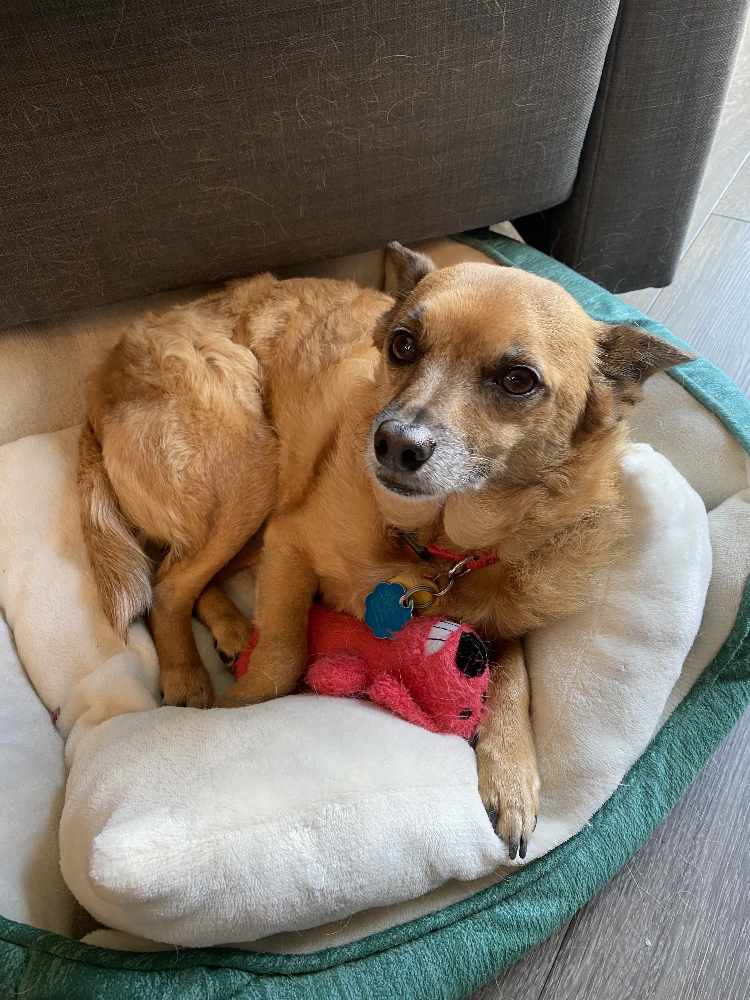

Writing update: I hit 22k words, but I’m feeling a bit burnt out, so I’ve decided to adopt a concept of “writing sprints” — I’ll take the next week off to revise and rework what I’ve already got before spending another 2 weeks sprinting at 1,666 words per day. Notably, that will let me fix some issues in the outline that have become apparent while sprinting to the first draft.

[”A prince riding a composite elephant”, India, Golconda, Deccan, 16th century](https://www.clevelandart.org/art/2013.282#)

## Russell’s Fun Facts Corner

Let’s try out a new format: introducing Russell’s Fun Facts Corner!

* [Kasongo Ilunga](https://en.wikipedia.org/wiki/Kasongo_Ilunga) was Minster for Foreign Trade in the Democratic Republic of Congo for most of 2007. He had been added to the candidate shortlist to fulfill a constitutional requirement that at least two options be presented to the Prime Minster for each ministerial position, but due to a conflict between the Prime Minister and the other candidate, the unknown Ilunga was chosen — only to never claim his office, because he *probably didn’t exist*.
* The [Shigir idol](https://en.wikipedia.org/wiki/Shigir_Idol), found in a peat bog near Yekaterinburg, Russia, is the oldest known carved sculpture in the world, carbon-dated to sometime around 9,500 BCE, shortly after the end of the last ice age. Its precise use is unknown, but it depicts a human face and possibly body and was likely carved with tools made from beaver jaws.
* [Shirakawa](https://en.wikipedia.org/wiki/Historic_Villages_of_Shirakawa-g%C5%8D_and_Gokayama) is a village and UNESCO World Heritage Site in Gifu Prefecture, Japan. Nestled in a remote mountain valley that receives high snowfall during the winter, regular contact with the village was difficult until the 1950s, leading the villagers to develop an idiosyncratic style of thatched-roof home that sheds snow easily during winter.
* A [Schelling point](https://en.wikipedia.org/wiki/Focal_point_(game_theory)), or focal point, is a game-theoretic concept to describe the solution two “players” will converge on without communicating. The most famous example is meeting a stranger in New York City on a particular day without communicating — both people are likely to choose the information desk at Grand Central Terminal at noon, by reasoning that the *other* person is likely to choose that as an “obvious” location. Alex Danco extends this concept to argue that [Schelling points are a kind of capital](https://danco.substack.com/p/nfts-and-cbgbs-hows-that-for-a-clickbait?token=eyJ1c2VyX2lkIjozMjcxNiwicG9zdF9pZCI6MzMwNDM5MDEsIl8iOiI1bzVGMCIsImlhdCI6MTYxNDU0NzczOSwiZXhwIjoxNjE0NTUxMzM5LCJpc3MiOiJwdWItODYyMyIsInN1YiI6InBvc3QtcmVhY3Rpb24ifQ.dlxTVHjPCJf5HOIYNS0eXC3-drot3uFwfb4eV9UmwPw), because they allow for implicit communication without the cost of explicit communication. An example he gives is SAFE notes — as the bog-standard early-stage funding contract in Silicon Valley that both venture capitalists and founders expect to use, they act as a Schelling point in funding negotiations, saving both sides from the cost of creating a new kind of contract every time.
* (warning: gross factor) Casu marzu is a type of Sardinian cheese produced by leaving a wheel of pecorino out to rot — which you then eat as maggots jump out at your face. It is arguably the most dangerous cheese in the world, which is why it’s been banned by the Italian government since 1962. So why is it still quietly available across the island, if you ask the right people? Because [cheesemaking has become a key signifier of Sardinian identity](https://theoutline.com/post/8843/casu-marzu-cheese-sardinia-illegal-dangerous) — which is particularly important on an island where almost half the citizens still want independence.
* You may know that some Japanese soldiers refused to surrender until well after World War II, like [Yokoi Shoichi](https://en.wikipedia.org/wiki/Shoichi_Yokoi) or [Onoda Hiroo](https://en.wikipedia.org/wiki/Hiroo_Onoda), who famously didn’t believe the pamphlets declaring surrender and so hid out in the Philippines until his former commanding officer arrived in 1972 to relieve him of duty. Personally, I find the most interesting such story — perhaps because of the way it illuminates the workings of empire — to be [Nakamura Teruo](https://en.wikipedia.org/wiki/Teruo_Nakamura), who was the very last Japanese soldier to surrender, in 1974. But he wasn’t actually ethnically Japanese — he was an ‘Amis aborigine from then-colonial Taiwan. Once he surrendered, he decided to be repatriated to long-since-independent Taiwan instead of Japan — where he received a frosty reception from the Kuomintang government and found he was ineligible for a pension from the Japanese army (at least until a public outcry). He died of lung cancer five years later.

## What’s New, Rooby-Doo?

I found and returned a Loofa dog to him, which he was carefully guarding, even though I’m not sure he particularly cares about it 🤷‍♀️

