This year I read [60(ish) books and graphic novels](https://rwblickhan.org/logs/books-2025/), as well as three books I got most of the way through but gave up on.

It was a better year for my reading than [last year](https://rwblickhan.org/newsletters/best-of-the-rest/), particularly for fiction, but I still feel a degree of diminishing returns — I just didn’t read all that much that truly moved me. Nevertheless, I read obsessively. Who can say why?

Next year, as part of my [yearly goals](https://rwblickhan.org/essays/yearly-goals/), I set a goal to read twelve specific books, including (among others) *Middlemarch*, *Infinite Jest*, *Jonathan Strange and Mr Norrell*, the Gormenghast trilogy, *Jane Eyre*, *Wide Sargasso Sea*, and a Pynchon novel. Is that an ambitious list? Perhaps, but they all feel valuable.

In any case, here’s a list of some of my favorites from this year. Next week I’ll follow up with films, television, and video games.

## Fiction

### The Haunting of Hill House

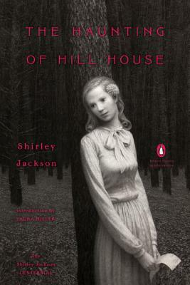

This is cheating, because I read [*Haunting of Hill House*](https://app.thestorygraph.com/books/e70d6b29-473e-4c8e-922e-4c71e3476c81) years ago and merely reread it this year. But I’m including it as one of my favorites for this year because I simply didn’t appreciate it enough before. Shirley Jackson was truly the GOAT. *Hill House* is a novel that requires you to pay attention to *every single sentence* for full effect, as the house draws Eleanor home to her doom (and the novel draws the reader in...). It’s a novel that has to be read (at least) twice, but still feels like it hides secrets. It is easily the best horror novel of all time, one of the best novels of madness, and, now, one of my all-time favorites as well.

### The Remains of the Day

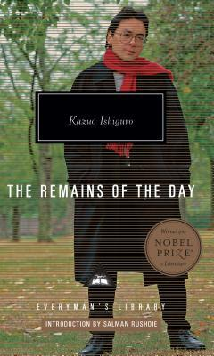

I wasn’t too impressed by [*An Artist of the Floating World*](https://app.thestorygraph.com/books/be0be157-51c4-44d3-b8a4-6159692cefcb) and I had complicated-at-best feelings about [*The Buried Giant*](https://app.thestorygraph.com/books/a51f50cc-32d4-4039-9ba2-54be5dcf9328), so I was starting to feel that Nobel Prize-winning author Kazuo Ishiguro was, maybe, a little overrated?

I am happy to report that I loved [*The Remains of the Day*](https://app.thestorygraph.com/books/0877ff9a-0560-417e-94ab-aa32c1839d36), a sad, slow, somber, but surprisingly readable and funny (in a very dry, English way) story about a butler who has wasted his life.

### Gone Girl

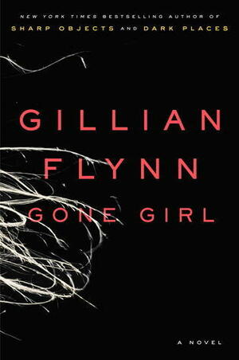

[*Gone Girl*](https://app.thestorygraph.com/books/e9be4097-bc75-4f67-a030-0e7e7270c009) was probably my most enjoyable read of the year. It’s an incredibly compelling thriller, propulsive from chapter to chapter, which also happens to be incredibly thoughtful and thematically rich (*two* unreliable narrators??). One wishes Gillian Flynn had written another book in the decade and a half since *Gone Girl* came out.

I can’t say I particularly cared for the film adaptation, as well-executed as it is. The film leans much more heavily on the ~ ineffability ~ of Amy, particularly with the ethereal, floaty acting style of Rosamund Pike. [light spoilers follow] It even ends on a repeat of the opening line, along the lines of “can two people ever really know each other”, which differs from the novel, which ends on Amy insisting she deserves the last word. I prefer the novel’s ending, because what I found particularly skin-crawling about the novel was that Amy was *not* ineffable, but in fact utterly understandable — but she is utterly convinced of her own correctness, even well past the point anyone else would consider mad.

### When We Cease To Understand The World

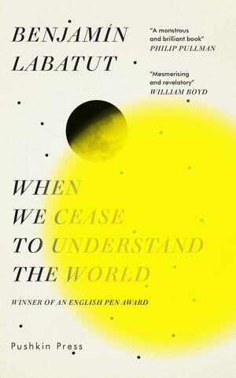

Benjamín Labatut’s [*When We Cease To Understand The World*](https://app.thestorygraph.com/books/24590d59-8f32-4af3-b6bd-98e4cfad13da) is a very *strange* novel — historical fiction that freely blends fact and fiction in its telling of mid-century modern physics and its limits, stretching it to the point of cosmic horror. I really wish there was an annotated version that explained what was real — did Alexander Grothendieck really attempt to single-handedly assassinate Hitler? (Wikipedia suggests this is a falsehood.) It’s somewhat hard to recommend on those grounds, since it’s hard to say what the book is even *saying*. But there *is* something extremely readable about physicists slowly losing their minds trying to understand the world, in the same way that I enjoyed the Mid-Century Physics Cinematic Universe of *Oppenheimer*.

### It

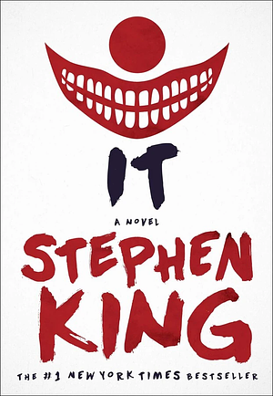

Stephen King’s [*It*](https://app.thestorygraph.com/books/6fbe3530-bf43-4ecf-971c-abad89753f25) is a classic! It basically invented the idea of a creepy clown! It’s very long and has many questionable plot decisions! You don’t need me to tell you all that!

What’s most interesting reading *It* in 2025 is that it’s explicitly a book about looking back at the 1950s from the perspective of the 1980s, but which itself is a product of the 1980s — not too dissimilar to, say, *Back to the Future*, but the epic scope and density of worldbuilding, in which the history of Derry, Maine is itself a major character, lends it a panoramic view of how much has changed since its release. [spoilers follow] Would a writer in 2025 choose to write a children’s orgy? Would a white writer in 2025 choose to write a side villain that mostly speaks in slurs? Would a male writer in 2025 write Beverly’s domestic abuse or feminist bestie in *that* way? Probably not! But that King did says a lot about how Western culture has changed since the 1980s, in much more subtle and interesting ways than the crop of nostalgic ‘80s media like *Stranger Things*.

### No Longer Human

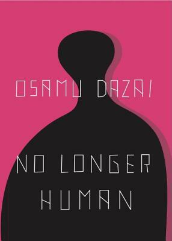

Osamu Dazai’s [*No Longer Human*](https://app.thestorygraph.com/books/156d4f2b-763c-4c22-85d7-5ee0fdc7d4e9) is a book saved by its epilogue.  (Spoilers follow, but suffice to say, *No Longer Human* is intense but worthwhile.)

After a hundred-some pages of misanthropic misadventures of our ne’er-do-well narrator (often taken to be a semi-autobiographical depiction of Dazai himself), which are readable but wearisomely repetitive, another narrator takes over and visits a minor side character, who happens to be a mutual acquaintance. This second narrator tries to get her to admit that the first narrator was, basically, a pain in the ass. But this mutual acquaintance demurs — he was, she insists, an angel. At which point a reader might think back on the first-person narrative of alienation, implied childhood abuse, attempted suicide, and morphine addiction and think: Oh. *Oh.* Maybe our first-person narrator suffered from a bit of depression. Maybe our first-person narrator was not, in fact, a reliable narrator of his own experience. It’s almost as shocking a twist as Dante getting slapped into Lethe by Beatrice.

I don’t believe there’s a publicly-stated connection, but I would not at all be surprised to learn that *No Longer Human* influenced *Neon Genesis Evangelion*, especially given Hideaki Anno [read the novel](https://otakuusamagazine.com/1984-manga-reveals-trials-and-tribulations-of-young-hideaki-anno/) during a period of intense depression a decade before starting work on *Evangelion*.

I also tried to read Junji Ito’s [(very) loose manga adaptation](https://app.thestorygraph.com/books/156d4f2b-763c-4c22-85d7-5ee0fdc7d4e9) and, I’m sorry to say, despised it. Ito expands the story into a typical gross-out Junji Ito horror manga — a style I found enchantingly unnerving in *Uzumaki*, but simply clashes with the bleak, alienated, blunt style of the novel.

### Are You There, God? It’s Me, Margaret

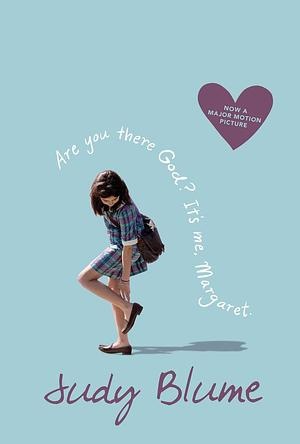

Judy Blume is a national treasure, and [*Are You There, God? It’s Me, Margaret*](https://app.thestorygraph.com/books/0e1acfe8-b62e-46fc-bbc6-c1a71c55b2ec) is among the reasons why. It’s a simple bildungsroman, but an effective one, and despite being “for children,” it doesn’t shy away from the complexity of Margaret’s situation — her overbearing Jewish grandmother (not that *Margaret* thinks of her as overbearing, leading to an amusing “hey, dad, guess who’s here?” exchange early in the novel) or her toxic evangelical Christian maternal grandparents, who are never quite demonized, despite quite obviously being in the wrong. Many novelists-for-adults could learn something from the surprising subtlety on display!

### The Stone Door

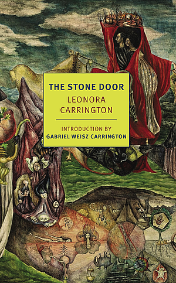

I’m not *recommending* [*The Stone Door*](https://app.thestorygraph.com/books/5b765ec3-209f-4d9b-8d92-4baa6da1eca6). If you only read one Leonora Carrington book, it should be [*The Hearing Trumpet*](https://app.thestorygraph.com/books/079b53f3-904e-4db1-891a-bd6a1abadd23). If you only read two, it should be *The Hearing Trumpet* again. If you only three, it should be her [*Complete Stories*](https://app.thestorygraph.com/books/4c5de048-bedd-48b5-95a7-a5d067b0a013).

But if you, like myself, are a fan of all things Carrington — if you went to MoMA twice in the same trip, because [“And Then We Saw the Daughter of the Minotaur”](https://www.moma.org/collection/works/393384) was inexplicably not on view the first time — then you should probably read *The Stone Door*. It barely has a plot — *very* roughly, it follows a woman from Mexico City (that would be Carrington) and a man from Hungary (a version of her second husband, Chiki Weisz) meeting each other in dreams and falling in love — and the whole novel proceeds with the sudden stop-start shifts in action that characterize actual dreams. And, like listening to someone ramble about their dreams, it’s confusing and a little boring! But there is *something* to this weird, metaphorical, symbolism-for-symbolism’s-sake story — some uncanny feeling that touches the soul, like the best surrealist art does, like Magritte and Buñuel and Lynch and Carrington’s paintings themselves.

## Non-Fiction

### Beyond Weird

I read Philip Ball’s [*Beyond Weird*](https://app.thestorygraph.com/books/5e86090c-f1f0-4fff-921c-c8cd18c014d7) years ago in university and decided to revisit it, since I had retained almost nothing. This time, however, I carefully wrote up spaced-repetition notes as I read, so *hopefully* I will actually retain some of it this time.

*Beyond Weird* is *probably* the best pop-science introduction to quantum mechanics available.

:::aside{.note}
If you have enough of a math or physics background, [*Quantum Mechanics: The Theoretical Minimum*](https://app.thestorygraph.com/books/5cac03b9-8902-4592-a071-97b0970f36a8) is probably the best introduction overall, but it’s so minimal and moves so fast that, frankly, I still found it too dense. But I also didn’t devote the time to it that I should have — you’ll probably have a better experience if you actually take the time to do all the exercises.
:::

Ball is fantastic at explaining the rather esoteric concepts of quantum mechanics without *overexplaining* or, as the case may be, oversimplifying. In particular, he avoids the trap of treating quantum mechanics as particularly spooky or weird, instead clearly explaining the core conceptual difficulties and what physicists *have* unraveled since the field was founded (notably, how decoherence occurs, which is usually dropped even from undergraduate physics classes!). I’m excited to check out his latest book, [*How Life Works*](https://app.thestorygraph.com/books/a266fa71-5e93-4742-a5b7-aac053b4047d), next year.

### Paradise Lost: A Biography

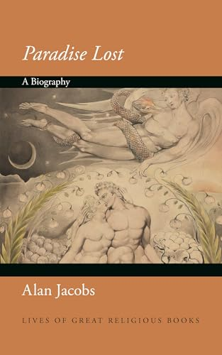

I would read [Alan Jacobs](https://ayjay.org/) talk about literally anything — he’s one of the most [thoughtful commentators](http://blog.ayjay.org/) active today, and I adored his previous books [*Breaking Bread with the Dead*](https://app.thestorygraph.com/books/e11758f2-6f0e-4419-b0ad-7eec30d9523e) and (to a lesser extent) [*How to Think*](https://app.thestorygraph.com/books/a6008b45-d84f-4970-ba4b-21428ddf29a4). His latest, [*Paradise Lost: A Biography*](https://app.thestorygraph.com/books/8b82a821-6d30-4a4c-8fc5-ff23356ee55d), is an essential companion to that essential poem, exploring both Milton’s background and various responses in well-argued, easy-to-follow prose. You do need to be familiar with *Paradise Lost*, and Jacobs occasionally smuggles in his own theological convictions — he’s less-than-impressed by *His Dark Materials* for that reason — but it’s a must-read if you have even a passing interest in the history of English literature.

### Catching the Big Fish

I’m a fan of David Lynch (as you shall see in next week’s issue...), so I’m only a *little* surprised I enjoyed his memoir-cum-meditations [*Catching the Big Fish: Meditation, Consciousness, and Creativity*](https://app.thestorygraph.com/books/00dd068c-96bf-4158-9c33-a47f34bcd07a). Actually, I expected to be disappointed, anticipating something akin to Rick Rubin’s [*The Creative Act*](https://app.thestorygraph.com/books/c2731500-a535-44ac-8b38-21c2f502db6f) — a long ramble of truisms about following your heart and listening to the mystical Source of art which I bounced off *hard*. *Catching the Big Fish* occasionally has that vibe — Lynch *was* a proponent of Transcendental Meditation™️, after all — but he’s too good of a storyteller, too *odd* of a storyteller, to leave it there.

Instead, he waxes lyrical about the light in Los Angeles (“Even with smog, there’s something about that light that’s not harsh, but bright and smooth. It fills me with the feeling that all possibilities are available.”), or viewing the world surrealistically (“And so, even though I’m from Missoula, Montana, which is not the surrealistic capital of the world, you could be anywhere and see a kind of strangeness in how the world is these days.”), or how suffering is not necessary for great art (“I like to think that van Gogh would have been even more prolific and even greater if he wasn’t so restricted by the things tormenting him. I don’t think it was pain that made him so great — I think his painting brought him whatever happiness he had.”) It’s not really a book that has a “point”, per se — other than shilling Transcendental Meditation™️, that is — but rather a collection of observations from one of our culture’s greatest observers.

Also, to be honest, the fact that each “chapter” is only a page or two long made it extremely easy to read in bed or on the bus, so it’s particularly recommended if you’re attention-addled.

### Waking Up

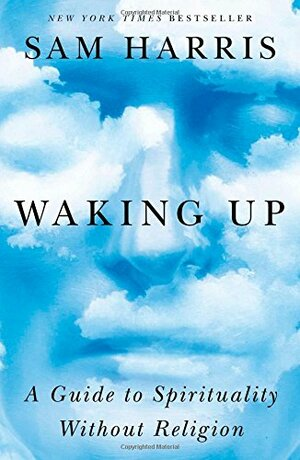

I [discussed](https://rwblickhan.org/newsletters/essentially-a-catholic-tragic-opera/) Sam Harris’ [*Waking Up*](https://app.thestorygraph.com/books/99c9b0f6-04ac-4e76-a10a-d273468caaa2) recently, and I don’t have much to add. The full course *is* probably more useful, but I’d still recommend the book as one of the better self-help books out there (if, that is, you can ignore the Harris-isms).

### Zhuangzi

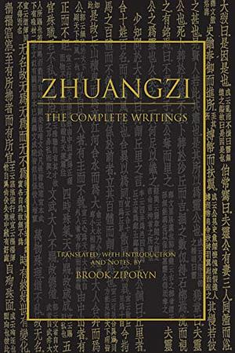

I’ve [complained](https://rwblickhan.org/newsletters/time-to-read-the-eastern-classics/#zhuangzi) about the [*Zhuangzi*](https://app.thestorygraph.com/books/737d2fbe-a5d2-4088-b761-522715fe222e) before, but I did in fact power through it this year and come to appreciate it, especially after reading Brook Zipporyn’s supplemental essay [“Zhuangzi as Philosopher”](https://hackettpublishing.com/zhuangziphil). That essay explains Zhuangzi as a (rather unique) skeptical philosopher who maintains a “wild card” perspective in which *every* perspective is valid *from the point of view of that perspective* (including, of course, the “wild card” perspective itself) and can therefore be used or discarded as appropriate.

I still can’t exactly recommend the *Zhuangzi* to the average reader, but if you’re interested at all in skepticism or Chinese philosophy or religion, the *Zhuangzi* is one of the most important works to engage with.
