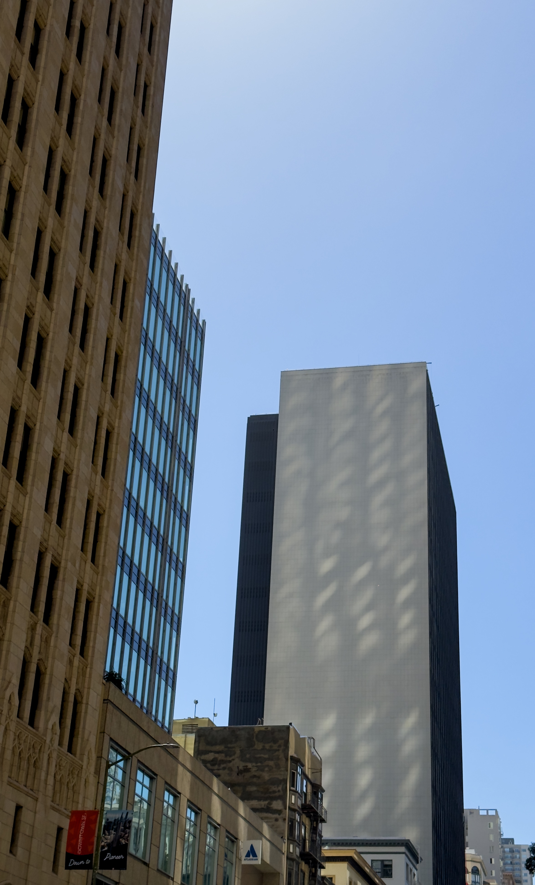

So this past week I finally read C.P. Snow’s [“The Two Cultures and the Scientific Revolution”](https://en.wikipedia.org/wiki/The_Two_Cultures), the paper that you have to cite if you start talking about the sciences and the humanities. It is, in fact, a very good paper! And you can find a PDF [right here](https://sciencepolicy.colorado.edu/students/envs_5110/snow_1959.pdf).

Snow was a mid-century physicist who later became a novelist and, as a result, had a foot in both worlds, science and literature — worlds that he felt, in the late ‘50s, had diverged into two separate cultures that looked at each other with, not even disdain, but simply incomprehension! Probably the most famous anecdote he relates is a group of writers thumbing their noses at the illiteracy of scientists, only to be baffled when Snow asks them about the Second Law of Thermodynamics.

That thesis has certainly aged — and his real target, originally, was the British educational establishment of the 1950s — but it’s still referenced so often because it does speak to _something_ real.

A few things that jumped out at me:

- Today the two cultures I’d reference aren’t necessarily “science” and “literature” but probably something more like “West Coast tech industry” versus “East Coast media industry” — a split in culture between (mostly Brooklyn-resident) journalists and novelists and (mostly Bay Area-based) “techies”. And _neither_ group understands or cares much for the old school, academic literary or scientific cultures — so we almost have _four_ cultures?
- But there _are_ points of overlap, across the twentieth century. Pynchon famously includes rambles on Maxwell’s Demon in his novels, and Helen DeWitt has a long-standing interest in statistical modeling in R, and there’s _plenty_ of tech workers who left to become novelists (not just in science fiction!).
- Most people that quote “The Two Cultures” only reference the first half — about the eponymous two cultures — but the second half of his paper turns into a robust defense of industrialization, which I almost found more interesting. In particular, he argues that, firstly, industrialization is simply a net good — with reference to his Russian peasant ancestors and their rather limited lives — and, secondly, that industrialization is like the atom bomb — the hardest part is knowing that it’s possible — so the rest of the world will _rapidly_ catch up. From the perspective of 2026, it’s interesting to note that’s both _totally true_ — East Asia and China in particular really did just _go for it_ — yet also clearly much more difficult than Snow predicted. And it _once again_ brings to mind _No Other Choice_ and the question of whether industrialization was “worth it” or even possible to stop at all, a question that I find strangely undertheorized as compared to, say, the literal centuries of capitalist-vs-socialist debates. (A topic I will, perhaps, return to another time.)

Anyway, it’s pretty short (50 short pages, so it took me maybe a half hour to get through it) and highly recommended despite its age.

---

Recently Sherry and I ran a salon night, in the tradition of Parisian Enlightenment salons[^salons], where we asked a bunch of our friends to present on some niche topic of interest. To my surprise, ten people (!) signed up to present (plus Sherry and myself), on topics ranging from drugs to pop culture conspiracy theories to the 2008 writer’s strike to women’s health to Costco,[^ppts] and another twenty decided to cram into our apartment to watch the presentations. So, a highly recommended event format — it turns out that people love to talk about their favourite topics and other people love to hear about it.

---

Warning: this section is pure navel-gazing and probably best skipped.

I recently found myself in possession of a list of my “50 favorite albums” that I wrote back in 2020. So, hang with me a moment as I run through it:

1. _Kid A_, Radiohead
2. _01/10 (OK Computer/In Rainbows)_, Radiohead
3. _A Moon-Shaped Pool_, Radiohead
4. _Minecraft: Volume Alpha_, C418
5. _An empty bliss beyond this world_, The Caretaker
6. _Acts I-V_, The Dear Hunter
7. _Entertainment!_, Gang of Four
8. _Q: Are We Not Men? A: We Are Devo_, Devo
9. _The ArchAndroid_, Janelle Monae
10. _Mezzanine_, Massive Attack
11. _Heligoland_, Massive Attack
12. _Untrue_, Burial
13. _Game of Thrones Season 6 Soundtrack_, Ramin Djawadi
14. _Kind of Blue_, Miles Davis
15. _Best of Victor Jara_, Victor Jara
16. _Solid State Survivor_, YMO
17. _Public Pressure_, YMO
18. _BGM_, YMO
19. _Gymnopédies_, Erik Satie
20. _The Disintegration Loops_, William Basinski
21. _Remain in Light_, Talking Heads
22. _Selected Ambient Works, Vol. 2_, Aphex Twin
23. _The Suburbs_, Arcade Fire
24. _Tomorrow’s Harvest_, Boards of Canada
25. _For Emma, Forever Ago_, Bon Iver
26. _Broken Bells_, Broken Bells
27. _Trilogy_, Carpenter Brut
28. _Something_, Chairlift
29. _Crystal Castles_, Crystal Castles
30. _Crystal Castles II_, Crystal Castles
31. _Discovery_, Daft Punk
32. _Breakup Song_, Deerhoof
33. _Endtroducing…_, DJ Shadow
34. _Clair de lune_, Claude Debussy
35. _The Entire City_, Gazelle Twin
36. _Meliora_, Ghost
37. _Holy Ghost!_, Holy Ghost!
38. _Cross_, Justice
39. _Deep Cuts_, The Knife
40. _Silent Shout_, The Knife
41. _Lauren - Single_, Men I Trust
42. _Aromanticism_, Moses Sumney
43. _Loveless_, My Bloody Valentine
44. _Ghosts I-IV_, Nine Inch Nails
45. _In Utero_, Nirvana
46. _Paramore_, Paramore
47. _Spiderland_, Slint
48. _Flood_, They Might Be Giants
49. _The Social Network_, Trent Reznor & Atticus Ross
50. _The Velvet Underground & Nico_, The Velvet Underground

If I wrote such a list today, it would probably have a lot of the same albums, but some things jump out at me from a 2026 perspective:

- _wow_ is this list reflective of my race/class/gender/nationality/date of birth/etc
- Radiohead tops the list — _Kid A_ and the 01/10 playlist that combines _OK Computer_ and _In Rainbows_ are #1 and #2, just as they still are. But, curiously, I also included _A Moon-Shaped Pool_, which I’m genuinely not sure I’ve listened to since 2020.
- There’s not a single St Vincent album (!) even though I was definitely a fan pre-pandemic. I have no explanation for this.
- I had a big They Might Be Giants phase back in college, which probably explains the presence of _Flood_, but they haven’t really stuck since then. Similarly, I had a Holy Ghost! phase in _high school_, but I don’t think I’ve listened to their debut in ten years.
- _Obviously_ I included Daft Punk[^daft-punk] but now that I know that _Random Access Memories_ is really, definitively the last Daft Punk album, I would probably include it as well.
- I still love Quebecois indie dream-poppers Men I Trust, but for a top 50 list I’m surprised I included not just an album but a _specific single_.
- A few of these are definitely subject to recency bias — I’m quite fond of Slint, Moses Sumney, Ghost, and Gazelle Twin, but their presence on the list probably speaks more to pandemic-lockdown-era repeats. Similarly, I almost definitely included the _Game of Thrones_ soundtrack because I was writing a fantasy novel at the time. Today I would probably include the _Succession_ soundtrack instead 😉

[^salons]: Note: relationship to Parisian Enlightenment salons tenuous at best; it was mostly just inspiration.
[^ppts]: And almost all of us made powerpoints, too!
[^daft-punk]: Though much lower than I would have expected — _Discovery_ really should be top ten.