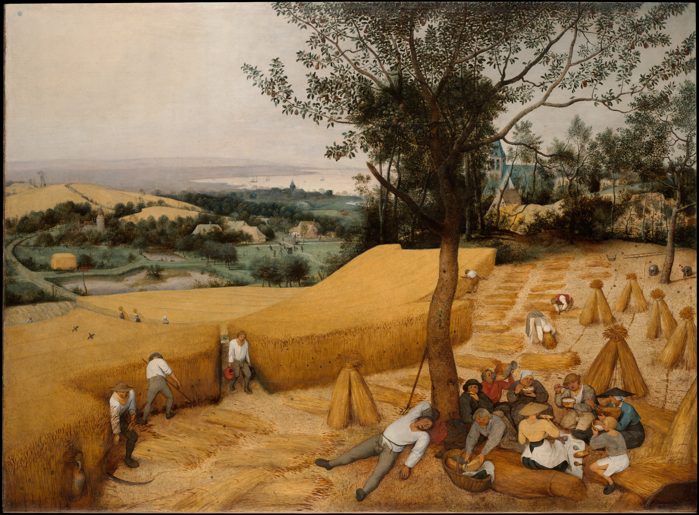

["The Harvesters", Pieter Bruegel the Elder, 1565](https://www.metmuseum.org/art/collection/search/435809)

---

I’m training for the [San Francisco Marathon](https://www.thesfmarathon.com) (my first marathon; come join!) and I decided it was about time to try electrolytes. I sweat a lot, which in turns mean I lose a lot of salt, which in turn means I have trouble staying hydrated after runs, since the human body tries to maintain its salt-to-water ratio.

In the past, I drank Gatorade after runs, but after some cursory research, it sounds like the general consensus is that Gatorade is not really a meaningful source of... anything, really. (One Reddit post said something along the lines of “Gatorade is just sugar water — if it actually had electrolytes, it would taste like crap”.) That probably explains why a clinic once told my dangerously-dehydrated friend to stop drinking Gatorade and switch to Pedialyte 🤔

Instead, I’m trying [DripDrop](https://www.amazon.com/dp/B094QB6PH6?psc=1&ref=ppx_yo2ov_dt_b_product_details). It comes in single-serve powder packets, it tastes decent if not amazing, and it really does seem to help after a long (>5 mi) run. Recommended if you also get “dry palms” after a run!

---

Speaking of salt, Anton Howes’ Age of Invention newsletter is running [a series on the history of salt](https://www.ageofinvention.xyz/p/age-of-invention-the-second-soul-fa5) (that’s a link to the second post), which I highly recommend.

One of the stranger facts about the pre-modern world is that salt was arguably the single most important trade commodity.

As mentioned above, the human body tries to keep its salt-to-water ratio constant; if you don’t get enough salt, your body starts ejecting water, and you very quickly shrivel up and die. That’s probably why salt is one of the five core tastes and the only based on *a single specific molecule*. Also, in the pre-modern world, salt was widely used to preserve food and sometimes acted as a fertilizer.[^salt]

What was the fabulously wealthy Malian Empire under Mansa Musa buying with all that gold? Truckloads of salt, which is vanishingly rare in the Sahel. (Well, not literally truckloads, but you know what I mean.) What made Yangzhou, the richest city in pre-modern China, the richest city in pre-modern China? Salt merchants working in the government salt monopoly, moving salt up and down the country on barges over the Grand Canal.

Anyway, Age of Invention is a fantastic newsletter about the transition from the pre-modern to the modern, industrialized world and I highly recommend it.

---

Speaking of the [Grand Canal](https://en.wikipedia.org/wiki/Grand_Canal_(China)), when I visited China a month ago, Sherry’s parents took us to look at Suzhou’s stretch of the canal. The Grand Canal doesn’t get nearly enough respect, seeing as how it is arguably the *single most important infrastructure project in the pre-modern world*[^important] and is, in fact, still a functioning waterway! (There was a long line of coal (?) barges when we visited.)

---

Why does everybody hate [The Wirecutter](https://www.nytimes.com/wirecutter/) now?

I get this vague cultural sense that The Wirecutter “isn’t taken seriously” since it was bought by the NYT, but I’ve never got a straight answer as to why. It’s obviously not as *intensely* well-researched as it used to be, but it still feels like a reasonable place to get an overview of a product category and some major brands to look at.

For instance, I picked DripDrop based on a recommendation from [this NY Mag article](https://nymag.com/strategist/article/best-electrolyte-powders.html), but that article seems... no different to the average Wirecutter article? And I just bought an [electric toothbrush](https://www.amazon.com/dp/B0B6MDLZTN?psc=1&ref=ppx_yo2ov_dt_b_product_details) based on [The Wirecutter’s article](https://www.nytimes.com/wirecutter/reviews/best-electric-toothbrush/), and it’s serving me well. It still seems better than [Buy Side from WSJ](https://www.wsj.com/buyside), which actually does give me “these are all affiliate links” vibes.

Is the quality actually meaningfully worse? Are people just allergic to the NYT?

---

Willow (daughter of Will and Jada Pinkett, creator of *Whip My Hair* which honestly is much more hype than I remember) has a new album. The lead single, [“symptom of life”](https://www.youtube.com/watch?v=wQtVSNmYCNg), sounds like what you would get if you mashed up Radiohead, domi & J.D. Beck, and an R&B singer (Lauryn Hill, maybe?). David Bennett called it [“the craziest pop song of the 21st century”](https://www.youtube.com/watch?v=YxYVEa_urTo ). I like it quite a bit and you might too.

[^salt]: These days excess salinity is a major agricultural issue, but that’s because we produce salt on an industrial scale. In the pre-modern world, it was a perfectly functional fertilizer. In fact, the myth that Rome salted the earth around Carthage is a.) a fake fact from the 1800s and b.) [probably a reference to using salt as fertilizer to grow *weeds*](http://kiwihellenist.blogspot.com/2016/12/salting-earth.html).
[^important]: Why the most important infrastructure project? The Grand Canal is arguably *the* reason northern and southern China have repeatedly been reunited throughout history. [Water-based navigation is just so much more efficient in the pre-modern world.](https://acoup.blog/2019/10/04/collections-the-preposterous-logistics-of-the-loot-train-battle-game-of-thrones-s7e4/)
