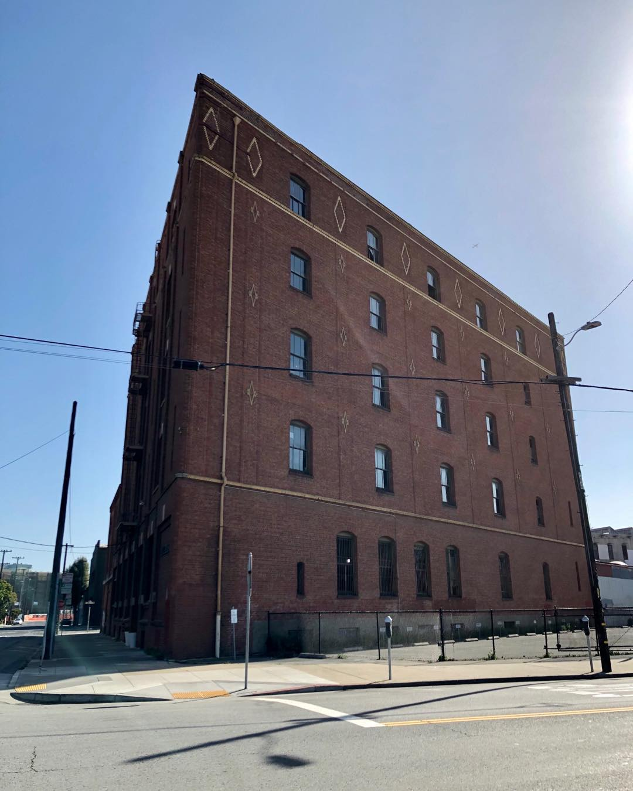
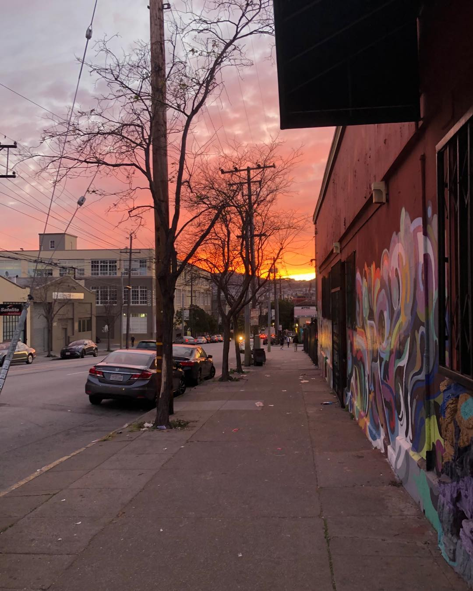

I don’t have much in the way of “deep thoughts” this time (do I ever?), so this will be more of a personal update. I’ve felt extremely busy ever since getting back from New York, probably because it’s voting time (done) and tax time (in progress) and new glasses time (… not started), plus I had to take Rooibos on a two hour walk yesterday. It’s nice to see Potrero at night, although it’s also shockingly empty (I suppose that’s true of San Francisco in general—much like Vancouver, it’s a very go-to-bed-early city). Unfortunately we’ve gotten some noise complaints, so we’re going to be a bit more stern towards his “you left me and I could have *died*” barking—he’s still got a bit of separation anxiety, though it only seems to activate when we leave and return, and there’s no more barking and scratching when we’re gone.

### What I’m Reading

Nothing!

Well, that’s not true. But I didn’t finish any books these past two weeks, and I didn’t read anything online that seemed particularly worth noting. So, for the first and perhaps last time, nothing!

### What I’m Listening To

I listened to [this episode](https://preachpod.org/listen/makinde-adedapo) of *Preach*, which is an interview with a Chicago-based Yoruban priest, whose father adopted traditional West African religion in the 70s (if I recall the episode correctly). It’s a very *very* interesting interview, especially as he explains the creation myth is that people wanted to go to Earth and were told by the creators they could if they fulfilled a mission… which, of course, each person promptly forgets upon being born. Thus, you have a destiny that you have to check up on, and there’s a strong tradition of divination to ask “am I doing the right thing?” It makes me think back to *The Secret of Our Success* and *WTF?!: An Economic Tour of the Weird* (a book I really enjoyed, even if it wasn’t the best I’ve read), and how seemingly irrational practices (like divination) can in fact introduce a helpful degree of randomization to everyday practices. The interviewee explains that he wanted to be a football player, but was told by the head priest (his father) that it wasn’t part of his destiny; though disappointed, he later came to realize that he never would have made it as a professional player.

### What Working On

The [Betterreads API](https://github.com/bibliopals/betterreads-api) is now GraphQL, thanks to a little [GraphQLKit](https://github.com/alexsteinerde/graphql-kit) library somebody put together to make it easier to integrate to Vapor. I still have no idea where to get book data for it, so this will probably remain a practice project only 🙂

I’m still slowly using Figma sketching out that RSS reader I mentioned last time. It’s taking a while because for some reason I decided to redraw all the standard iOS components I need.

I briefly considered working on a simple recipe app just for myself. Watch this space.

I’m also still slowly doodling towards a few essay ideas, as mentioned last time. But nothing to report yet.

### Where I’m Working

Still at Asana?

### What I’m Cooking

We tried our hand at [pad kee mao](https://en.wikipedia.org/wiki/Drunken_noodles), aka Thai drunken noodles, which is easily one of my top three favorite foods. We used [this recipe](https://thewoksoflife.com/drunken-noodles-pad-kee-mao/) (what an adorable website, right? I’m getting all my recipes from there in the future.) and it turned out almost, but not entirely, unlike pad kee mao. Well, that’s not fair—it did taste pretty darn good, but we were missing the baby corn, the red chili peppers, the Thai basil, and the fish sauce, and we didn’t soak the rice noodles long enough 🙂 Still, promising enough to try again!

### What I’m Drinking

A nice smooth vanilla rooibos (not the dog), which I find surprisingly difficult to find in San Francisco. Also difficult to find: frozen yogurt, red chili peppers, a functional transit system 🙂

Also, because he’ll yell at me (again) if I don’t give a shoutout… hi, Rob! 🙂

