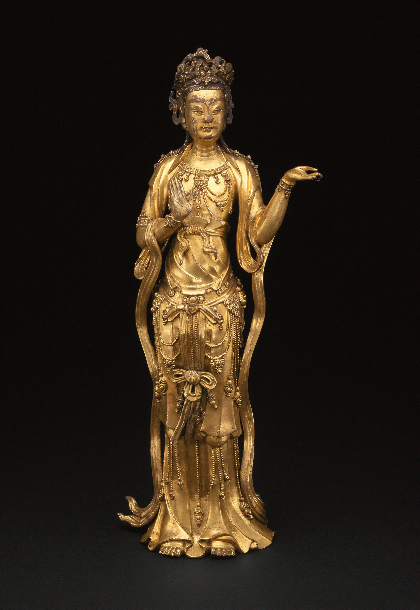

I finally got around to finishing that outline! So, now I just need to write like crazy for the next month… With that said, these newsletters will probably be shorter for the next month.

In good news, more than half the city of San Francisco has been vaccinated against Covid-19, and general availability (or close enough, anyway) opens on Thursday. So hopefully by the next newsletter I’ll have my first vaccine.

["Guanyin (Avalokiteshvara)”, Yuan/early Ming dynasty, late 14th century](https://www.artic.edu/artworks/28158/guanyin-avalokiteshvara)

## In Which I Realize It’s Not Me, It’s The Translation

Earlier this year I read, in translation, the Russian picaresque classic *Dead Souls* by Nikolai Gogol and found it boring more than funny. I had chosen the Pevear & Volokhonsky translation because, well, aren’t they the stars of Russian translation? Aren’t they slowly working their way through all the classics and giving them a much-needed facelift? And, in any case, they handled *The Master & Margarita* well enough that I consider it one of my favorites.

Well, apparently my disappointment in *Dead Souls* — and my general feeling that it was written in an overly-verbose, and not particularly interesting, 19th century style — was due to the translation! Linguist John McWhorter had a [post up](https://johnmcwhorter.substack.com/p/pevear-and-volokhonsky-are-indeed) on his disappointment in their translation of *War & Peace*, which he found strangely literal and ungraceful. His examples are admirably specific, even if I don’t totally agree with them — notably, his insistence that *burden* is primarily used in a metaphorical sense, as opposed to the more physical *load*, seems way off base to me, to the point that I couldn’t actually understand what his problem with that usage was at first! But the other examples track with what I read in *Dead Souls*, and sure enough, McWhorter links to a [10-year-old magazine piece](https://www.commentarymagazine.com/articles/gary-morson/the-pevearsion-of-russian-literature/) complaining about P&V and in particular their then-new translation of *Dead Souls*, with the examples they cite from another translation seeming… much funnier and more entertaining? Perhaps I’ll have to pick up a copy of that version instead.

Anyway, I guess consider this a PSA in case you’re hoping to read any Russian classics soon?

## I’d Still Really Like That “History of the World via Chinese Diaspora” Book Please

In perhaps a bit of a follow-up to [last week’s chat about digital humanities potentially unmasking Elena Ferrante](https://buttondown.email/rwblickhan/archive/picking-and-choosing-elements-of-western-culture/), here’s a neat (if somewhat simplistic) [analysis of Chinese naming conventions](https://kontinentalist.com/stories/a-cultural-history-of-han-chinese-names-for-girls-and-boys-in-china) over the past century. Some of their conclusions seem unwarranted — does the higher occurrence of male names with the 家 “home” radical really speak to a desire for more family-oriented men? — but two results really stick out to my mind:

1. In the corpus studied, 军 (jun1, “army”) was one of the most common characters in names through the ‘70s and ‘80s, particulary in 建军 (jian4 jun1, “build up the army”), before all-but-disappearing starting in the ‘90s.
2. Single-character given names started to spike in the ‘70s and ‘80s, perhaps due to the one-child policy, before cratering again in the ‘90s, perhaps because many names had become *too* common.

In a very different usage of, well, “digital” “humanities” (but not strictly in the disciplinary sense), an entrepreneur is building what basically sounds like [Ancestry.com-but-for-Chinese-genealogy-books](https://restofworld.org/2021/how-technology-is-reuniting-chinese-indonesians-with-their-ancestral-names/), with the hope of reconnecting Chinese-Indonesians to their roots after decades of being discriminated against by Suharto’s New Order.

And, on another note, here’s a brief note in the Economist about the [Calcutta Chinese](https://getpocket.com/read/3290014639), who moved to Calcutta/Kolkata throughout the years and developed a distinct diaspora identity — only for thousands to be detained during the brief 1962 border war between China and India, leading to a slow wilting away of the community. Now, apparently, Markham, Ontario has more Calcutta Chinese than all of Kolkata!

## What’s New, Rooby-Doo?

He’s patiently waiting for us to get our vaccines so we can finally have some people over.

