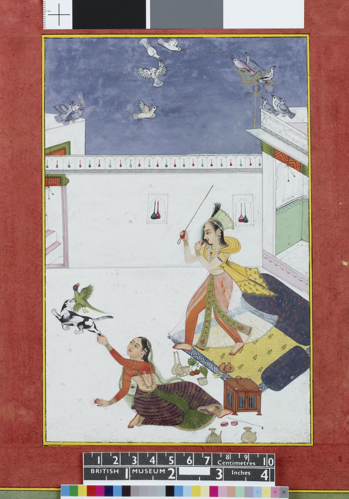

So I didn’t end up [taking that outline more seriously](https://buttondown.email/rwblickhan/archive/i-should-probably-take-that-outline-more/) and as a result didn’t finish it in time for April — I wish I could say “April Fools”, but I’m seriously not embarking on a new manuscript this month. Sad! But in fairness, work is going to be rough for a while, so perhaps it’s best to hold off. Still, I am hacking away at the outline — well, I actually restarted it, but I’ve made good progress since then! — and I’ll start NAprilWriMo *just* as soon as it’s done, hopefully by the 15th (which might mean I’m vaccinated before I start 😅).

["Two ladies, a cat and a parrot”, 1750-1800](https://www.britishmuseum.org/collection/object/A_1999-1202-0-4-19)

## Table of Contents

## There Are No More Mysteries Anymore And Maybe That’s Okay

Elisa Sotgiu [argues in Lithub](https://lithub.com/have-italian-scholars-figured-out-the-identity-of-elena-ferrante/?utm_source=Sailthru&utm_medium=email&utm_campaign=Lit%20Hub%20Daily:%20March%2031%2C%202021&utm_term=lithub_master_list) that a series of papers in the last few years have conclusively proven that Elena Ferrante, pseudonymous author of the (very very popular) Neapolitan Novels, is in fact Domenico Starnone, another Italian author who happens to a.) be male and b.) be married to Anita Raja, Ferrante’s translator. Now, note that I have never read the Neapolitan Novels[^1], so I don’t have much stake in the mystery one way or the other — if Elena Ferrante were revealed to be a man, I’m sure there would be a tizzy in the literary world, but also death of the author and all that — but what I find really interesting here is the techniques used. One of the papers cited trained a machine learning model to profile authors based on their text, while another visualizes the stylometrics of a corpus of recent Italian fiction and finds that Ferrante and Starnone sit alone in a particular corner of the space. These “digital humanities” techniques are not exactly new, of course — and, as the author of the article takes pains to point out, “traditional” academics find it deeply bad form to care about Ferrante’s identity, let alone cite these studies — but I can’t help but find them exciting, especially seeing as how they’re solving a “real” mystery here.

## Let’s Learn About Lacrosse

I’ve had [this article](https://www.latimes.com/sports/story/2020-08-21/tribal-lacrosse-team-iroquois-nationals-fight-racism?utm_source=noahtoly&utm_medium=email&utm_campaign=lacrosse-politics-trust-me-on-this-one) in my Pocket to-read pile for a few months now and almost didn’t bother with it, but I’m glad I did. I (perhaps uncharitably) expected the story (“Imagine inventing a sport and then being shunned by it. That’s the Haudenosaunee story”) to be little more than the typical “lacrosse was appropriated, isn’t that terrible” — which I usually don’t find very interesting, even if important — but while that is an element, the actual issue here is much more intriguing. You see, the Haudenosaunee (aka Iroquois Confederacy), who invented the sport, actually play as a national team, the creation of which was an intentional political act to promote Haudenosaunee sovereignty:

> The Nationals were created in 1983 after the confederacy tired of watching its best players cherry-picked by the American and Canadian national programs. The squad resolved to carry Haudenosaunee-issued passports. ‘When we first started talking about the idea of a national team, it would be a vehicle to implement our sovereignty,’ says [Rex] Lyons, whose father, Oren, is a hall of fame player and a faithkeeper for the Onondaga nation. ‘We wanted to travel as who we were.’

Haudenosaunee-issued passports! There’s so much to chew on here — sport as nation building, the strange legal fiction of sovereignty and who gets to be sovereign, the possibility that indigenous American nations may soon be able to exercise real sovereignty that so far has mostly been on paper (c.f. the [recent decision](https://www.nytimes.com/2020/07/09/us/supreme-court-oklahoma-mcgirt-creek-nation.html?action=click&module=TopStories&pgtype=Homepage) that much of eastern Oklahoma is in fact under various Indian reservations), and of course sub-state nationalism in a broader sense, with this standing alongside Quebec, Catalonia, and Scotland — but the little problem is that, er, most sports authorities don’t actually recognize the Haudenosaunee — the World Games only relaxed their guidelines after an online petition that drew 50,000 signatures, hence the LA Times article.

## More on Modernization

I don’t recommend you read [this article](https://aeon.co/essays/is-westernisation-fact-or-fiction-the-case-of-japan-and-the-us), exactly, but it does illuminate a distinction [I’ve tried to hint at before](https://buttondown.email/rwblickhan/archive/a-form-of-transcendent-mysticism-s2e6/) — namely, that we should think in terms of a global “modern” monoculture, with regional variations, instead of a process of “Westernization”. With that in mind, this article is “not even wrong” — the author is essentially arguing that, rather fiercely, that Japanese intellectuals in the Meiji period were not “Westernizing” but rather picking and choosing elements of Western culture they wanted to adopt. To which, armed with the distinction above, I say: well, duh! Japan was not Westernizing — in fact, arguably, we could say most of the “West” was not even Westernizing — but rather modernizing! It reminds me of a [comment economist Branko Milanovic made with regards to the works of Junichiro Tanizaki](http://glineq.blogspot.com/2020/11/marriage-and-society-in-ante-bellum.html):

> I think that an excessive focus on the so-called ‘Westernization’ makes us not realize that what we observe in the book (and probably in real life) was a process of modernization. Osaka of the late 1930s is a recognizably modern city […] Yes, there is kabuki and no theaters […], but so there is opera and zarzuela in Naples and Madrid. We do not contrast opera to American movies in South Europe to call it ‘Westernization’. Why should we contrast traditional Japanese theater to American films in Osaka?

Why indeed?

## Most Wicked Mouse

Let’s end with something less serious and, indeed, more amusing. Mark Dominus at Universe of Discourse writes about a 12th century self-portrait [showing a monk shaking his fist at the mouse stealing his lunch](https://blog.plover.com/2021/02/02/#Hildebert) and shares some fun details about what it shows about material culture of the 12th century.

## What’s New, Rooby Doo?

He had a very exciting week this week — he even got to play with another dog! — so as you can see he’s *real* tired.

[^1]: I’ve been meaning to, but there’s 1,472 other books on [my to-read list](https://www.goodreads.com/review/list/26891156-russell-blickhan?order=d&ref=nav_mybooks&shelf=to-read&sort=date_added) vying for my attention…