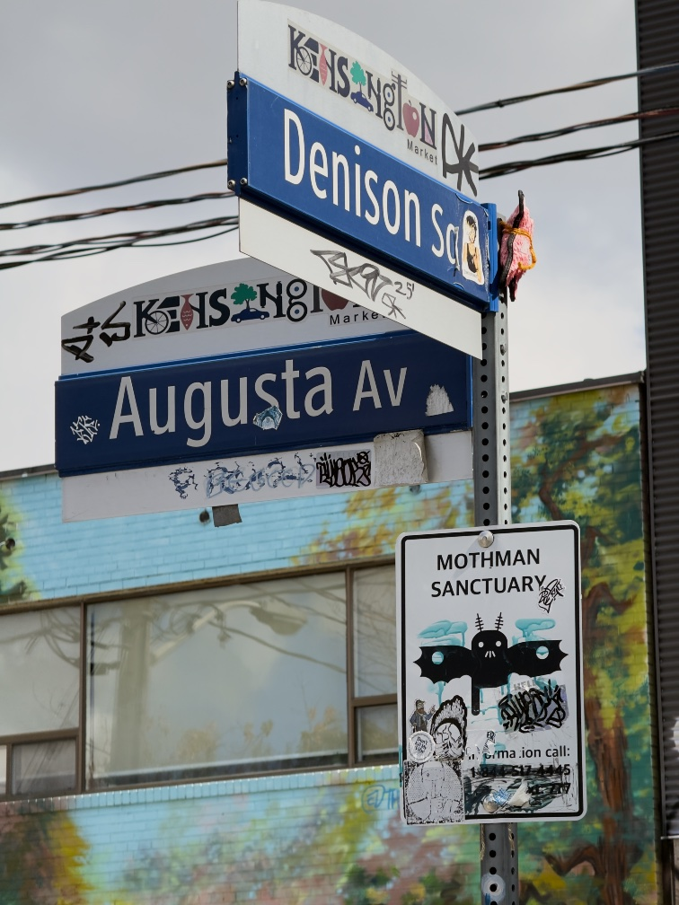

I’m still recovering from two weeks across the continent, where a minor bout of congestion partly killed my voice, and now this weekend is a [music festival](https://portolamusicfestival.com/), after which I will probably sleep about 12 hours. So this will be a grab bag of random thoughts I wrote down at various points, with little elaboration.

---

I occasionally complain that video games aren’t taken seriously as an artistic medium, but as a counterpoint, consider [this issue](https://peterraleigh.substack.com/p/horrors-half-remembered) of Peter Raleigh’s (excellent, strongly recommended) _Long Library_, where he compares the recent _Backrooms_ unfavourably to _Silent Hill 2_. It’s a fantastic example because he just casually assumes knowledge of _Silent Hill 2_[^silenthill], in a way that I think will become much more common in the near future. On the other hand, compare for instance W. David Marx’s slightly snippy comment that Elon Musk [“expresses his contra-liberal tastes through a love of video games”](https://culture.ghost.io/good-taste-is-not-whats-oppressing-us-in-2026/), which feels rather dismissive of the whole medium. I think the former approach to criticism will ultimately triumph over the latter.

---

A few weeks ago, I was listening to a Vergecast episode[^episode] revolving around health tracking and one of the hosts pointed out that, to paraphrase, all this health tracking doesn’t really matter because you could always get hit by a truck tomorrow.

And, while the point is taken — you can’t _really_ control everything, health-wise, no matter how hard you try — it’s also quite sad that a truck is the metaphor we use, isn’t it? Because, as a society, we don’t _have_ to accept traffic deaths. And yet, somehow, it’s so completely normalized that we just _do_.

Which makes me wonder if, in a hundred years, if traffic deaths went to zero, would people still use “getting hit by a truck” as a metaphor, detached from their personal experience? In much the same way people refer to “spinning a yarn” without understanding how that plays into textile productions at all.

---

So [_The Handmaiden_](https://letterboxd.com/film/the-handmaiden/) is a film that I kind of love, even though I think it’s pretty weak in some ways (certainly not as strong or important as [_No Other Choice_](https://letterboxd.com/film/no-other-choice-2025/)). One common (correct) criticism is that, for a movie about lesbians, it’s _incredibly_ male-gazey.

But on thought there... obviously, there’s a whole complicated set of issues about power (and who has it) and gender (and which has it) and how _The Handmaiden_ is an adaptation of a novel by a woman and how sexuality is portrayed on film and the history of male gaze. But. But! The thought is: _The Handmaiden_ (which is, ultimately, a feel-good romance about a pair of lesbians provided for male viewers) is not _that_ far from the [widely-beloved genre](https://youtu.be/8rAOc_nJwz8) of feel-good romances about gay men provided for female viewers, a la _Heated Rivalry_. Like, yes, again, obviously, very different situations in many ways. But I don’t think I’ve ever heard anybody point out the structural similarities — how they’re almost [dual](<https://en.wikipedia.org/wiki/Duality_(mathematics)>) to each other.

[^silenthill]: Which, after all, if you’re only going to know about one horror game, _Silent Hill 2_ is probably the one to know.

[^episode]: Which, unfortunately, I can’t find a link to now, but I think it was the episode around the announcement of the iPhone Duo.
