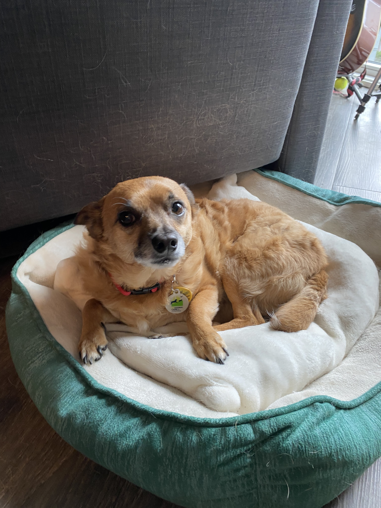
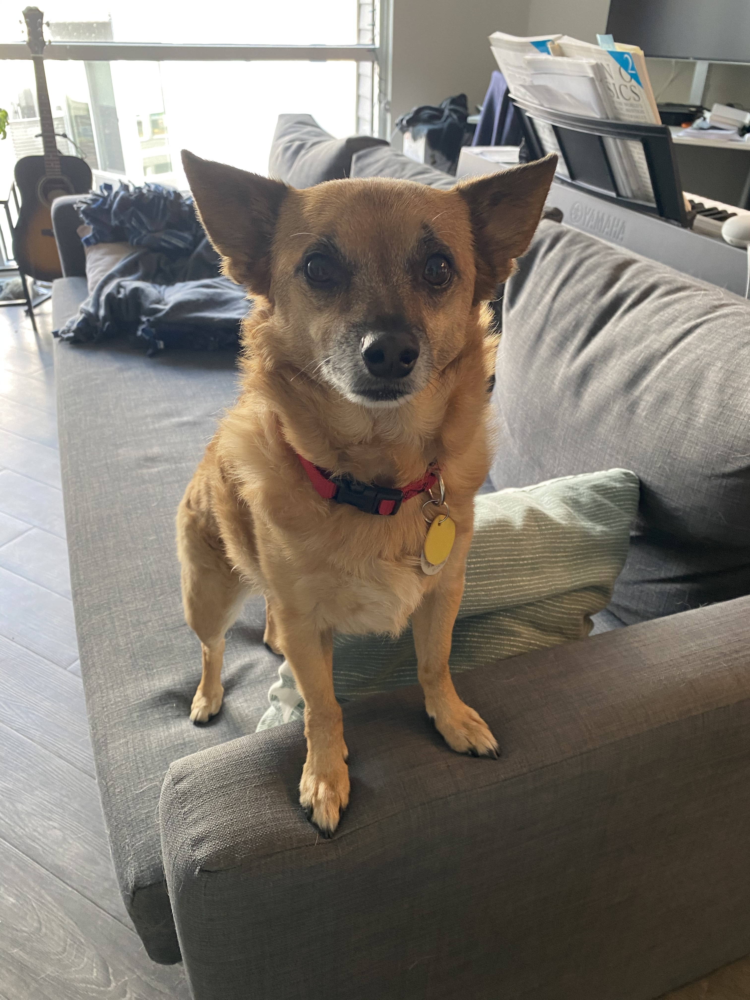

Every time I start writing a newsletter I feel I have nothing to talk about — I’ve veered away from planning like it’s a deer that just leapt onto the road — and yet somehow I always find something to talk about. And if I don’t, at least there’s a photo of Rooibos at the end?

In personal news, I have been… rather lazy in editing the novel! I’ve only quote-unquote “finished” two (of a planned… 44 😱). Part of the issue is that I’ve realized just how much extra work I have ahead of me — both because I’m essentially rewriting everything in the rough draft and because the rough draft only has 32 chapters — but more generally it’s the end of the year and I’m slowing down in general. But! Work generously gave us[^1] the entire week off. I *very responsibly* cancelled my travel plans for the week[^2] and so I have little else to do besides edit and maybe go on a great big [Craig Mod](https://craigmod.com/ridgeline/)-style walk. (Long walks, by which I mean \>2 hours, preferably by oneself, are lovely — I highly recommend them.) On a (related?) note, I did begin outlining a second book, although this one is a spooky horror 😈[^3]

One thing I’ve been thinking about lately is the sense that programmers today are the equivalent of ancient Mesopotamian scribes, scribbling accounting onto clay tablets and maybe, just maybe, finding time to pen the *Epic of Gilgamesh* in between. (This was brought back to mind by the introduction to Stephen Diehl’s new series, [*Exotic Programming Ideas*](https://www.stephendiehl.com/posts/exotic01.html).)

In particular, perhaps with our C-like languages we’re stuck in the equivalent of cuneiform, which was not the most practical of writing systems. What would be the equivalent of the *Epic of Gilgamesh*, artistically, from programming? It would probably have to be a video game, or perhaps something GPT-3-related — but both of those are rather difficult to work with, definitely not something that “most people” could do, the way most people could, hypothetically, write a novel (if they were so inclined). This is probably rote by now, but still worth thinking about — how could we build tools that make programming as “obvious” as our current writing system? (I guess [Bret Victor](http://worrydream.com/#) plays a lot in that space? I feel like I keep hearing about him — perhaps I should check out what he’s actually doing!) It’s definitely something I’ll keep thinking about.

Well, that was a short missive, but you’ve made it this far, so he’s your obligatory photo of Rooibos:

 

Heck, have two:

Now, back to work!

[^1]: Well, we technically have unlimited PTO, so I suppose it doesn’t cost the company anything to give us an extra holiday 🤔

[^2]: Whether the original plans were themselves responsible is up for debate 🙂

[^3]: That said, for various reasons, I don’t think it’ll ever see the light of day. I still want to write it, though.