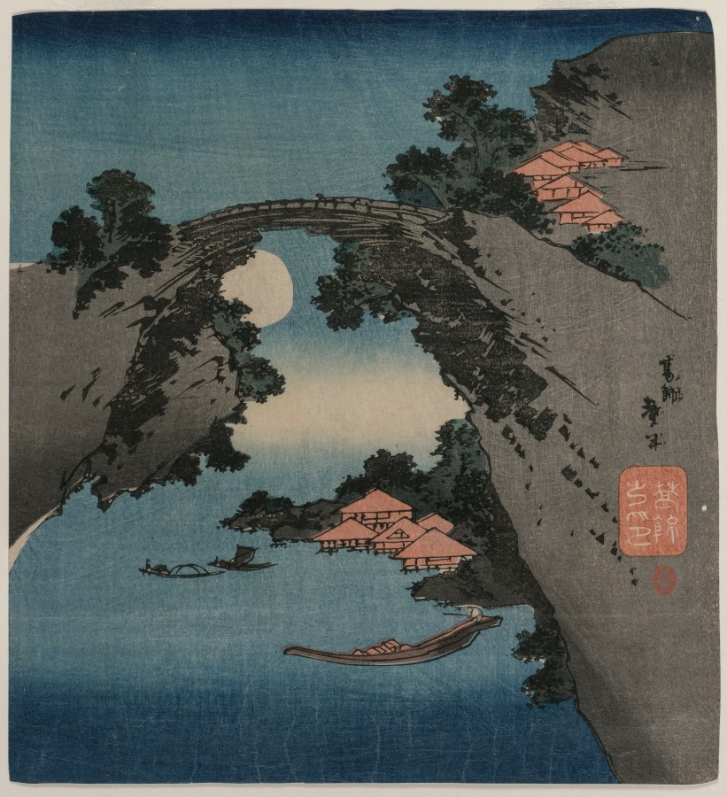
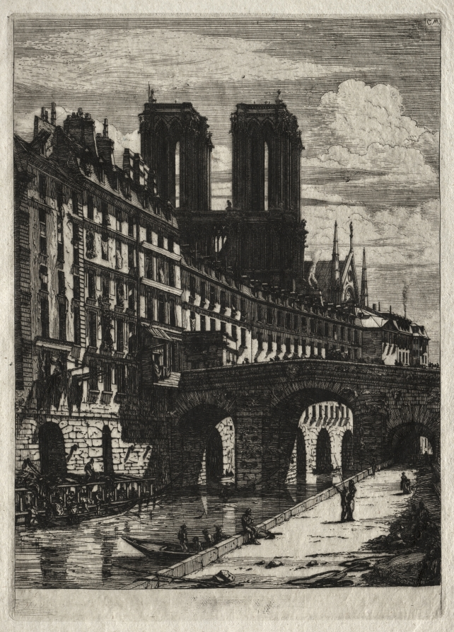
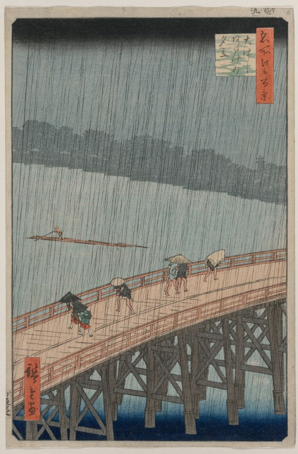
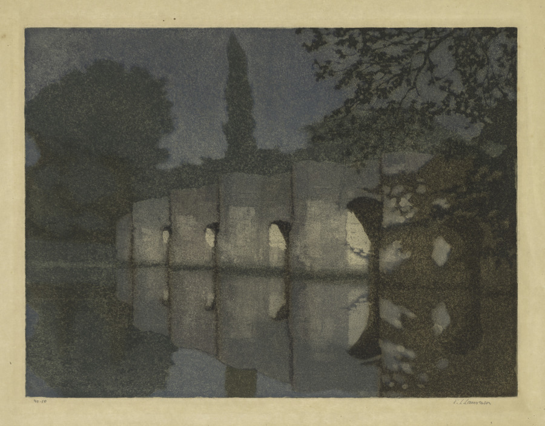

It’s been a bit of a long two weeks, so this issue is rather short, if you discount the (very) short story I’ve attached to the end 🙂 So, without further ado…

[“The Monkey Bridge”, Katsushika Taito II, early 1830s](https://www.clevelandart.org/art/1921.413)

## What I’m Reading

I read the Oxford World’s Classics edition of *The Golden Ass* by Apuleius, the only ancient Roman novel to survive in its entirety. As the tale of a man magically turned into a donkey and suffering a series of misfortunes and misadventures, it’s the great-grandpappy of the [picaresque](https://en.wikipedia.org/wiki/Picaresque_novel) genre, or perhaps I should say the great-great-grandpappy of *The Hitchhiker’s Guide to the Galaxy*. While I did enjoy it quite a bit, it unfortunately does have that ancient tendency to misogyny and the casual abuse of slaves, both of which have, uh, not really aged well. But as a time capsule of ancient Rome, it’s a fascinating study, including one of the best-preserved descriptions of a [mystery religion](https://en.wikipedia.org/wiki/Greco-Roman_mysteries) (the famous last chapter sees the main character saved by the grace of Isis, becoming a devoted follower)[^1]. It also includes the most influential version of [Cupid and Psyche](https://en.wikipedia.org/wiki/Cupid_and_Psyche), which is a pretty cute story.

Ars Technical ran an article on [“The Internet’s most important—and misunderstood—law, explained”](https://arstechnica.com/tech-policy/2020/06/section-230-the-internet-law-politicians-love-to-hate-explained/), which explains the Section 230 “safe harbor” provisions that allow social media to exist without being sued into oblivion for hosting defamatory/illegal/etc content, why it’s unpopular with many, and the proposals to replace it. It’s a very cogent summary of a difficult law that, while perhaps not as important as *looks around* a lot of other stuff going on, *is* nevertheless important.

Finally, Slate Star Codex had [“Slightly Skew Systems of Government”](https://slatestarcodex.com/2020/06/17/slightly-skew-systems-of-government/), where he comes up with novel new government forms that are both silly and yet also surprisingly insightful. I do wish there was more fiction exploring “imaginary legal and political systems”—surely some science fiction/fantasy does that, but I want something that’s focused *exclusively* on that.

[“Etchings of Paris: The Little Bridge”, Charles Meryon, 1850](https://www.clevelandart.org/art/1954.881)

## What I’m Playing

Adam Robinson-Yu’s [*A Short Hike*](https://adamgryu.itch.io/a-short-hike) (included in the itch.io Bundle for Racial Justice and Equality mentioned last time) is a beautiful, relaxing little game where you… go for a short hike. It takes about two to three hours. I don’t really want to say, not so much for the sake of spoilers, but because I don’t think I can do justice to just playing it. So: consider this your recommendation!

## What I’m Watching

Even if you don’t play *A Short Hike* (which you should, because it’s lovely), it’s worth taking the half hour to appreciate [this postmortem](https://youtu.be/ZW8gWgpptI8), which focuses both on why the developer decided to build it (skipping out on a complex RPG he had been working on) and also many of the “tricks” that make the game tick, like the pixelating filter[^2] that gives the game its unique vibe or the clever way some items are duplicated around the island so that players can “just happen” to find them (despite being virtually guaranteed to do so). In short, if you have any interest in game design at all, it’s well worth a watch.

[”Sudden Shower over Shin-Ohashi Bridge and Atake”, from the series *One Hundred Famous Views of Edo*, Utagawa Hiroshige, 1857](https://www.clevelandart.org/art/1921.318)

## What I’m Working On

As mentioned last time, I’ve become unhappy with the organization of the newsletter—I don’t think I’m giving it the time or thought it needs, and the simple “list what media consumed” format doesn’t help that—and I’m looking to relaunch it, or, in newsletter lingo, start a new season 😉

I now have an idea of how I’ll structure it in the season to come, though I still have to hammer out some of the details. In any case, with the first issue of this newsletter sent out on August 8th of last year, it seems fitting to end this season on August 2nd—so, there will only be two more issues with this format.

Meanwhile, I’ve continued my write-500-words-a-day experiment, only missing a day and a half in the past two weeks. I’m now close to 10,000 words on what I’m still calling *Bear*[^3]. I ran out of steam a bit this week—perhaps work was too stressful, or perhaps my initial concept was too limited—but after a nice long run this weekend, I think I have an idea of the shape of the story and the main characters. So, if all goes well, I’ll see you all in mid-September with a completed rough draft 😛

I’ve occasionally been writing very short (flash?) fiction on days where I didn’t feel particularly “inspired.” Most of those had a nice hook but could use a few more revisions before they’re ready for public (public?) consumption. However, I am fairly happen with how one particular story turned out, which I’ll attach here as a goodbye treat.

[”Stopham Bridge”, Edward Louis Laurenson, 19th century](https://www.clevelandart.org/art/2014.222)

## *The Bridge*

There is a bridge with no end.

One end of this bridge is contained in a city, built up over the millennia from a small hamlet into a great metropolis, but the other end, if indeed there is one, cannot be glimpsed in the thick fog that rolls in from the ocean.

Occasionally, someone will attempt to reach the other end of the bridge. Some of these explorers have been very well-prepared, taking enough rations for weeks, camping gear, even compasses. Yet very few of these men (for they are by and large men) ever return from those expeditions, and those that do seem strangely out of time, claiming that they had walked for years, worn ragged, despite leaving mere minutes before, or disappearing for decades before returning, youthful and energetic, claiming they nervously backed out before the expedition had gone too far.

All the accounts of all these explorers do share some commonalities, however. As you walk along the bridge, they all unanimously say, the air grows cold and dark, such that you must turn on headlamps and wrap yourself in Arctic cold-weather gear. The fog grows thicker and thicker, until you can barely see a few feet in front of you—on some of these expeditions, members have walked off into the mist, seemingly a stone’s throw away, and never returned. Any compasses brought will start to go haywire, pointing first this way, then that; sometimes staying consistent for hours, then suddenly pointing the opposite direction, and other times slowly drifting, as if there was a tiny, almost imperceptible curve to the bridge.

The only constant, all these reports say, is the churning of the water far below and the gentle swaying of the bridge.

There have been proposals to mount a larger expedition to cross the bridge—to form a human chain across the bridge, perhaps, or explore it with military equipment. But these proposals have, for the most part, fallen on dead ears. Most residents of the city know that the bridge is endless and know not to bother starting down it. And so it is that the bridge stands, silent, ominous, yet also comfortable, as an enduring symbol of the city and its people.

It is said in some tourist guides—the cheaper, less reliable ones—that the people of the city so love this emblem of their city that, as their lives draw to a close, they find themselves drawn to the bridge, and take first one step, then another, and another, and soon are enveloped in mist, never to be seen again. Most residents of the city are generally annoyed when this urban legend is brought up, since after all the city has perfectly functional hospices and graveyards and crematorium. Yet it is also true that a tourist such as yourself, walking along the beach past dusk, lit only by the lights of the distant highway, can often spot solitary figures walking slowly, calmly, down the bridge and into the night.

[^1]: I was going to humorously compare this to Insane Clown Posse’s surprise outing as evangelical Christians, but a quick check reveals that was just conjecture that they’ve refuted. The ["fucking magnets”](https://en.wikipedia.org/wiki/Miracles_(Insane_Clown_Posse_song)) song is totally real, though.

[^2]: Even Sherry, traditionally a skeptic of lo-fi art, had to admit it was beautiful.

[^3]: Note to self: think of a better name.