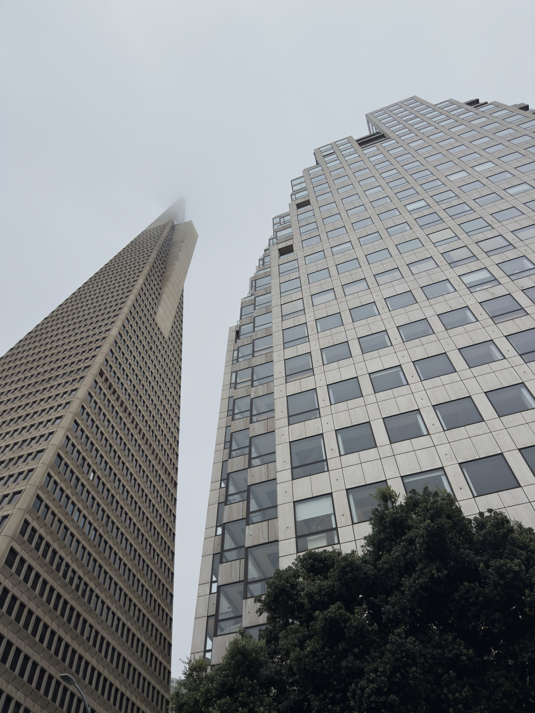
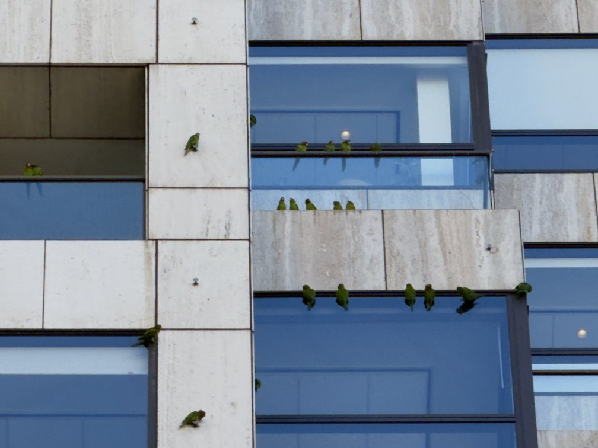

- The more things change, the more they stay the same... seven years later, Transamerica Pyramid is still there, as is the office across from it. And now, I work in that office!

As of today, it has been _seven[^seven] years_ since I [started this newsletter](https://rwblickhan.org/newsletters/soma-or-moving-to-san-francisco-and-living-to-tell/) — which also means it’s been seven years since I moved to the Bay Area.

In that time, I’ve written [189 posts](https://rwblickhan.org/newsletters/) across 8 “seasons” — though, owing to some site updates a few months ago, that includes a few dozen posts that I originally posted without sending as newsletters. Buttondown says I’ve sent 164 emails, or about one every other week, though that’s heavily weighed towards this year’s weeknotes.

[Season 1](https://rwblickhan.org/newsletters/soma-or-moving-to-san-francisco-and-living-to-tell/), back when I called this newsletter “Adventures in Dilenttantery”, was pretty disparate — like the newsletter today — but was typically structured around “what I’m reading” / “what I’m watching” / etc. Season 2, starting with [this post](https://rwblickhan.org/newsletters/misplaced-institutional-incentives/) in mid-2020, saw me rename the newsletter to “Applied Dilettantery” and move towards a mini-essay format. Season 3 was a short series of short stories, starting with [“The House”](https://rwblickhan.org/newsletters/the-house-part-i/) in late 2020. Season 4, starting with [“What’s New, Rooby-Doo?”](https://rwblickhan.org/newsletters/whats-new-rooby-doo/) in early 2021, moved back to a mini-essay format, though it pretty quickly ran out of steam, since I also _tried_ to move to a once-per-week format instead of biweekly. Season 5 opened with my first [yearly book review](https://rwblickhan.org/newsletters/52-books-of-2021/) at the start of 2022, but most of the other pieces now listed as “season 5” were originally independent pieces as I took a year-long break from writing.[^2022] Season 6, starting [at the end of 2022](https://rwblickhan.org/newsletters/you-might-not-think-you-need-a-milk-frother/), is where I renamed to “rwblog”, moved back to a biweekly cadence, and started writing shorter posts. Season 7 opened with [leaving my 5-year-long role at Asana](https://rwblickhan.org/newsletters/sixth-five-year-plan/) — definitely my biggest career shift to date — but otherwise continued with shorter, discrete notes, similar to season 6. Season 8, towards the [end of last year](https://rwblickhan.org/newsletters/welcome-to-season-8/), moved to the current weeknotes format.

In that time, I’ve lived surprisingly few places — after two years in the “armpit of [SoMa](https://en.wikipedia.org/wiki/South_of_Market,_San_Francisco)”[^soma], I moved to [Mission Bay](https://en.wikipedia.org/wiki/Mission_Bay,_San_Francisco), currently famous as the red-hot epicenter of the AI boom (and its attendant rent increases...). I have, however, spent a non-trivial amount of time in every neighborhood of San Francisco except [Bayview](https://en.wikipedia.org/wiki/Bayview%E2%80%93Hunters_Point,_San_Francisco)[^bayview], [Visitacion Valley](https://en.wikipedia.org/wiki/Visitacion_Valley,_San_Francisco), and, weirdly[^ocean], Ocean Avenue. I’ve barely been to East Bay, South Bay, or the rest of NorCal, though, because metropolitan areas are fractal.[^fractal] I’ve visited Vancouver (three times), Hawaii (three times), Chicago (three times), New York (twice), Toronto (twice), Paris (twice), Barcelona, Lyon, [London](https://rwblickhan.org/newsletters/strange-things-about-london/), Las Vegas, Los Angeles, Bali, [Melbourne](https://rwblickhan.org/newsletters/strange-things-about-melbourne/), Taipei, Shanghai, Suzhou, Cancún, Puerto Rico, Ottawa, Montreal, Tahoe, Monterey/Carmel-by-the-Sea, Dillon Beach, Mendocino, and Lassen.[^travel]

I’ve worked at [Asana](https://asana.com/)[^teams], [Descript](https://www.descript.com/), and now [Vanta](https://www.vanta.com/); I’ve written, depending on how you count, seven unpublished manuscripts[^drafts]. I’ve [logged](https://rwblickhan.org/logs/) 415 books and 310 movies. I’ve completely achieved 32 and partially achieved 26 of my 85 [yearly goals](https://rwblickhan.org/newsletters/yearly-goals/) since I started tracking — one of which was getting married 😉

Oh, and I survived a pandemic. Kinda weird to think about how long ago that was, eh?

I’ve probably done a whole bunch of things I’ve completely forgotten about — I barely remember half the posts I linked up there... — which is why I guess it’s nice to have this all documented, more or less. Seven years feels like practically no time at all — I might as well have graduated from university last week, it sometimes feels — and yet also feels like a massive amount of time, like decades and decades have gone by and I have no connection to that little kid who “moved to SoMa and lived[^lived] to tell”.

So, no matter how long you’ve been following along, thank you for joining me on this deeply disparate, probably slightly confusing[^life] journey. Here’s to seven-times-seven more years!

And now, to round us out, something I’ve heard about for seven years but only finally got to see this week: the tenacious [wild parrots](https://www.kqed.org/news/11185731/where-did-the-wild-parrots-of-san-francisco-come-from) of San Francisco! A better symbol for ["keep going"](https://www.robinsloan.com/newsletters/keep-going/) I cannot imagine...

[^2022]: 2022, not surprisingly, was the year I suffered from fairly intense occupational burnout...

[^soma]: A block away from the yearly [Folsom Street Fair](https://en.wikipedia.org/wiki/Folsom_Street_Fair), in fact, which was one of the few highlights of an otherwise fairly moribund neighborhood.

[^teams]: Albeit across a number of different teams in my five years there.

[^bayview]: Though I _have_ biked down to [Candlestick Point](https://en.wikipedia.org/wiki/Candlestick_Point_State_Recreation_Area) and spent an afternoon at [Archimedes Banya](https://banyasf.com/), which perhaps counts.

[^ocean]: “Weirdly” because it’s the location of San Francisco classic [Beep’s Burgers](https://maps.app.goo.gl/Ei1tPF1xgqMexGWk6), which seemingly everyone in San Francisco has been to, except me.

[^fractal]: A topic I could have sworn I’ve written about, but can’t find. Perhaps for another time!

[^drafts]: And, er, multiple drafts of most of those. But this one is the one, I swear!

[^travel]: Only now as I write this out do I realize _just how much_ I travel, oops.

[^lived]: A title that has always bothered me, a bit — I often read it as “SoMa is a particularly rough neighborhood that I barely survived”, but the intention was to say “moving is really stressful”.

[^seven]: “Seven” of course being considered the perfect number in antiquity.

[^life]: Which is a pretty good description of life, eh?
